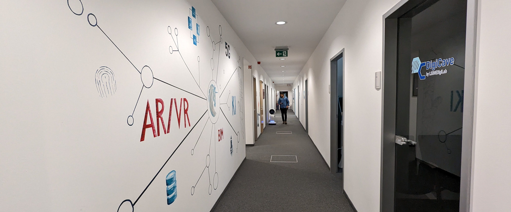

# AI Core Station ^ AI Accelerators and a naive guide to AI hardware:
Here is a small guide I wrote while building my lab's AI workstation and relevant information I learned while building the system are documented. I will cover 5 topics in this blog and here is an overview diagram of the workstation:
  

 

## Topics:
- AI/ ML / DL Workstation Build
- Robotics, Electronics and Hardware
- AI Accelerators
- Benchmarking GPU Performance
- Benchmarking Standard DL tasks
  

# #1 AI/ ML / DL Workstation Build 
- Essence of Computation & Networking [NOTES](notes/ai_workstation/essence_of_computation.md) 
- AI / ML / DL hardware core components [NOTES](notes/ai_workstation/components.md) 
- Final AI Work Station build [NOTES](notes/ai_workstation/final_aistation.md) 

# #2 Robotics, Electronics and Hardware
- Electronics components & workbench [NOTES](notes/robotics_ee_hardware/ee_components.md) 
- Robotics Components [NOTES](notes/robotics_ee_hardware/robotic_components.md) 
- IoT & AI on Edge devices [NOTES](notes/robotics_ee_hardware/iot_edge.md) 
- 3D printing & PCB Design [NOTES](notes/robotics_ee_hardware/3dpcb.md)
- DIY & Advanced Robotics hardware [NOTES](notes/robotics_ee_hardware/diyarh.md) 

# #3 AI Accelerators 
- AI accelerators [NOTES](notes/ai_accelerators/ai_accelerators.md) 
- Future Computing [NOTES](notes/ai_accelerators/future_computing.md) 
- Mobile AI workstations/ laptops [NOTES](notes/ai_accelerators/mobile_workstation.md) 

# #4 Benchmarking System Performance
- 3D Mark Benchmark [x report] as no test suite for linux but windows
- Phoronix test suite [report](bench@sys/phoronix.MD) ✅✅
- Paessler Network benchmark [link](https://www.paessler.com/network_bandwidth_test) only windows sys (for linux - phoronix/ethr or phoronix/speedtest-cli)
- LAMMPS benckmark [link](https://lammps.org/bench.html) ( classical molecular dynamics in phoronix )
- VASP benchmark [link](https://www.hpc.cineca.it/content/vasp-benchmark) ( atomic scale molecular modelling in phoronix)
- V-Ray 5 benchmark [link](https://www.chaos.com/vray/benchmark) ( render latency benchmark in phoronix)

# #5 Benchmarking Standard DL tasks
- AI environment setup with CUDA, cudnn and python3 in linux [report](notes/aienv.MD)
- Stanford DAWN Deep Learning Benchmark [x report] - retired benchmark and upgraded to mlperf
- MLPerf training benchmarks [report](./bench@ai/mlperf.MD)
- AI-Benchmark Alpha / Burnout [report](./bench@ai/alphaburnout.MD) 

`@lab : 
`
 [lab_video_draft_22"](https://youtu.be/GytbWIVu4dU)
