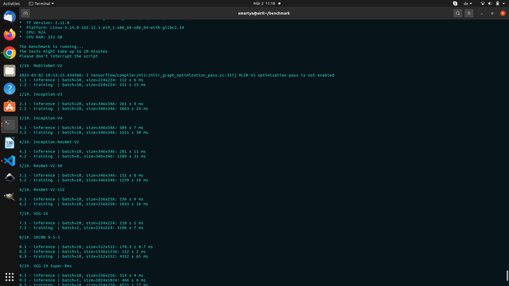

# AI-Benchmark Alpha

: [ai-benchmark alpha](https://ai-benchmark.com/alpha)

```python
from ai_benchmark import AIBenchmark

benchmark = AIBenchmark()
results = benchmark.run()
```

## CPU training:


## GPU training: