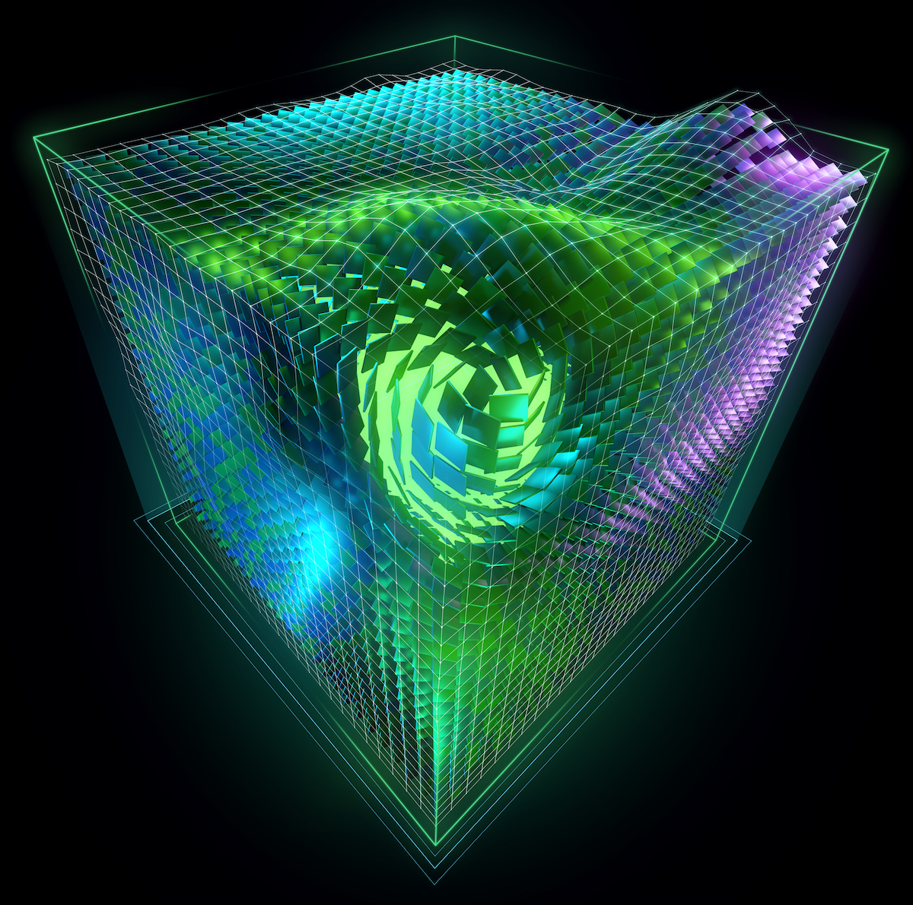

# Parallel Programming with CUDA



[ [CUDA C++ Programming Guide](./CUDA_C_Programming_Guide.pdf), [CUDA toolkit](https://developer.nvidia.com/cuda-toolkit), [CUDA zone](https://developer.nvidia.com/cuda-zone), [CUDA C++ Best Practices Guide](./CUDA_C_Best_Practices_Guide.pdf), [NVIDIA CUDA Compiler Driver](./CUDA_Compiler_Driver_NVCC.pdf), [CUDA Math API Reference Manual](./CUDA_Math_API.pdf) ]

libraries : [ [cuBLAS](./CUBLAS_Library.pdf), [cuFFT](./CUFFT_Library.pdf), [cuRAND Library](./CURAND_Library.pdf), [cuSOLVER Library](./CUSOLVER_Library.pdf), [cuSPARSE Library](./CUSPARSE_Library.pdf), [NVIDIA cuDSS](https://docs.nvidia.com/cuda/cudss/index.html), [NVIDIA Collective Communications Library (NCCL)](https://developer.nvidia.com/nccl) ]

[ [NVIDIA TESLA V100 GPU ARCHITECTURE](./volta-architecture-whitepaper.pdf), [Volta Tuning Guide](https://docs.nvidia.com/cuda/volta-tuning-guide/), [NVIDIA A100 Tensor Core GPU Architecture](./nvidia-ampere-architecture-whitepaper.pdf), [Ampere Tuning Guide](https://docs.nvidia.com/cuda/ampere-tuning-guide/), [Hopper H100 White Paper](./gtc22-whitepaper-hopper.pdf) ([pdf](./nvidia-h100-tensor-core-hopper-whitepaper.pdf)), [Hopper Tuning Guide](https://docs.nvidia.com/cuda/hopper-tuning-guide/) ]

@github/[cuda-smaples](https://github.com/nvidia/cuda-samples).

<p align="justify">
CUDA (Compute Unified Device Architecture) is a parallel computing platform and application programming interface (API) developed by NVIDIA. It allows developers to harness the power of NVIDIA GPUs (Graphics Processing Units) for high-performance computing tasks beyond graphics rendering. CUDA is widely used in scientific computing, machine learning, image processing, and other fields where massive parallelism can significantly accelerate computations.
</p>

+ <b>Parallel Computing Architecture:</b> At the heart of CUDA is the concept of parallelism. Traditional CPUs are designed for serial processing, handling one instruction at a time, while GPUs are built for parallel processing, executing thousands of tasks simultaneously. CUDA enables developers to tap into this parallel computing power.

+  <b>CUDA-enabled GPUs: </b>CUDA is compatible with NVIDIA GPUs. To leverage CUDA, a GPU must have CUDA cores, which are specialized processing units designed for parallel tasks. Modern GPUs have thousands of these cores, making them powerful parallel processors.

+ <b>CUDA Programming Model:</b> CUDA extends the C and C++ programming languages with additional constructs for parallel programming. Developers write CPU-hosted code (the host) and GPU-executed code (the device) to work together. The host and device communicate through function calls, memory transfers, and synchronization mechanisms.
  
+ <b>Kernels and Threads: </b>In CUDA, developers define parallel tasks as kernels, which are functions that run in parallel on the GPU. Kernels are executed by thousands of lightweight threads, which are organized into thread blocks. Threads within a block can cooperate and communicate via shared memory.
  
+ <b>Memory Hierarchy:</b> CUDA provides a memory hierarchy with different types of memory:
  
    - Global Memory: Large, device-wide memory accessible by all threads.
    - Shared Memory: Low-latency, per-thread-block memory for fast inter-thread communication.
    - Constant Memory: Read-only memory optimized for constant data.
    - Texture Memory: Specialized memory for texture access in graphics applications.

    Efficient memory management is crucial for optimizing CUDA applications.

+ <b>Synchronization:</b> Developers can use synchronization primitives, such as barriers, to coordinate thread execution and ensure data consistency. Proper synchronization is essential for avoiding race conditions and ensuring correct results.

+ <b>CUDA Libraries:</b> NVIDIA provides CUDA libraries that offer optimized functions for common tasks like linear algebra (cuBLAS), Fast Fourier Transforms (cuFFT), and neural network inference (cuDNN). These libraries save developers time and effort in optimizing low-level code.

+ <b>CUDA Toolchain:</b> NVIDIA provides a comprehensive toolchain for CUDA development:

   - <b>CUDA Compiler (nvcc):</b> Compiles CUDA code into executable binaries.
   - <b>CUDA Debugger (cuda-gdb): </b>Debugging tool for CUDA applications.
   - <b>CUDA Profiler (nvprof):</b> Profiles GPU performance and memory usage.
   - <b>Visual Profiler:</b> GUI-based profiling tool for detailed performance analysis.

+ <b>GPU Virtualization:</b> CUDA supports GPU virtualization, allowing multiple virtual machines to share a single GPU. This is crucial for cloud computing and data center environments.

+ <b>CUDA Ecosystem:</b> The CUDA ecosystem includes a large community of developers, researchers, and third-party libraries. Frameworks like TensorFlow, PyTorch, and CUDA-based language extensions like CUDA C++ and CUDA Python simplify GPU-accelerated development in machine learning and scientific computing.

### Device and Host Code: CUDA programming involves writing two types of code:
+ <b>Device Code:</b> Code that runs on the GPU. This code is defined as kernels and is executed in parallel by multiple threads.
+ <b>Host Code:</b> Code that runs on the CPU (host). It manages the GPU, transfers data between the CPU and GPU, and launches kernels.

#### Kernel Functions:

Kernels are the core of CUDA programming. A kernel is a C/C++ function that executes in parallel on the GPU. It's defined with the `__global__` qualifier in CUDA C/C++. Here's a simple CUDA kernel that adds two arrays element-wise:

```cpp
__global__ void add(int* a, int* b, int* c, int size) {
    int idx = blockIdx.x * blockDim.x + threadIdx.x;
    if (idx < size) {
        c[idx] = a[idx] + b[idx];
    }
}

```
In this kernel, `blockIdx.x` and `threadIdx.x` are special variables that identify the thread's block and thread index within the block, respectively.

#### Launching Kernels: Kernels are launched from host code. To launch the add kernel from the previous example:

```cpp
int main() {
    int size = 1000;
    int* a, * b, * c;  // Allocate memory on the CPU
    // Allocate memory on the GPU
    cudaMalloc(&a, size * sizeof(int));
    cudaMalloc(&b, size * sizeof(int));
    cudaMalloc(&c, size * sizeof(int));

    // Initialize arrays a and b, and copy them to the GPU
    // ...

    // Launch the kernel with a grid of blocks and threads
    int threadsPerBlock = 256;
    int blocksPerGrid = (size + threadsPerBlock - 1) / threadsPerBlock;
    add<<<blocksPerGrid, threadsPerBlock>>>(a, b, c, size);

    // Copy the result (array c) from GPU to CPU
    cudaMemcpy(c_host, c, size * sizeof(int), cudaMemcpyDeviceToHost);

    // Free GPU memory
    cudaFree(a);
    cudaFree(b);
    cudaFree(c);

    // Perform further processing with the result c_host
    // ...

    return 0;
}


```

#### Thread Hierarchy: CUDA threads are organized into a hierarchy:
- `Grid`: A grid is the highest-level organization of threads. It consists of multiple blocks.
- `Block`: Each grid is divided into blocks. Blocks are executed independently on SMs (Streaming Multiprocessors) on the GPU.
- `Thread`: Each block is divided into threads, and threads within a block can cooperate and share data using shared memory.
  


#### Synchronization:  Developers can use synchronization barriers (`__syncthreads()`) within a block to coordinate thread execution. Synchronization is important for avoiding race conditions.

####  Memory Management: CUDA provides functions for allocating and transferring data between the CPU and GPU memory (`cudaMalloc`, `cudaMemcpy`, etc.). It's crucial to manage memory efficiently to avoid memory leaks.

#### Libraries and Ecosystem: CUDA offers libraries like [cuBLAS](https://docs.nvidia.com/cuda/cublas/index.html), [cuFFT](https://docs.nvidia.com/cuda/cufft/index.html), and [cuDNN](https://developer.nvidia.com/cudnn) for optimized numerical computations. Additionally, popular machine learning frameworks like TensorFlow and PyTorch provide GPU support through CUDA.

## Efficient scheduling and memory access in CUDA:

Efficient scheduling and memory access are crucial aspects of CUDA programming. 

### Warp Scheduling:

CUDA executes threads in groups called warps. A warp typically contains 32 threads. The GPU scheduler selects warps to run on the SM (Streaming Multiprocessor), and all threads in a warp execute the same instruction simultaneously.


### Thread Divergence:

Thread divergence occurs when threads within a warp take different execution paths within a kernel. For example, if an `if` condition is evaluated differently among threads, some threads may follow one path, and others a different path. Thread divergence can lead to performance degradation because the warp executes both paths serially.

### Memory Access and Coalescing:

Efficient memory access is vital in CUDA programming. Global memory access is most efficient when threads within a warp access consecutive memory locations. This ensures memory coalescing, reducing memory access latency.

Memory access coalescing is a fundamental optimization technique in CUDA (Compute Unified Device Architecture) programming, especially for achieving high memory bandwidth and efficient memory access patterns. 

Why Memory Access Matters: Efficient memory access is crucial for achieving high GPU performance because memory latency is a significant bottleneck. Coalesced memory access minimizes the number of memory transactions and reduces memory latency.

Coalescing refers to the combining of multiple memory accesses into a single transaction, reducing the number of memory requests to global memory.
In CUDA, memory transactions are performed in chunks of 32, 64, or 128 bytes, depending on the GPU architecture. Coalesced memory access tries to ensure that threads in a warp access memory locations within these chunks.

<b>Coalescing Rules:</b> CUDA GPUs have specific rules for achieving coalesced memory access:

+ <b>Rule 1</b> - Contiguous Memory Access: Threads in a warp should access contiguous memory locations. For example, if thread 0 accesses `A[0]`, thread 1 should access `A[1]`, thread 2 should access `A[2]`, and so on.

+ <b>Rule 2</b> - Aligned Data Types: Coalescing is more efficient when data types are aligned to their size. For example, use `int` for 4-byte data, `float` for 4-byte floating-point data, etc.

+ <b>Rule 3</b> - Proper Indexing: The index calculations for memory access should ensure that threads in a warp access locations that are within the same chunk of memory.

Below is a code example demonstrating coalesced memory access in a matrix multiplication kernel:

```cpp

__global__ void matrixMultiply(float* A, float* B, float* C, int width) {
    int row = blockIdx.y * blockDim.y + threadIdx.y;
    int col = blockIdx.x * blockDim.x + threadIdx.x;
    float sum = 0;

    for (int i = 0; i < width; ++i) {
        sum += A[row * width + i] * B[i * width + col]; // Coalesced memory access
    }

    C[row * width + col] = sum;
}


```

#### Memory Hierarchy in CUDA:

CUDA GPUs have multiple levels of memory, each with different characteristics:
+ <b>Global Memory:</b> The largest, but slowest, memory accessible by all threads. Global memory accesses are typically cached.
+ <b>Shared Memory:</b> Fast, per-thread-block memory that is shared among threads within a block. Shared memory is manually managed and explicitly allocated by the programmer.
+ <b>Registers:</b> Local memory accessible by individual threads within a warp. Registers are fast but limited in quantity.

#### Shared Memory:

Shared memory is a fast, on-chip memory shared among threads within a thread block. It can be used to store data that needs to be shared and accessed quickly among threads. Proper utilization of shared memory can significantly improve performance.

#### Code Example: Matrix Multiplication:

Matrix multiplication is a common example used to illustrate CUDA scheduling and memory access. Below is a simplified CUDA code example for matrix multiplication:

```cpp

// Matrix multiplication kernel
__global__ void matrixMultiply(int* A, int* B, int* C, int width) {
    int row = blockIdx.y * blockDim.y + threadIdx.y;
    int col = blockIdx.x * blockDim.x + threadIdx.x;
    int sum = 0;

    for (int i = 0; i < width; ++i) {
        sum += A[row * width + i] * B[i * width + col];
    }

    C[row * width + col] = sum;
}

int main() {
    // Initialize matrices A and B
    // ...

    int* d_A, * d_B, * d_C; // Device memory pointers
    int size = width * width * sizeof(int);

    // Allocate memory on the GPU
    cudaMalloc((void**)&d_A, size);
    cudaMalloc((void**)&d_B, size);
    cudaMalloc((void**)&d_C, size);

    // Copy data from host to device
    cudaMemcpy(d_A, A, size, cudaMemcpyHostToDevice);
    cudaMemcpy(d_B, B, size, cudaMemcpyHostToDevice);

    // Define thread block and grid dimensions
    dim3 blockDim(16, 16);
    dim3 gridDim((width + blockDim.x - 1) / blockDim.x, (width + blockDim.y - 1) / blockDim.y);

    // Launch the kernel
    matrixMultiply<<<gridDim, blockDim>>>(d_A, d_B, d_C, width);

    // Copy the result from device to host
    cudaMemcpy(C, d_C, size, cudaMemcpyDeviceToHost);

    // Free device memory
    cudaFree(d_A);
    cudaFree(d_B);
    cudaFree(d_C);

    // Perform further processing with the result C
    // ...

    return 0;
}


```

In this code example:

+ The `matrixMultiply` kernel is launched with a grid of blocks and threads.
+ Each thread calculates an element of the result matrix `C` by iterating over the corresponding row and column.
+ Proper indexing and memory access patterns are essential for efficient memory coalescing.

Optimizing memory access patterns and minimizing thread divergence are essential for achieving high performance in CUDA programs. Properly tuned CUDA kernels can significantly accelerate parallel computing tasks, especially those involving large datasets like matrix multiplication.

## cuBLAS :

cuBLAS (CUDA Basic Linear Algebra Subroutines) is a GPU-accelerated library developed by NVIDIA that provides a collection of high-performance linear algebra routines for use in CUDA applications. cuBLAS allows developers to harness the computational power of NVIDIA GPUs to perform essential linear algebra operations efficiently. 

#### cuBLAS Features:

+ <b>Matrix Multiplication:</b> cuBLAS provides highly optimized functions for matrix-matrix multiplication (GEMM - General Matrix Multiply), which is a fundamental operation in many scientific and machine learning applications.

+ <b>Linear Solvers:</b> It offers routines for solving linear systems of equations (e.g., LU decomposition, triangular solvers) and computing matrix inverses.

+ <b>Matrix Factorization:</b> cuBLAS supports Cholesky decomposition and QR factorization.

+ <b>Vector Operations:</b> Basic vector operations like dot product, vector-vector addition, and scaling are available.

+ <b>Batched Operations:</b> cuBLAS supports batched versions of many routines, allowing you to efficiently perform the same operation on multiple sets of matrices or vectors.

+ <b>Stream Support:</b> cuBLAS can operate asynchronously with CUDA streams, which is important for overlapping computation and data transfers.

Below is a simple code example demonstrating matrix multiplication using cuBLAS:

```cpp

#include <iostream>
#include <cublas_v2.h>

int main() {
    int m = 4; // Number of rows in A
    int n = 3; // Number of columns in B
    int k = 2; // Number of columns in A and rows in B

    // Host matrices
    float* h_A = new float[m * k];
    float* h_B = new float[k * n];
    float* h_C = new float[m * n];

    // Initialize host matrices A and B
    // ...

    // Device matrices
    float* d_A, * d_B, * d_C;
    cudaMalloc((void**)&d_A, sizeof(float) * m * k);
    cudaMalloc((void**)&d_B, sizeof(float) * k * n);
    cudaMalloc((void**)&d_C, sizeof(float) * m * n);

    // Copy data from host to device
    cudaMemcpy(d_A, h_A, sizeof(float) * m * k, cudaMemcpyHostToDevice);
    cudaMemcpy(d_B, h_B, sizeof(float) * k * n, cudaMemcpyHostToDevice);

    // cuBLAS initialization
    cublasHandle_t handle;
    cublasCreate(&handle);

    // Perform matrix multiplication with cuBLAS
    float alpha = 1.0;
    float beta = 0.0;
    cublasSgemm(handle, CUBLAS_OP_N, CUBLAS_OP_N, n, m, k, &alpha, d_B, n, d_A, k, &beta, d_C, n);

    // Copy the result from device to host
    cudaMemcpy(h_C, d_C, sizeof(float) * m * n, cudaMemcpyDeviceToHost);

    // Free device and host memory
    cudaFree(d_A);
    cudaFree(d_B);
    cudaFree(d_C);
    delete[] h_A;
    delete[] h_B;
    delete[] h_C;

    // Destroy cuBLAS handle
    cublasDestroy(handle);

    return 0;
}


```


resources : [CUDA C++ Programming Guide](https://docs.nvidia.com/cuda/cuda-c-programming-guide/index.html), [py-numba](https://nyu-cds.github.io/python-numba/05-cuda/), [A beginner's guide to GPU programming and parallel computing with CUDA](https://github.com/PacktPublishing/Learn-CUDA-Programming), [Introduction to GPU Programming with CUDA and Thrust](https://youtu.be/iu1A0q6k3aw?si=SSsgFHLYqaBZRRtw), [OpenCL](https://www.khronos.org/opencl/), [CUDA Crash Course](https://www.youtube.com/playlist?list=PLxNPSjHT5qvtYRVdNN1yDcdSl39uHV_sU), [Parallel Computing with Nvidia CUDA](https://youtu.be/zSCdTOKrnII?si=DaAjOTxruYxJ90K4), [CUDA Programming - C/C++ Basics](https://youtu.be/kyL2rj_Se3M?si=X3309oAtU959QT-o), [CUDA Programming Tutorials NPTEL](https://www.youtube.com/playlist?list=PL1VUG29jR5kkA2eze4U4ngLcf7U7HCqGh), [GPU Architectures and Programming](https://www.youtube.com/playlist?list=PLbRMhDVUMngfj_NXI7jqMYLnhcRhRKAGq), [CUDA programming in Python with numba and cupy](https://youtu.be/9bBsvpg-Xlk?si=uIqs7TPG7-jluap8), [CUDA Programming on Python](https://youtu.be/-lcWV4wkHsk?si=KCnk3RljPj0Ra3du), [Getting Started With CUDA for Python Programmers](https://youtu.be/nOxKexn3iBo?si=qwpqYrf3gGIB0sg6), [How CUDA Programming Works | GTC 2022](https://youtu.be/n6M8R8-PlnE?si=IHvT3GqcEhjtb0zY), [CUDA Simply Explained - GPU vs CPU Parallel Computing for Beginners](https://youtu.be/r9IqwpMR9TE?si=Y0QJH4Uio9T6LwlC).