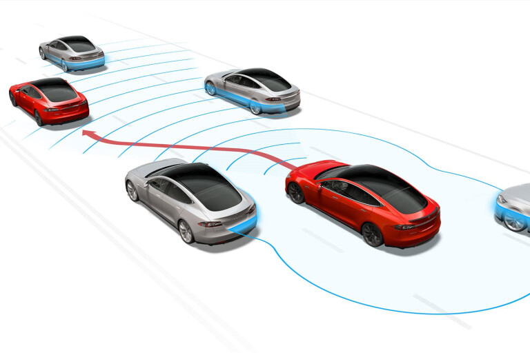

# Adaptive Cruise Control

ADAS features: { Traction Control System (TCS), Cross Wind Stabilization, Electronics Stability Control, Parking Assist, Driver Emergency Stop Assist, Hill Descent Control, Lane Assist, Collision Avoidance System, Automotive Head Up Display, Automotive Navigation System, Traffic Sign Recognition (TSR), Vehicular Communication System, Automotive Night Vision, Rear View Camera,  Omniview Technology, Blind Spot Monitor, Driver Drowsiness Detection, Intelligent Speed Adaptation (ISA), Adaptive Light Control System, Automatic Emergency Braking (AEB) }

The latest intelligent cruise control systems aim to tackle the entire journey, offloading the driver’s tasks whenever possible. Here are some of the most interesting use cases:

<b>Stop & Go cruise control : </b>
Traffic congestion is a real problem across the world. Major cities worldwide are faced with the challenge of optimizing their traffic networks. Even driving bumper to bumper at low speeds can result not only in discomfort for drivers, but also accidents. This is where Stop & Go cruise control can play a role. Operating similarly to adaptive cruise control on motorways, the difference is in slow-moving traffic, when it automatically stops or starts vehicle movement under driver supervision. The car will brake and accelerate on its own, while maintaining a safe distance from the vehicle in front.

<b>Speed limit-aware cruise control : </b>
One of the situations requiring ACC adjustment by the driver is when passing a speed limit sign. However, intelligent cruise control can automatically adjust the set speed to the newly detected speed limit, thanks to input from the traffic sign recognition system. This is done by fusing camera observation and map data to provide reliable speed restriction information.

<b>Eco cruise control for fuel and EV capacity savings : </b>
When in eco mode, cruise control adjusts the set speed so that the minimum amount of energy – whether electricity or fuel – is consumed during the journey. In a situation where a vehicle would go uphill, the system could drop the speed of the vehicle with 15-20%, in appreciation of the expected downhill speed gain shortly after.
To be able to make such judgment, ACC relies on ADAS map data, specifically gradient information. Being able to rely on slope data means that the TomTom ADAS Map has been proven to provide between 5-10% fuel savings.

<b>Cruise control in curves : </b>
Especially on country roads and junctions, but also on motorways, the driver usually needs to correct the speed set by adaptive cruise control when facing bends and turns.
Using curvature data from the ADAS Map, intelligent cruise control can eliminate human intervention by calculating the safe and comfortable speed for a given road segment. It does so by also considering specific vehicle dynamics.
There is also ample opportunity for customization. When in sport mode, the system can cater to drivers with a sporty driving style and shows them the dynamic driving capabilities of the vehicle.

<b>Turn-by-turn cruise control : </b>
One of the most recent advancements in intelligent cruise control technology is the capability to automate acceleration and braking at highway exits, entrances, junctions and roundabouts. Even when a driver corrects the vehicle speed by braking, as soon as the pedal is released, the system resumes its activity and sets the speed according to the upcoming road feature it detects. For example, this can be a drivable profile through a roundabout.
Map data is critical to this operation, as the system relies on insights based on traffic signs – stop, yield, traffic lights – and curvature at junction information.

<b>Predictive adaptive cruise control to anticipate road hazards ahead : </b>
When there is a road accident, a broken vehicle on the road or severe weather conditions such as icy roads, special caution when driving is required. Intelligent cruise control systems rely on the vehicle’s connectivity to obtain early warnings and adjust speed accordingly. The result is a safer and more comfortable journey for the driver and passengers.

<b>Parking speed control : </b>
The first and the last stage of a car journey with adaptive cruise control is always the same: controlling the speed when maneuvering in a parking or a driveway. To assist the driver in such a scenario, it is imperative to use additional sensing and very low speed.
Currently, many ACC systems under development target not only self-parking, but also maneuvering through large parking lots.

<b>Dynamic priority cruise control : </b>an emerging technology
The next step for modern adaptive cruise control systems is the ability to perceive and automatically handle changing traffic lights and other vehicles at junctions. Intelligent driving strategies that support this use case include priority negotiation and sensing a rapidly changing situation with high confidence. Of course, the driver can still observe the vehicle’s choices and intervene at any given moment.

Features in Map for Cruise Control:

- Gradient : 
Enables predictive gear-shifting to optimize energy use.

- Curvature on road : 
Helps with driving strategy choices, such as selecting a safe speed for the upcoming bend.

- Curvature at junction : 
Helps with driving strategy choices at roundabouts and junctions, without cruise control cancellation (selecting a safe speed).

- Traffic sign : 
Helps with driving strategy choices, such as fuel-efficient slowing down ahead of an upcoming stop.

- Speed restriction : 
Helps with driving strategy choices, such as selecting a safe speed.

- Lane at junction : 
Complements the vision of the system's detections. Completes curvature data for wider roads.

resources: [Advanced Driver Assistance System | Every ADAS Levels in Car Explained](https://youtu.be/EiWl5PAtfYA), [Springer : Adaptive Cruise Control](https://link.springer.com/chapter/10.1007/978-3-8348-8619-4_33)