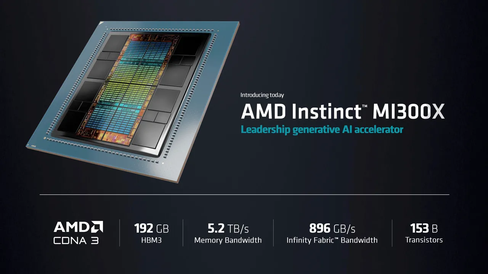

# AI Accelerators

The rapid growth of AI and machine learning has led to increasingly complex and computationally intensive AI models. To meet the demand for faster training and inference, specialized hardware accelerators, known as AI accelerators, have emerged. These accelerators are designed to perform AI-related computations more efficiently than general-purpose CPUs or GPUs.

Here is a comprehensive list of AI accelerators I came across while exploring about them :)  🌸

Accelerate AI computations with : CPU = scalar, GPU = vector, IPU = graph >>>

<table style="width:100%" >
<tr>
<th>AI accelerator</th>
<th>Description</th>
</tr>
<tr>
<td>Tensor Processing Unit (TPU)</td>
<td>Tensor Processing Units (TPUs) are Google’s custom-developed application-specific integrated circuits (ASICs) used to accelerate machine learning workloads. <a href="https://en.wikipedia.org/wiki/Tensor_Processing_Unit">TPUs</a> are available for monthly <a href="https://cloud.google.com/tpu/pricing">subscription</a> by Google.

<a href="https://www.golem.de/news/machine-learning-googles-mini-tpu-kosten-mit-board-150-us-dollar-1903-139824.html">Edge TPU</a> (mini-TPU) for edge devices. This is the <a href="https://coral.ai/products/dev-board/">dev board</a> and <a href="https://shop.heise.de/google-coral-usb-accelerator">USB accelerator</a> for mini TPU. The TPU is 15 to 30 times faster than current GPUs. TPUs have high latency and are specifically built to target matrix multiplication (deep learning).

reference: <a href="https://cloud.google.com/blog/products/ai-machine-learning/an-in-depth-look-at-googles-first-tensor-processing-unit-tpu">An in-depth look at Google’s first Tensor Processing Unit (TPU)</a>.

</td>
</tr>
<tr>
<td>Intelligence Processing Unit (IPU)</td>
<td><a href="https://www.graphcore.ai/">Graphcore's</a> IPU has 1216 independent <a href="https://www.graphcore.ai/products/ipu">processors</a>. GraphCore: In-House Software Stack called “Poplar” + Multi-threaded Dataflow Execution.  

IPUs have a structure which provides efficient massive compute parallelism hand in hand with huge memory bandwidth. Graph based processing will change the way data are processed. Poplar enables lowering Pytorch, Tensorflow, or ONNX-based models to an imperative, C++ compatible code, in favor of what the company termed as: “vertex programming”.

Reference: Graphcore - <a href="https://youtu.be/N0syxQlkpAg">What's Inside an IPU Chip?</a>

</td>
</tr>
<tr>
<td>Data Processing Unit (DPU)</td>
<td>
A DPU is a new class of programmable processor that combines three key elements. A DPU is a system on a chip, or SoC, that combines:   

1. An industry-standard, high-performance, software-programmable, multi-core CPU, typically based on the widely used Arm architecture, tightly coupled to the other SoC components. 
2. A high-performance network interface capable of parsing, processing and efficiently transferring data at line rate, or the speed of the rest of the network, to GPUs and CPUs. 
3. A rich set of flexible and programmable acceleration engines that offload and improve applications performance for AI and machine learning, zero-trust security, telecommunications and storage, among others.

Example : [NVIDIA DPU](https://blogs.nvidia.com/blog/2020/05/20/whats-a-dpu-data-processing-unit/), [Blue Field](https://www.nvidia.com/en-us/networking/products/data-processing-unit/)
 

</td>
</tr>
<tr>
<td>Vision Processing Unit (VPU)</td>
<td>
A vision processing unit (VPU) is an emerging class of microprocessor; it is a specific type of AI accelerator, designed to accelerate machine vision tasks.

Example : [Intel® Movidius™ Vision Processing Units (VPUs)](https://www.intel.de/content/www/de/de/products/details/processors/movidius-vpu.html)
</td>
</tr>
<tr>
<td>Quantum Processing Unit (QPU)</td>
<td>

A quantum processing unit (QPU), also referred to as a quantum chip, is a physical (fabricated) chip that contains a number of interconnected qubits. It is the foundational component of a full quantum computer, which includes the housing environment for the QPU, the control electronics, and many other components. A QPU, aka a quantum processor, is the brain of a quantum computer that uses the behavior of particles like electrons or photons to make certain kinds of calculations much faster than processors in today’s computers. By contrast, CPUs, GPUs and DPUs all apply principles of classical physics to electrical currents. That’s why today’s systems are called classical computers. Here is a [list](https://en.wikipedia.org/wiki/List_of_quantum_processors) of quantum processors.

</td>
</tr>

<tr>
<td>Neural Processing Unit (NPU)</td>
<td>
Neural Processing Units (NPUs) are specialized hardware accelerators designed to efficiently execute neural network algorithms, enabling high-performance artificial intelligence (AI) applications. NPUs are optimized for a data-driven parallel computing, making them highly efficient at processing massive multimedia data like videos and images and processing data for neural networks.

Example : [ARM Ethos-U65](https://www.arm.com/products/silicon-ip-cpu/ethos/ethos-u65), [Intel Mobileye EyeQ Ultra](https://www.intel.com/content/www/us/en/newsroom/news/mobileye-ces-2022-tech-news.html).
</td>
</tr>

<tr>
<td>Field-programmable gate array (FPGA)</td>
<td>FPGAs support a wide computational spectrum by enabling bit-level configurability: the arithmetic units can be configured to implement functions that operate on numbers of arbitrary widths, and the on-chip memory blocks can be fused to construct memory spaces of varied sizes. FPGA == reconfigurability.</td>
</tr>
<tr>
<td>Coarse-Grained Reconfigurable Arrays (CGRAs)</td>
<td>CGRAs have a high degree of reconfigurability but at a coarser-granularity than FPGAs (they sacrifice the finer-grained bit-level configurability as it might not be necessary).

Reconfigurable Dataflow — Wave Computing, SambaNova, SimpleMachines. They describe a software-defined hardware approach in which the compiler determines the structures of computational datapaths and the behavior of on-chip memories. At the core of its architecture lies the “reconfigurable dataflow unit” (RDU). The RDU chip contains an array of compute units (called “PCUs”) and scratchpad memory units (called “PMUs”) organized in a 2D-mesh hierarchy interconnected with NoC (network-on-chip) switches the RDU accesses off-chip memory using a hierarchy of units called AGUs and CUs.
</td>
</tr>
<tr>
<td>Application-specific integrated circuit (ASIC)</td>
<td>An application-specific integrated circuit is an integrated circuit (IC) chip customized for a particular use, rather than intended for general-purpose use like TPUs for deep learning. You can design custom ASICs as per need rather than using general purpose chips.</td>
</tr>
<tr>
<td>System on a chip (SoC)</td>
<td>A system-on-a-chip (SoC) is a microchip with all the necessary electronic circuits and parts for a given system, such as a smartphone or wearable computer, on a single integrated circuit (IC).

example - [Hailo](https://hailo.ai/) : Efficient Dataflow for Edge Inference.
</td>
</tr>
<tr>
<td>Cerebras Wafer-Scale Engine (WSE)</td>
<td>Their “chip” is a single wafer, meaning no dissection, just keep all manufactured chips on the big piece of silicon, and this would be the chip. Compared to the A100, Cerebras’ second-generation WSE (WSE-2) houses 123x more cores, 1000x more memory at 56x more the size but more power consumption.</td>
</tr>
<tr>
<td>Photonic Integrated Circuit (PIC)</td>
<td>

[LightMatter](https://lightmatter.co/) : Photonics-Based Analog Computing. They designed a systolic array-based that performs multiply-and-accumulate operations by manipulating the photonics input signals using phase-shift encoded as different phases in the light signal’s waves (similar to how signals are being modulated when they are sent over fiber optic cables). As photonics data flows at the speed of light, LightMatter’s chips can potentially perform matrix and vectorized operations at very high speeds and potentially orders of magnitude less power.
There is another startup called [lighton.ai](https://lighton.ai/photonic-computing-for-ai/) working on photonic computing.

</td>
</tr>
<tr>
<td>Super Computer</td>
<td><a href="https://youtu.be/oRUcvu-liFM">Tesla Dojo</a>, <a href="https://www.nvidia.com/en-us/data-center/dgx-superpod/">	NVIDIA DGX SuperPOD</a></td>
</tr>
</table>
 

source: [microsoft](https://www.microsoft.com/en-us/research/uploads/prod/2017/08/HC29.22622-Brainwave-Datacenter-Chung-Microsoft-2017_08_11_2017.compressed.pdf)

Leading AI hardware startups developing  several custom AI chips : 	[cerebras](https://www.cerebras.net/product-system/), [SambaNoba](https://sambanova.ai/), [Habana](https://habana.ai/), [Groq](https://groq.com/), [Hailo](https://hailo.ai/), [Esperanto](https://www.esperanto.ai/). 

References: AI Accelerators — Part I: [Intro](https://medium.com/@adi.fu7/ai-accelerators-part-i-intro-822c2cdb4ca4), Part II: [Transistors and Pizza](https://medium.com/@adi.fu7/ai-accelerators-part-ii-transistors-and-pizza-or-why-do-we-need-accelerators-75738642fdaa) (or: Why Do We Need Accelerators)?, Part III: [Architectural Foundations](https://medium.com/@adi.fu7/ai-accelerators-part-iii-architectural-foundations-3f1f73d61f1f), Part IV: [The Very Rich Landscape](https://medium.com/@adi.fu7/ai-accelerators-part-iv-the-very-rich-landscape-17481be80917), Part V: [Final Thoughts](https://medium.com/@adi.fu7/ai-accelerators-part-v-final-thoughts-94eae9dbfafb) ; [Accelerating Persistent Neural Networks at Datacenter Scale](https://youtu.be/DbhAMiQ_yvs) - Back in the 1980s, 1990s, and early 2000s, there was the “RISC vs. CISC war” with x86-based Intel and AMD leading the CISC side and ARM’s ISA leading “camp RISC”. There are pros and cons for each approach, but ultimately and greatly due to the booming of ARM-based smartphones, RISC came at the upper hand for mobile devices. It is now also becoming more dominant in the cloud with the designs like Amazon’s ARM-based line of [AWS Graviton](https://aws.amazon.com/ec2/graviton/) processors. NVIDIA was to buy ARM  at $40 B.

ISA for AI - Domain specific ISAs (extended RISCs), Very-Long Instruction Word (VLIW) architectures, Systolic Arrays ( used by TPUs and NVIDIA Tensor cores), Reconfigurable Processors (FPGAs), Dataflow Processing Systems and Processing in Memory ( for near data processing / Neuromorphic Computing - [IBM True North](https://youtu.be/X2TYAcr36r0), [Intel Loihi 2](https://www.intel.com/content/www/us/en/research/neuromorphic-computing.html), [brainchip](https://brainchip.com/) ). Startups working on Systolic Arrays + VLIW: TPUv1, Groq, and Habana (2 chips: Goya for inference and Gaudi for training, [Greco](https://habana.ai/inference/greco/)). RISC-Based AI Accelerators: Esperanto and TensTorrent, [NeuReality](https://www.neureality.ai/): TCO-Driven Approach to Eliminate System Overheads.

####  [NVIDIA DGX™ B200](https://www.nvidia.com/en-in/data-center/dgx-b200/) - Equipped with eight NVIDIA Blackwell GPUs interconnected with fifth-generation NVIDIA® NVLink®, DGX B200 delivers leading-edge performance, offering 3X the training performance and 15X the inference performance of previous generations.

#### [Cerebras CS-3](https://www.cerebras.net/blog/cerebras-cs3) - the world’s fastest and most scalable AI accelerator. More details on CS-3 [here](https://www.cerebras.net/product-system/).

#### [Tenstorrent](https://tenstorrent.com/) - [Unboxing the Tenstorrent Grayskull AI Accelerator!](https://youtu.be/WJpJkvNw9Ts?si=em4rBlJ-DUL_R7PT).

#### [AMD Alveo U50 Data Center Accelerator Card](https://www.xilinx.com/products/boards-and-kits/alveo/u50.html) - The AMD Alveo™ U50 Data Center accelerator cards provide optimized acceleration for workloads in financial computing, machine learning, computational storage, and data search and analytics.

[AMD Acceleration Cards](https://www.xilinx.com/products/boards-and-kits/accelerator-cards.html), [MemryX](https://memryx.com/) - AI Acceleration, [AMD FZ5](https://www.xilinx.com/products/boards-and-kits/1-1e4y1or.html).

# Generative AI Accelerators :

## AMD unveils MI300x AI chip as 'generative AI accelerator'

To be able to run an entire 40-billion parameter model in memory, said Lisa Su, actually reduces the number of GPUs you need. [[source](https://www.zdnet.com/article/amd-unveils-mi300x-ai-chip-as-generative-ai-accelerator/)]

## Microsoft Azure Maia AI Accelerator

[With a systems approach to chips, Microsoft aims to tailor everything ‘from silicon to service’ to meet AI demand](https://news.microsoft.com/source/features/ai/in-house-chips-silicon-to-service-to-meet-ai-demand/), [Microsoft announces custom AI chip](https://youtu.be/gGGBVp_w9fI?si=C_WuJrtAShEzBOFs)

## Intel® Gaudi 3 AI Accelerator

Big for Gen AI, Even Bigger for ROI : [Intel® Gaudi 3 AI Accelerator](https://www.intel.com/content/www/us/en/products/details/processors/ai-accelerators/gaudi3.html).

