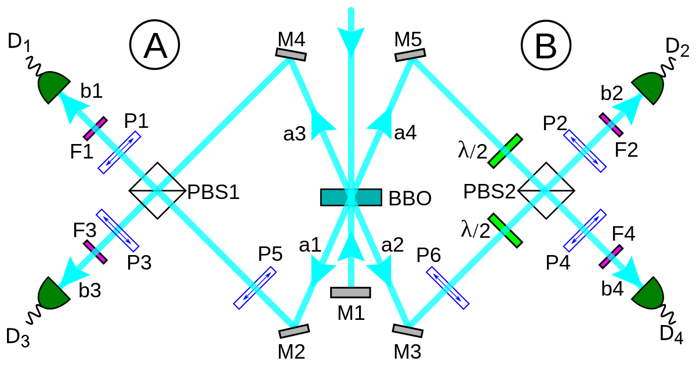

# New modes of computing #AI

<a> </a>

### Graphene-based transistors : 

Graphene, a material just one atom thick made of carbon and known for its exceptional conductivity, can be fashioned into minuscule tubes and combined with other two-dimensional materials to enhance the speed of electron movement. This advancement allows for more efficient use of space and energy compared to even the smallest silicon transistors. However, until recently, the production of these nanotubes was hindered by messiness and high error rates, making commercial viability challenging.

resource: [This New Semiconductor Could Revolutionize Computing](https://youtu.be/oXBtPmVrES4?si=4bZ46FLdFt7n92vn), [Georgia Tech Researchers Create First Functional Graphene Semiconductor](https://youtu.be/gWUX2OTqkEo?si=aYLXf6ZryhhgS6yQ), [Researchers herald functional graphene semiconductor](https://youtu.be/W2MlkVdSfz4?si=1dCxO_9eQ-vQuQaa), [Graphene Processors and Quantum Gates](https://youtu.be/VLPpDoMBVK0?si=yV4dCoxFwsI0xqhe), [MIT : Powering the Next Generation of Electronics - Graphene Conductivity & Neuromorphic Computing](https://youtu.be/2lN0mhbR5SI?si=UmfO02DufeZs1_ZC), [How Graphene Could Help Us Build Bigger and Better Quantum Computers](https://youtu.be/87diaTDipNU?si=kBxRTk7jrBVGReXx), [New Microchip Breakthrough: New Era in Electronics?](https://youtu.be/wGzBuspS9JI?si=mHazGtQIR8gZCHCT).

+ Charge carriers in graphene, such as electrons, exhibit high mobility (atleast 10x), meaning they can move through the material with less resistance.
+ Graphene is only one atom thick, making graphene-based transistors extremely thin compared to silicon transistors, which are typically thicker.
+ Graphene possesses excellent thermal conductivity, which can help in dissipating heat generated during transistor operation. 
+ One of the key differences is the presence of a bandgap in silicon but not in graphene. Silicon transistors can be turned on and off effectively due to this bandgap, while graphene-based transistors lack this property, requiring additional engineering to control current flow. 


## Optical Computing

The ability to compute using photons, that is, by mapping data onto light-intensity levels and then varying the light intensity to perform calculations. Optical computing leverages the properties of light, such as speed, wavelength, and coherence, to process and manipulate data. Unlike electronic computers that use binary digits (bits), optical computers can utilize photons as information carriers, enabling parallel processing and high-speed operations.

resources : [[1](https://youtu.be/L6oXAfvmJQ8)], [[2](https://youtu.be/UWMEKex6nYA)], [[3](https://youtu.be/UqeH7ozVOpQ)], [[4](https://youtu.be/t0yj4hBDUsc)], [[5](https://youtu.be/29aTqLvRia8)]


+ Photonic transistors are what powers optical computer. (100x - 1000x faster than normal commercial transistors used today & extremely power efficient). Terabit bandwidth! <br />
+ Photonic CPUs are 5x faster than NVIDIA A100 GPUs and 7x energy efficient. <br />
+ Calculations are analog than digital. A bit of less precision but deep learning matrix operations aren't based on precision to the teeth. <br />
+ Future AI hardware accelerators will be based on Silicon Photonics. <br />
+ Heat loss in PCB due to ions smashing against each other, minimized by AI hardware accelerators by arranging them parallel but consumes a lot of energy. Thus we need Photonic Computing which is based on light, controlled ion flow and energy efficient. <br />

Available chip: [lighton.ai](https://lighton.ai/photonic-computing-for-ai/), [lightmatter](https://lightmatter.co/), [lightintelligence.ai](https://www.lightelligence.ai/), [Enlightra](https://enlightra.com/), [Quintessent](https://www.quintessent.com/), [Ayar Labs](https://ayarlabs.com/), [Lidwave](https://www.lidwave.com/). <br />
News: [Photonic Chip Performs Image Recognition at the Speed of Light](https://spectrum.ieee.org/photonic-neural-network), [Mobileye Puts Lidar on a Chip—and Helps Map Intel's Future](https://www.wired.com/story/mobileye-lidar-on-a-chip-intel/), [OPTICAL COMPUTING FOR POST-QUANTUM CRYPTOGRAPHY](https://optalysys.com/optical-computing-for-post-quantum-cryptography/), [PyTorch ONN](https://github.com/JeremieMelo/pytorch-onn), [New Photonic Chip: x1000 faster](https://youtu.be/8ohh0cdgm_Y?si=5QV38w_yjBAIgfeT) [Lithium niobate], [Lithium Niobate Photonics In The Era of AI](https://youtu.be/qdIJCQYKe14?si=-q94pVsEC_Ytz4r8), [High density lithium niobate photonic integrated circuits](https://www.nature.com/articles/s41467-023-40502-8), [UPenn develops optical chip to process complex math for AI](https://optics.org/news/15/2/28#:~:text=Engineers%20at%20the%20University%20of,also%20reducing%20their%20energy%20consumption%E2%80%9D.), []() . <br /><br />

## Neuromorphic Computing
resources : [[1](https://youtu.be/TetLY4gPDpo)], [[2](https://youtu.be/u9pulFlavIM)]


+  Elements of a computer are modeled after systems in the human brain and nervous system. Neuron to Neuron communication and results to more energy efficient computation for AI tasks.<br />
+ Different element like single crystalline Silicon + layer of Silicon Germanium, Tantalum Oxide are used to control precise flow of ions.<br />

Available chip: [IBM True North](https://youtu.be/X2TYAcr36r0), [Intel Loihi 2](https://www.intel.com/content/www/us/en/research/neuromorphic-computing.html), [brainchip](https://brainchip.com/).<br />

<br />

## Quantum Computing
resources : [[1](https://youtu.be/-UlxHPIEVqA)], [[2](https://youtu.be/u1XXjWr5frE)], [[3](https://youtu.be/Fzzxozmuj4I)], [[4](https://youtu.be/-ZNEzzDcllU)], [[5](https://youtu.be/rlsUiOlBwoI)], [[6](https://youtu.be/j9eYQ_ggqJk)], [[7](https://youtu.be/vfJuvNuSPKw)]


```python
    import numpy as np
    import os

    from qiskit.tools.visualization import plot_histogram
    from qiskit import execute, QuantumCircuit, QuantumRegister, ClassicalRegister
    from qiskit import BasicAer
    from IPython.display import display, Math

    from quantuminspire.credentials import get_authentication
    from quantuminspire.qiskit import QI

    QI_URL = os.getenv('API_URL', 'https://api.quantum-inspire.com/')


    def format_vector(state_vector, decimal_precision=7):
        """ Format the state vector into a LaTeX formatted string.

        Args:
            state_vector (list or array): The state vector with complex
                                        values e.g. [-1, 2j+1].

        Returns:
            str: The LaTeX format.
        """
        result = []
        epsilon = 1/pow(10, decimal_precision)
        bit_length = (len(state_vector) - 1).bit_length()
        for index, complex_value in enumerate(state_vector):
            has_imag_part = np.round(complex_value.imag, decimal_precision) != 0.0
            value = complex_value if has_imag_part else complex_value.real
            value_round = np.round(value, decimal_precision)
            if np.abs(value_round) < epsilon:
                continue

            binary_state = '{0:0{1}b}'.format(index, bit_length)
            result.append(r'{0:+2g}\left\lvert {1}\right\rangle '.format(value_round, binary_state))
        return ''.join(result)

```


+ Building block = qbits ( 0 or/and 1 based on probability ~ Superposition). 2 qbit equals 4 quantum states and grows exponentially. <br />
+ Entanglement: Probability Distribution of n qubits changes altogether if arrow direction of one qubit is changed. <br />
+ Interference: Adding wave functions of qubits. <br />
+ We can program quantum computers with python using [Qiskit](https://qiskit.org/). <br />
+ Research paper: Quantum supremacy using a programmable superconducting processor ([nature](https://www.nature.com/articles/s41586-019-1666-5)). <br />
+ Google achieved Quantum supremacy with their Weber computer ([Sycamore processor](https://quantumai.google/hardware/datasheet/weber.pdf)). <br />

Available Resources : [Google Quantum AI](https://quantumai.google/), [IBM Quantum System II](https://youtu.be/AQjKUN8PORM), [PsiQuantum](https://www.psiquantum.com/).
<br />

News: [Quantum Computer Completed A 2.5-Billion-Year Task In 200 Seconds](https://www.intelligentliving.co/quantum-computer-2-5-billion-year-task-in-200-seconds/) ( earlier estimated 10,000+ years), [1 million qubit quantum computers: moving beyond the current “brute force” strategy](https://seeqc.com/blog/1-million-qubit-quantum-computers-moving-beyond-the-current-brute-force-strategy), [Hello quantum world! Google publishes landmark quantum supremacy claim](https://www.nature.com/articles/d41586-019-03213-z). <br />

<br /><br />