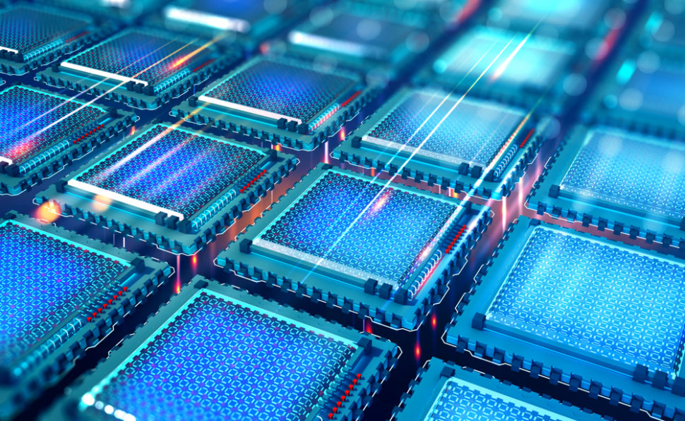
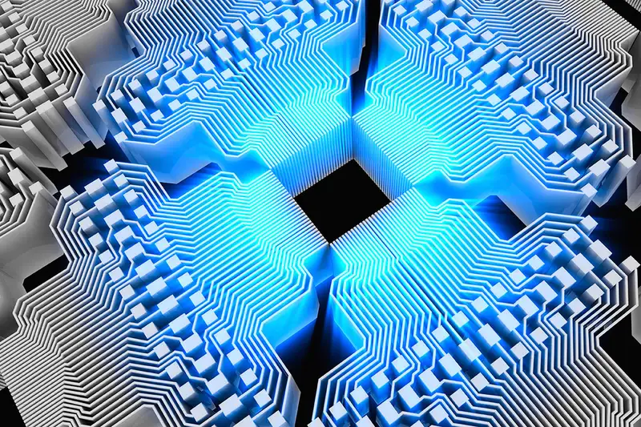
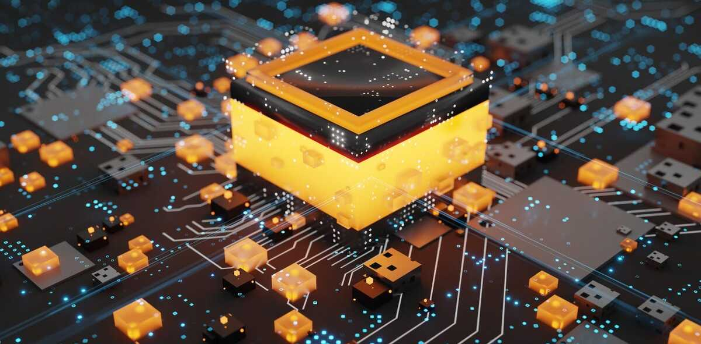

# New modes of computing #AI

## Optical Computing
resources : [[1](https://youtu.be/L6oXAfvmJQ8)], [[2](https://youtu.be/UWMEKex6nYA)], [[3](https://youtu.be/UqeH7ozVOpQ)], [[4](https://youtu.be/t0yj4hBDUsc)], [[5](https://youtu.be/29aTqLvRia8)]

+ Photonic transistors are what powers optical computer. (100x - 1000x faster than normal commercial transistors used today & extremely power efficient). Terabit bandwidth!  
+ Photonic CPUs are 5x faster than NVIDIA A100 GPUs and 7x energy efficient.  
+ Calculations are analog than digital. A bit of less precision but deep learning matrix operations aren't based on precision to the teeth.  
+ Future AI hardware accelerators will be based on Silicon Photonics.  
+ Heat loss in PCB due to ions smashing against each other, minimized by AI hardware accelerators by arranging them parallel but consumes a lot of energy. Thus we need Photonic Computing which is based on light, controlled ion flow and energy efficient.  

Available chip: [lighton.ai](https://lighton.ai/photonic-computing-for-ai/), [lightmatter](https://lightmatter.co/)  
News: [Photonic Chip Performs Image Recognition at the Speed of Light](https://spectrum.ieee.org/photonic-neural-network), [Mobileye Puts Lidar on a Chip—and Helps Map Intel's Future](https://www.wired.com/story/mobileye-lidar-on-a-chip-intel/)   

## Neuromorphic Computing
resources : [[1](https://youtu.be/TetLY4gPDpo)], [[2](https://youtu.be/u9pulFlavIM)]

+  Elements of a computer are modeled after systems in the human brain and nervous system. Neuron to Neuron communication and results to more energy efficient computation for AI tasks. 
+ Different Element like Single Crystalline Silicon + layer of Silicon Germanium, Tantalum Oxide are used to control precise flow of ions. 

Available chip: [IBM True North](https://youtu.be/X2TYAcr36r0), [Intel Loihi 2](https://www.intel.com/content/www/us/en/research/neuromorphic-computing.html), [brainchip](https://brainchip.com/). 

 

## Quantum Computing
resources : [[1](https://youtu.be/-UlxHPIEVqA)], [[2](https://youtu.be/u1XXjWr5frE)], [[3](https://youtu.be/Fzzxozmuj4I)], [[4](https://youtu.be/-ZNEzzDcllU)], [[5](https://youtu.be/rlsUiOlBwoI)], [[6](https://youtu.be/j9eYQ_ggqJk)], [[7](https://youtu.be/vfJuvNuSPKw)]

>

+ Building block = qbits ( 0 or/and 1 based on probability ~ Superposition). 2 qbit equals 4 quantum states and grows exponentially.  
+ Entanglement: Probability Distribution of n qubits changes altogether if arrow direction of one qubit is changed.  
+ Interference: Adding wave functions of qubits.  
+ We can program quantum computers with python using [Qiskit](https://qiskit.org/).  
+ Research paper: Quantum supremacy using a programmable superconducting processor ([nature](https://www.nature.com/articles/s41586-019-1666-5)).  
+ Google achieved Quantum supremacy with their Weber computer ([Sycamore processor](https://quantumai.google/hardware/datasheet/weber.pdf)).  

Available Resources : [Google Quantum AI](https://quantumai.google/), [IBM Quantum System II](https://youtu.be/AQjKUN8PORM)
 

News: [Quantum Computer Completed A 2.5-Billion-Year Task In 200 Seconds](https://www.intelligentliving.co/quantum-computer-2-5-billion-year-task-in-200-seconds/) ( earlier estimated 10,000+ years), [1 million qubit quantum computers: moving beyond the current “brute force” strategy](https://seeqc.com/blog/1-million-qubit-quantum-computers-moving-beyond-the-current-brute-force-strategy), [Hello quantum world! Google publishes landmark quantum supremacy claim](https://www.nature.com/articles/d41586-019-03213-z).  

  