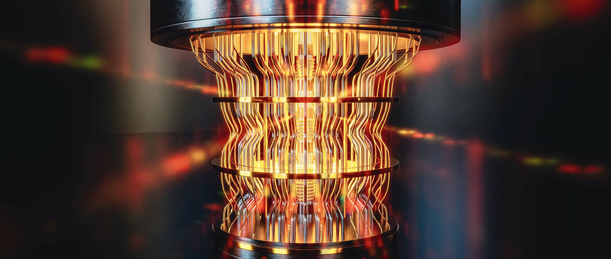
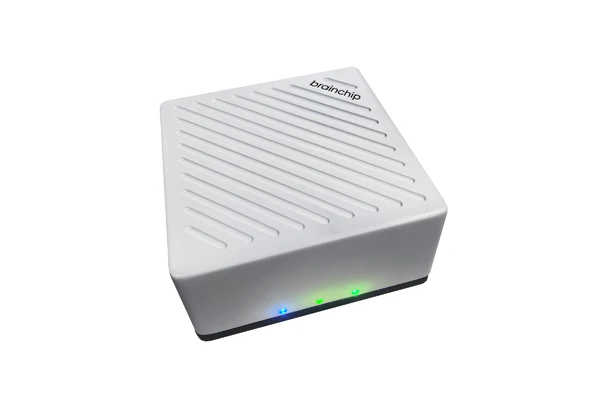

# New modes of computing #AI



<a> </a>

The future of computing is rapidly evolving, with transformative modes on the horizon that are set to redefine how we process, store, and analyze information. Here are some of the emerging paradigms that could shape the future of computing:

<p style="text-align:justify;">

1. `Quantum Computing` : 
Quantum computing leverages the principles of quantum mechanics, specifically superposition and entanglement, to perform complex calculations at unprecedented speeds. Unlike classical computers that use binary bits (0s and 1s), quantum computers use qubits that can represent and process multiple states simultaneously. This allows for massive parallelism and could revolutionize fields such as cryptography, drug discovery, optimization problems, and climate modeling. However, quantum computing is still in its infancy, with challenges related to qubit stability (quantum coherence) and error correction needing to be solved.
</p>

<p style="text-align:justify;">

2. `Neuromorphic Computing` : 
Neuromorphic computing aims to mimic the human brain's neural architecture, using specialized hardware like spiking neural networks to process information more efficiently. This mode of computing has applications in fields that require adaptive and real-time learning, such as robotics, sensory processing, and AI-driven decision-making. Neuromorphic chips are designed to be highly energy-efficient, potentially enabling devices that can perform complex AI tasks locally, without relying on cloud computing or high-power processors.
</p>

<p style="text-align:justify;">

3. `Edge and Fog Computing` : 
While cloud computing centralizes data processing, edge and fog computing bring computational resources closer to the data source, reducing latency and bandwidth costs. In edge computing, devices process data locally, making it ideal for applications requiring real-time decision-making, such as autonomous vehicles, IoT devices, and smart cities. Fog computing expands on edge computing by creating a distributed network of nodes between the cloud and the edge, allowing for more extensive processing and analytics at a near-local level. Together, these paradigms enable faster responses and reduce reliance on centralized cloud infrastructure.
</p>

<p style="text-align:justify;">

4. `Optical and Photonic Computing` : 
Optical computing uses photons instead of electrons for data processing, allowing for faster data transfer and lower energy consumption. Photonic computing has significant potential for applications in high-speed data centers and AI model training, where traditional electronic chips face limitations due to energy and heat dissipation issues. With advancements in silicon photonics, the integration of optical components on silicon chips is becoming more feasible, promising substantial improvements in speed and efficiency.
</p>

<p style="text-align:justify;">

5. `DNA and Biological Computing` : 
DNA computing leverages the biological molecules within DNA to store and process information. Unlike traditional binary computing, DNA computing can handle a large number of parallel computations, making it suitable for complex problem-solving, such as combinatorial optimization and pattern recognition. As research progresses, DNA computing could offer ultra-dense data storage solutions and even enable biological interfaces for healthcare and genetic research.
</p>

<p style="text-align:justify;">

6. `Reversible and Energy-Efficient Computing` : As energy efficiency becomes a priority, reversible computing offers a promising approach. This paradigm reduces energy dissipation by allowing computations to be reversed, theoretically making them "lossless" in terms of energy. By minimizing heat generation, reversible computing could address the energy constraints facing modern data centers and high-performance computing systems. It’s still a developing field, but it has the potential to contribute significantly to the sustainability of future computing technologies.
</p>

<p style="text-align:justify;">

7. `Holographic and 3D Computing` : 
Holographic and 3D computing explore the possibility of using light-based holographic systems and three-dimensional chip architectures. Holographic memory, for instance, can store information in 3D spaces, potentially offering high-density data storage. In 3D computing, stacking chips vertically enhances processing capabilities by allowing components to be closer together, which improves data transfer rates and power efficiency. These approaches hold promise for applications requiring massive storage and rapid access times.
</p>

<p style="text-align:justify;">

8. `Distributed Ledger and Blockchain Computing` : 
Blockchain and other distributed ledger technologies (DLT) offer decentralized, tamper-proof computing methods, particularly beneficial for applications that require transparency, security, and immutability. Blockchain computing is transforming fields like finance, supply chain, healthcare, and IoT by allowing multiple parties to access and verify data without a central authority. In the future, blockchain's integration with other computing paradigms could lead to new ways of handling data ownership, privacy, and security.
</p>

<p style="text-align:justify;">

9. `Artificial General Intelligence (AGI) and Brain-Computer Interfaces (BCI)` : 
AGI aims to create machines with human-like cognitive abilities, capable of reasoning, problem-solving, and learning autonomously across a wide range of tasks. Achieving AGI would represent a paradigm shift, allowing computers to operate in complex, dynamic environments with minimal human intervention. Brain-computer interfaces, which connect the human brain directly to computers, are also emerging, enabling new modes of interaction and control. These interfaces could provide breakthroughs in assistive technologies, remote control, and even enhancing human cognition.
</p>

<p style="text-align:justify;">

10. `Hyperdimensional Computing` : 
Hyperdimensional computing, or vector-symbolic architectures, is inspired by the way the human brain represents information across distributed patterns. This paradigm encodes information in high-dimensional spaces, allowing for noise-robust and parallelized computation. It’s particularly well-suited for AI and machine learning tasks, especially in resource-constrained environments like mobile devices and embedded systems, where conventional models may struggle with efficiency.

Resources : [vid](https://youtu.be/g7ih6rHdw3M?si=o3jVJJz1Ly2K6Wwu), [1](https://www.quantamagazine.org/a-new-approach-to-computation-reimagines-artificial-intelligence-20230413/), [2](https://michielstock.github.io/posts/2022/2022-10-04-HDVtutorial/), [3](https://redwood.berkeley.edu/wp-content/uploads/2018/01/kanerva2009hyperdimensional.pdf), [4](https://youtu.be/zUCoxhExe0o?si=diODRJDvD82w5QhA)


</p>


<p style="text-align:justify;">

11. `Spatial and In-Memory Computing` : 
Spatial computing focuses on processing data in a way that aligns with its physical location, enabling real-world applications in augmented reality (AR), virtual reality (VR), and smart environments. In-memory computing, on the other hand, integrates data storage and processing within memory hardware, drastically reducing latency. Both paradigms aim to meet the increasing demand for real-time processing in immersive and data-intensive applications, from AR-assisted surgery to large-scale simulations.
</p>

### Graphene-based transistors : 

Graphene, a material just one atom thick made of carbon and known for its exceptional conductivity, can be fashioned into minuscule tubes and combined with other two-dimensional materials to enhance the speed of electron movement. This advancement allows for more efficient use of space and energy compared to even the smallest silicon transistors. However, until recently, the production of these nanotubes was hindered by messiness and high error rates, making commercial viability challenging.

resource: [This New Semiconductor Could Revolutionize Computing](https://youtu.be/oXBtPmVrES4?si=4bZ46FLdFt7n92vn), [Georgia Tech Researchers Create First Functional Graphene Semiconductor](https://youtu.be/gWUX2OTqkEo?si=aYLXf6ZryhhgS6yQ), [Researchers herald functional graphene semiconductor](https://youtu.be/W2MlkVdSfz4?si=1dCxO_9eQ-vQuQaa), [Graphene Processors and Quantum Gates](https://youtu.be/VLPpDoMBVK0?si=yV4dCoxFwsI0xqhe), [MIT : Powering the Next Generation of Electronics - Graphene Conductivity & Neuromorphic Computing](https://youtu.be/2lN0mhbR5SI?si=UmfO02DufeZs1_ZC), [How Graphene Could Help Us Build Bigger and Better Quantum Computers](https://youtu.be/87diaTDipNU?si=kBxRTk7jrBVGReXx), [New Microchip Breakthrough: New Era in Electronics?](https://youtu.be/wGzBuspS9JI?si=mHazGtQIR8gZCHCT).

+ Charge carriers in graphene, such as electrons, exhibit high mobility (atleast 10x), meaning they can move through the material with less resistance.
+ Graphene is only one atom thick, making graphene-based transistors extremely thin compared to silicon transistors, which are typically thicker.
+ Graphene possesses excellent thermal conductivity, which can help in dissipating heat generated during transistor operation. 
+ One of the key differences is the presence of a bandgap in silicon but not in graphene. Silicon transistors can be turned on and off effectively due to this bandgap, while graphene-based transistors lack this property, requiring additional engineering to control current flow. 

[Intelligent Computing: The Latest Advances, Challenges, and Future](https://spj.science.org/doi/10.34133/icomputing.0006#sec-5)

## Optical Computing

The ability to compute using photons, that is, by mapping data onto light-intensity levels and then varying the light intensity to perform calculations. Optical computing leverages the properties of light, such as speed, wavelength, and coherence, to process and manipulate data. Unlike electronic computers that use binary digits (bits), optical computers can utilize photons as information carriers, enabling parallel processing and high-speed operations.

resources : [[1](https://youtu.be/L6oXAfvmJQ8)], [[2](https://youtu.be/UWMEKex6nYA)], [[3](https://youtu.be/UqeH7ozVOpQ)], [[4](https://youtu.be/t0yj4hBDUsc)], [[5](https://youtu.be/29aTqLvRia8)]


+ Photonic transistors are what powers optical computer. (100x - 1000x faster than normal commercial transistors used today & extremely power efficient). Terabit bandwidth! <br />
+ Photonic CPUs are 5x faster than NVIDIA A100 GPUs and 7x energy efficient. <br />
+ Calculations are analog than digital. A bit of less precision but deep learning matrix operations aren't based on precision to the teeth. <br />
+ Future AI hardware accelerators will be based on Silicon Photonics. <br />
+ Heat loss in PCB due to ions smashing against each other, minimized by AI hardware accelerators by arranging them parallel but consumes a lot of energy. Thus we need Photonic Computing which is based on light, controlled ion flow and energy efficient. <br /><br />


+ `Photonic Analog Computing`: Research has shown that optical configurations using phase masks can be leveraged to perform analog computations, such as matrix multiplications, at the speed of light. While intriguing, these systems are not yet easily miniaturizable for general-purpose computing but are promising for specialized tasks like industrial image recognition.

+ `Integrated Photonics`: Companies like Lightmatter and Lightelligence have made significant strides in integrated photonic circuits, which perform operations like matrix multiplications faster and more efficiently than traditional electronic processors. Lightmatter’s systems, for example, have demonstrated the capability to run neural network calculations three times faster than NVIDIA's DGX-A100 GPU chip.

+ `Intel’s Optical Compute Interconnect (OCI) Chiplet`: Intel introduced a new Optical Compute Interconnect (OCI) chiplet, which is integrated with a next-generation processor. This chiplet is designed to meet the growing demand for high-bandwidth AI infrastructure, offering scalability and energy efficiency. Intel also presented developments in quantum dot lasers integrated with silicon photonics, which show promise for reducing the complexity and cost of optical systems in data centers.

Available chip: [lighton.ai](https://lighton.ai/photonic-computing-for-ai/), [lightmatter](https://lightmatter.co/), [lightintelligence.ai](https://www.lightelligence.ai/), [Enlightra](https://enlightra.com/), [Quintessent](https://www.quintessent.com/), [Ayar Labs](https://ayarlabs.com/), [Lidwave](https://www.lidwave.com/). <br />
News: [Photonic Chip Performs Image Recognition at the Speed of Light](https://spectrum.ieee.org/photonic-neural-network), [Mobileye Puts Lidar on a Chip—and Helps Map Intel's Future](https://www.wired.com/story/mobileye-lidar-on-a-chip-intel/), [OPTICAL COMPUTING FOR POST-QUANTUM CRYPTOGRAPHY](https://optalysys.com/optical-computing-for-post-quantum-cryptography/), [PyTorch ONN](https://github.com/JeremieMelo/pytorch-onn), [New Photonic Chip: x1000 faster](https://youtu.be/8ohh0cdgm_Y?si=5QV38w_yjBAIgfeT) [Lithium niobate], [Lithium Niobate Photonics In The Era of AI](https://youtu.be/qdIJCQYKe14?si=-q94pVsEC_Ytz4r8), [High density lithium niobate photonic integrated circuits](https://www.nature.com/articles/s41467-023-40502-8), [UPenn develops optical chip to process complex math for AI](https://optics.org/news/15/2/28#:~:text=Engineers%20at%20the%20University%20of,also%20reducing%20their%20energy%20consumption%E2%80%9D.), [Quantum Computing with Light: The Breakthrough?](https://youtu.be/7UkXJsF8_so?si=xkTbkFhbZXPQzQkm). <br /><br />

## Neuromorphic Computing

The goal of this technology is to create a computer that mimics the architecture of the human brain in order to achieve human levels of problem solving – and perhaps even cognition at some point – while requiring hundreds of thousands of times less energy than a traditional transistor. Neuromorphic computing is based on the concept of neuromorphism, which involves designing computing systems that mimic the structure and behavior of the brain's neurons and synapses. These systems consist of interconnected artificial neurons and synapses, which process and transmit information in a manner similar to biological neural networks.

+ Hardware Implementation: Research efforts focus on developing specialized hardware platforms, such as neuromorphic chips and neuromorphic processing units (NPUs), optimized for executing neural network algorithms efficiently.
+ Spiking Neural Networks (SNNs): There is growing interest in spiking neural networks, which utilize spiking neurons and synaptic plasticity for performing various tasks, including pattern recognition, classification, and control.

BrainChip's Akida Technology: BrainChip has continued to evolve its neuromorphic AI processor, Akida, which is designed for ultra-low power and real-time processing. The latest iteration includes the Akida Edge Box, which is specifically designed for vision-based AI workloads like video analytics, facial recognition, and object detection. This platform is notable for its ability to process data independently of the cloud, making it a strong contender for applications requiring low latency and high privacy [brainchip](https://brainchip.com/brainchip-takes-vegas-to-the-edge-with-all-things-ai-at-ces-2024/).



resources : [[1](https://youtu.be/TetLY4gPDpo)], [[2](https://youtu.be/u9pulFlavIM)], Intel Architecture All Access : [1](https://youtu.be/6Dcs6fQglRA?si=f8PDMSOSGC5Qy8AM), [2](https://youtu.be/XWds3FIVm0U?si=mODv0mGwlLRawTsV), [W8 V1 - Neuromorphic computing](https://youtu.be/Y1v3wi-djD0?si=gGAOWYiciKUoYwZ-), [New computer will mimic human brain](https://youtu.be/8-WZiLOxoC8?si=rlK9wY4aA1OED2Rq), [How neuromorphic computing will change our world in wonderful ways](https://youtu.be/N9C3kJE7G-Q?si=GGac3Gm1zjavkPAg).


+  Elements of a computer are modeled after systems in the human brain and nervous system. Neuron to Neuron communication and results to more energy efficient computation for AI tasks.<br />
+ Different element like single crystalline Silicon + layer of Silicon Germanium, Tantalum Oxide are used to control precise flow of ions.<br />

Available chip: [IBM True North](https://youtu.be/X2TYAcr36r0), [Intel Loihi 2](https://www.intel.com/content/www/us/en/research/neuromorphic-computing.html), [brainchip](https://brainchip.com/),  [DeepSouth](https://eurocc.fccn.pt/en/deepsouth-the-worlds-first-neuromorphic-supercomputer/).<br />


## Quantum Computing

Quantum computers leverage the principles of superposition, entanglement, and quantum interference to perform computations.

+ IBM's Quantum Processors: IBM has introduced new quantum processors under its Heron class, including a 133-qubit processor codenamed Montecarlo. This processor is designed to offer improved qubit fidelity, with an expected average 2-qubit gate fidelity of 99.9%. IBM is also shifting its focus from traditional metrics like Quantum Volume to new benchmarks such as Error per Layer Gate (EPLG) and CLOPS_h, which provide a more accurate reflection of the performance of larger quantum processors​ [Quantum Computing Report](https://quantumcomputingreport.com/ibm-promises-a-disruptive-leap-for-quantum-in-2024/).

resources : [[1](https://youtu.be/-UlxHPIEVqA)], [[2](https://youtu.be/u1XXjWr5frE)], [[3](https://youtu.be/Fzzxozmuj4I)], [[4](https://youtu.be/-ZNEzzDcllU)], [[5](https://youtu.be/rlsUiOlBwoI)], [[6](https://youtu.be/j9eYQ_ggqJk)], [[7](https://youtu.be/vfJuvNuSPKw)]


```python
    import numpy as np
    import os

    from qiskit.tools.visualization import plot_histogram
    from qiskit import execute, QuantumCircuit, QuantumRegister, ClassicalRegister
    from qiskit import BasicAer
    from IPython.display import display, Math

    from quantuminspire.credentials import get_authentication
    from quantuminspire.qiskit import QI

    QI_URL = os.getenv('API_URL', 'https://api.quantum-inspire.com/')


    def format_vector(state_vector, decimal_precision=7):
        """ Format the state vector into a LaTeX formatted string.

        Args:
            state_vector (list or array): The state vector with complex
                                        values e.g. [-1, 2j+1].

        Returns:
            str: The LaTeX format.
        """
        result = []
        epsilon = 1/pow(10, decimal_precision)
        bit_length = (len(state_vector) - 1).bit_length()
        for index, complex_value in enumerate(state_vector):
            has_imag_part = np.round(complex_value.imag, decimal_precision) != 0.0
            value = complex_value if has_imag_part else complex_value.real
            value_round = np.round(value, decimal_precision)
            if np.abs(value_round) < epsilon:
                continue

            binary_state = '{0:0{1}b}'.format(index, bit_length)
            result.append(r'{0:+2g}\left\lvert {1}\right\rangle '.format(value_round, binary_state))
        return ''.join(result)

```


+ Building block = qbits ( 0 or/and 1 based on probability ~ Superposition). 2 qbit equals 4 quantum states and grows exponentially. <br />
+ Entanglement: Probability Distribution of n qubits changes altogether if arrow direction of one qubit is changed. <br />
+ Interference: Adding wave functions of qubits. <br />
+ We can program quantum computers with python using [Qiskit](https://qiskit.org/). <br />
+ Research paper: Quantum supremacy using a programmable superconducting processor ([nature](https://www.nature.com/articles/s41586-019-1666-5)). <br />
+ Google achieved Quantum supremacy with their Weber computer ([Sycamore processor](https://quantumai.google/hardware/datasheet/weber.pdf)). <br />

Available Resources : [Google Quantum AI](https://quantumai.google/), [IBM Quantum System II](https://youtu.be/AQjKUN8PORM), [PsiQuantum](https://www.psiquantum.com/), [Q-CTRL](https://q-ctrl.com/), [PASQAL](https://www.pasqal.com/), [Multiverse Computing](https://multiversecomputing.com/), [Quantum Machines](https://www.quantum-machines.co/), [Universal Quantum](https://universalquantum.com/), [Riverlane](https://www.riverlane.com/), [Atom Computing](https://atom-computing.com/), [1QBit](https://1qbit.com/).
<br />

News: [Quantum Computer Completed A 2.5-Billion-Year Task In 200 Seconds](https://www.intelligentliving.co/quantum-computer-2-5-billion-year-task-in-200-seconds/) ( earlier estimated 10,000+ years), [1 million qubit quantum computers: moving beyond the current “brute force” strategy](https://seeqc.com/blog/1-million-qubit-quantum-computers-moving-beyond-the-current-brute-force-strategy), [Hello quantum world! Google publishes landmark quantum supremacy claim](https://www.nature.com/articles/d41586-019-03213-z), [New quantum computers - Potential and pitfalls](https://youtu.be/0HFzTYlhT2E?si=NBxsuKE2xqx0Favn), [Companies, countries battle to develop quantum computers](https://youtu.be/K4ssT6Dzmnw?si=wFHt99uePJBL3fYl), [Record Quantum Computation at D-Wave: Millions of Years Down To Seconds](https://youtu.be/P2hn9kQHi_s?si=Jnqu6cYnvLdGBniT). <br />

<br /><br />