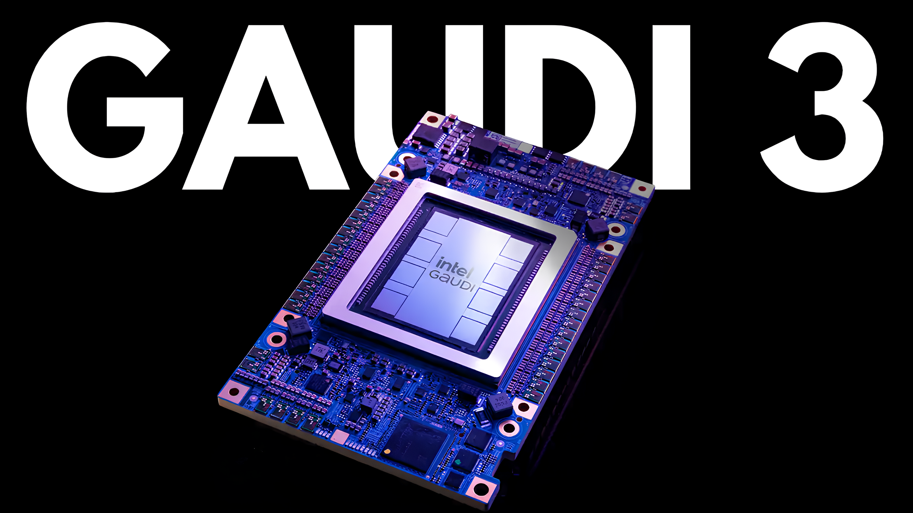
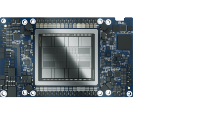
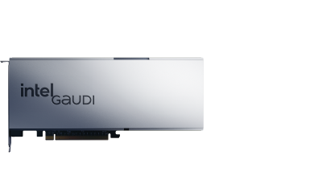
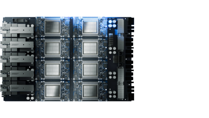
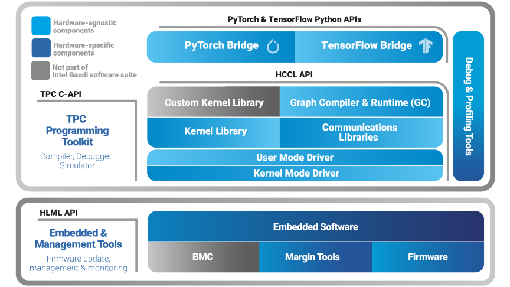
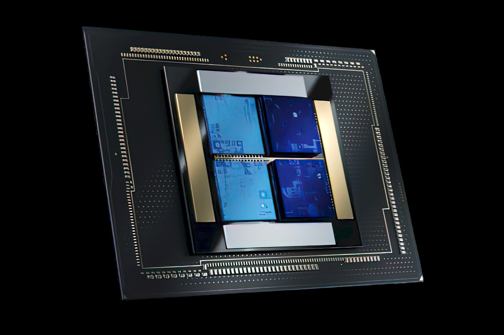
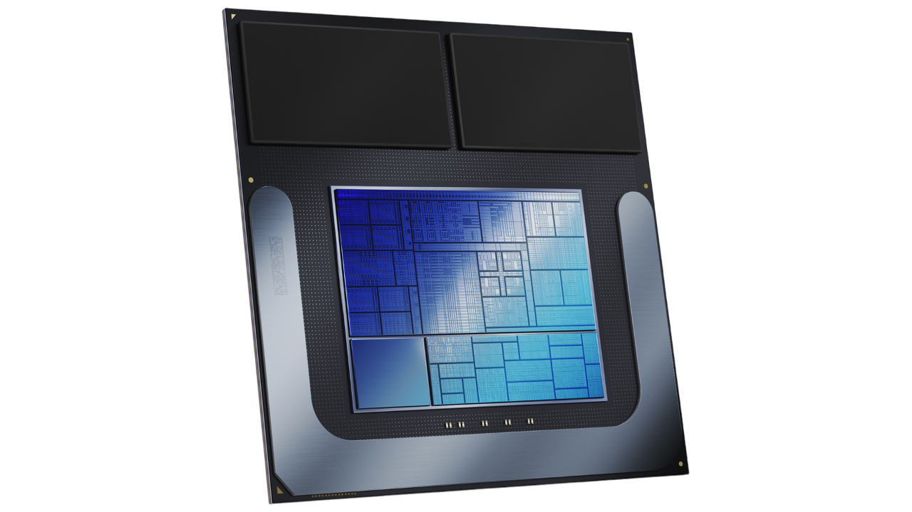

# Intel AI Accelerators 

## Intel® Gaudi® 3 : [ [whitepaper](./gaudi-3-ai-accelerator-white-paper.pdf) ]

  

[ [Intel® Gaudi® 3 Mezzanine Card: HL-325L (Air Cooled)](https://www.intel.com/content/www/us/en/content-details/817487/intel-gaudi-3-ai-accelerator-325-l-oam-mezzanine-card-product-brief.html), [Intel® Gaudi® 3 PCIe Card: HL-338](https://www.intel.com/content/www/us/en/content-details/817488/intel-gaudi-3-ai-accelerator-hl-338-pcie-add-in-card-product-brief.html), [Intel® Gaudi® 3 UBB: HLB-325](https://www.intel.com/content/www/us/en/content-details/817489/intel-gaudi-3-ai-accelerator-hlb-325-baseboard-product-brief.html) ]

[ [Intel® Gaudi® AI Accelerator](https://www.intel.com/content/www/us/en/products/details/processors/ai-accelerators/gaudi.html), [Intel® Gaudi® 2 AI accelerator](https://www.intel.com/content/www/us/en/products/details/processors/ai-accelerators/gaudi2.html) ]

## Intel® Gaudi® Software

[ [Intel Gaudi 3 AI Accelerator Explainer Video | Intel (video)](https://youtu.be/L5kmfRnO-M8?si=G4LjTFZGzkcGRd1p) ] [[Intel® Gaudi® Software Version 1.17.0](https://www.intel.com/content/www/us/en/developer/articles/news/intel-gaudi-software-version-1-17-0.html), [Using DistributedTensor with Intel Gaudi](https://docs.habana.ai/en/latest/PyTorch/PyTorch_DistributedTensor/PyTorch_DistributedTensor.html#pytorch-distributedtensor), @[github/gaudi](https://github.com/HabanaAI) ]

## Intel Falcon Shores :

Intel's Falcon Shores will be a multi-tile processor featuring both x86 cores (tiles) for general-purpose processing and Xe cores (tiles) for highly parallel AI and HPC workloads.

## Lunar Lake :

With more than 40 NPU tera operations per second (TOPS), Intel’s next generation processors will provide the capabilities necessary for Copilot+ experiences coming to market. In addition to the higher performing NPU, Lunar Lake will also be equipped with over 60 GPU TOPS delivering more than 100 platform TOPS.

[[ Lunar Lake Overview: In-Depth With Lead Architect and Design Mgr. | Talking Tech | Intel Technology ](https://youtu.be/hmlDCAiD1bA?si=Aa5i9_pCu8NwMnGR)]

Resources : [ [Intel Tiber Developer Cloud](https://www.intel.com/content/www/us/en/developer/tools/devcloud/services.html) ]
[ [ML Driven Hardware Cost Model for MLIR by Dr. Dibyendu Das](https://youtu.be/hLK2TOCOFVI?si=kAeY99GayyfwklBo), [Intel Vision 2024 Keynote (Highlights)](https://youtu.be/70NQxH6dRFY?si=WLwATCHGF9l4GCui) ]