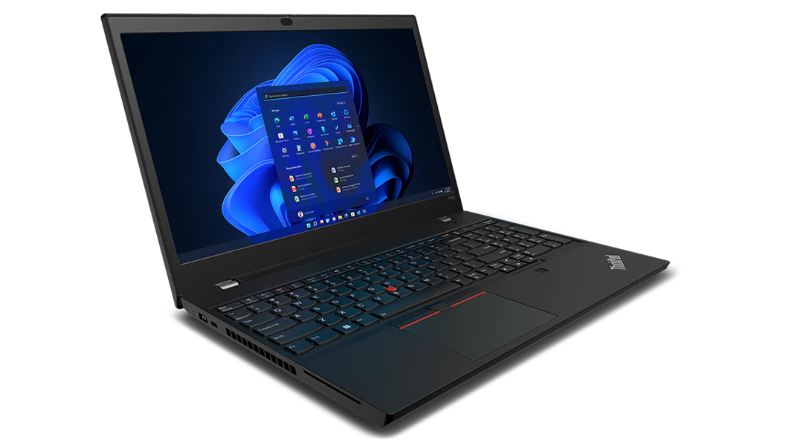
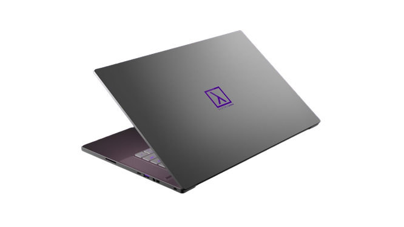
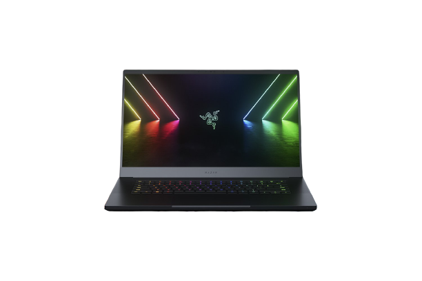
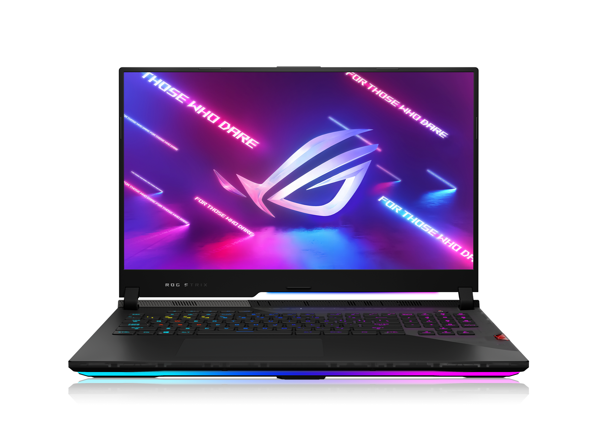
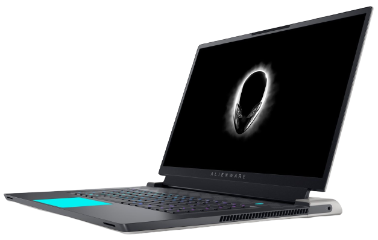
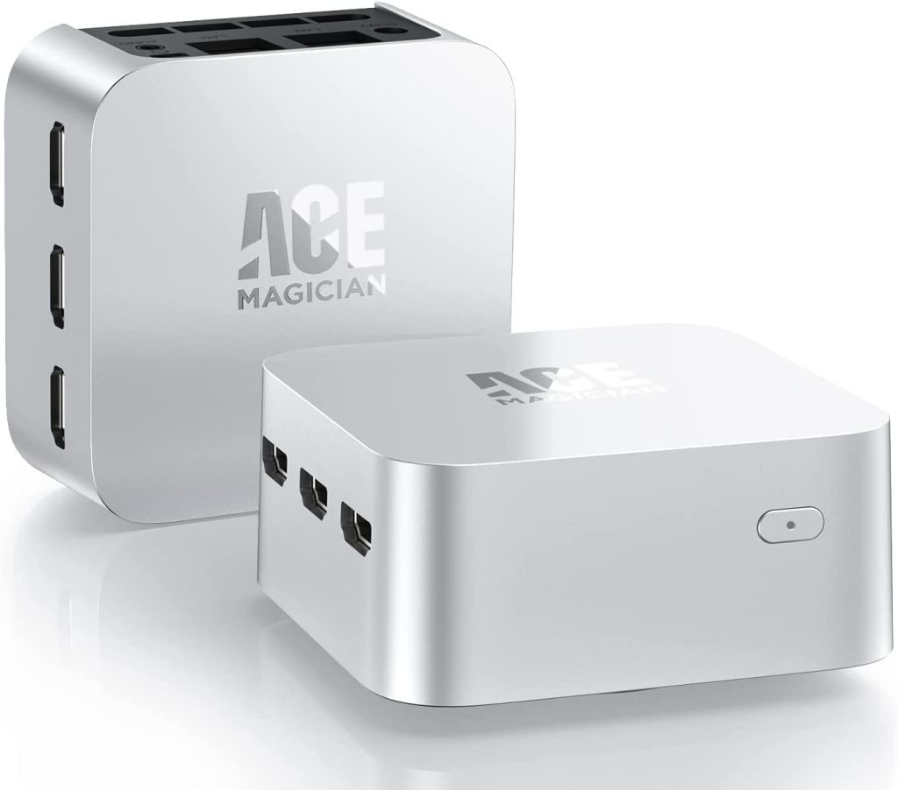

# Mobile AI Workstation

Let's list down five good laptops for AI/ML/DL:

<table style="width:100%" >
<tr>
<th>Product</th>
<th>Laptop</th>
<th>Specifications</th>
</tr>

<tr>
<td>ThinkPad T15p Gen 3 (15" Intel)</td>
<td></td>
<td>
Highlights:  
NVIDIA GeForce® RTX™ 3050 4GB GDDR6;  1TB SSD M.2 2280 PCIe Gen4/4, fingerprint sensor and USB C power
</td>
</tr>

<tr>
<td>Lambda Tensorbook</td>
<td></td>
<td>Tensorbook is equipped with GeForce RTX 3080 Max-Q 16GB GPU, VRAM-16 GB GDDR6 and is backed by Intel Core i7-11800H along with RAM of 64 GB 3200 MHz DDR4 and storage of 2 TB NVMe PCIe 4.0. </td>
</tr>

<tr>
<td>Razer Blade 15 RTX3080</td>
<td></td>
<td>This laptop is powered by NVIDIA GeForce RTX 3080 Ti along with Intel Core i7-11800H. The Intel Turbo Boost Technology can boost the i7 processor up to 5.1GHz.Go with ultra-fast 360Hz FHD.  </td>
</tr>

<tr>
<td>Asus Rog Strix Scar III G733</td>
<td></td>
<td>It is a powerhouse laptop with the combination of both NVIDIA and AMD. It is powered by AMD Ryzen 9 5900HX CPU and GeForce RTX 3080 GPU along with an ultrafast panel up to 300 Hz/3ms. It has a 90 Wh battery with rapid Type-c charging with video playback upto 12 hours.</td>
</tr>

<tr>
<td>Dell Alienware X17 R1</td>
<td></td>
<td>Its amazing power is fueled by a 12th-generation Intel Alderlake i9-12900H processor that conveys remarkable performance.</td>
</tr>
</table>

There also exists good mini PC : [Ace Magician](https://acemagicians.com/)

