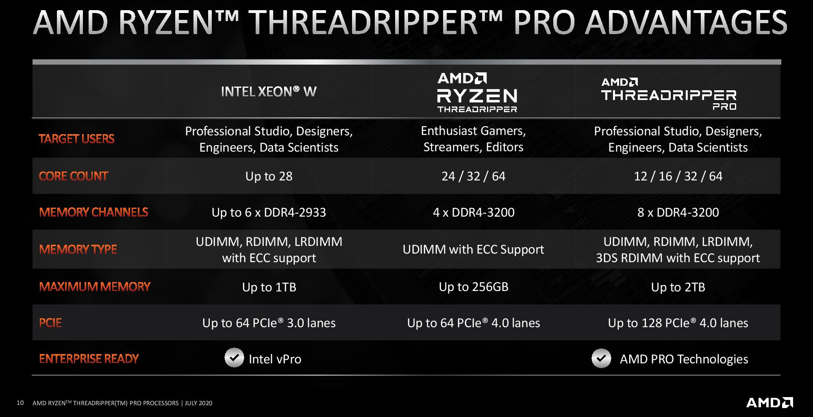

# AI/ML/DL Components

Let's talk about what makes a powerful workstation for deep learning. Important components of a workstation are:

<table style="width:100%" >
<tr>
<th>Hardware Component</th>
<th>Description</th>
</tr>

<tr>
<td>CPU (Processor)</td>
<td>

Important aspects while choosing a CPU for Deep Learning are:  
✦  CPU cores: Higher number of cores allows more parallelization. Deep Learning processes like pre-processing, batch-processing, reading in data etc are dependent on the number of CPU cores. We are going for 64 cores.

✦  Clock Speed: How fast to crank the computations on these data are dependent on the clock speed of the CPU. Beyond 2.9 Ghz is a good speed. Priority for deep learning is number of cores over clock speed.

✦   PCI Express: Are generally considered highway between CPU RAM and GPU RAM. PCIe 3.0 has speed of 1000 MB/s and PCIe 4.0 has speed of 2000 MB/s. PCIe 4.0 is what we need.

✦  Cache: Cache memory is important because it improves the efficiency of data retrieval. It stores program instructions and data that are used repeatedly in the operation of programs or information that the CPU is likely to need next. Higher Cache the better.

Here is an example of 4 core CPU:

At this moment : AMD Ryzen Threadripper PRO > Intel Xeon.

We will go for the Threadripper Pro 5000 series instead of 3000 series. Check for yourself:

</td>
</tr>

<tr>
<td>GPU</td>
<td>
 

GPUs provides thousands of additional cores (CUDA cores / Tensor cores) for fast computation and parallelization. NVIDIA is currently leading the GPU market with their commercial GPU series (GeForce) and professional GPU series (RTX) along CUDA and cuDNN deep learning ecosystem.  

<b> Comercial GPU (GeForce) : </b> NVIDIA GeForce 3090  
In the commercial series only 3090 has NVLink support. Do you wonder what's better than having a 3090? 2x 3090 for deep learning computations. Transfer of data between GPUs via SLI is slow and NVIDIA built their GPU connector called [NVLink](https://www.nvidia.com/en-us/data-center/nvlink/).

 
Remember 3090 is the GPU and there comes a variety of graphics card with 3090 GPU from different manufacturers. Here is a cooling efficiency chart of different graphics card with 3090 GPU:

  

Asus Strix Quiet 390W seems to a good and quiet commercial graphics card with 3090 GPU.

<b> Professional GPU (RTX) : </b> NVIDIA RTX A5500  
NVIDIAs Professional [RTX series](https://www.nvidia.com/en-gb/design-visualization/desktop-graphics/)

  

<b> Professional AI NVIDIA Workstations: </b>

<table style="width:100%" >
<tr>
<th>Station Name</th>
<th>Category</th>
<th>Technical Specifications</th>
<th>Discussion</th>
<th>Cost</th>
</tr>

<tr>
<td><a href="https://www.nvidia.com/en-us/data-center/dgx-station-a100/">NVIDIA DGX Station A100</a></td>
<td>Complete Workstation</td>
<td>Product</td>
<td>Product</td>
<td>€126,299.61</td>
</tr>

<tr>
<td><a href="https://www.nvidia.com/en-us/data-center/dgx-a100/">NVIDIA DGX A100</a></td>
<td>GPU</td>
<td>Product</td>
<td>€10,000</td>
</tr>

<tr>
<td><a href="https://www.nvidia.com/en-us/data-center/dgx-h100/">NVIDIA DGX H100</a></td>
<td>GPU</td>
<td>Product</td>
<td>Product</td>
<td>€36,345.48</td>
</tr>

<tr>
<td><a href="https://www.nvidia.com/en-us/data-center/dgx-basepod/">NVIDIA DGX BasePOD</a></td>
<td>Complete Workstation</td>
<td>Product</td>
<td>Product</td>
<td>cost varies with number of DGX A100s</td>
</tr>

<tr>
<td><a href="https://www.nvidia.com/en-us/data-center/dgx-superpod/">	NVIDIA DGX SuperPOD</a></td>
<td>Super Computer</td>
<td>Product</td>
<td>Product</td>
<td>The DGX Superpod starts at $7 million and scales up to $60 million for a fully equipped system. Access available for $90,000 a month.</td>
</tr>
</table>

</td>
</tr>

<tr>
<td>Memory (RAM)</td>
<td>-</td>
</tr>

<tr>
<td>Storage</td>
<td>-</td>
</tr>
</table>

we also have the option to order pre-built workstations or configure deep learning workstations from [Lambda](https://shop.lambdalabs.com/gpu-workstations/vector/customize), [Exxact](https://www.exxactcorp.com/VWS-150628029-DPW/configurator), [Puget](https://www.pugetsystems.com/recommended/Recommended-Systems-for-Machine-Learning-AI-174/Buy_200), [Bizon](https://bizon-tech.com/deep-learning-ai-workstation), [Mifcom.de](https://www.mifcom.de/pcs-fuer-machine-learning-cid237) etc.