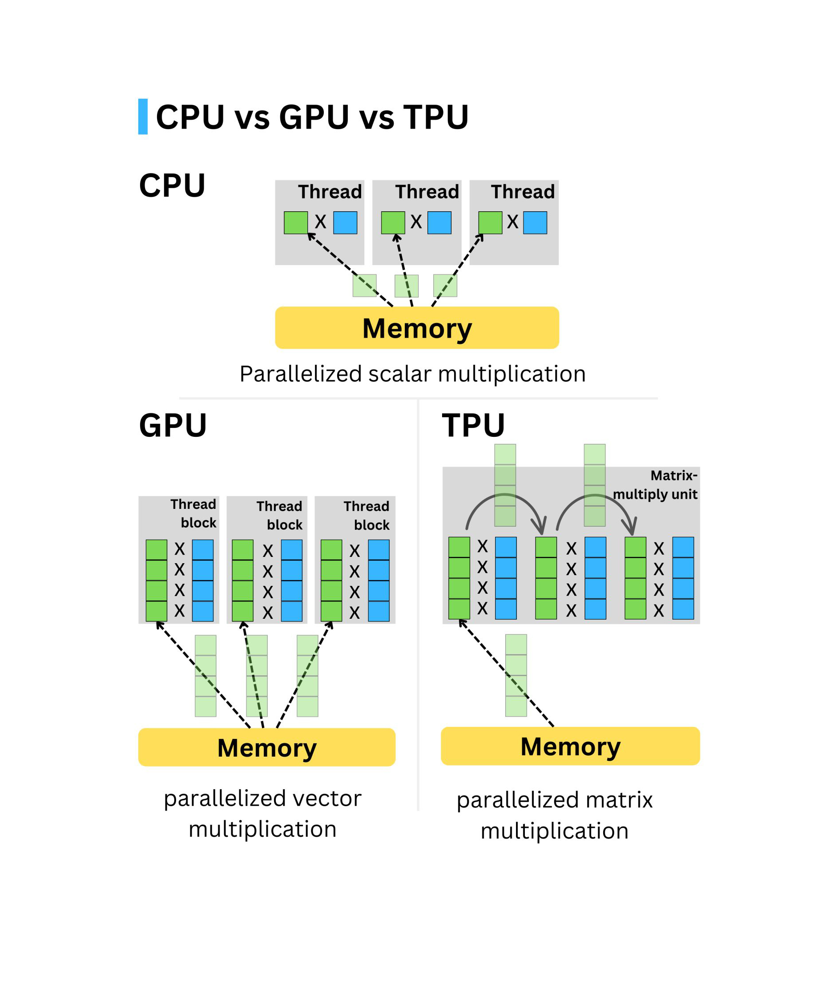

# AI/ML/DL System Core Components ⚙️

When selecting hardware components such as CPU, GPU, memory (RAM), and storage for deep learning tasks, it's essential to balance performance and cost-effectiveness. Let's talk about what makes a powerful workstation for deep learning. Important components of a workstation are:

<table style="width:100%" >
<tr>
<th>Hardware Component</th>
<th>Description</th>
</tr>

<tr>
<td>CPU (Processor)</td>
<td>

The CPU is crucial for handling tasks such as data preprocessing, managing I/O operations, and coordinating between different hardware components like the GPU and memory. Although the GPU handles most of the heavy lifting in deep learning, the CPU's role should not be underestimated. Important aspects while choosing a CPU for Deep Learning are:  

✦  `CPU cores`: More cores allow for better multitasking and parallel processing. A higher core count (6 to 16 cores) is beneficial for tasks like data loading and preprocessing that run in parallel with the training process. Higher number of cores allows more parallelization and deep Learning processes like pre-processing, batch-processing, reading in data etc are dependent on the number of CPU cores. We are going for 64 cores.

Simultaneous Multithreading (SMT): Technologies like Intel’s Hyper-Threading or AMD’s SMT allow each core to handle two threads, effectively doubling the number of threads that can run simultaneously. This is helpful in scenarios where many lightweight tasks need to be handled in parallel.

✦  `Clock Speed`: How fast to crank the computations on these data are dependent on the clock speed of the CPU. Beyond 2.9 Ghz is a good speed. Priority for deep learning is number of cores over clock speed. A higher clock speed (measured in GHz) results in faster processing of individual tasks. Aim for a CPU with a clock speed of 3.0 GHz or higher.

✦   `PCI Express`: Are generally considered highway between CPU RAM and GPU RAM. PCIe 3.0 has speed of 1000 MB/s and PCIe 4.0 has speed of 2000 MB/s. PCIe 4.0 or PCIe 5.0 compatibility ensures faster data transfer rates between the CPU, GPU(s), and storage devices, reducing latency in data loading and model inference.

✦  `Cache`: Cache memory is important because it improves the efficiency of data retrieval. It stores program instructions and data that are used repeatedly in the operation of programs or information that the CPU is likely to need next. Higher Cache the better. A larger cache allows faster access to frequently used data, which can improve performance during training. Look for CPUs with at least 12 MB of cache.

[ [Cache Memory Explained](https://youtu.be/Zr8WKIOIKsk?si=FQF3eGW52sRxO_X-)]

Here is an example of 4 core CPU:

+ Architecture: Modern architectures (e.g., Intel Core i7/i9, AMD Ryzen 7/9) offer better power efficiency and performance. Choosing the latest generation can provide better optimization for AI workloads. Modern architectures (e.g., AMD Zen 4, Intel Alder Lake) offer better performance per watt and more efficient processing per core, improving computation efficiency for deep learning.

    Support for Vectorized Instructions: CPUs that support SIMD (Single Instruction, Multiple Data) instructions, such as AVX2, AVX-512 (for Intel), or AMD’s equivalent, are better for deep learning. These instructions accelerate matrix operations and other vectorized calculations commonly used in neural networks.
    

Thermal Design Power (TDP): CPUs with high TDP ratings often deliver better performance but require more robust cooling solutions. Efficient power management becomes crucial if the system is intended for continuous operation in a workstation environment.

Recommendations:
+ High-End: AMD Ryzen 9 7950X or Intel Core i9-14900K.
+ Mid-Range: AMD Ryzen 7 7800X or Intel Core i7-13700K.
+ Budget: AMD Ryzen 5 7600X or Intel Core i5-13600K.

We will go for the Threadripper Pro 5000 series instead of 3000 series. Check for yourself:

New: [Threadripper PRO 7000 WX-Series](https://www.amd.com/en/products/processors/workstations/ryzen-threadripper.html) | [AMD Ryzen™ 9 7950X3D](https://www.amd.com/en/products/processors/desktops/ryzen/7000-series/amd-ryzen-9-7950x3d.html) | [Intel® Core™ i9 processor 14900K](https://www.intel.com/content/www/us/en/products/sku/236773/intel-core-i9-processor-14900k-36m-cache-up-to-6-00-ghz/specifications.html).

</td>
</tr>

</table>

<table style="width:100%" >
<tr>
<td>GPU</td>
<td>

The `GPU` is the most critical component for deep learning as it handles the parallel computations required for training neural networks. The choice of GPU significantly impacts the speed of training and inference.

  

GPUs provides thousands of additional cores (CUDA cores / Tensor cores) for fast computation and parallelization. NVIDIA is currently leading the GPU market with their commercial GPU series (GeForce) and professional GPU series (RTX) along CUDA and cuDNN deep learning ecosystem. GPUs follow a programming model called single-instruction-multiple-threads (SIMT), where the same instruction executes concurrently on different cores/threads, each on its own portion of data as dictated by its assigned thread ID. All cores run the threads synchronously in lock-step, which greatly simplifies the control flow, and works great for domains like dense linear algebra, which neural network applications heavily rely on.

+ `CUDA Cores`: More CUDA cores generally mean higher processing power for deep learning workloads. More CUDA cores allow for better parallel processing. 

+ `Tensor Cores`: Found in NVIDIA’s RTX and Tesla GPUs, Tensor Cores specifically accelerate tensor operations, crucial for deep learning frameworks like TensorFlow and PyTorch. Tensor Cores dramatically improve matrix calculations, enabling faster training and inference times.

+ `VRAM (Video RAM)`: Deep learning models with larger neural networks and datasets require GPUs with ample VRAM. The amount of VRAM determines the size of the models and datasets that can be loaded at once. For most deep learning tasks, 12 GB of VRAM is the minimum, but 24 GB or more is recommended for larger models.

+ `Memory Bandwidth`:  Memory bandwidth (GB/s) is the rate at which data is transferred between the GPU’s memory and cores. Higher bandwidth facilitates faster data handling, essential for large neural networks and complex models. For instance, GPUs with GDDR6 or HBM2 memory offer superior bandwidth, leading to faster training times and more efficient data processing.

+ `Double Precision vs. Single Precision`: Deep learning primarily uses single-precision floating-point (FP32) operations, so GPUs optimized for single precision are preferred. For deep learning, the ability to process half-precision (FP16) operations efficiently is important. GPUs that support mixed precision training can provide a significant performance boost.

GPU Memory : VRAM  + GDDR6 (DRAM). GPU has capacitors that regulate the voltage to various components and  PCIe bus connects to CPU. GDDR is GDDR SDRAM - Graphics Double Data Rate.

For those scaling up, multi-GPU setups are valuable. NVIDIA GPUs support NVLink, which enhances data transfer speeds between GPUs. This feature is particularly useful for large-scale models and distributed deep learning.
  

<b> Comercial GPU (GeForce) : 

 

</b> NVIDIA GeForce [4090](https://www.nvidia.com/en-us/geforce/graphics-cards/40-series/rtx-4090/) : 

The RTX 4090 is NVIDIA's latest consumer-grade powerhouse based on the Ada Lovelace architecture. With 24 GB of GDDR6X memory, massive CUDA core counts, and high clock speeds, the RTX 4090 is well-suited for advanced deep learning, 3D rendering, and video processing.
However, the RTX 4090 does not support NVLink. Unlike previous models, NVIDIA removed NVLink support from the Ada Lovelace architecture, including the RTX 4090, which means it cannot be linked with another GPU for direct memory sharing. This is a shift from previous generations like the RTX 3090, which did support NVLink. For users needing multi-GPU configurations with NVLink, the A100, H100, or certain Quadro models remain options

</b> NVIDIA GeForce 3090 : 
In the commercial series only 3090 has NVLink support. Do you wonder what's better than having a 3090? 2x 3090 for deep learning computations. Transfer of data between GPUs via SLI is slow and NVIDIA built their GPU connector called [NVLink](https://www.nvidia.com/en-us/data-center/nvlink/). [ Update : [GeForce comparison chart](https://www.nvidia.com/en-in/geforce/graphics-cards/compare/) ]

 

Remember 3090 is the GPU and there comes a variety of graphics card with 3090 GPU from different manufacturers. Here is a cooling efficiency chart of different graphics card with 3090 GPU:

  

Asus Strix Quiet 390W seems to be a good and quiet commercial graphics card with 3090 GPU. [ Update : [NVIDIA GeForce - 40 series GPUs](./img/comp.jpg), lambdalabs/[gpu-benchmarks](https://lambdalabs.com/gpu-benchmarks) ].

<b> Professional GPU (RTX) : </b> NVIDIA RTX A5500  
NVIDIAs Professional [RTX series](https://www.nvidia.com/en-gb/design-visualization/desktop-graphics/) are very powerful yet costly. Update: [RTX cards](https://www.nvidia.com/en-in/geforce/buy/).

 + The A100, based on NVIDIA’s Ampere architecture, is designed specifically for data centers and high-performance deep learning tasks. With up to 80 GB of HBM2e memory and multi-instance GPU (MIG) technology, the A100 is exceptionally powerful for massive workloads. It also supports NVLink, which enhances data transfer speed between multiple GPUs, making it ideal for large-scale AI model training.

+ The H100, NVIDIA’s next-generation GPU, is based on the Hopper architecture and further improves performance with faster memory and higher Tensor core efficiency, making it suitable for even more complex AI and machine learning applications.

  

New: [GeForce RTX 4090](https://www.nvidia.com/en-in/geforce/graphics-cards/40-series/rtx-4090/), [NVIDIA Blackwell](https://nvidianews.nvidia.com/news/nvidia-blackwell-platform-arrives-to-power-a-new-era-of-computing).
</td></tr>
</table>

<table style="width:100%">
<tr><td>

### [NVIDIA RTX 6000 Ada Generation Graphics Card](https://www.nvidia.com/en-in/design-visualization/rtx-6000/)

 [ [graphics-cards](https://www.nvidia.com/en-in/design-visualization/desktop-graphics/) ]

<b> Professional AI NVIDIA Workstations: </b>

<table style="width:100%">
<tr>
<th>Station Name</th>
<th>Category</th>
<th>Technical Specifications (Cost)</th>
</tr>

<tr>
<td><a href="https://www.nvidia.com/en-us/data-center/dgx-station-a100/">NVIDIA DGX Station A100</a></td>
<td>Complete Workstation [<a href="https://youtu.be/gT59YOdch8M">1</a>], [<a href="https://youtu.be/0mAesfFt4us">2</a>], [<a href="https://youtu.be/oMqmgxnLuhk">3</a>] </td>
<td><a href="https://www.nvidia.com/content/dam/en-zz/Solutions/Data-Center/dgx-station/nvidia-dgx-station-a100-datasheet.pdf">technical_details.pdf</a> (with NVSwitches - €126,299.61)</td>
</tr>

<tr>
<td><a href="https://www.nvidia.com/en-us/data-center/dgx-a100/">NVIDIA DGX A100</a></td>
<td>GPU [<a href="https://youtu.be/MY7jZGZw9vA">1</a>], [<a href="https://youtu.be/zBAxiQi2nPc">2</a>]</td>
<td><a href="https://images.nvidia.com/aem-dam/Solutions/Data-Center/nvidia-dgx-a100-80gb-datasheet.pdf">technical_details.pdf</a> (refrigerant cooling - €10,000)</td>
</tr>

<tr>
<td><a href="https://www.nvidia.com/en-us/data-center/dgx-h100/">NVIDIA DGX H100</a></td>
<td>GPU [<a href="https://youtu.be/bHW9eCzeEfE">1</a>], [<a href="https://www.tomshardware.com/news/nvidia-hopper-h100-80gb-price-revealed">2</a>]</td>
<td><a href="https://www.nvidia.com/en-us/data-center/dgx-h100/">technical_details.pdf</a> ( hopper arch over ampere - €36,345.48 )</td>
</tr>

<tr>
<td><a href="https://www.nvidia.com/en-us/data-center/dgx-basepod/">NVIDIA DGX BasePOD</a></td>
<td>Complete Workstation</td>
<td><a href="https://www.nvidia.com/en-us/data-center/dgx-basepod/">technical_details.pdf</a> (cost varies with number of DGX A100s)</td>
</tr>

<tr>
<td><a href="https://www.nvidia.com/en-us/data-center/dgx-superpod/">	NVIDIA DGX SuperPOD</a></td>
<td>Super Computer [<a href="https://youtu.be/NoCdoBl9vPw">1</a>], [<a href="https://www.computerbase.de/2021-06/nvidia-dgx-superpod-20-petaflops-fuer-90.000-us-dollar-im-neuen-monatsabo/">2</a>], [<a href="https://youtu.be/vY61ExKhnfA">3</a>]</td>
<td><a href="https://www.nvidia.com/en-us/data-center/dgx-superpod/">technical_details.pdf</a> ($7- $60 million or $90,000 / month.)</td>
</tr>
</table>

</td>
</tr>

</table>

<table style="width:100%">
<tr>
<td>Memory (RAM)</td>
<td>

Considering 64 cores, it is wise to have 4 GB memory per core and that takes us to 64 x 4 = 256 GB RAM. If we go for 32 cores then 32 x 4 = 128 GB RAM. ECC memory will protect our system from a potential crash by correcting any errors in the data, while non-ECC memory doesn't correct such errors. We will go for DDR4 due to DDR4 slots in motherboard.

+ `Capacity`: For deep learning tasks, a minimum of 32 GB is recommended, with 64 GB or more being ideal for handling larger datasets and more complex models. Deep learning models, especially in natural language processing, can be memory-intensive. A larger RAM capacity prevents out-of-memory errors. 

+ `Memory Bandwidth`: High memory bandwidth facilitates faster data access and model training. RAM speed (measured in MHz) impacts data transfer rates between the CPU and memory. DDR4 RAM with speeds of 3200 MHz or higher is generally sufficient.

+ `ECC (Error-Correcting Code) Memory` (optional): ECC memory can help prevent data corruption, ensuring the integrity of training data and models. ECC RAM can detect and correct memory errors, which is crucial for ensuring data integrity during long training sessions. However, ECC RAM is typically more expensive and is usually only found in workstation-grade hardware.

</td>
</tr>

<tr>
<td>Storage</td>
<td>We need SSD! Choice : M.2 SSD via NVMe. SSD comes in 2 size : 2.5 " SSD uses SATA interface and M.2 SSD are plugged into an M.2 SLOT. M.2 NVMe SSD are good storage devices. 

+ `Solid-State Drives (SSD)`: SSDs offer faster data access compared to traditional hard disk drives (HDD), reducing data loading times.
+ `NVMe SSDs`: NVMe SSDs provide even faster read/write speeds, particularly useful for loading large datasets.
+ `Storage Capacity`: Deep learning often requires large storage capacities for datasets. Consider multi-terabyte storage options.
+ `Backup and Redundancy`: Implement robust backup and redundancy solutions to protect against data loss.

External Storage : NAS RAID 5 [calculation](https://www.synology.com/en-global/support/RAID_calculator?hdds=16%20TB|16%20TB|16%20TB|16%20TB): 
Total: 64 TB;  Available: 48 TB; for protection: 16 TB.

Extra information:  
+ 50 ms SSD is 3000x faster than 17 ns DRAM. (Comparison of a super sonic jet to a tortoise).  
+ There are 8 DRAM in a DIMM (RAM). These RAM are connected via 2 channels (dual channel) to the CPU. 
</td>
</tr>
</table>

If you wish to build your own system from scratch, watch [this](https://youtu.be/PXaLc9AYIcg) video. We also have the option to order pre-built workstations or configure deep learning workstations from [Lambda](https://shop.lambdalabs.com/gpu-workstations/vector/customize), [Exxact](https://www.exxactcorp.com/VWS-150628029-DPW/configurator), [Puget](https://www.pugetsystems.com/recommended/Recommended-Systems-for-Machine-Learning-AI-174/Buy_200), [Bizon](https://bizon-tech.com/deep-learning-ai-workstation), [Mifcom.de](https://www.mifcom.de/pcs-fuer-machine-learning-cid237) etc.

Extra Tips:  
+ Enable XMP profile in BIOS/UEFI to leverage memory's full speed.  
+ Good coolers : Air cooler - [ID-COOLING SE ARGB](https://www.idcooling.com/Product/detail/id/186/name/SE-234-ARGB) & Liquid cooler - [Hydro Series™ H150i PRO RGB 360mm](https://www.corsair.com/us/en/Categories/Products/Liquid-Cooling/Hydro-Series%E2%84%A2-PRO-RGB-Liquid-CPU-Coolers/p/CW-9060031-WW). Good rule of thumb while installing AIO, air pressure inside equals air pressure outside. In air cooling, air goes from the direction fan faces to its back. Place the fans in such a way that the back air goes through GPU and have atleast 2 fans = 1 for intake and the other for exhaust. 
+ PSU cables: 24 pin ATX cable (power to the entire motherboard), EPS (power to CPU socket), PCIe (power to graphics card).   
+ How they work (video) : [SSD](https://youtu.be/5Mh3o886qpg), [M.2 NVMe SSD](https://youtu.be/HvfIeTieXOI), [Computer Memory](https://youtu.be/7J7X7aZvMXQ), [GPU](https://youtu.be/bZdxcHEM-uc). 

I am currently working in a 4090 D [2025 update]:

 

Extra Tools: [power supply calculator](https://outervision.com/power-supply-calculator), [windows 10 media tool](https://www.microsoft.com/en-us/software-download), [AMD drivers](https://www.amd.com/en/support), [NVIDIA drivers](https://www.nvidia.com/de-de/geforce/geforce-experience/)

