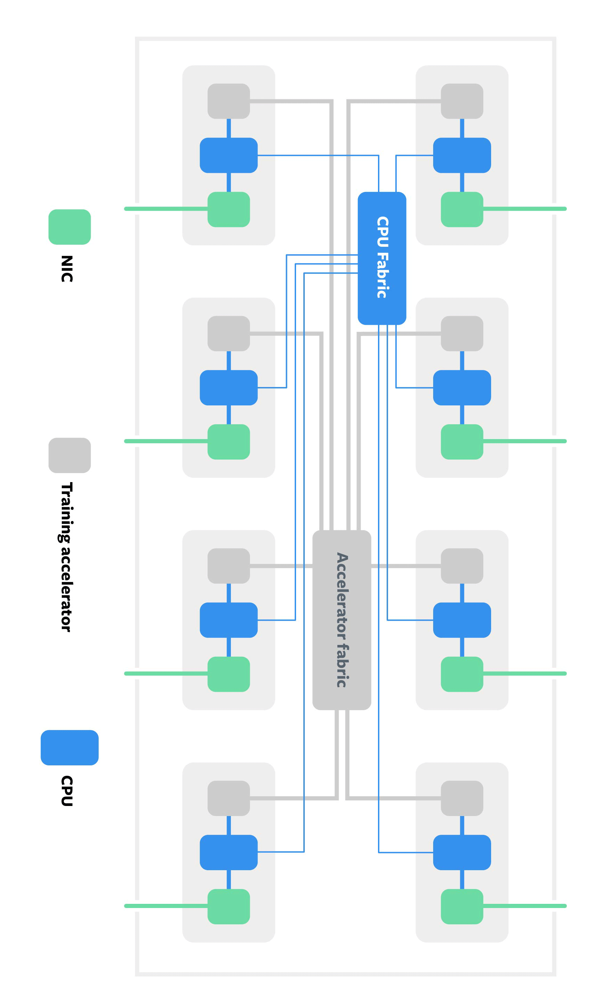

# AI/ML/DL System Core Components

Let's talk about what makes a powerful workstation for deep learning. Important components of a workstation are:

<table style="width:100%" >
<tr>
<th>Hardware Component</th>
<th>Description</th>
</tr>

<tr>
<td>CPU (Processor)</td>
<td>

Important aspects while choosing a CPU for Deep Learning are:  
✦  CPU cores: Higher number of cores allows more parallelization. Deep Learning processes like pre-processing, batch-processing, reading in data etc are dependent on the number of CPU cores. We are going for 64 cores.

✦  Clock Speed: How fast to crank the computations on these data are dependent on the clock speed of the CPU. Beyond 2.9 Ghz is a good speed. Priority for deep learning is number of cores over clock speed.

✦   PCI Express: Are generally considered highway between CPU RAM and GPU RAM. PCIe 3.0 has speed of 1000 MB/s and PCIe 4.0 has speed of 2000 MB/s. PCIe 4.0 is what we need.

✦  Cache: Cache memory is important because it improves the efficiency of data retrieval. It stores program instructions and data that are used repeatedly in the operation of programs or information that the CPU is likely to need next. Higher Cache the better.

Here is an example of 4 core CPU:

At this moment : AMD Ryzen Threadripper PRO > Intel Xeon.

We will go for the Threadripper Pro 5000 series instead of 3000 series. Check for yourself:

</td>
</tr>

</table>

<table style="width:100%" >
<tr>
<td>GPU</td>
<td>
 

GPUs provides thousands of additional cores (CUDA cores / Tensor cores) for fast computation and parallelization. NVIDIA is currently leading the GPU market with their commercial GPU series (GeForce) and professional GPU series (RTX) along CUDA and cuDNN deep learning ecosystem. GPUs follow a programming model called single-instruction-multiple-threads (SIMT), where the same instruction executes concurrently on different cores/threads, each on its own portion of data as dictated by its assigned thread ID. All cores run the threads synchronously in lock-step, which greatly simplifies the control flow, and works great for domains like dense linear algebra, which neural network applications heavily rely on.

GPU Memory : VRAM  + GDDR6 (DRAM). GPU has capacitors that regulate the voltage to various components and  PCIe bus connects to CPU. GDDR is GDDR SDRAM - Graphics Graphics Double Data Rate.  

<b> Comercial GPU (GeForce) : </b> NVIDIA GeForce 3090  
In the commercial series only 3090 has NVLink support. Do you wonder what's better than having a 3090? 2x 3090 for deep learning computations. Transfer of data between GPUs via SLI is slow and NVIDIA built their GPU connector called [NVLink](https://www.nvidia.com/en-us/data-center/nvlink/).

 
Remember 3090 is the GPU and there comes a variety of graphics card with 3090 GPU from different manufacturers. Here is a cooling efficiency chart of different graphics card with 3090 GPU:

  

Asus Strix Quiet 390W seems to a good and quiet commercial graphics card with 3090 GPU.

<b> Professional GPU (RTX) : </b> NVIDIA RTX A5500  
NVIDIAs Professional [RTX series](https://www.nvidia.com/en-gb/design-visualization/desktop-graphics/) are very powerful yet costly.

  

</td></tr>
</table>

<table style="width:100%">
<tr><td>

<b> Professional AI NVIDIA Workstations: </b>

<table style="width:100%">
<tr>
<th>Station Name</th>
<th>Category</th>
<th>Technical Specifications (Cost)</th>
</tr>

<tr>
<td><a href="https://www.nvidia.com/en-us/data-center/dgx-station-a100/">NVIDIA DGX Station A100</a></td>
<td>Complete Workstation [<a href="https://youtu.be/gT59YOdch8M">1</a>], [<a href="https://youtu.be/0mAesfFt4us">2</a>], [<a href="https://youtu.be/oMqmgxnLuhk">3</a>] </td>
<td><a href="https://www.nvidia.com/content/dam/en-zz/Solutions/Data-Center/dgx-station/nvidia-dgx-station-a100-datasheet.pdf">technical_details.pdf</a> (with NVSwitches - €126,299.61)</td>
</tr>

<tr>
<td><a href="https://www.nvidia.com/en-us/data-center/dgx-a100/">NVIDIA DGX A100</a></td>
<td>GPU [<a href="https://youtu.be/MY7jZGZw9vA">1</a>], [<a href="https://youtu.be/zBAxiQi2nPc">2</a>]</td>
<td><a href="https://images.nvidia.com/aem-dam/Solutions/Data-Center/nvidia-dgx-a100-80gb-datasheet.pdf">technical_details.pdf</a> (refrigerant cooling - €10,000)</td>
</tr>

<tr>
<td><a href="https://www.nvidia.com/en-us/data-center/dgx-h100/">NVIDIA DGX H100</a></td>
<td>GPU [<a href="https://youtu.be/bHW9eCzeEfE">1</a>], [<a href="https://www.tomshardware.com/news/nvidia-hopper-h100-80gb-price-revealed">2</a>]</td>
<td><a href="https://www.nvidia.com/en-us/data-center/dgx-h100/">technical_details.pdf</a> ( hopper arch over ampere - €36,345.48 )</td>
</tr>

<tr>
<td><a href="https://www.nvidia.com/en-us/data-center/dgx-basepod/">NVIDIA DGX BasePOD</a></td>
<td>Complete Workstation</td>
<td><a href="https://www.nvidia.com/en-us/data-center/dgx-basepod/">technical_details.pdf</a> (cost varies with number of DGX A100s)</td>
</tr>

<tr>
<td><a href="https://www.nvidia.com/en-us/data-center/dgx-superpod/">	NVIDIA DGX SuperPOD</a></td>
<td>Super Computer [<a href="https://youtu.be/NoCdoBl9vPw">1</a>], [<a href="https://www.computerbase.de/2021-06/nvidia-dgx-superpod-20-petaflops-fuer-90.000-us-dollar-im-neuen-monatsabo/">2</a>], [<a href="https://youtu.be/vY61ExKhnfA">3</a>]</td>
<td><a href="https://www.nvidia.com/en-us/data-center/dgx-superpod/">technical_details.pdf</a> ($7- $60 million or $90,000 / month.)</td>
</tr>
</table>

</td>
</tr>

</table>

<table style="width:100%">
<tr>
<td>Memory (RAM)</td>
<td>Considering 64 cores, it is wise to have 4 GB memory per core and that takes us to 64 x 4 = 256 GB RAM. If we go for 32 cores then 32 x 4 = 128 GB RAM. ECC memory will protect our system from a potential crash by correcting any errors in the data, while non-ECC memory doesn't correct such errors. We will go for DDR4 due to DDR4 slots in motherboard.</td>
</tr>

<tr>
<td>Storage</td>
<td>We need SSD! Choice : M.2 SSD via NVMe. SSD comes in 2 size : 2.5 " SSD uses SATA interface and M.2 SSD are plugged into an M.2 SLOT. M.2 NVMe SSD are good storage devices.  

External Storage : NAS RAID 5 [calculation](https://www.synology.com/en-global/support/RAID_calculator?hdds=16%20TB|16%20TB|16%20TB|16%20TB): 
Total: 64 TB;  Available: 48 TB; for protection: 16 TB.

Extra information:  
+ 50 ms SSD is 3000x faster than 17 ns DRAM. (Comparison of a super sonic jet to a tortoise).  
+ There are 8 DRAM in a DIMM (RAM). These RAM are connected via 2 channels (dual channel) to the CPU. 
</td>
</tr>
</table>

If you wish to build your own system from scratch, watch [this](https://youtu.be/PXaLc9AYIcg) video. We also have the option to order pre-built workstations or configure deep learning workstations from [Lambda](https://shop.lambdalabs.com/gpu-workstations/vector/customize), [Exxact](https://www.exxactcorp.com/VWS-150628029-DPW/configurator), [Puget](https://www.pugetsystems.com/recommended/Recommended-Systems-for-Machine-Learning-AI-174/Buy_200), [Bizon](https://bizon-tech.com/deep-learning-ai-workstation), [Mifcom.de](https://www.mifcom.de/pcs-fuer-machine-learning-cid237) etc.

Extra Tips:  
+ Enable XMP profile in BIOS/UEFI to leverage memory's full speed.  
+ Good coolers : Air cooler - [ID-COOLING SE ARGB](https://www.idcooling.com/Product/detail/id/186/name/SE-234-ARGB) & Liquid cooler - [Hydro Series™ H150i PRO RGB 360mm](https://www.corsair.com/us/en/Categories/Products/Liquid-Cooling/Hydro-Series%E2%84%A2-PRO-RGB-Liquid-CPU-Coolers/p/CW-9060031-WW). Good rule of thumb while installing AIO, air pressure inside + air pressure outside. In air cooling, air goes from the direction fan faces to its back. Place the fans in such a way that the back air goes through GPU and have atleast 2 fans = 1 for intake and the other for exhaust. 
+ PSU cables: 24 pin ATX cable (power to the entire motherboard), EPS (power to CPU socket), PCIe (power to graphics card).   
+ How they work (video) : [SSD](https://youtu.be/5Mh3o886qpg), [M.2 NVMe SSD](https://youtu.be/HvfIeTieXOI), [Computer Memory](https://youtu.be/7J7X7aZvMXQ), [GPU](https://youtu.be/bZdxcHEM-uc). 

Extra Tools: [power supply calculator](https://outervision.com/power-supply-calculator), [windows 10 media tool](https://www.microsoft.com/en-us/software-download), [AMD drivers](https://www.amd.com/en/support), [NVIDIA drivers](https://www.nvidia.com/de-de/geforce/geforce-experience/)

