# Essence of Computation & Networking

We are problem solvers and we often come across computational needs in order to reach our solutions for the problems at hand. It is a tradeoff!  We need good hardware for good computational needs. Networking hardware acts as data pipeline and investing in good hardware aids in good research and problem solving.

  

Here is a series of blogs I prepared on hardware and electronics. These blogs are for educational purposes only.

### Essence of Computation:

The "essence of computation" refers to the fundamental principles underlying how computers process, store, and manipulate information. At its core, computation involves the transformation of input data into output data using a set of instructions or algorithms. The process is executed through the manipulation of binary data, represented by the digits 0 and 1, which are the basic units of information in digital systems.

Let's start from the very basics with 1 (on / high voltage) and 0 (off/low voltage). Here is a beautiful comprehensive video of how everything started  [ (history) --- (of) ---- (hardware) ](https://youtu.be/M4d3FXu9-3I),  everything in CS is either 0 or 1 ( except qbit's probabilistic state but eventually it will be either a 0 or 1 ). BINARY! We speak binary [ [ Why Do Computers Use 1s and 0s? ](https://youtu.be/Xpk67YzOn5w?si=8q64tARIvxdm19Ef), [ Exploring How Computers Work ](https://youtu.be/QZwneRb-zqA?si=zn9y0sI8oqr7rlWD) ].

#### Binary Representation :
+ `Bits and Bytes`: The most basic unit of data in computing is the bit, which can have a value of either 0 or 1. Eight bits form a byte, which can represent 256 different values (2^8). The binary system is used because it aligns with the physical properties of digital electronics, where two distinct states (e.g., on/off, high/low voltage) can be easily distinguished and manipulated.

+ `Encoding Information`: Different types of data (e.g., numbers, text, images, audio, video) are encoded in binary form so that they can be processed by computers. Each type of data has its own encoding scheme that defines how it is represented using bits.

Networking hardware comprises the physical devices necessary for communication and data exchange across networks. These devices facilitate the interconnection of computers, servers, and other network-enabled devices, enabling efficient and reliable data transfer.

Data (image/video/audio/text etc) travels around as sequences of 0s and 1s. ------ 01100100 01100001 01110100 01100001 (data/packets) ------→ ( Internet ) ------→ (AI work station) . ISP (WAN) provides internet connection via optical fiber and we need networking harware to accept the WAN connection, create a LAN, switch and route packets to appropriate addresses/ devices. 

#### Types of Data and Their Binary Representation:

+ `Numbers :`

    + `Integers`: Integers are represented in binary using a fixed number of bits. For example, an 8-bit unsigned integer can represent values from 0 to 255. Signed integers (which can be positive or negative) use the most significant bit (MSB) as a sign bit.
        + `Example`: The decimal number 5 is represented as 00000101 in an 8-bit binary system.
    + `Floating-Point Numbers`: Floating-point representation is used for real numbers (fractions). The IEEE 754 standard defines how floating-point numbers are represented, using separate bits for the sign, exponent, and mantissa.
        + `Example`: The decimal number 3.14 might be represented as 01000000 10010011 11010111 00010100 in 32-bit single precision.

+ `Text :`

    + `ASCII`: The American Standard Code for Information Interchange (ASCII) uses 7 or 8 bits to represent each character. For instance, the letter 'A' is represented as 01000001.
    + `Unicode`: Unicode extends ASCII to represent a vast range of characters from different languages, using varying numbers of bits (e.g., UTF-8, UTF-16).
        + `Example`: The character '€' (Euro sign) is represented as 11100010 10000010 10101100 in UTF-8.

+ `Images :`

    + `Bitmap (BMP)`: In a bitmap image, each pixel is represented by a certain number of bits that correspond to color values. A common format is 24-bit RGB, where 8 bits each represent the red, green, and blue color channels.
        + `Example`: A pixel with red=255, green=0, blue=0 (pure red) would be represented as 11111111 00000000 00000000.
    + `Compressed Formats (JPEG, PNG)`: These formats use compression algorithms to reduce file size. JPEG, for instance, uses lossy compression by converting the image into frequency components and reducing less perceptible details, still ultimately represented in binary.
    + `Grayscale`: Each pixel in a grayscale image is represented by a single value, typically 8 bits, indicating the intensity of light (0 for black, 255 for white).

+ `Audio :`

    + `PCM (Pulse Code Modulation)`: In digital audio, sound waves are sampled at regular intervals and quantized into binary values. For example, CD-quality audio uses 44.1 kHz sampling rate with 16-bit samples, meaning each audio sample is represented by 16 bits.
        + `Example`: A sample value of 32767 (maximum positive value in 16-bit signed audio) would be represented as 01111111 11111111.
    + `Compressed Formats (MP3, AAC)`: These formats use lossy compression to reduce file size by removing sounds less audible to human ears. The audio data is still stored as binary but with fewer bits than uncompressed audio.

+ `Video :`

    + `Frames`: A video is a sequence of images (frames) displayed in rapid succession. Each frame is represented similarly to images, often using compressed formats.
    + `Encoding (H.264, HEVC)`: Video compression algorithms like H.264 or HEVC reduce redundancy between consecutive frames and within individual frames. The video is then encoded into a binary stream.
        + `Example`: A frame in a video might be stored as a combination of I-frames (full frames) and P-frames (predictive frames that store only the changes from previous frames).

We will quickly take a quick peek into good networking hardware we use.

### Networking Hardware:
 

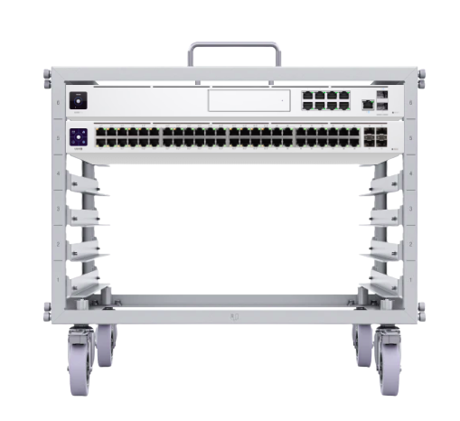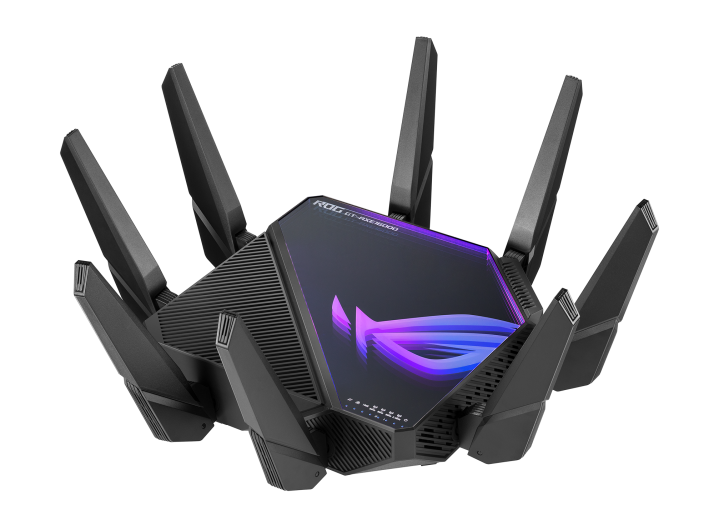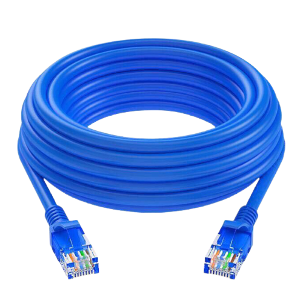
 

<table style="width:100%" >
<tr>
<th>Hardware Number</th>
<th>Hardware Name</th>
<th>Product</th>
</tr>

<tr>
<td>1</td>
<td>Switch+Router</td>
<td>Ubiquiti Networks UniFi Dream Machine Pro Managed Gigabit Ethernet (10/100/1000) </td>
</tr>

<tr>
<td>2</td>
<td>Router</td>
<td>Asus ROG Rapture GT-AXE16000</td>
</tr>

<tr>
<td>3</td>
<td>Switch</td>
<td>Ubiquiti Networks UniFi Switch Flex XG Managed L2 10G Ethernet (100/1000/10000) Power over Ethernet (PoE)</td>
</tr>

<tr>
<td>4</td>
<td>RJ-45 10G Transceiver </td>
<td>Ubiquiti Networks UACC-CM-RJ45-10G Netzwerk-Transceiver-Modul Kupfer 10000 Mbit/s RJ-45</td>
</tr>

<tr>
<td>5</td>
<td>RJ-45 Cable</td>
<td>Kabelmeister® RJ45 patch cord with Cat. 7 raw cable and locking lug protection (RNS®), S/FTP, PiMF, halogen-free, 500MHz, OFC</td>
</tr>

</table>
 

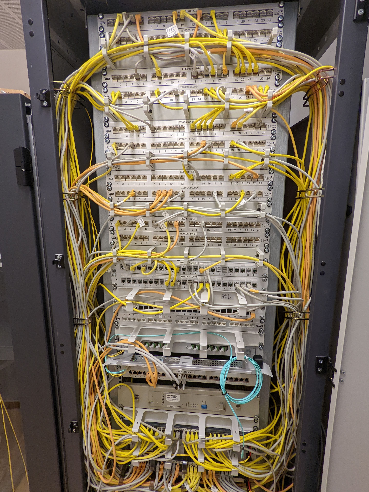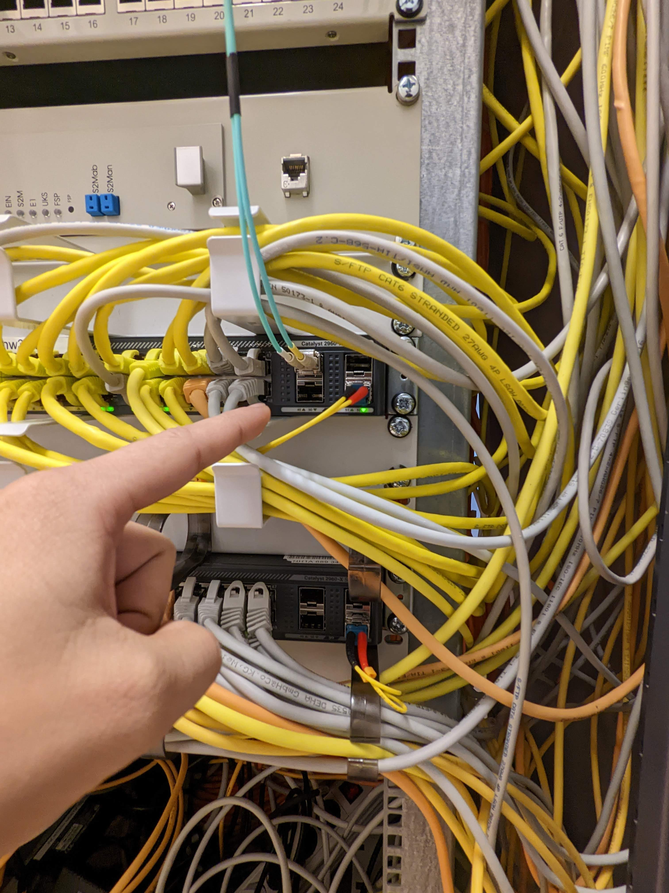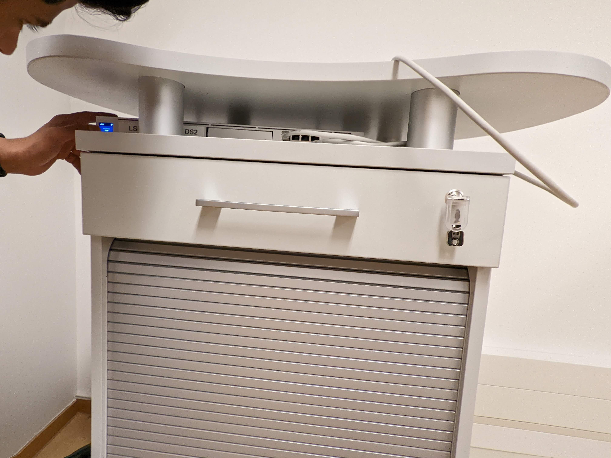
 

You see the blue wire in the first picture is of optical fiber cable incoming into the lab switch. The yellow/ white ones are 10-G RJ45 Ethernet cable going to different rooms. The rightmost picture is of Unifi Deam Machine Pro in my lab.

 

## Why Unifi Hardware?

You can visualize every aspect of your networking hardware from unifi mobile app (unifi network + ui verify + wifi man) and web app. It allows us to see realtime status, log files, open ports, tunelling (vpn) and detailed information of connected devices. In addition you can also do signal strength mapping of your lab in AR (check [my demo](https://youtu.be/soBF9LdwTZ8)).

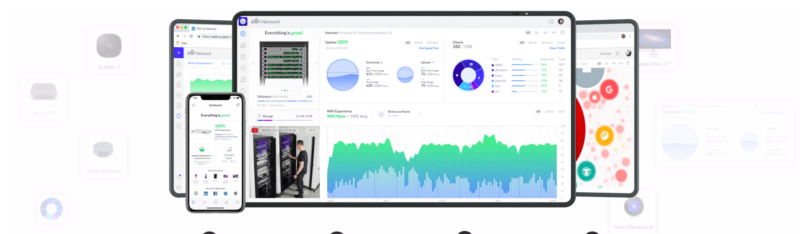
 

highlighting some of the features I used in lab :

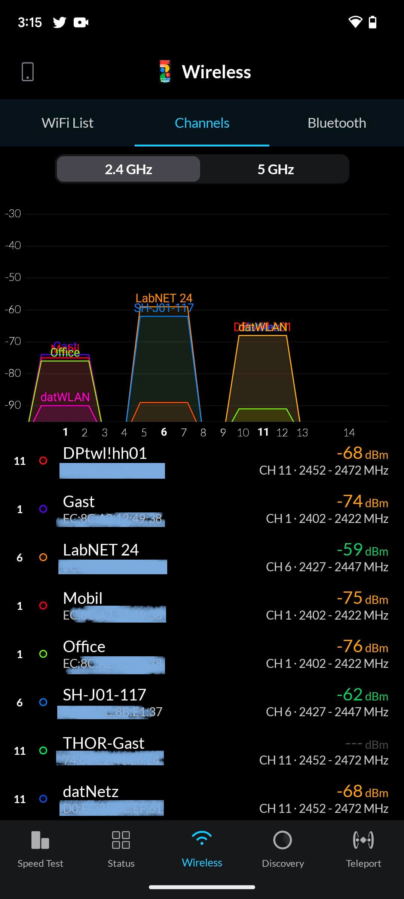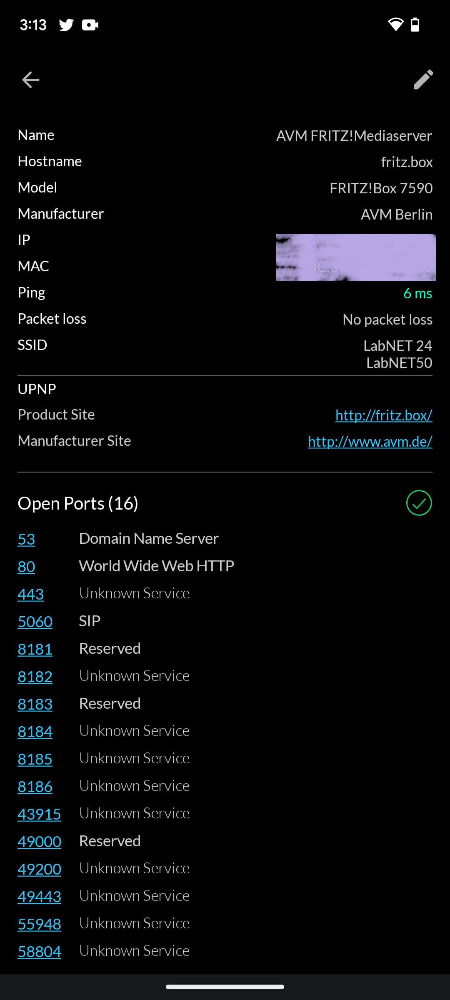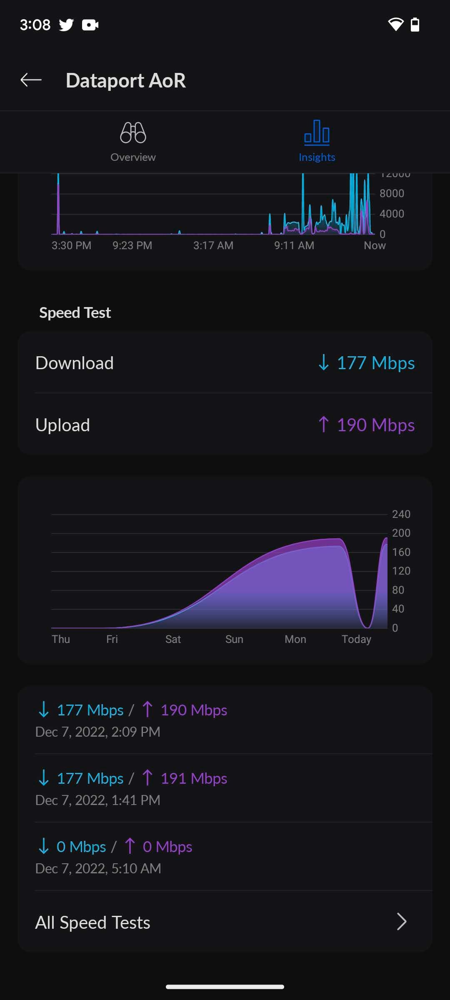 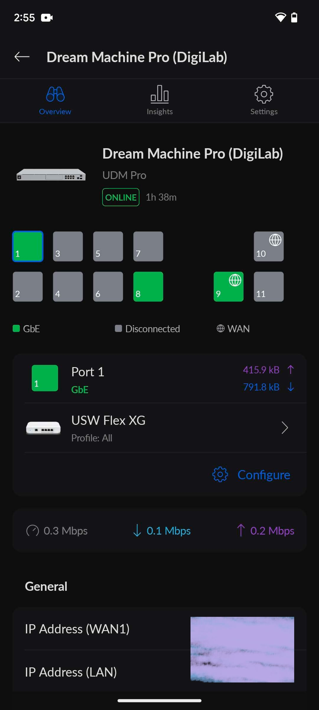
 

[Exclusive Insight: Visiting one of the Most Advanced Datacenters in the World](https://youtu.be/bpTNcbnZjvY), [networking-devices](https://www.nwkings.com/network-devices).

