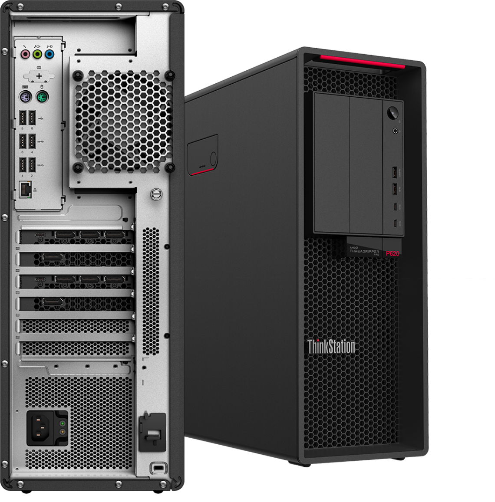
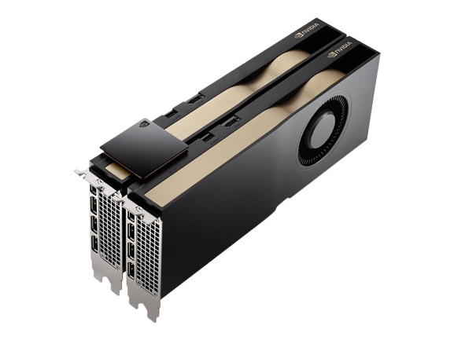
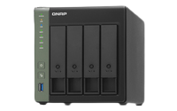

# AI workstation

 

We have this<b> final build : : [neofetch](https://twitter.com/florist_notes/status/1628860764306960384)</b>

<table style="width:100%" >
<tr>
<th>Hardware Number</th>
<th>Component</th>
<th>Product</th>
</tr>

<tr>
<td>1</td>
<td>GPU</td>
<td>2 x NVIDIA® RTX™ A5500 with NVLink 24 GB GDDR6</td>
</tr>

<tr>
<td>2</td>
<td>Processor</td>
<td>AMD Ryzen™ Threadripper™ PRO 5995WX Prozessor
(2,70 GHz bis zu 4,50 GHz)</td>
</tr>

<tr>
<td>3</td>
<td>Memory (RAM)</td>
<td>32GB DDR4 3200MHz ECC RDIMM QTY(8); Total = 32 x 8 = 256 GB</td>
</tr>

<tr>
<td>4</td>
<td>Storage</td>
<td>
Onboard M.2 SSD Boot Drive: Yes  
Storage Controller Adapter: Integrierter AMD Speicher-Controller 
+ First Onboard M.2 SSD: 4TB SSD, M.2 2280, PCIe 4.0, TLC, Opal 2.0  
+ Second Onboard M.2 SSD: 4TB SSD, M.2 2280, PCIe 4.0, TLC, Opal 2.0 
 
Total Storage : 8 TB (M.2 SSD) M.2 2280, PCIe 4.0, TLC, Opal 2.0 
</td>
</tr>

<tr>
<td>5</td>
<td>Motherboard</td>
<td>MB AMD V1.2</td>
</tr>

<tr>
<td>6</td>
<td>Ethernet</td>
<td>Aquantia 10G Ethernet-Adapter</td>
</tr>

<tr>
<td>7</td>
<td>Platform</td>
<td>Tower P620, AMD WRX80-Chip</td>
</tr>

<tr>
<td>8</td>
<td>Flex Bay</td>
<td>5,25"-Flex-Modul</td>
</tr>

<tr>
<td>9</td>
<td>Network Attached Storage (NAS)</td>
<td>QNAP - TS-431X3-4G with WD Gold ( 16 TB x 4 = 64 TB)

</td>
</tr>
</table>
