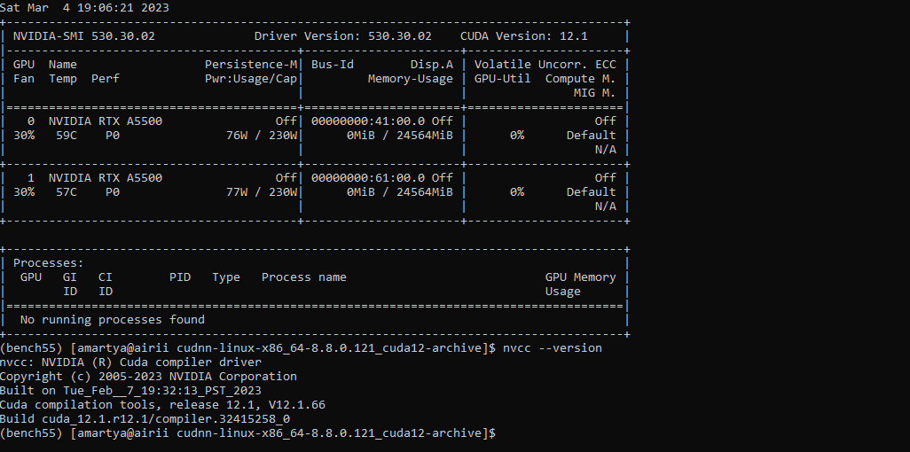

# AI Environment with CUDA, cudnn and python on linux

```
            ******** PLAN  ******** :


        System : https://github.com/florist-notes/aicore_s/blob/main/notes/ai_workstation/final_aistation.md

        OS : AlmaLinux 8.6 (RHEL 8) / ubuntu 20.04 LTS (Debian)
        GPU: 2 x NVIDIA® RTX™ A5500 with NVLink 24 GB GDDR6
        Processor : AMD Ryzen™ Threadripper™ PRO 5995WX Prozessor (2,70 GHz bis zu 4,50 GHz)

        env management : Anaconda (Miniconda)

        Target libraries:
        > CUDA Toolkit version: 11.4
        > cuDNN version: 8.2.4
        > Python version : 3.9
        > TensorRT version :  8.4.0
        > PyTorch version : 1.8.1
        > TensorFlow version : 2.4
        > OpenCV version: 4.5

```
My grpahics card (2x RTX A5500) supports until CUDA 11.6 ([.pdf](https://www.nvidia.com/content/dam/en-zz/Solutions/gtcs22/rtx-a5500/nvidia-rtx-a5500-datasheet.pdf)). Check what CUDA toolkit is supported by your graphics card, my selection: cuDNN : [8.2.4](https://developer.nvidia.com/compute/machine-learning/cudnn/secure/8.2.4/11.4_20210831/cudnn-11.4-linux-x64-v8.2.4.15.tgz) from [cudnn-archive](https://developer.nvidia.com/rdp/cudnn-archive) and [CUDA 11.4](https://developer.nvidia.com/cuda-11-4-0-download-archive), To download CUDA for RHEL 8:

```bash
        $ wget https://developer.download.nvidia.com/compute/cuda/11.6.0/local_installers/cuda-repo-rhel8-11-6-local-11.6.0_510.39.01-1.x86_64.rpm
        $ sudo rpm -i cuda-repo-rhel8-11-6-local-11.6.0_510.39.01-1.x86_64.rpm
        $ sudo dnf clean all
        $ sudo dnf -y module install nvidia-driver:latest-dkms
        $ sudo dnf -y install cuda
```
CUDA Deep Neural Network (cuDNN) is a library used for further optimizing neural network computations. It is written using the CUDA API. To extract cuDNN tar file:

```bash
        $ tar xvf cudnn-11.4-linux-x64-v8.2.4.15.tgz
        $ sudo cp -P cuda/lib64/* /usr/local/cuda/lib64/
        $ sudo cp cuda/include/* /usr/local/cuda/include/
```
Next, update the paths for CUDA library and executables:

```bash
        $ echo 'export LD_LIBRARY_PATH="$LD_LIBRARY_PATH:/usr/local/cuda/lib64:/usr/local/cuda/extras/CUPTI/lib64"' >> ~/.bashrc
        $ echo 'export CUDA_HOME=/usr/local/cuda' >> ~/.bashrc 
        $ echo 'export PATH="/usr/local/cuda/bin:$PATH"' >> ~/.bashrc 
        $ source ~/.bashrc
```



Once installed check CUDA : `$ cat /usr/local/cuda/version.json` and cuDNN : ` $ cat /usr/local/cuda/include/cudnn.h`. To check nvidia drivers : `$ nvidia-smi` and to check CUDA Compute toolkit : `$ nvcc --version`. To remove CUDA from system : 

```bash
            $ sudo apt-get --purge remove "*cublas*" "cuda*" "nsight*" (if downloaded from apt-get) 
            $ sudo apt-get --purge remove "*nvidia*" (remove nvidia-drivers)
            $ sudo rm -rf /usr/local/cuda* (if installed via source file)

```
The CUDA config file `$ cat /usr/local/cuda/version.json` returns a json with CUDA version information:

```bash
            {
            "cuda" : {
                "name" : "CUDA SDK",
                "version" : "12.1.0"
            },
            "cuda_cccl" : {
                "name" : "CUDA C++ Core Compute Libraries",
                "version" : "12.1.55"
            },
            "cuda_cudart" : {
                "name" : "CUDA Runtime (cudart)",
                "version" : "12.1.55"
            },
            "cuda_cuobjdump" : {
                "name" : "cuobjdump",
                "version" : "12.1.55"
            }
            .
            .
            .
```

## Step-by-step Guide :

The Advanced Packaging Tool (APT) is a high-level package management tool in Ubuntu and other Debian Linux distribution derivatives. Let's revise our apt commands here:

```
        $ ls  /etc/apt/apt.conf.d
        $ sudo apt update
        $ apt list --upgradable
        $ sudo apt upgrade -y

        To see progress bar in apt, configure: in /etc/apt/apt.conf.d in the 99progressbar file
        $ nano 99progressbar
        Dpkg::Progress-Fancy"1";
        $ sudo apt upgrade package_name
        $ sudo apt full-upgrade
        $ sudo apt install package_name
        $ sudo apt install package1 package2
        $ sudo apt install /full/path/file.deb
        $ sudo apt remove package_name
        $ sudo apt remove package1 package2
        $ sudo apt purge package_name
        $ sudo apt autoremove (remove unused packages)

```
The apt-get suite is also an APT command-line tool for handling packages in Linux systems. The software-properties-common package gives you better control over your package manager by letting you add PPA (Personal Package Archive) repositories. Deadsnakes is a PPA with newer releases than the default Ubuntu repositories. Install the supporting software with the command:

```bash
    $ sudo apt-get update
    $ sudo apt-get upgrade -y
```
### To install python 3 and basic libraries:

```bash
    $ sudo apt-get update
    $ sudo apt-get --assume-yes upgrade
    $ sudo apt-get --assume-yes install tmux build-essential curl vim  gcc-9 g++-9 python-is-python3 python3-virtualenv make binutils
    $ sudo apt-get --assume-yes install software-properties-common
    $ sudo apt-get install -y cmake gfortran git pkg-config
    $ sudo apt-get install -y python-dev software-properties-common wget 
    $ sudo apt-get autoremove
    $ sudo apt install python3.8

    OR  from source file
    
    $ wget https://www.python.org/ftp/python/3.7.5/Python-3.7.5.tgz
    $ tar -xf Python-3.8.3.tgz
    $ cd python-3.8.3
    $ ./configure --enable-optimizations
    $ python3 --version
```


This is a guide to understand and build your AI environment with CUDA, cudnn and python. I have a [dnf guide for RHEL](./packagednf.MD) and an AI hardware guide [here](https://github.com/s-ai-kia/aicore_s) for extended learning.

## Install and Manage Multiple Python Versions with pyenv :

Pyenv is a program that’s used for Python version management on macOS and Linux. It can install multiple Python versions, specify the version that’s used system-wide, and specify the version that’s used in specific directories. It can also create and manage virtual environments using specific versions.

` $ git clone https://github.com/pyenv/pyenv.git ~/.pyenv `


```bash

$ gedit .bashrc

'''
# Pyenv environment variables
export PYENV_ROOT="$HOME/.pyenv"
export PATH="$PYENV_ROOT/bin:$PATH"
# Pyenv initialization
if command -v pyenv 1>/dev/null 2>&1; then
  eval "$(pyenv init --path)"
fi
'''

$ exec $SHELL (restart bash)
$ sudo apt-get update --yes
$ sudo apt-get install --yes libssl-dev zlib1g-dev libbz2-dev libreadline-dev libsqlite3-dev llvm libncurses5-dev libncursesw5-dev xz-utils tk-dev libgdbm-dev lzma lzma-dev tcl-dev libxml2-dev libxmlsec1-dev libffi-dev liblzma-dev wget curl make build-essential python-openssl #py-env dependencies
$ pyenv install --list #python version available in pyenv

```

To manage python environment  with pyenv ` $ git clone https://github.com/pyenv/pyenv.git ~/.pyenv` and  ` $ cd ~/.pyenv && src/configure && make -C src`, where `$ pyenv global 3.9.0` is used to setup default python environment in pyenv and `$ python -m venv venv39` to create virtual environment. To activate the virtual environment ` $ source venv39/bin/activate` . It prepends the virtual environment path to the PATH environment variable which sets the new Python interpreter and package manager as the default version.

To install python versions:

```python
Python 3.5:
pyenv install 3.5.4
Python 3.6:
pyenv install 3.6.8
Python 3.7:
pyenv install 3.7.9
Python 3.8:
pyenv install 3.8.6
Python 3.9:
pyenv install 3.9.0

```

and to specify default python version : ` $ pyenv global 3.8.6` .  It creates a text file in the Pyenv directory that stores the specified version. This is used by Pyenv to activate the default version but it gets overwritten by the local Pyenv text file and environment variable. The Local command `$ pyenv local 3.6.8` is used in Pyenv to specify the default Python version for the current directory. It creates a text file in the current directory that stores the specified version. This is automatically detected by Pyenv which activates the Python version in the current directory and subdirectories.

Create the Virtual Environment: `$ python -m venv venv36`</br>

The Virtual Environment is an isolated Python installation directory that has its own interpreter, site-packages, and scripts. It mostly gets used to prevent version conflicts between dependencies from different projects.

```bash
    $ source ./venv36/bin/activate (activate virtual environment)
    $ python --version
    $ which python
    $ deactivate

```
To install python libraries:

```python
    $ python -m pip install numpy
    $ python -m pip install pandas
    $ python -m pip install scipy
    $ python -m pip install pillow
    $ python -m pip install matplotlib
    $ python -m pip install opencv-python
    $ python -m pip install scikit-learn
    $ python -m pip install keras
    $ python -m pip install tensorflow

```

To install drivers from [NVIDIA DRIVER DOWNLOAD](https://www.nvidia.com/Download/index.aspx?ncid=afm-chs-44270&ranMID=44270&ranEAID=je6NUbpObpQ&ranSiteID=je6NUbpObpQ-oJhiti4zR3ZOJRl0GBDj_A) and then do :

```bash

    $ chmod +x NVIDIA-Linux-x86_64–440.44.run
    $ sudo sh NVIDIA-Linux-x86_64–440.44.run

```

'$ conda' can be used to manage virtual python environments. My conda guide is [here](./conda.MD).

To check with Installation :

```bash
# Should print True
$ python3 -c "import tensorflow as tf; print(tf.test.is_gpu_available())"

# should print cuda
$ python3 -c "import torch; print(torch.device('cuda' if torch.cuda.is_available() else 'cpu'))"
```