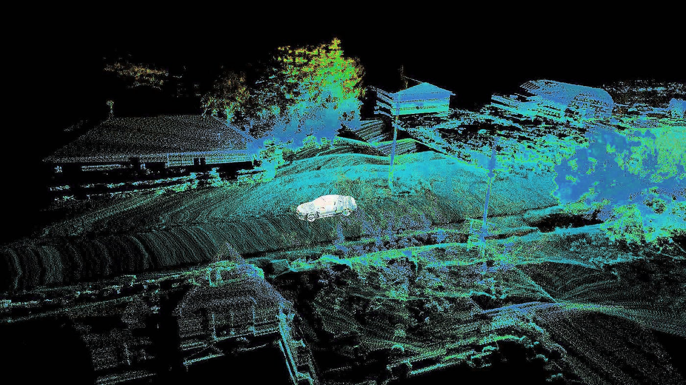
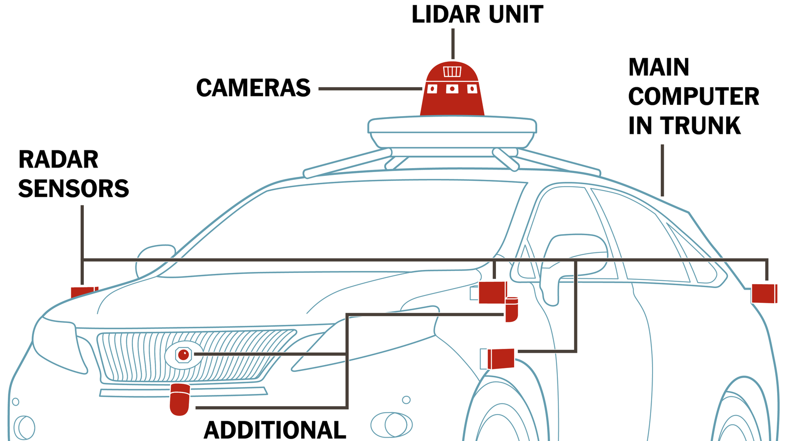
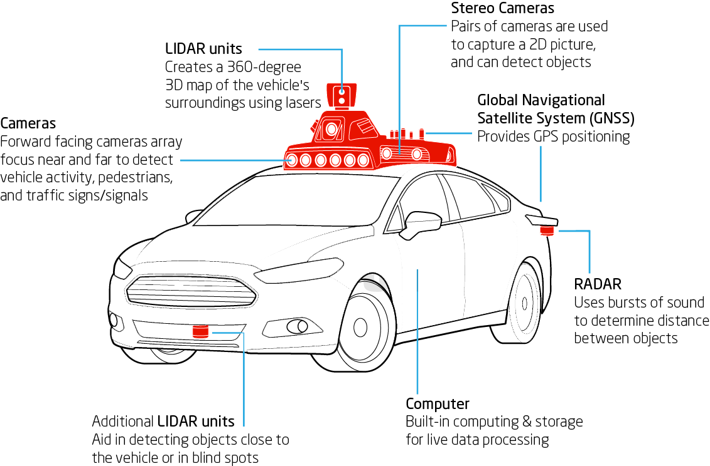

# Autonomous System

A self-driving car (sometimes called an autonomous car or driverless car) is a vehicle that uses a combination of sensors, cameras, radar and artificial intelligence (AI) to travel between destinations without a human operator.

The following outlines how self driving vehicles work:

+ The driver (or passenger) sets a destination. The car's software calculates a route.
+ A rotating, roof-mounted Lidar sensor monitors a 60-meter range around the car and creates a dynamic three-dimensional (3D) map of the car's current environment.
+ A sensor on the left rear wheel monitors sideways movement to detect the car's position relative to the 3D map.
+ Radar systems in the front and rear bumpers calculate distances to obstacles.
+ AI software in the car is connected to all the sensors and collects input from Map Street View (OSM) and video cameras inside the car.
+ The AI simulates human perceptual and decision-making processes using deep learning and controls actions in driver control systems, such as steering and brakes.
+ The car's software consults Maps for advance notice of things like landmarks, traffic signs and lights.
+ An override function is available to let a human take control of the vehicle.

Self-driving features that are available in many production cars as of now include the following:

+ <b>Hands-free steering</b> centers the car without the driver's hands on the wheel. The driver is still required to pay attention.
+ <b>Adaptive Cruise Control (ACC)</b> automatically maintains a selectable distance between the driver's car and the car in front.
+ <b>Lane-centering steering</b> intervenes when the driver crosses lane markings by automatically nudging the vehicle toward the opposite lane marking.

More on [Adaptive Cruise Control (ACC)](./acc.MD), [Self Driving Car Estimation and Navigation](./navself.MD), [Self Driving Car Perception](./perc.MD) :)
### Sensors in an Autonomous Vehicle:

Levels of autonomy in self-driving cars :

#### Level 1: An advanced driver assistance system (ADAS) aids the human driver with steering, braking or accelerating, though not simultaneously. An ADAS includes rearview cameras and features like a vibrating seat warning to alert drivers when they drift out of the traveling lane.

#### Level 2: An ADAS that can steer and either brake or accelerate simultaneously while the driver remains fully aware behind the wheel and continues to act as the driver.

#### Level 3: An automated driving system (ADS) can perform all driving tasks under certain circumstances, such as parking the car. In these circumstances, the human driver must be ready to retake control and is still required to be the main driver of the vehicle.

#### Level 4: An ADS can perform all driving tasks and monitor the driving environment in certain circumstances. In those circumstances, the ADS is reliable enough that the human driver needn't pay attention.

#### Level 5: The vehicle's ADS acts as a virtual chauffeur and does all the driving in all circumstances. The human occupants are passengers and are never expected to drive the vehicle.

@github : [carla](https://github.com/carla-simulator/carla), [apollo](https://github.com/ApolloAuto/apollo), [AirSim](https://github.com/microsoft/AirSim), [autoware](https://github.com/autowarefoundation/autoware), [webot](https://github.com/cyberbotics/webots) + [josm](https://josm.openstreetmap.de/)

resources : [CARLA](https://carla.org/), [Udacity - Self-Driving Car Engineer](https://www.udacity.com/course/self-driving-car-engineer-nanodegree--nd0013), [University of Toronto : Self Driving Cars Specialization](https://www.coursera.org/specializations/self-driving-cars), [uni-bonn.de](https://www.ipb.uni-bonn.de/sdc-2021/), [Perception for Self-Driving Cars](https://www.freecodecamp.org/news/perception-for-self-driving-cars-deep-learning-course/), [MIT Deep Learning and Artificial Intelligence Lectures](https://deeplearning.mit.edu/), [CMU 18-744: Autonomous Driving](https://courses.ece.cmu.edu/18744), [sensor types](https://www.linkedin.com/pulse/autonomous-driving-types-sensors-brandon-goh/), [Autonomous vehicles: theoretical and practical challenges](https://www.sciencedirect.com/science/article/pii/S2352146518302606), [awesome radar perception](https://github.com/ZHOUYI1023/awesome-radar-perception), [Ultra Fast Lane Detection](https://github.com/cfzd/Ultra-Fast-Lane-Detection), [Motion Planning](https://github.com/zhm-real/MotionPlanning).