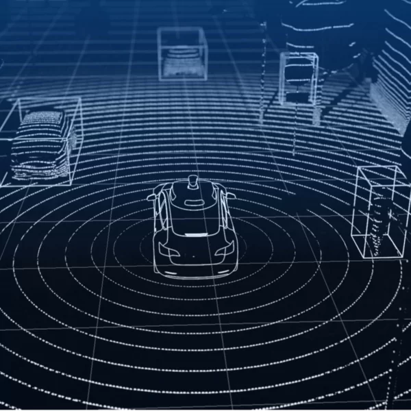

# Self Driving Car Estimation and Navigation

  

+ [Estimation and navigation methods with limited information for autonomous urban driving](https://onlinelibrary.wiley.com/doi/full/10.1002/eng2.12054)
+ [Autonomous Vehicle State Estimation and Mapping Using Takagi–Sugeno Modeling Approach](https://www.ncbi.nlm.nih.gov/pmc/articles/PMC9099810/)
+ [State Estimation and Localization for Self-Driving Cars](https://www.coursera.org/learn/state-estimation-localization-self-driving-cars)
+ [Vehicle Dynamics State Estimation and Localization for High Performance Race Cars](https://www.sciencedirect.com/science/article/pii/S2405896319303957)
+ [Autonomous vehicle localization using
state estimation techniques](https://upcommons.upc.edu/bitstream/handle/2117/333272/master-thesis-dunia-prieto.pdf?sequence=1&isAllowed=y)
+ [Estimating Probabilities with Bayesian Modeling in Python](https://towardsdatascience.com/estimating-probabilities-with-bayesian-modeling-in-python-7144be007815)