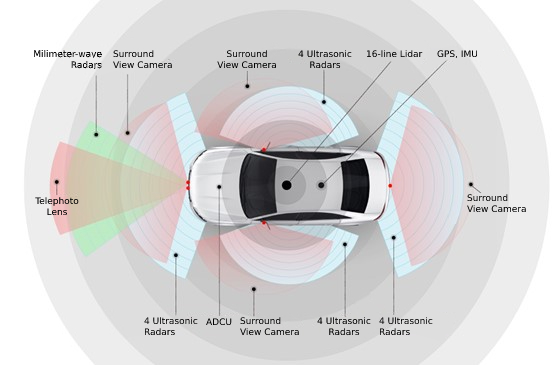
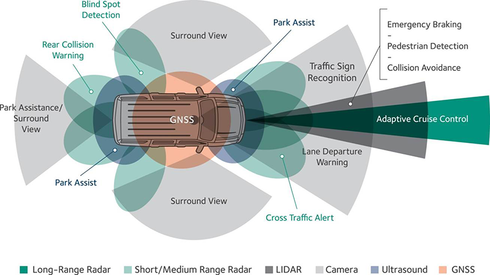

# Self Driving Car Perception :

 

<table width=100%>
<tr>
<th>Object Detection</th>
<th>Segmentation</th>
</tr>
<tr>
<td>

2D Object Detection:
- Object Detection [[models](https://paperswithcode.com/task/object-detection)]
- Real time object detection [[models](https://paperswithcode.com/task/real-time-object-detection)]
- Few shot object detection [[models](https://paperswithcode.com/task/few-shot-object-detection)]
- Object Detection In Aerial Images [[models](https://paperswithcode.com/task/object-detection-in-aerial-images)]
  
Object Tracking [[models](https://paperswithcode.com/area/computer-vision/object-tracking)]

3D Object Detection:
- 3D Object Detction [[models](https://paperswithcode.com/task/3d-object-detection)]

</td>
<td>

Segmentation: [models](https://paperswithcode.com/area/computer-vision/semantic-segmentation)
- Semantic Sedmentation [[models](https://paperswithcode.com/task/semantic-segmentation)]
- Panoptic Segmentation [[models](https://paperswithcode.com/task/panoptic-segmentation)]
- 3D Semantic Segmentation [[models](https://paperswithcode.com/task/3d-semantic-segmentation)]
- Real-Time Semantic Segmentation [[models](https://paperswithcode.com/task/real-time-semantic-segmentation)]
- Road Segmentation [[models](https://paperswithcode.com/task/road-segementation)]

Depth Estimation: [[models](https://paperswithcode.com/task/depth-estimation)]
- Monocular Depth Estimation [[models](https://paperswithcode.com/task/monocular-depth-estimation)]
- Stereo Depth Estimation [[models](https://paperswithcode.com/task/stereo-depth-estimation)]
</td>
</tr>
</table>

## SLAM (Simultaneous Localization and Mapping)

Vision SLAM: @github/[SLAM](https://github.com/SilenceOverflow/Awesome-SLAM)
- Monocular vision SLAM ([example](https://de.mathworks.com/help/vision/ug/monocular-visual-simultaneous-localization-and-mapping.html))
- Stereo vision SLAM ([example](https://de.mathworks.com/help/vision/ug/stereo-visual-simultaneous-localization-mapping.html))
- RGB-D vision SLAM ([example](https://de.mathworks.com/help/vision/ug/visual-slam-with-an-rgbd-camera.html))

Filter Based SLAM : Filter based SLAM treats the SLAM problem as a state-estimation problem, where the state encompasses information about the current position and map. The state is recursively updated by a filter, which estimates the current position and map based on actions and measurements. As more data is collected, the estimate is augmented and refined.

Some filter based SLAM algorithms are:

+ Kalman Filter: this is a recursive algorithm that works in two steps: a prediction step and an update step. The prediction step makes a prediction for the state based on the dynamics of the system, and the update steps reconcile the prediction with the measurements to produce an improved estimate of the state. The information from the prediction and measurements are weighed based on their uncertainty / (co)-variance. The Kalman Filter algorithm assumes a linear world with Gaussian error / noise; in fact, the Kalman Filter is the optimal / best estimator in a linear, Gaussian world when optimizing for mean square error between the estimated and true state. However, a limitation of the Kalman Filter is that linearity and / or Gaussian error / noise do not always apply.
  
+ Extended Kalman Filter (EKS): the Extended Kalman Filter (EKS) extends the Kalman Filter and allows us to relax the linearity assumption by using linearization. The technique involves using a first-order Taylor expansion around the estimate and keeps most of the Kalman Filter mechanics. The EKS algorithm is a very popular technique for nonlinear state estimation due to its flexibility and efficiency. However, EKS can also introduce large errors in the estimate and lead to suboptimal performance.
  
+ Unscented Kalman Filter (UKS): the Unscented Kalman Filter (UKS) extends the Kalman Filter and allows us to relax the linearity assumption by approximating a probability distribution. The technique involves using an unscented transformation that calculates statistics, such as the mean or variance, for a random variable that undergoes a nonlinear transformation (by sampling sigma points that represent the distribution of the state). The UKS can provide more accurate estimates for the state, especially in more nonlinear systems, but can be more computationally expensive.
  
+ Particle Filter: the Particle Filter represents the estimate as a set of particles, where each particle represents a possible state; particles with higher weights are deemed to be more reflective of the true state. As more information is collected, the particles are re-weighted based on their match to the observed measurements. A key strength of the Particle Filter is that it has very few assumptions of the underlying system, allowing for complexity, and the ability to handle non-linear systems and non-Gaussian error / noise (unlike the Kalman Filter). As such, it’s very flexible and can be used in a wide variety of situations. However, the Particle Filter does also have limitations such as dimensionality (i.e., a lot of particles may be needed to accurately express the state distribution), divergence (i.e., the particles can diverge from the true state), and complexity (i.e., the computation required can be intensive). There are variants that build upon the Particle Filter and address these limitations.
In general, filter based SLAM shines in structured environments where the dynamics are known — in this setting, it can be computationally efficient and potentially provide real-time estimates.

Graph Based SLAM : 
Graph based SLAM treats the SLAM problem as a graph problem, where position information is represented by the nodes and the map is derived with the edges. In the robotics space, it’s common to use pose-graph optimization. In a pose graph, the nodes represent poses and landmarks and the edges represent constraints between them. New nodes are added as new poses and landmarks are detected, and constraints connect sequential nodes with information about the movement. For example, moving from one point to another would be represented with two nodes, each containing information about the pose and landmarks measured, connected by an edge, containing information about the motion and other observations. In constructing the pose graph, we can also add edges between nodes if they are similar enough, indicating a return to some previous poses and landmarks. When two nodes are very similar, it provides information to update the pose graph and potentially add new edges indicating their closeness (this is also sometimes called detecting a loop closure).
- Square Root Smoothing And Mapping (Square Root SAM) [[paper](https://dellaert.github.io/files/Dellaert06ijrr.pdf)]
- Incremental Smoothing and Mapping (iSAM) [[paper](https://www.cs.cmu.edu/~kaess/pub/Kaess08tro.pdf)]
- g2o: A General Framework for Graph Optimization [[paper](http://ais.informatik.uni-freiburg.de/publications/papers/kuemmerle11icra.pdf)]

In general, graph based SLAM performs better than filtering based SLAM when there are large uncertainties or non-Gaussian noises because of its flexibility. However, a limitation is that it can be computationally expensive.

Deep Learning Based SLAM
Deep learning based SLAM attempts to solve the SLAM problem using neural networks and deep learning. Examples:
- [ [RatSLAM](https://www.researchgate.net/publication/4076855_RatSLAM_A_hippocampal_model_for_simultaneous_localization_and_mapping), [LIST-SLAM](https://arxiv.org/abs/2104.00099), [EnvSLAM](https://www.mdpi.com/2220-9964/10/11/772) ]

[[A Comprehensive survey of visual SLAM algorithms](https://hal.science/hal-04132827/document)] [ [Lidar SLAM: The Ultimate Guide to Simultaneous Localization and Mapping](https://www.wevolver.com/article/lidar-slam-the-ultimate-guide-to-simultaneous-localization-and-mapping) ]

Autonomous Vehicles : [[models and features](https://paperswithcode.com/area/computer-vision/autonomous-vehicles)]

resources : [Evaluation and Analysis of Perception Systems for Autonomous Driving](https://www.diva-portal.org/smash/get/diva2:1536525/FULLTEXT01.pdf), [Vision-Based Environmental Perception for Autonomous Driving](https://arxiv.org/ftp/arxiv/papers/2212/2212.11453.pdf), [Computer Vision and Perception for Self-Driving Cars (Deep Learning Course)](https://youtu.be/cPOtULagNnI), [Perception, Planning, Control, and Coordination for Autonomous Vehicles](https://www.mdpi.com/2075-1702/5/1/6), [DeepDriving: Learning Affordance for Direct Perception in Autonomous Driving](https://deepdriving.cs.princeton.edu/paper.pdf), [Self Driving Car : Uni Bonn](https://www.youtube.com/watch?v=EBFlmHqgezM&list=PLgnQpQtFTOGQo2Z_ogbonywTg8jxCI9pD).