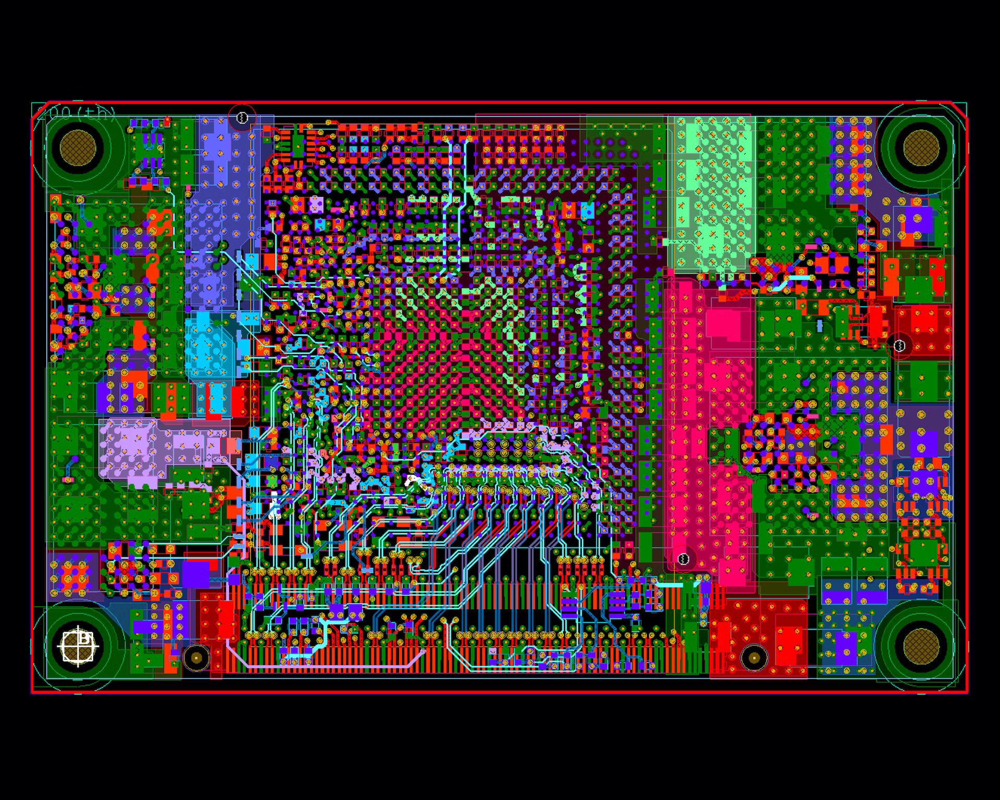

# 3D printing and PCB Design

### 3D Printers

Watch [3D printing basics](https://www.youtube.com/watch?v=nb-Bzf4nQdE&list=PLDJMid0lOOYnkcFhz6rfQ6Uj8x7meNJJx) and read [this](https://formlabs.com/blog/fdm-vs-sla-compare-types-of-3d-printers/) article- Additive / (filament or resin based)

+ Filament printer : Fused deposition modeling (FDM), also known as fused filament fabrication (FFF), is the most widely used type of 3D printing at the consumer level. FDM 3D printers work by extruding thermoplastic filaments, such as ABS (Acrylonitrile Butadiene Styrene), PLA (Polylactic Acid), through a heated nozzle, melting the material and applying the plastic layer by layer to a build platform. Each layer is laid down one at a time until the part is complete.

+ Resin Printer : Stereolithography was the world’s first 3D printing technology, invented in the 1980s, and is still one of the most popular technologies for professionals. SLA 3D printers use a laser to cure liquid resin into hardened plastic in a process called photopolymerization.

<table style="width:100%" >
<tr>
<th>Original Prusa i3 MK3S+    (for Serious Hobbyists, Makers) <a href="https://www.prusa3d.com/category/original-prusa-i3-mk3s/#a_aid=toms3DP&a_bid=11110001">printer</a></th>
<th>Dremel DIGILAB 3D45    (for Professionals and Small Businesses)
 <a href="https://www.idealo.de/preisvergleich/OffersOfProduct/5952912_-digilab-3d45-dremel.html">printer</a></th>
<th>Ultimaker S5    (for Large Objects) <a href="https://ultimaker.com/3d-printers/ultimaker-s5">printer</a></th>
<th>MakerBot Replicator+    (for Product Designers/Engineers) <a href="https://shop.hak5.org/collections/implants/products/key-croc?variant=21284858396785">printer</a></th>
<th>Creality Ender-3 V2    (for DIY Types) <a href="https://www.creality.com/products/ender-3-v2-3d-printer-csco">printer</a></th>
</tr>
</table>

Class : [[MIT : Principles of Manufacturing](https://www.edx.org/micromasters/mitx-principles-manufacturing)], buy from  [slice engineering](https://www.sliceengineering.com/?p=SyCtzG4s8), [Prusa Research](https://www.prusa3d.com/) and design with [Prusa Slicer](https://www.prusa3d.com/page/prusaslicer_424/) | 3D model - [makebot thingverse](https://www.thingiverse.com/), [youmagine](https://www.youmagine.com/), [printables](https://www.printables.com/), [Cults3D](https://cults3d.com/en); Tools - [Fusion 360](https://www.autodesk.com/products/fusion-360/overview?term=1-YEAR&tab=subscription), [meshroom](https://alicevision.org/#meshroom).

[ [3D Printing Meets Robotics](https://youtu.be/mft36w5Hl1I?si=QQ1hK7DyI-Vy48gG), [New 3D printer makes multi-material robots](https://youtu.be/2WL4b03Tfjg?si=PrzhoYvejFshL_EP), [This 3D printer can watch itself fabricate objects](https://youtu.be/mw9hYHoD46o?si=-NU-Q1_Z1Hg_NSDf), [The 3D printer that crafts complex robotic organs in a single run](https://youtu.be/GDFuBoeVd_8?si=En1Cl7soRhOtRNhS), [Breakthrough 3D Printer Uses Strange Goo](https://youtu.be/MXOJeKFZsSk?si=KS8SOKp0gzqS0REb), [This 3D printer can watch itself fabricate objects](https://news.mit.edu/2023/3d-printer-can-watch-itself-fabricate-objects-1115), [Engineers create 3D-printed objects that sense how a user is interacting with them](https://news.mit.edu/2021/3d-printed-objects-sense-interaction-0914), [Autonomous 3D Printed QuadSpider Robot](https://youtu.be/04VkpGuIz30?si=R5E2BV65WVCcDdlU), [Resin VS FDM 3D printers: Which one is the best for miniatures?](https://youtu.be/PtwvAbm679Q?si=1HjbYa3-Yw8hTu3_), [10 Amazing ARTICULATED 3D Prints](https://youtu.be/GOCiaXNAFec?si=udUixaAWSUwHg9St), [Fully 3D Printed TANK / Tracked Robot Platform](https://youtu.be/q3XNYwNZ97w?si=a9WewhWikGaMNeSs), [Building a Robotic Fox with 3D Printing, Arduino and Fusion 360](https://youtu.be/iXmrPoqd8gs?si=G8q2sAkPq4R0m6Rd), [Flying a DIY 3D Printed Quadcopter... Will it work?](https://youtu.be/zLjSPts9hUI?si=QFrE6CMdlGdZ8_58), [I PRINTED an RC Car... How FAST can it go??](https://youtu.be/-pxNIrBaDrA?si=5OI7sKEq2K_cmIDB), [How To Make Avatar Scorpion Rc Helicopter - 3D Printed Rc Helicopter](https://youtu.be/UkFCE25-XTs?si=BlnpCl_eyfMH81R1), [Probably the FASTEST DRONE with 8 blade props](https://youtu.be/6w5apnkCZqo?si=Mhkk4cFYRkUpWRek), [Metal 3D Printing a 48 Blade Turbine Part out of 316L Stainless](https://youtu.be/xM36RpcgcQc?si=_jPoJ0_IhNWy-OB6), [3D Printing Timelapse - 1 meter high](https://youtu.be/hrv0sDACB7M?si=6KbfNohY8h2y_7mt) ]

## 3D printing with [TINKERCAD](https://www.tinkercad.com/) ; [thingiverse](https://www.thingiverse.com/) for shopping 3D models ~ [STL file](./Mighty_Stantia_skk.stl).

[ [3D printed crystal dragon](https://www.youtube.com/shorts/vzx_iWcTyTw), [3D printed dragon flight test](https://www.youtube.com/shorts/uRxKrj5EqDk) xD, [DIY 3D Printed SMARS Robot](https://youtu.be/tJqI_Hq0oDw?si=44wxxAUIXWrnaZrL), [How Does 3D Printing Works - 3D Animation](https://youtu.be/fiMoXrTM0SQ?si=tIOhAFXovv0GacRi), [The Working Principle and Outputs Of 3D Printers](https://www.youtube.com/shorts/H-4fuAT-aU8) ]

## PCB Design :

Printed Circuit Boards (PCBs) are the backbone of modern electronics. They serve as the physical foundation for electronic components, connecting them in a precise and organized manner. Effective PCB design is crucial for achieving functionality, reliability, and manufacturability in electronic devices.

The schematic is the blueprint of the PCB, showing the interconnections between components. It's created using Electronic Design Automation (EDA) tools like Altium Designer, Eagle, or KiCad.

Checkout my project @github/[cube_ss](https://github.com/s-ai-kia/cube_ss) for notes and tips on PCB design and also check [PCB design](https://www.youtube.com/watch?v=MdcnkaAoDTE&list=PLiYbY8lzAN-2xni5V_Rtp0IKyNugQuVO8).

Steps : [From Idea to Schematic to PCB](https://youtu.be/35YuILUlfGs);
Schematic Design : [Easy EDA](https://easyeda.com/), [KiCAD EDA](https://www.kicad.org/), [Altium Designer](https://www.altium.com/altium-designer);
Order PCB : [jlpcb](https://jlcpcb.com/), [pcbway](https://www.pcbway.com/) 

Resources: [No glasses required - 360 degree view of Voxon Photonics 3D Volumetric Display](https://youtu.be/CCuybyAO8fs?si=p34Ddwusd0nBEWpW), [Tiny volumetric display](https://youtu.be/HKpBhE7QVAI?si=MfNMuQ2GZkN9cwS0), [apple-vision-pro](https://www.apple.com/apple-vision-pro/), [quest-3](https://www.meta.com/quest/quest-3/).