# 3D printing and PCB Design

### 3D Printers

Watch [3D printing basics](https://www.youtube.com/watch?v=nb-Bzf4nQdE&list=PLDJMid0lOOYnkcFhz6rfQ6Uj8x7meNJJx) and read [this](https://formlabs.com/blog/fdm-vs-sla-compare-types-of-3d-printers/) article- Additive / (filament or resin based)

+ Filament printer : Fused deposition modeling (FDM), also known as fused filament fabrication (FFF), is the most widely used type of 3D printing at the consumer level. FDM 3D printers work by extruding thermoplastic filaments, such as ABS (Acrylonitrile Butadiene Styrene), PLA (Polylactic Acid), through a heated nozzle, melting the material and applying the plastic layer by layer to a build platform. Each layer is laid down one at a time until the part is complete.

+ Resin Printer : Stereolithography was the world’s first 3D printing technology, invented in the 1980s, and is still one of the most popular technologies for professionals. SLA 3D printers use a laser to cure liquid resin into hardened plastic in a process called photopolymerization.

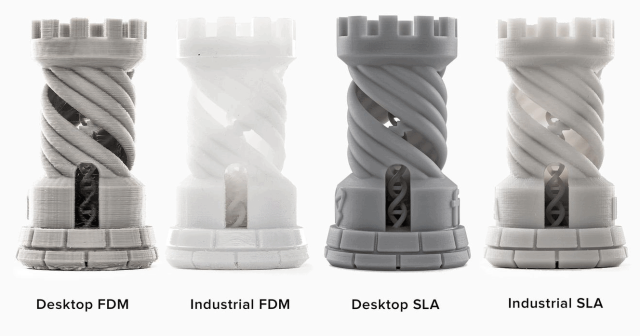

<table style="width:100%" >
<tr>
<th>Original Prusa i3 MK3S+  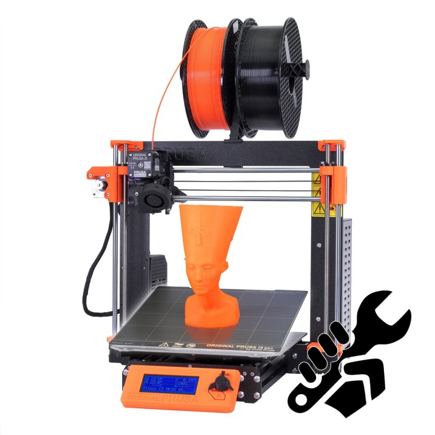  (for Serious Hobbyists, Makers) <a href="https://www.prusa3d.com/category/original-prusa-i3-mk3s/#a_aid=toms3DP&a_bid=11110001">printer</a></th>
<th>Dremel DIGILAB 3D45  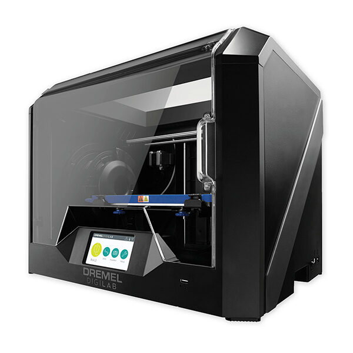  (for Professionals and Small Businesses)
 <a href="https://www.idealo.de/preisvergleich/OffersOfProduct/5952912_-digilab-3d45-dremel.html">printer</a></th>
<th>Ultimaker S5  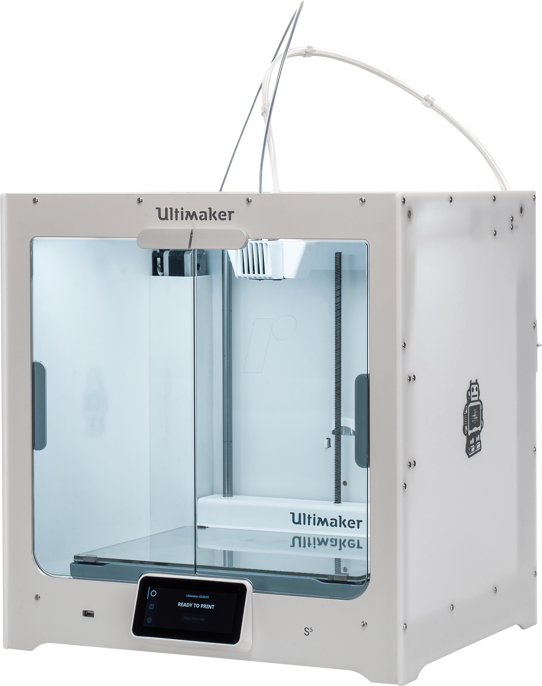  (for Large Objects) <a href="https://ultimaker.com/3d-printers/ultimaker-s5">printer</a></th>
<th>MakerBot Replicator+  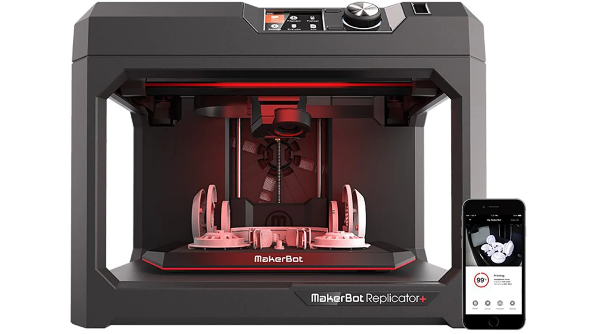  (for Product Designers/Engineers) <a href="https://shop.hak5.org/collections/implants/products/key-croc?variant=21284858396785">printer</a></th>
<th>Creality Ender-3 V2  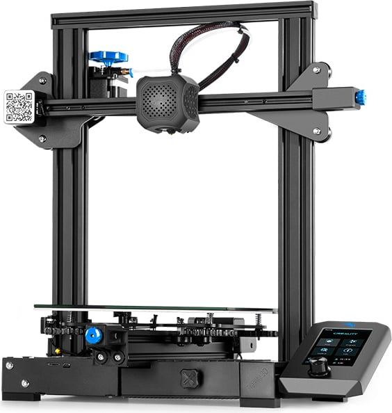  (for DIY Types) <a href="https://www.creality.com/products/ender-3-v2-3d-printer-csco">printer</a></th>
</tr>
</table>

Class : [[MIT : Principles of Manufacturing](https://www.edx.org/micromasters/mitx-principles-manufacturing)], buy from  [slice engineering](https://www.sliceengineering.com/?p=SyCtzG4s8), [Prusa Research](https://www.prusa3d.com/) and design with [Prusa Slicer](https://www.prusa3d.com/page/prusaslicer_424/) | 3D model - [makebot thingverse](https://www.thingiverse.com/), [youmagine](https://www.youmagine.com/), [printables](https://www.printables.com/), [Cults3D](https://cults3d.com/en); Tools - [Fusion 360](https://www.autodesk.com/products/fusion-360/overview?term=1-YEAR&tab=subscription), [meshroom](https://alicevision.org/#meshroom).

## 3D printing with [TINKERCAD](https://www.tinkercad.com/) ; [thingiverse](https://www.thingiverse.com/) for shopping 3D models ~ [STL file](./Mighty_Stantia_skk.stl).

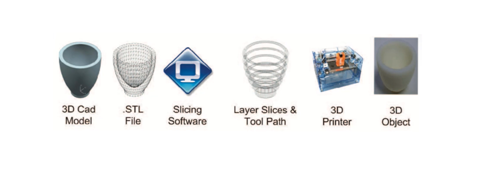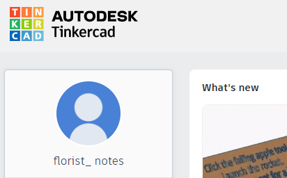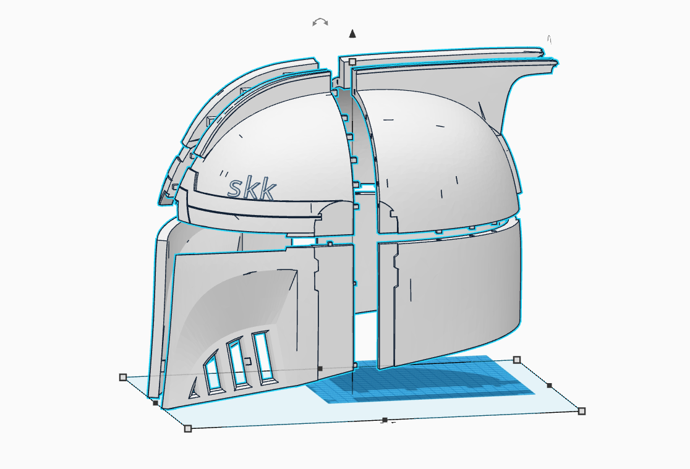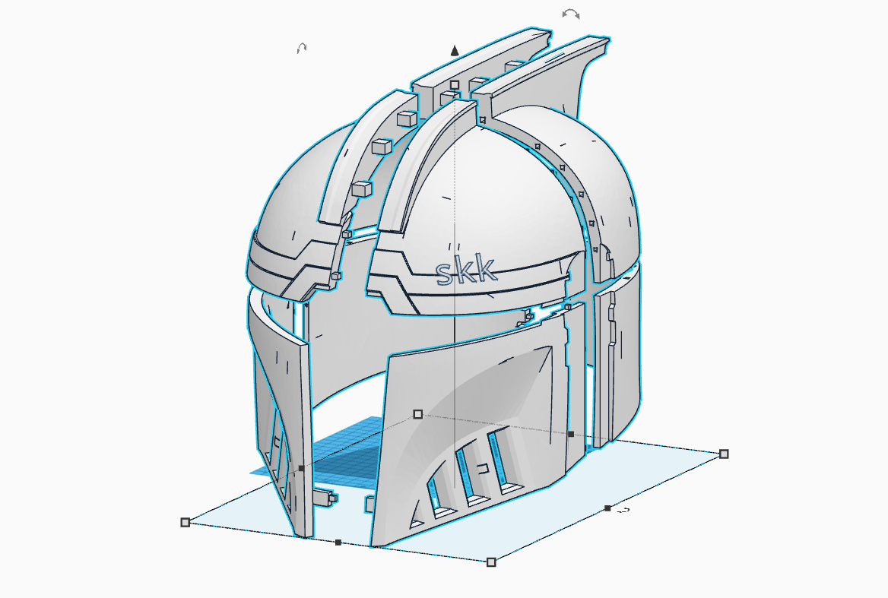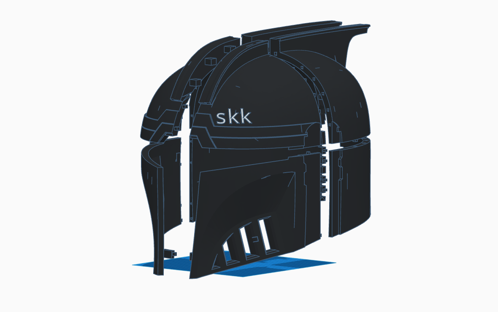

## PCB Design :

Printed Circuit Boards (PCBs) are the backbone of modern electronics. They serve as the physical foundation for electronic components, connecting them in a precise and organized manner. Effective PCB design is crucial for achieving functionality, reliability, and manufacturability in electronic devices.

The schematic is the blueprint of the PCB, showing the interconnections between components. It's created using Electronic Design Automation (EDA) tools like Altium Designer, Eagle, or KiCad.

Checkout my project @github/[cube_ss](https://github.com/s-ai-kia/cube_ss) for notes and tips on PCB design and also check [PCB design](https://www.youtube.com/watch?v=MdcnkaAoDTE&list=PLiYbY8lzAN-2xni5V_Rtp0IKyNugQuVO8).

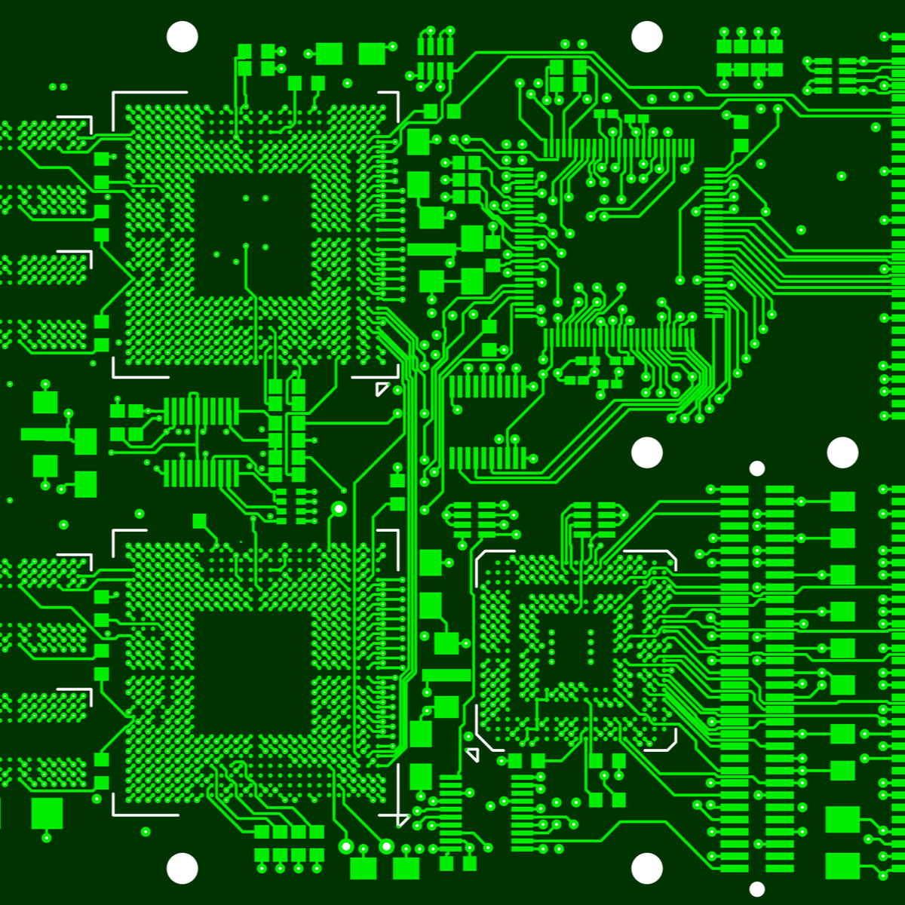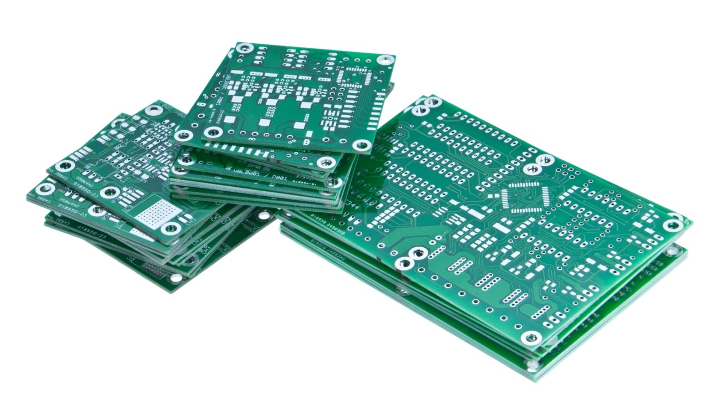

Steps : [From Idea to Schematic to PCB](https://youtu.be/35YuILUlfGs);
Schematic Design : [Easy EDA](https://easyeda.com/), [KiCAD EDA](https://www.kicad.org/), [Altium Designer](https://www.altium.com/altium-designer);
Order PCB : [jlpcb](https://jlcpcb.com/), [pcbway](https://www.pcbway.com/) 