# DIY projects and Advanced Robots

Want something fresh? Start with [KINEMATICS | Serial robot vs. Parallel robot](https://youtu.be/3fbmguBgVPA), sip a cup of coffee, watch [KINEMATICS | Hexapod (Gough-Stewart platform) 6-axis parallel robot](https://youtu.be/xiECumcaEx0) and [ROBOTICS | Miniature 3-axis robotic arm](https://youtu.be/yhdL4jz74WM), take a deep breath, that was impressive!

### DIY Projects
I have been searching for clean DIY robotics projects and here is a list of top 5:

### 1. Amethyst AUV Platform | project - [guide](https://beobachtung3d.com/projects/amethyst)

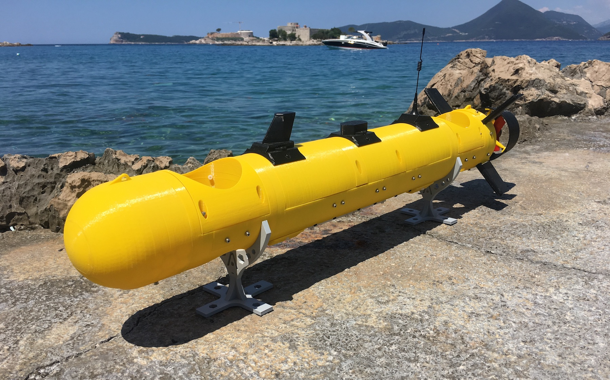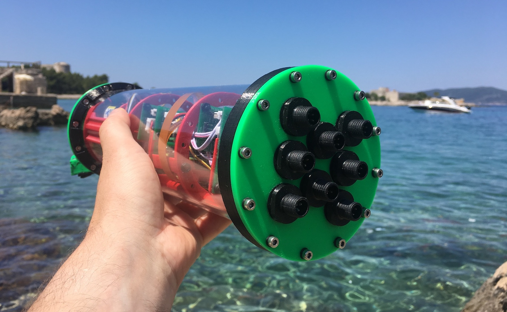

### 2. Open Source Rover | project - [guide](https://github.com/jakkra/Mars-Rover)
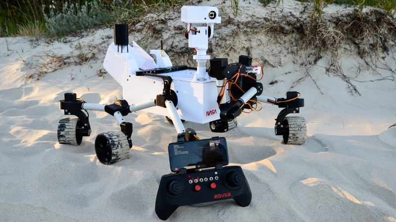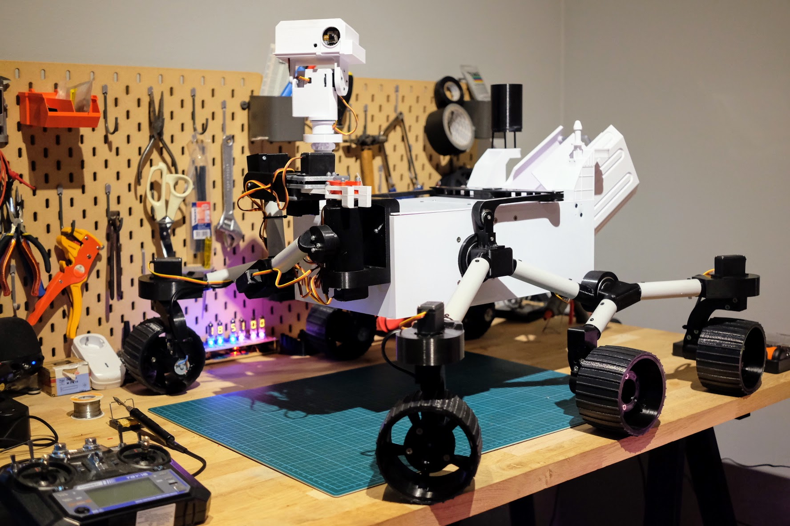

### 3. Robotic Arm | project - [guide](https://github.com/peng-zhihui/Dummy-Robot), [video](https://youtu.be/F29vrvUwqS4)
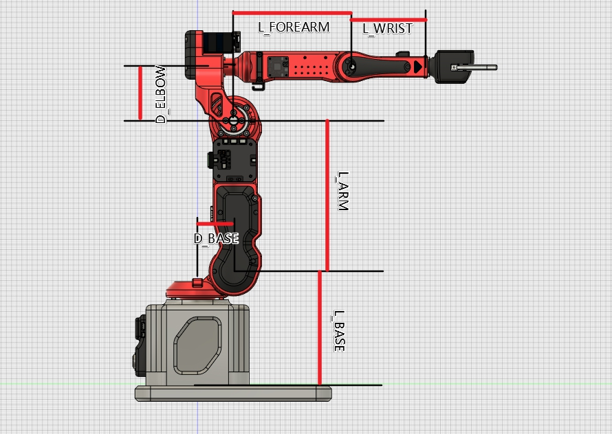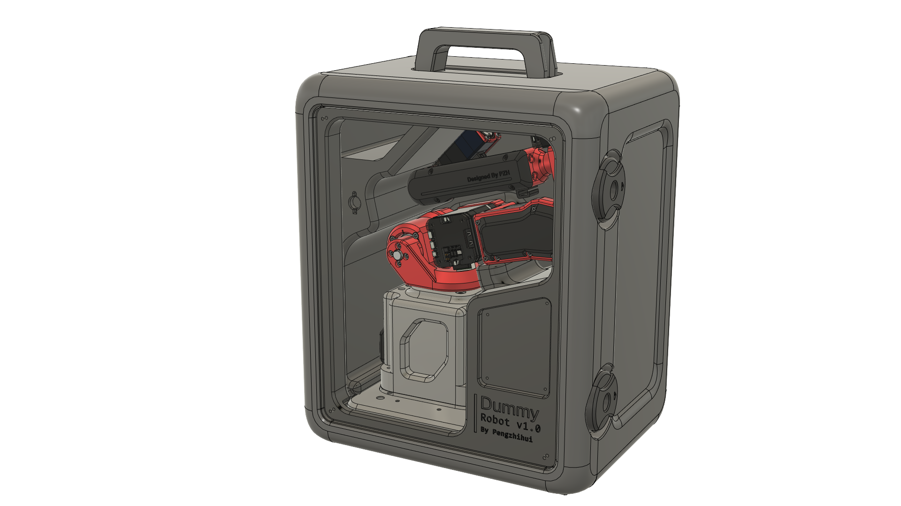

### 4. Modular Rocket | project - [guide](https://bps.space/), @[BPS Space](https://www.youtube.com/@BPSspace), @[Lafayette Systems](https://www.youtube.com/@LafayetteSystems).
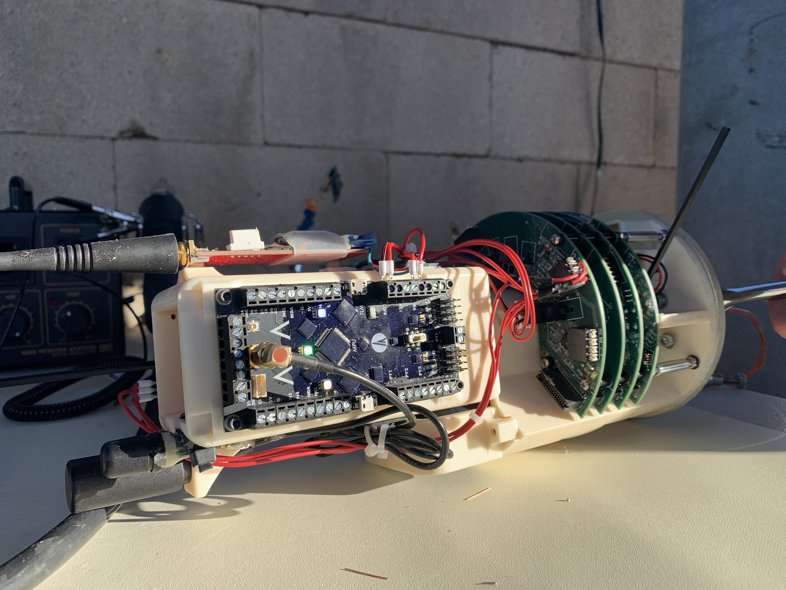

### 5. MorpHex MKII | project - [guide](http://zentasrobots.com/robot-projects/morphex-mkii/) | [video](https://youtu.be/yn3FWb-vQQ4)
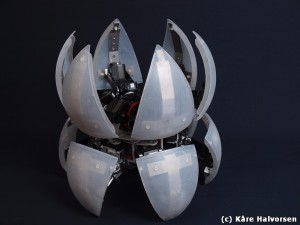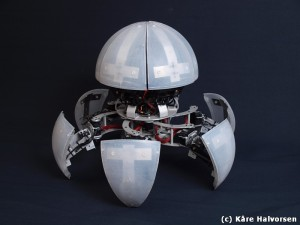

#### [Deep Robotics](https://www.youtube.com/@deeprobotics8601/videos), [Hexapod v2.1](https://youtu.be/To2Y6Mhu-CE?si=I9zZMNKVTwplLBWx), [Rocket guidance and flight trajectory control](https://youtu.be/4xEx2EQIPD4?si=GUrs2l8139btoGnk), [로봇 복싱](https://youtu.be/wthjhzUzqRo?si=_FdlQXvVRYrXG48T), [Testing Out JPL’s New Snake Robot](https://youtu.be/ifCIDT4X9AM?si=lzaokjMIIt9V4sf6), [MX-Phoenix fast walking among people](https://youtu.be/mcw_0cIyr9Y?si=WYGC7degO_f0HiJQ), [Festo BionicSwift 2021](https://youtu.be/hUE8o056Cpc?si=_N_fhnteQ06q4BP-), [Orwell the Hexapod Robot](https://youtu.be/IAX3vwjZ4m4?si=2yLEiSOVdAsnoPI6), [Open Source Motion Capture for Autonomous Drones](https://youtu.be/0ql20JKrscQ?si=CX2fn0w0DLLOXuXH), [Building the MOST MANEUVERABLE submarine](https://youtu.be/ol0xvj7TAeM?si=Yn6qIoy_lHij0qWu), [Robotic arm controlled with three axis joystick](https://youtu.be/JDUm7V1Xa9s?si=pJvnwIf_anVl-k_J), [Building a rocket bird (ornithopter)](https://youtu.be/angnUj0-yhQ?si=5GU7BRpMTntdSXGV), [Fourier’s GR-1 Humanoids](https://youtu.be/jLwhKJ1uqb0?si=mgOetZwYuhgSLqZY), [LimX Dynamics’ Biped Robot](https://youtu.be/UpNid_rWDnI?si=2JVc9MZHKOHSPWo3), [AMBIDEX: 혁신적 매커니즘의 양팔 로봇](https://youtu.be/3LvZyOY6vVk?si=aUQzFbEGNNUeIX-g), [Disney : Droids in Training](https://youtu.be/qNfRgZMWyCI?si=e6gCBcMd-fghG8T9), [I built a rover using a Raspberry Pi & Arduino](https://youtu.be/IoCaTgmUSvc?si=scw2Kbb-4KoZGsjM), [A ROS2 Self Balancing Robot](https://youtu.be/ZrFPCvi1gjE?si=OFpWufCM7eUJOYvk), [Caterpillar type robot SLAM Navigation test - 무한궤도 타입 로봇 성능테스트](https://youtu.be/SklJSdrUJdI?si=CZwSBpLFZy37Mw_7), [hinotori™ Robotic Assisted Surgery System](https://youtu.be/XVNb1KbkJOU?si=rQwOCIO1zITgewI7), [I Built a Robot Dog and Made it Dance](https://youtu.be/VhUvoV5XyRg?si=h_c6dAP6BFhL666x), [I Built an Arduino Powered Hexapod from Scratch](https://youtu.be/u-U2VmCW-e8?si=yDvryQittQYZ7EG3), [Open Source Motion Capture for Autonomous Drones](https://youtu.be/0ql20JKrscQ?si=snPrcg94jpFSSKr2), [ESP32 based omnidirectional robots w/ camera](https://youtu.be/OIdMkZyhx7E?si=22pEj9o_8WDlK-ex), [Building a Companion Robot with Raspberry Pi and Arduino](https://youtu.be/Nqp4vuDWgpw?si=FmaQMUanlGVTKbSI), [Building a DIY REAPER Drone...](https://youtu.be/X-Q08HQq7fM?si=mNRcoJ-GLFOAG_o_), [Affordable DIY Robot Arm](https://youtu.be/KQ0SGzuE_xo?si=Ejl-n00F0RvKOLix), [How to build an Autonomous UAV for Long Range FPV & Autonomous Missions](https://youtu.be/nn87IyFPEy4?si=1dQ-2hPI2ITynTuP), [We could build this huge Space Station in 6 months](https://youtu.be/s-XlWP4Q4Ds?si=jeCWXUCWQ5ye426i), [Avular Origin One](https://youtu.be/T80Eel88N7E?si=mtxxIQsjQGvDJVPw), [I built a rover using a Raspberry Pi & Arduino](https://youtu.be/IoCaTgmUSvc?si=V-M-SjkHjyNDteb2), [I built a flying car! (eVTOL)](https://youtu.be/y3lqXjbzbp8?si=TO0x3yj3j1X715ot), [Advancing Humanoid Robot Development](https://youtu.be/Bhg3uOx9ZPw?si=MtHX7bqbnLe5c-d1), [V1 Introduction To KT2](https://youtu.be/-jo0ZcBD9yA?si=3sFwP03NNWb9zO1T).

## Advaned Robotics hardware :

### BRUCE (Bipedal Robot Unit with Compliance Enhanced)
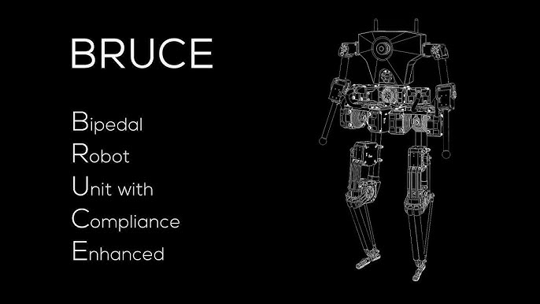

[BRUCE](https://www.westwoodrobotics.io/bruce/) (Bipedal Robot Unit with Compliance Enhanced) is a kid-size humanoid robot open-platform for robotics research and education, originally developed at RoMeLa in joint effort with Westwood Robotics.

### Dingo Quadruped | [web](https://github.com/Yerbert/DingoQuadruped) : [[video](https://youtu.be/8KntOIgzUjY?si=x8aR25hHUyAICFm_)]

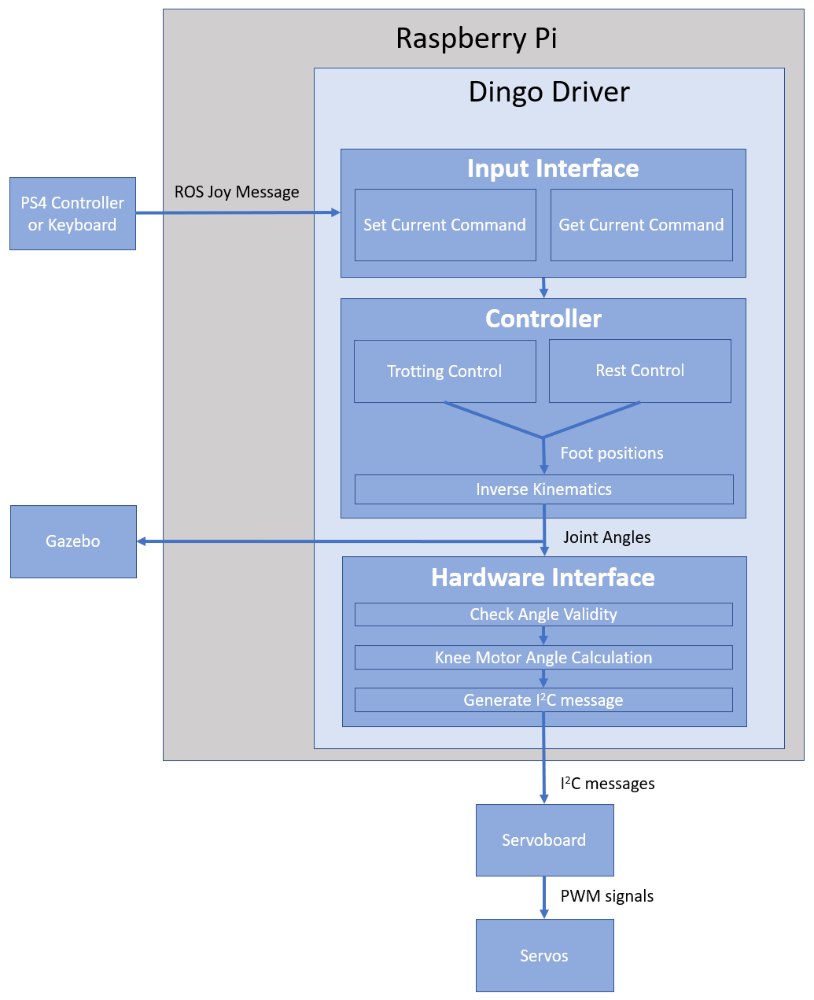

### OpenSource Hardware Project : [OpenHand](https://www.eng.yale.edu/grablab/openhand/)

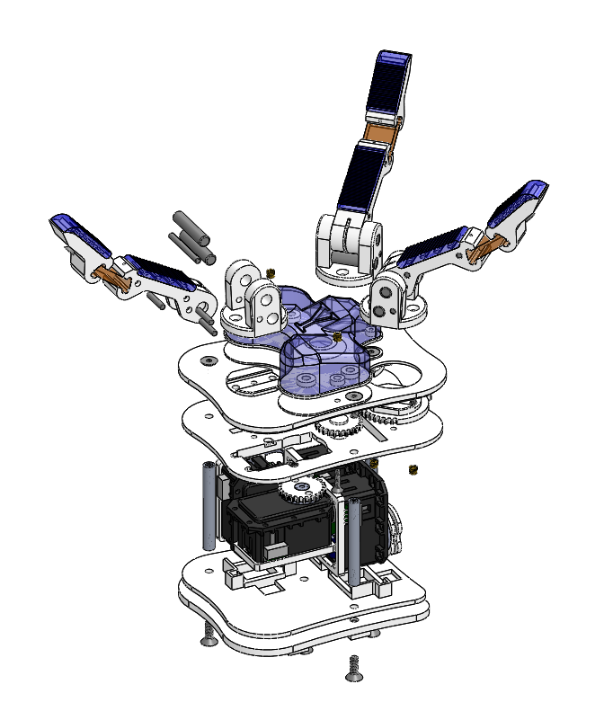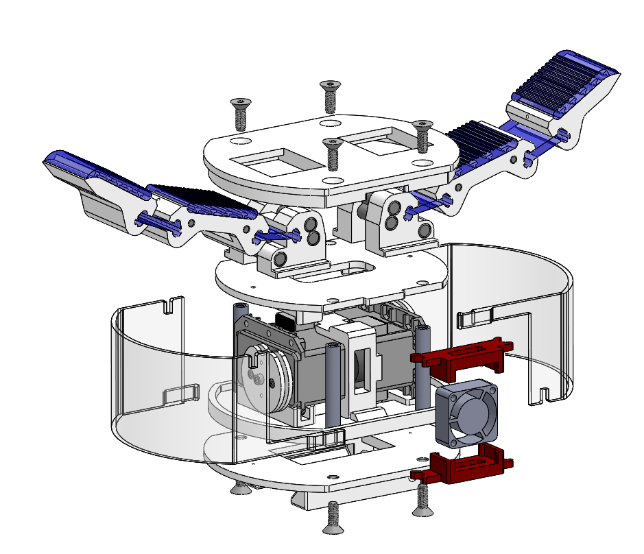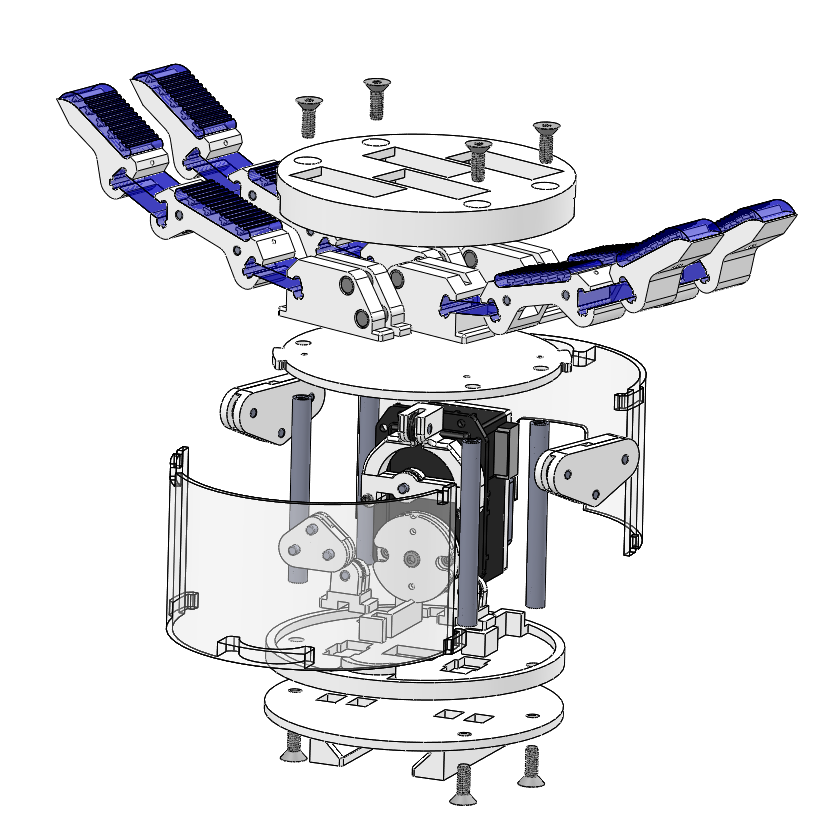

### Underwater / Marine Robotics 

#### [BlueROV2](https://bluerobotics.com/store/rov/bluerov2/) | [Naticus Robotics](https://nauticusrobotics.com/) : [Aquanaut](https://nauticusrobotics.com/aquanaut/) and [Hydronaut](https://nauticusrobotics.com/hydronaut/)

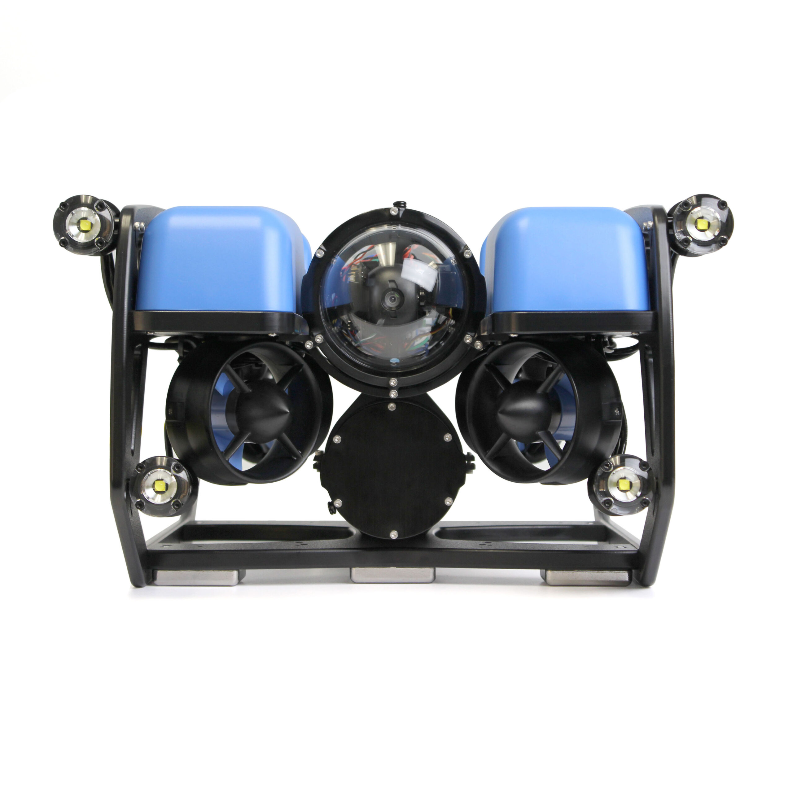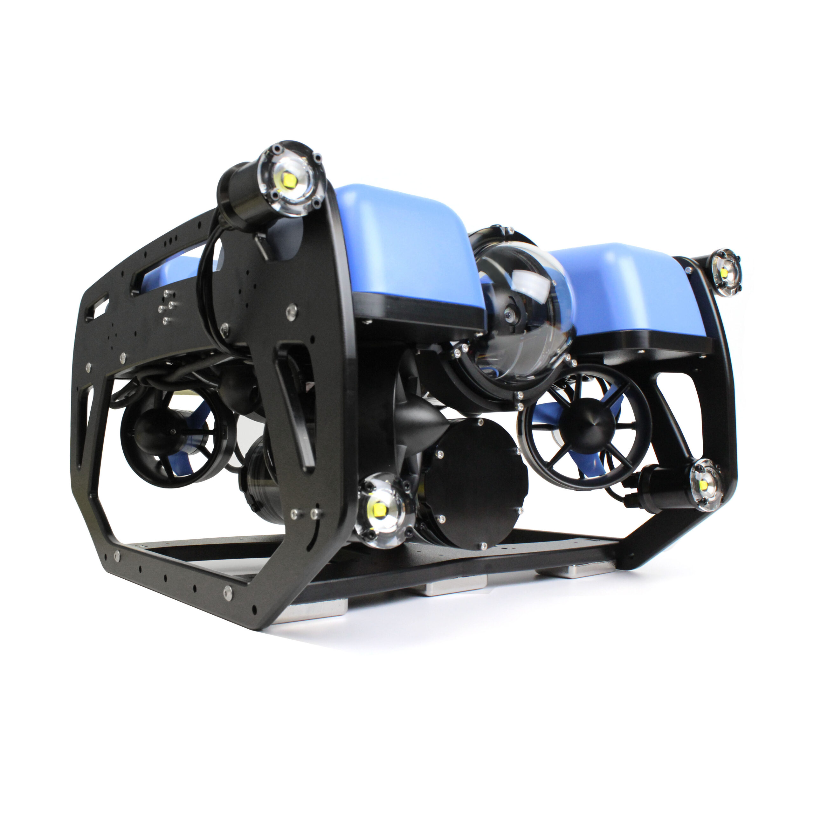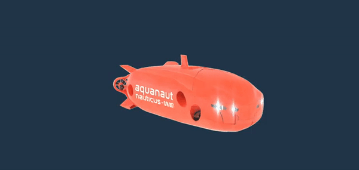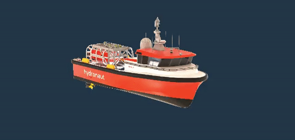

### Robotic Arms, Grippers and Advanced Robotic Manipulator

#### order : [TM Robot](https://www.tm-robot.com/en/#), [mycobot](https://shop.elephantrobotics.com/en-de/collections/mycobot), [robotshop](https://www.robotshop.com/collections/robotic-arms), [mybotshop](https://www.mybotshop.de/Robot-arms), [denso](https://www.densorobotics-europe.com/), [KUKA](https://www.kuka.com/), [reachrobotics](https://reachrobotics.com/), [dfrobot](https://www.dfrobot.com/)

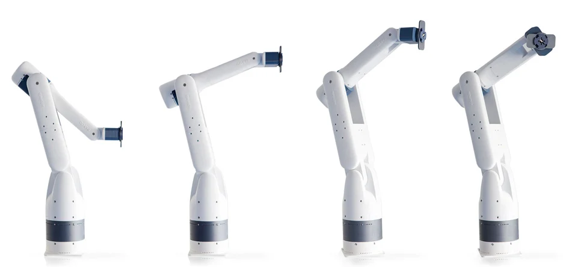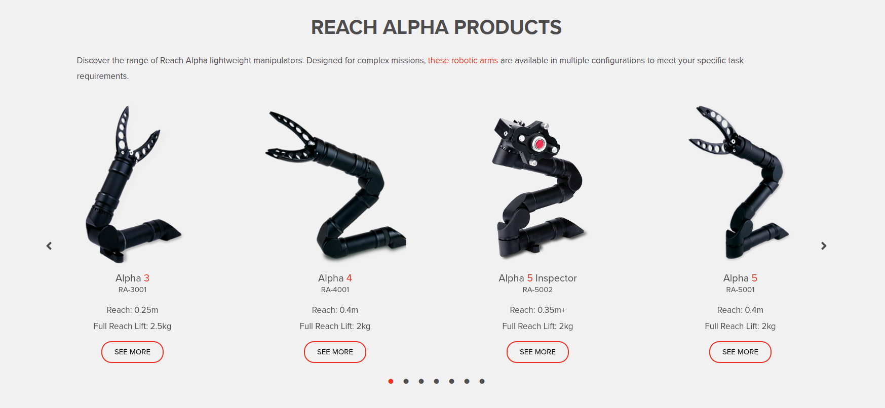

## Cutting Edge Robotics :

[ [Ameca facial motion capture](https://youtu.be/3OHILYjsW7c), [Boston Dynamics](https://youtu.be/fn3KWM1kuAw), [Robo Threads](https://youtu.be/INSyV4dgqu8), [Festo - Bionic Robotics](https://youtu.be/_qRGIRvr06w), [Deep Sea Soft Robotics](https://youtu.be/shr6sJy_29E), [OceanOneK](https://youtu.be/h2CLLBUpPZg), [Snake Robots](https://youtu.be/FWr-MvOOOYU), [Soft Robotic Fish](https://youtu.be/JPabeUxSfAw), [Xenobot 2.0](https://youtu.be/JPFRUZGqUFA), [MIT slime robot](https://youtu.be/VmV3m0QqNOY), [Search for Life: NASA JPL Explores Martian-Like Caves](https://youtu.be/qTW-dbZr4U8), [Drone reaches TRANSONIC prop tip SPEED](https://youtu.be/LbYEzEWvjr8), [ANYbotics](https://www.youtube.com/@ANYbotics), [Robot Animals](https://youtu.be/pd6HNSh0TJw), [Spot Levels Up | Boston Dynamics](https://youtu.be/qgHeCfMa39E), [Meet Alter 3, the singing and conducting humanoid robot!](https://youtu.be/LzDcIPipsT4?si=AylyoxQd6OLzgRS3), [MIT CSAIL Office Hours Episode 1: Robotics](https://youtu.be/l5o_edsg_nU?si=_u8_5sXS_p5wCCXb), [Assembler robots could eventually build almost anything](https://youtu.be/G94FDMGLwCc?si=sBCQ_KCqog87Z_Sm), [Robo-gripper grasps by reflex](https://youtu.be/XxDi-HEpXn4?si=_w4TGnfRkn-2PpzL), [The bio-inspired 'transformer' that crawls, rolls and flies](https://youtu.be/S4eQXXxUnNE?si=qAvabiZG2n-X6L1Y), [New 3D printer makes multi-material robots](https://youtu.be/2WL4b03Tfjg?si=4H4BCpz12QWQxylo), [Foundations of Spatial Perception for Robotics](https://youtu.be/AEaBq2-FeY0?si=pLZxHy3PY9aEFMGn), [A Look Into the Future of Robotics at MIT CSAIL | Strictly Robots](https://youtu.be/HmNxzg2_cso?si=vOPYQfA1bP4rtRPI), [Oxford DRSG](https://www.youtube.com/@OxfordDynamicRobotSystemsGroup/videos) ]

## Sophia and Ameca

Sophia the robot @/[SophiatheRobot](https://www.youtube.com/@SophiatheRobot) | [Ameca](https://youtu.be/CDBWud9Uc7w?si=qOXoFX2QiJSzRlIw), [Ameca Facial Expressions](https://youtu.be/lHk7gspkj0I?si=T-fLyahmuHVcGmqE)

 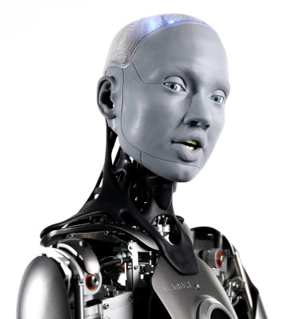 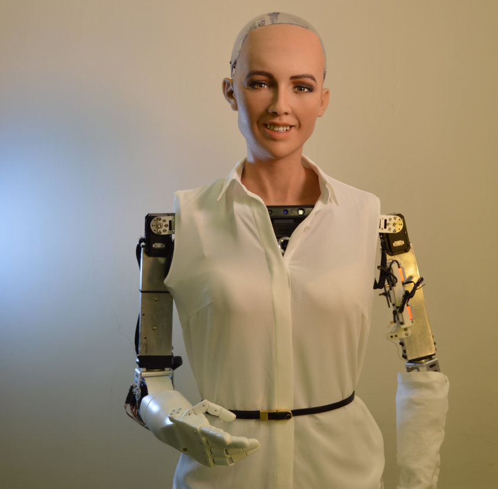

TESLA : [ [Optimus - Gen 2](https://youtu.be/cpraXaw7dyc?si=JjF_l5kGeI-npgzQ), [Tesla Bot Update](https://youtu.be/XiQkeWOFwmk?si=L9JDYPl41jj8-wFN) ]

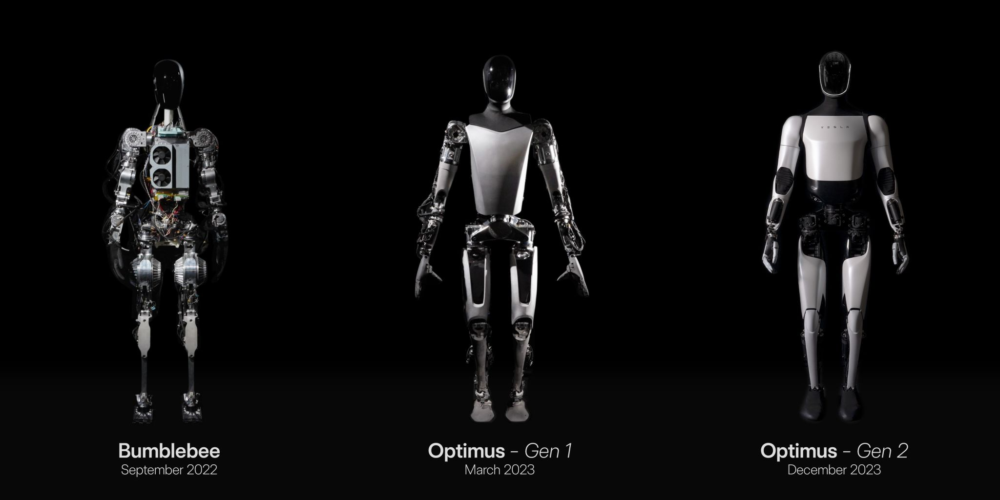 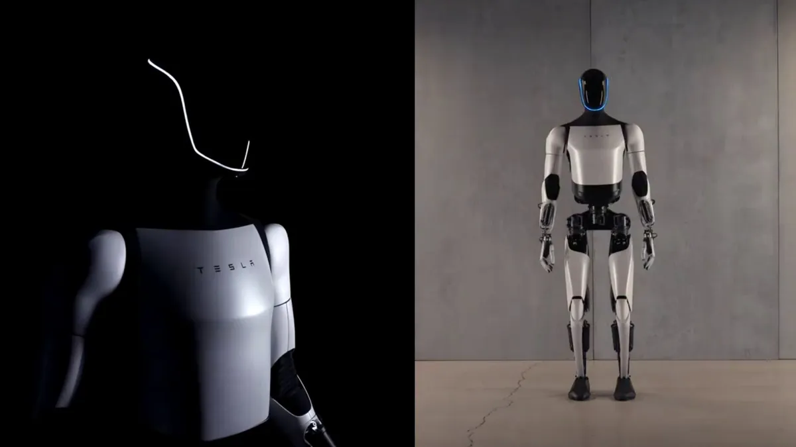

<table style="width:100%" > 
<tr>
<th>Spot Enterprise Package  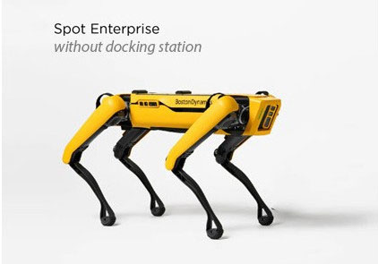<a href="https://www.generationrobots.com/en/403823-spot-enterprise-package.html#/202-charging_dock-without_charging_dock">buy</a></th>
<th>Payload: Boston Dynamics Spot Arm  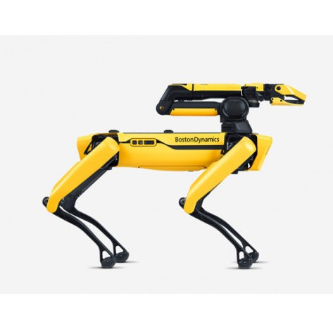
 <a href="https://www.generationrobots.com/en/403824-payload-boston-dynamics-spot-arm.html">buy</a></th>
<th>Boston Dynamics Spot Dock  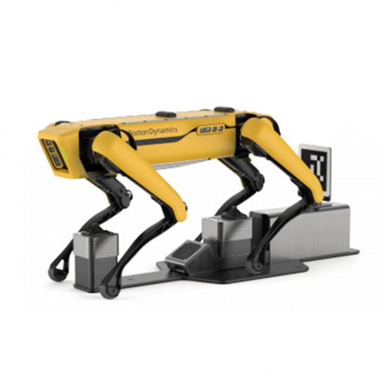 <a href="https://www.generationrobots.com/en/403767-boston-dynamics-spot-dock.html">buy</a></th>
<th>Additional Spot Battery  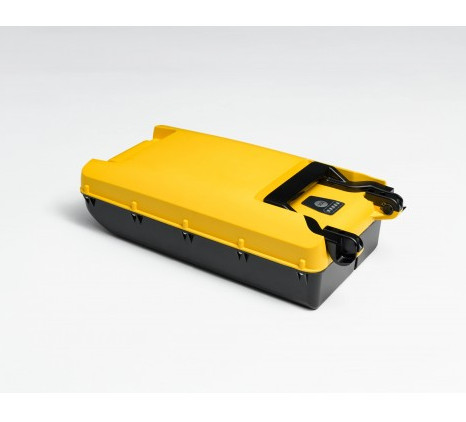<a href="https://www.generationrobots.com/en/403766-additional-spot-battery.html">buy</a></th>
<th>Payload: Boston Dynamics Spot CAM+IR (Thermal)  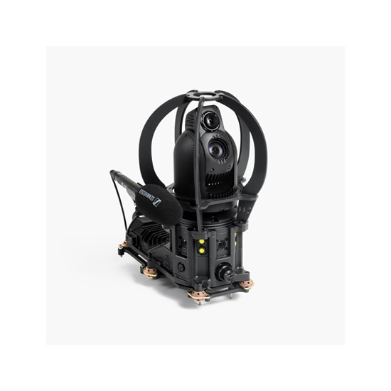<a href="https://www.generationrobots.com/en/403884-payload-boston-dynamics-spot-camir-thermal.html">buy</a></th>
</tr>

<tr>
<th>B1 Quadruped Robot Dog  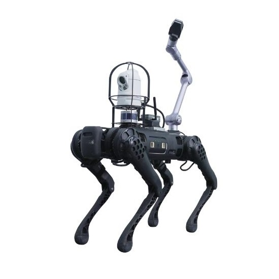<a href="https://www.generationrobots.com/en/404030-b1-quadruped-robot-dog.html">buy</a></th>
<th>Aliengo quadruped robot  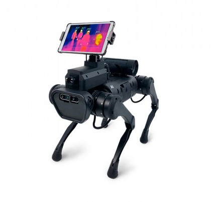
 <a href="https://www.generationrobots.com/en/403913-aliengo-robot-dog-quadruped-robot.html#/287-version-basic">buy</a></th>
<th>TurtleBot3 Burger Mobile Robot  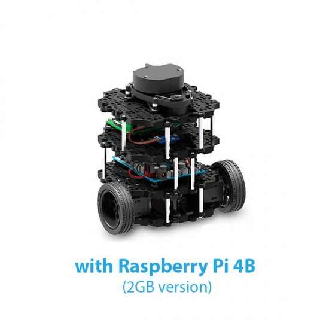 <a href="https://www.generationrobots.com/en/402707-turtlebot3-burger-mobile-robot.html#/242-type_de_kit-with_raspberry_pi_4_2gb">buy</a></th>
<th>LIMO Open-Source Mobile Robot (ROS compatible)  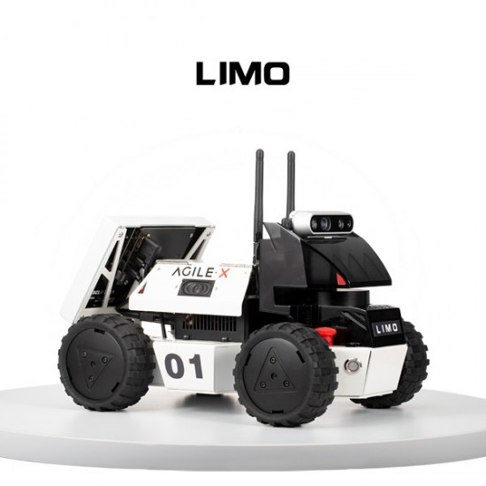<a href="https://www.generationrobots.com/en/403880-limo-open-source-mobile-robot-ros-compatible.html#/249-type_de_kit-limo_standard_version">buy</a></th>
<th>Leo Rover Mobile Robot (without arm)  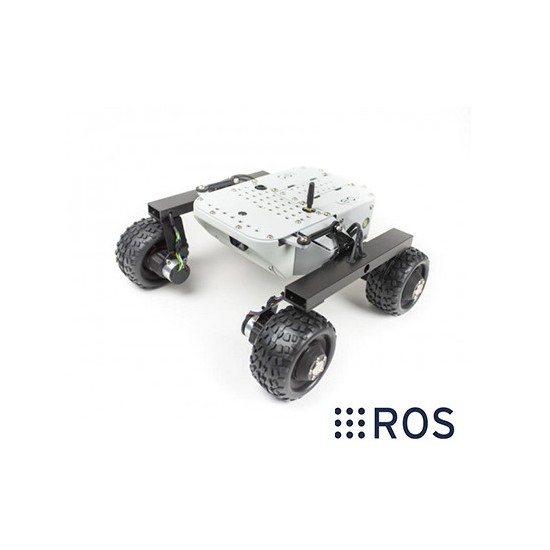<a href="https://www.generationrobots.com/en/403285-turtle-rover-mobile-robot.html">buy</a></th>
</tr>

<tr>
<th>Kilobot robot (swarm robot)  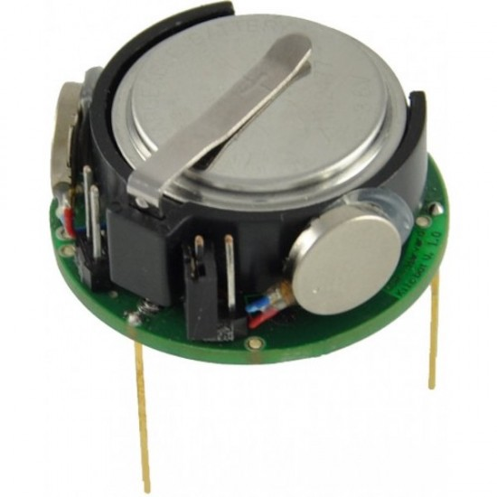<a href="https://www.generationrobots.com/en/401427-kilobot-robot-pack-of-10-k-team.html">buy</a></th>
<th>e-puck2 (swarm robot)  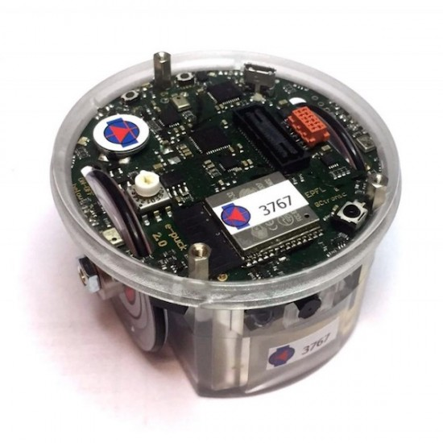
 <a href="https://www.generationrobots.com/en/403090-e-puck2.html">buy</a></th>
<th>Programmable Humanoid Robot NAO V6  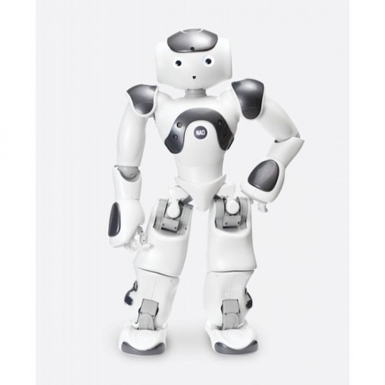 <a href="https://www.generationrobots.com/en/403100-programmable-humanoid-robot-nao-v6.html">buy</a></th>
<th>7-axis Franka Research 3 Robotic Arm + FCI licence  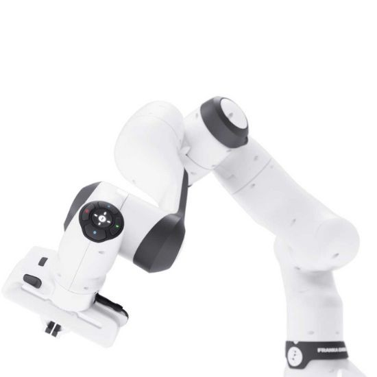<a href="https://www.generationrobots.com/en/403992-7-axis-franka-research-3-robotic-arm-fci-licence.html">buy</a></th>
<th>Doosan M1013 Robotic Arm  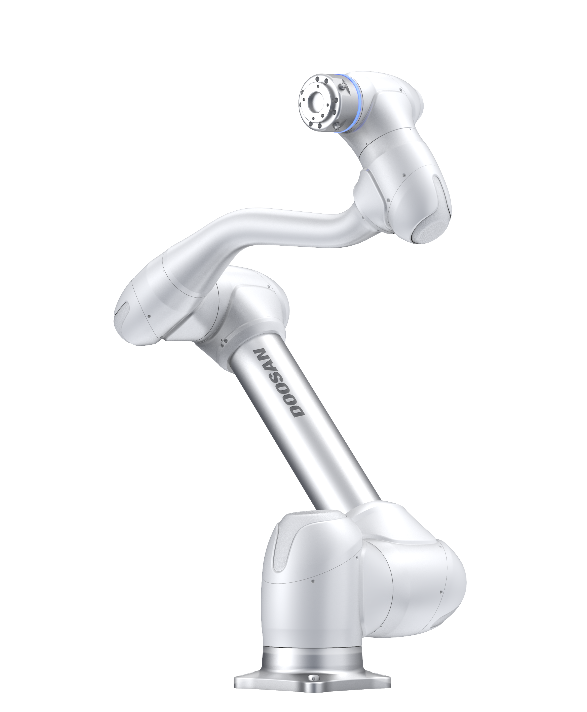<a href="https://www.generationrobots.com/en/403413-doosan-m1013-robotic-arm.html">buy</a></th>
</tr>

</table>

resources - [grablab opensource hardware](https://www.eng.yale.edu/grablab/openrobothardware.html), @github/[awesome-robotics](https://github.com/mjyc/awesome-robotics-projects); articles - [Design and driving model for the quadruped robot: An elucidating draft](https://journals.sagepub.com/doi/10.1177/16878140211009035)