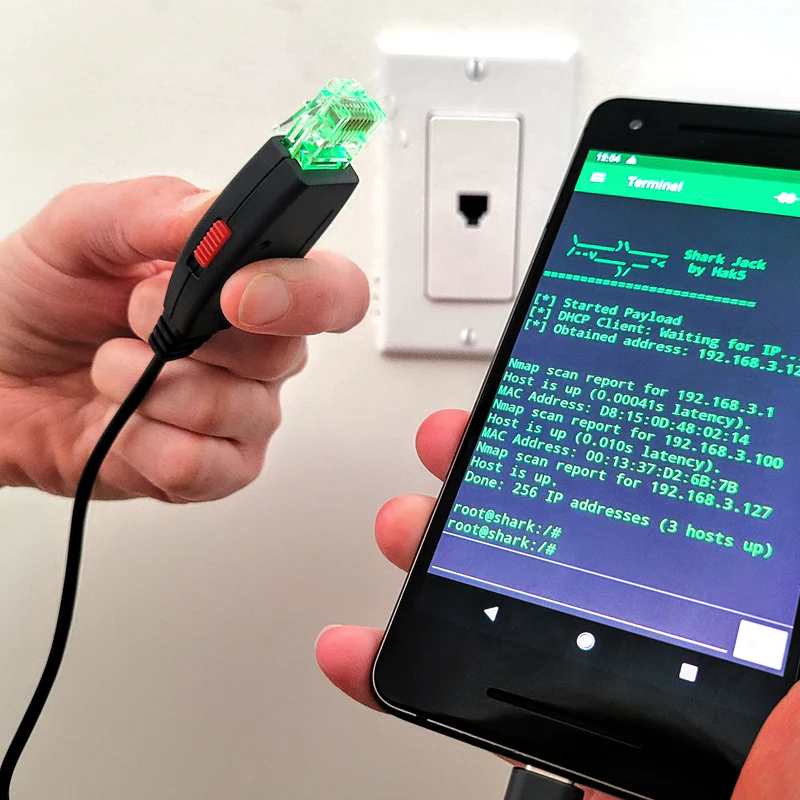

# Electronic Components & Workbench

#### Bonus! Hacking Gadgets

<table style="width:100%" >
<tr>
<th>SHARK JACK   <a href="https://shop.hak5.org/collections/hotplug-attack-tools/products/shark-jack">hack</a></th>
<th>O.MG PLUG   <a href="https://shop.hak5.org/collections/omg-row2/products/omg-plug?variant=40035873554545">hack</a></th>
<th>MALICIOUS CABLE DETECTOR   <a href="https://shop.hak5.org/collections/omg-row2/products/malicious-cable-detector-by-o-mg">hack</a></th>
<th>KEY CROC   <a href="https://shop.hak5.org/collections/implants/products/key-croc?variant=21284858396785">hack</a></th>
<th>USB RUBBER DUCKY   <a href="https://shop.hak5.org/collections/hotplug-attack-tools/products/usb-rubber-ducky?variant=353378649">hack</a></th>
<th>BASH BUNNY   <a href="https://shop.hak5.org/collections/hotplug-attack-tools/products/bash-bunny">hack</a></th>
</tr>

</table>
 