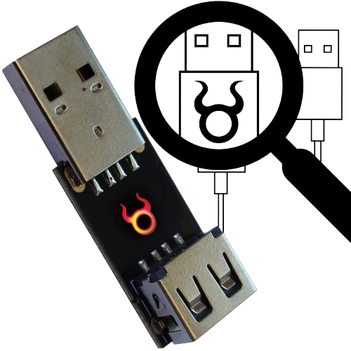
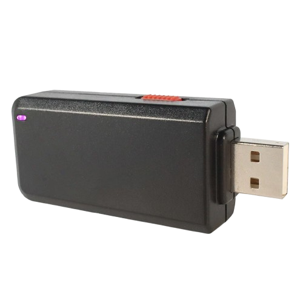

# Electronic Components & Workbench

### Electronics Components

<table style="width:100%" >
<tr>
<th>Component Name</th>
<th>Image</th>
<th>Description</th>
</tr>

<tr>
<td>Resistor</td>
<td>xx</td>
<td>xxxxxxxxxxxxxxxxxxxxxxxx</td>
</tr>

<tr>
<td>Capacitor</td>
<td>xx</td>
<td>xxxxxxxxxxxxxxxxxxxxxxxx</td>
</tr>

<tr>
<td>Diode</td>
<td>xx</td>
<td>xxxxxxxxxxxxxxxxxxxxxxxx</td>
</tr>

<tr>
<td>Transistor</td>
<td>xx</td>
<td>xxxxxxxxxxxxxxxxxxxxxxxx</td>
</tr>

<tr>
<td>Potentiometer</td>
<td>xx</td>
<td>xxxxxxxxxxxxxxxxxxxxxxxx</td>
</tr>

<tr>
<td>Integrated Circuit (IC)</td>
<td>xx</td>
<td>xxxxxxxxxxxxxxxxxxxxxxxx</td>
</tr>

<tr>
<td>Relay</td>
<td>xx</td>
<td>xxxxxxxxxxxxxxxxxxxxxxxx</td>
</tr>

<tr>
<td>Inductor</td>
<td>xx</td>
<td>xxxxxxxxxxxxxxxxxxxxxxxx</td>
</tr>

<tr>
<td>Piezoelectric devices, crystals, resonators</td>
<td>xx</td>
<td>xxxxxxxxxxxxxxxxxxxxxxxx</td>
</tr>

<tr>
<td>Wires</td>
<td>xx</td>
<td>xxxxxxxxxxxxxxxxxxxxxxxx</td>
</tr>

<tr>
<td>Breadboard</td>
<td>xx</td>
<td>xxxxxxxxxxxxxxxxxxxxxxxx</td>
</tr>
</tr>

<tr>
<td>Power Supply</td>
<td>xx</td>
<td>xxxxxxxxxxxxxxxxxxxxxxxx</td>
</tr>
</tr>

<tr>
<td>LED</td>
<td>xx</td>
<td>xxxxxxxxxxxxxxxxxxxxxxxx</td>
</tr>
</tr>

</table>
 

Extended :  [Buttons and Switches](https://www.sparkfun.com/categories/145), [Data Loggers](https://www.sparkfun.com/categories/589), [Magnets](https://www.sparkfun.com/categories/322), [Real Time Clock (RTC)](https://www.sparkfun.com/categories/358) and [Electronics kit](https://www.amazon.de/-/en/Electronic-Components-Electrical-Technology-Breadboard/dp/B08TLTHWD7/).

### Workbench

<table style="width:100%" >
<tr>
<th>Component Name</th>
<th>Image</th>
<th>Description</th>
</tr>

<tr>
<td>Digital Capacitance Meter</td>
<td>xx</td>
<td>xxxxxxxxxxxxxxxxxxxxxxxx</td>
</tr>

<tr>
<td>Oscilloscope</td>
<td>xx</td>
<td>xxxxxxxxxxxxxxxxxxxxxxxx</td>
</tr>

<tr>
<td>Diagonal Pliers</td>
<td>xx</td>
<td>xxxxxxxxxxxxxxxxxxxxxxxx</td>
</tr>

<tr>
<td>Ratcheting Crimper Pliers</td>
<td>xx</td>
<td>xxxxxxxxxxxxxxxxxxxxxxxx</td>
</tr>

<tr>
<td>Wire Strippers</td>
<td>xx</td>
<td>xxxxxxxxxxxxxxxxxxxxxxxx</td>
</tr>

<tr>
<td>Dual-Purpose Cross-Shaped Multi-Function Screwdriver</td>
<td>xx</td>
<td>xxxxxxxxxxxxxxxxxxxxxxxx</td>
</tr>

<tr>
<td>
Tweezers-straight (anti-magnetic)</td>
<td>xx</td>
<td>xxxxxxxxxxxxxxxxxxxxxxxx</td>
</tr>

<tr>
<td>Antenna Analyzer
</td>
<td>xx</td>
<td>xxxxxxxxxxxxxxxxxxxxxxxx</td>
</tr>

<tr>
<td>Logic Analyzer</td>
<td>xx</td>
<td>xxxxxxxxxxxxxxxxxxxxxxxx</td>
</tr>

<tr>
<td>Spectrum Analyzer
</td>
<td>xx</td>
<td>xxxxxxxxxxxxxxxxxxxxxxxx</td>
</tr>

<tr>
<td>Power Supply Tools</td>
<td>xx</td>
<td>xxxxxxxxxxxxxxxxxxxxxxxx</td>
</tr>

<tr>
<td>Soldering Tools/Kits</td>
<td>xx</td>
<td><a href="https://www.amazon.de/-/en/Electronics-Adjustable-Temperature-Multimeter-Desoldering/dp/B09CKTYTVJ/">Soldering kit</a>, <a href="https://www.amazon.com/Thermal-Grizzly-Kryonaut-Grease-Paste/dp/B011F7W3LU">Thermal Paste</a>, <a href="https://www.amazon.com/Amazon-Brand-Isopropyl-Antiseptic-Technical/dp/B07NFSFBXQ">99% Isopropyl Alcohal</a>, <a href="https://www.amazon.com/POWERGIANT-Electric-Screwdriver-Cordless-Precision/dp/B07R7TNR66">Electric Screwdriver set</a>, <a href="https://www.amazon.com/StarTech-com-24x27-5in-Desktop-Anti-Static-M3013/dp/B00009XT3H">Building Mat</a>.</td>
</tr>

<tr>
<td>Mat</td>
<td>xx</td>
<td>xxxxxxxxxxxxxxxxxxxxxxxx</td>
</tr>

</table>
 
 

#### Bonus! Hacking Gadgets

<table style="width:100%" >
<tr>
<th>SHARK JACK   <a href="https://shop.hak5.org/collections/hotplug-attack-tools/products/shark-jack">hack</a></th>
<th>O.MG PLUG   <a href="https://shop.hak5.org/collections/omg-row2/products/omg-plug?variant=40035873554545">hack</a></th>
<th>MALICIOUS CABLE DETECTOR   <a href="https://shop.hak5.org/collections/omg-row2/products/malicious-cable-detector-by-o-mg">hack</a></th>
<th>KEY CROC   <a href="https://shop.hak5.org/collections/implants/products/key-croc?variant=21284858396785">hack</a></th>
<th>USB RUBBER DUCKY   <a href="https://shop.hak5.org/collections/hotplug-attack-tools/products/usb-rubber-ducky?variant=353378649">hack</a></th>
<th>BASH BUNNY   <a href="https://shop.hak5.org/collections/hotplug-attack-tools/products/bash-bunny">hack</a></th>
</tr>

</table>
 