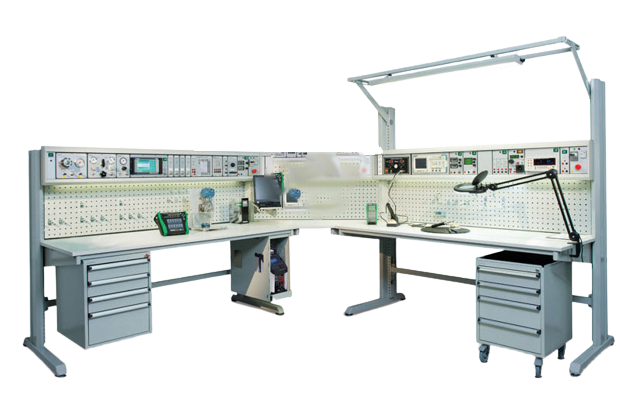

# Electronic Components & Workbench ⏚ 

 

An electronics lab is a space dedicated to the design, testing, and development of electronic circuits and devices. It is equipped with a wide range of electronic components, each serving a specific function. These components are the building blocks of electronics, and understanding their roles is essential for any electronics enthusiast or engineer. 

### Electronic Components

<table style="width:100%" >
<tr>
<th>Component Name</th>
<th>Image</th>
<th>Description</th>
</tr>

<tr>
<td>Resistor</td>
<td></td>
<td>

A resistor will resist the current flow in an electric circuit.
+ Function: Resistors are passive components that limit the flow of electric current in a circuit. They are used to control voltage levels, set biasing conditions, and protect other components.
+ Types: There are various types of resistors, including fixed resistors, variable resistors (potentiometers), and specialized resistors like thermistors and photoresistors.

</td>
</tr>

<tr>
<td>Capacitor</td>
<td></td>
<td>

A capacitor is like a battery with very low capacity. It might for example be used to introduce a delay in a circuit.
+ Function: Capacitors store and release electrical energy. They are used for filtering, timing, and coupling signals in electronic circuits.
+ Types: Capacitors come in different types, such as electrolytic capacitors, ceramic capacitors, and tantalum capacitors, each with its specific characteristics.

</td>
</tr>

<tr>
<td>Diode</td>
<td></td>
<td>A diode is a component that only conducts electricity in one direction. It is commonly used if you want to convert from alternating current (AC) to direct current (DC). Other types of diodes include Light Emitting Diode (LED) and Zener diode.

+ Function: Diodes allow current to flow in one direction while blocking it in the opposite direction. They are used for rectification, voltage regulation, and signal clipping.
+ Types: Common diode types include silicon diodes, Schottky diodes, and light-emitting diodes (LEDs).
</td>
</tr>

<tr>
<td>Transistor</td>
<td></td>
<td>A transistor is similar to a relay in the sense that you can use it to turn on and off a current. The transistor is what makes amplifiers work.

+ Function: Transistors amplify or switch electronic signals. They are the building blocks of digital logic circuits and amplifiers.
+ Types: Transistors include bipolar junction transistors (BJTs) and field-effect transistors (FETs), which further divide into various subtypes like NPN, PNP, N-channel, and P-channel.
</td>
</tr>

<tr>
<td>Potentiometer</td>
<td></td>
<td>A potentiometer is a variable resistor in which a wiper sweeps from one end of the resistive element to the other, resulting in resistance that is proportional to the wiper's position.</td>
</tr>

<tr>
<td>Integrated Circuit (IC)</td>
<td></td>
<td>An integrated circuit is a circuit made up of several tiny components and placed in a small package. It could be anything from a microcontroller to a radar system.

+ Function: ICs are miniature electronic circuits etched onto a silicon chip. They can perform complex functions like microcontrollers, amplifiers, and memory storage.
+ Types: ICs come in various packages and purposes, such as operational amplifiers (op-amps), microprocessors, and digital signal processors (DSPs).
</td>
</tr>

<tr>
<td>Relay</td>
<td></td>
<td>A relay is a switch that can be controlled electrically. If you connect power to the relay, the switch opens. If you disconnect the power, the switch closes. (Or vice versa).</td>
</tr>

<tr>
<td>Inductor</td>
<td></td>
<td>An inductor will resist changes in current.

+ Function: Inductors store energy in a magnetic field and resist changes in current. They are used in filters, oscillators, and energy storage applications.
+ Types: Inductors can be air-core, iron-core, or toroidal, with varying inductance values and applications.
</td>
</tr>

<tr>
<td>Piezoelectric devices, crystals, resonators</td>
<td></td>
<td>A crystal oscillator is a component used to create a precise frequency for example as a clock for a microcontroller.</td>
</tr>

<tr>
<td>Wires</td>
<td></td>
<td>Jumper wire for connection - male and female.

+ Function: Connectors and cables facilitate the physical connection between components and circuits. They are essential for interconnecting devices on a breadboard or PCB.
</td>
</tr>

<tr>
<td>Breadboard & Perfboard</td>
<td></td>
<td>A breadboard, solderless breadboard, or protoboard is a construction base used to build semi-permanent prototypes of electronic circuits. 

Perfboard is a material for prototyping electronic circuits (also called DOT PCB). It is a thin, rigid sheet with holes pre-drilled at standard intervals across a grid, usually a square grid of 0.1 inches (2.54 mm) spacing.

+ Function: Breadboards are prototyping platforms used for quickly assembling and testing electronic circuits. PCBs (Printed Circuit Boards) are used for creating permanent or production-ready circuits.
+ Importance: These platforms provide the structure for connecting and organizing electronic components effectively.

</td>
</tr>
</tr>

<tr>
<td>Power Supply</td>
<td></td>
<td>Power Supply

+ Function: Power supplies provide the necessary voltage and current to operate electronic circuits. They can be variable or fixed, linear or switching, depending on the application.
</td>
</tr>
</tr>

<tr>
<td>LED</td>
<td></td>
<td>Light Emitting Diode</td>
</tr>
</tr>

</table>
 

Extended :  [Buttons and Switches](https://www.sparkfun.com/categories/145) - [joystick](https://www.adafruit.com/product/3102), [Data Loggers](https://www.sparkfun.com/categories/589), [Magnets](https://www.sparkfun.com/categories/322), [Real Time Clock (RTC)](https://www.sparkfun.com/categories/358), [Sparkfun kit](https://learn.sparkfun.com/tutorials/beginner-parts-kit-identification-guide/all) and [Electronics kit](https://www.amazon.de/-/en/Electronic-Components-Electrical-Technology-Breadboard/dp/B08TLTHWD7/).

### Workbench

<table style="width:100%" >
<tr>
<th>Component Name</th>
<th>Image</th>
<th>Products</th>  
</tr>

<tr>
<td>Multimeter</td>
<td></td>
<td><a href="https://www.seeedstudio.com/Mini-Digital-Tweezers-DT71-p-4696.html">
DT71 Mini Digital Tweezers - LCR/ ESR Meter, Multimeter, SMD Tester with Built-in Micro Signal Generator</a></td>
</tr>

<tr>
<td>Digital Capacitance Meter</td>
<td></td>
<td><a href="https://www.amazon.com/Honeytek-CECOMINOD047803-A6013L-Capacitor-Tester/dp/B0036FQ3FW/">Honeytek A6013L Capacitor Tester</a></td>
</tr>

<tr>
<td>Oscilloscope</td>
<td></td>
<td><a href="https://www.seeedstudio.com/DSO-Nano-v3.html">DSO Nano v3</a>, <a href="https://www.seeedstudio.com/MiniDSO-DS213-Nano-4-Channel-100MSa-s-p-2891.html">MiniDSO DS213 Nano 4 Channel 100MSa/s</a>, <a href="https://www.amazon.com/Rigol-DS1054Z-Digital-Oscilloscopes-Bandwidth/dp/B012938E76/">Rigol DS1054Z</a></td>
</tr>

<tr>
<td>Function Generator</td>
<td></td>
<td><a href="https://www.amazon.com/GW-Instek-SFG-1003-Generator-Frequency/dp/B0051W6LDW/">GW Instek SFG-1003 DDS Function Generator with 6 Digit LED Display, 0.1Hz to 3MHz Frequency</a></td>
</tr>

<tr>
<td>Diagonal Pliers</td>
<td></td>
<td><a href="https://www.seeedstudio.com/Diagonal-Pliers-p-1432.html">Diagonal Pliers</a></td>
</tr>

<tr>
<td>Ratcheting Crimper Pliers</td>
<td></td>
<td><a href="https://www.seeedstudio.com/Ratcheting-Crimper-Pliers-p-1584.html">Ratcheting Crimper Pliers</a></td>
</tr>

<tr>
<td>Wire Strippers</td>
<td></td>
<td><a href="https://www.seeedstudio.com/Wire-Strippers-p-1430.html">Wire Strippers</a></td>
</tr>

<tr>
<td>Dual-Purpose Cross-Shaped Multi-Function Screwdriver</td>
<td></td>
<td><a href="https://www.seeedstudio.com/Dual-purpose-cross-shaped-multi-function-screwdriver-p-4114.html">Dual-Purpose Cross-Shaped Multi-Function Screwdriver</a></td>
</tr>

<tr>
<td>
Tweezers-straight (anti-magnetic)</td>
<td></td>
<td><a href="https://www.seeedstudio.com/Tweezers-straight-anti-magneti-p-537.html">Tweezers-straight (anti-magnetic)</a></td>
</tr>

<tr>
<td>Antenna Analyzer
</td>
<td></td>
<td><a href="https://www.seeedstudio.com/SARK-110-ULM-Antenna-Analyzer-p-4126.html">SARK-110-ULM Antenna Analyzer</a></td>
</tr>

<tr>
<td>Logic Analyzer</td>
<td></td>
<td><a href="https://www.seeedstudio.com/MiniDSO-LA104-Logic-Analyzer-p-3217.html">MiniDSO LA104 Logic Analyzer</a></td>
</tr>

<tr>
<td>Spectrum Analyzer
</td>
<td></td>
<td><a href="https://www.seeedstudio.com/RF-Explorer-6G-Combo-PLUS-Slim-p-4616.html">RF Explorer 6G Combo PLUS – Slim</a></td>
</tr>

<tr>
<td>Power Supply Tools</td>
<td></td>
<td><a href="https://www.seeedstudio.com/ZKETECH-EBC-A10H-AC-Electronic-Load-Battery-Capacity-Tester-Powe-Supply-Tester-30V-10A-150W-p-4522.html">ZKETECH EBC-A10H AC Electronic Load/Battery Capacity Tester/Power Supply Tester 30V 10A 150W</a>, <a href="https://www.seeedstudio.com/MDP-XP-Smart-Digital-Power-Supply-Kit-p-4117.html">ZKETECH EBC-A10H AC Electronic Load/Battery Capacity Tester/Power Supply Tester 30V 10A 150W</a></td>
</tr>

<tr>
<td>Soldering Tools/Kits</td>
<td></td>
<td><a href="https://www.amazon.de/-/en/Electronics-Adjustable-Temperature-Multimeter-Desoldering/dp/B09CKTYTVJ/">Soldering kit</a>, <a href="https://www.amazon.com/Thermal-Grizzly-Kryonaut-Grease-Paste/dp/B011F7W3LU">Thermal Paste</a>, <a href="https://www.amazon.com/Amazon-Brand-Isopropyl-Antiseptic-Technical/dp/B07NFSFBXQ">99% Isopropyl Alcohal</a>, <a href="https://www.amazon.com/POWERGIANT-Electric-Screwdriver-Cordless-Precision/dp/B07R7TNR66">Electric Screwdriver set</a>, <a href="https://www.amazon.com/StarTech-com-24x27-5in-Desktop-Anti-Static-M3013/dp/B00009XT3H">Building Mat</a>, <a href="https://www.amazon.com/Hakko-Digital-FX888D-Soldering-Station/dp/B00AWUFVY8/">Soldering Station</a>, <a href="https://www.amazon.com/Vastar-Solder-Sucker-Desoldering-Removal/dp/B01C70X7V4/">De Soldering Pump</a>, <a href="https://www.amazon.com/SRA-Soldering-Flux-Low-Solids-No-Clean/dp/B008OC0E5M/">Flux pen</a>.</td>
</tr>

<tr>
<td>Mat & Goggles</td>
<td></td>
<td><a href="https://www.amazon.com/Soldering-Silicone-Resistant-Electronics-Workbench/dp/B0727RK3QF?th=1">Soldering Mat Silicone Insulation Work Mat Heat Resistant 932°F</a>, <a href="https://www.amazon.com/Quilting-Cutting-Mats-Green-Supplies/s?keywords=Quilting+Cutting+Mats&rh=n%3A262643011%2Cp_n_size_browse-vebin%3A2637806011&c=ts&ts_id=262643011">Quilting Cutting Mats</a>, <a href="https://www.amazon.com/TR-Industrial-Anti-Fog-Approved-Wide-Vision/dp/B00O3K5RSS/">Protection Glass</a>, <a href="https://www.amazon.com/Illumify-Lighted-Magnifier-Visor-Removable/dp/B01B7SLFGQ/">Illumify Lighted Head Magnifier</a>, <a href="Kenley 56 LED Light Magnifying Lamp">Kenley 56 LED Light Magnifying Lamp</a></td>
</tr>

</table>
 

references : [buildelectroniccircuits](https://www.build-electronic-circuits.com/), instructables - [workbench guide](https://www.instructables.com/Electronics-Workbench-Equipment-List/), [adafruit](https://www.adafruit.com/categories) - [tools](https://www.adafruit.com/category/8).

## Robotics Power 🔋: Voltage in a Battery:

Power (P) = Voltage (V) * Current (I) | Watt = Volts * Ampere . Most micro controllers are operated at 5 V. We use a regulator to precisely output 5 V to our micontroller as direct 5 V is hard to feed from supply voltage. Current drawn ~ 5 A. Therefore, 5 V * 5 A = 25 W , Our regulator needs to be able to supply 25 Watts of Power. Make the power connections : [Robot Power 2: Electric Boogaloo](https://youtu.be/_FGYVgAti9M?si=HnfHwMJ-LDHXFCeP).

## Robot Motors :

Motors generally need high input voltage so we don't plug it in a Raspberry Pi directly. These input signals are Pulse Width Modulation (PWM)s. We use Motor Controllers to provide commands and input PWMs. The simplest motor controller is an Open-Loop-Controller. The feedback control (Measure speed) to autonomously drive is known as closed-loop control ~ PID control.

 
 The final schematic diagram:

### LED Accessories :

<table style="width:100%" >
<tr>
<th>Adafruit 8x8 NeoTrellis Feather M4 Kit Pack   <a href="https://www.adafruit.com/product/2721">link</a></th>
<th>32x32 RGB LED Matrix Panel - 4mm Pitch   <a href="https://www.adafruit.com/product/607">link</a></th>
<th>Flexible Adafruit DotStar Matrix 16x16 - 256 RGB LED Pixels   <a href="https://www.adafruit.com/product/2735">link</a></th>
<th>Adafruit DotStar High Density 8x8 Grid - 64 RGB LED Pixel Matrix   <a href="https://www.adafruit.com/product/3444">link</a></th>
</tr>

<tr>
<th>Adafruit RGB Matrix Bonnet for Raspberry Pi   <a href="https://www.adafruit.com/product/3211">link</a></th>
<th>Adafruit DotStar Digital LED Strip - Black 144 LED/m - 0.5 Meter - BLACK   <a href="https://www.adafruit.com/product/2328">link</a></th>
<th>nOOds - Flexible LED Filament - 3V 300mm long   <a href="https://www.adafruit.com/product/5510">link</a></th>
<th>Adafruit 5x5 NeoPixel Grid BFF Add-On for QT Py and Xiao   <a href="https://www.adafruit.com/product/5646">link</a></th>
</tr>
</table>
 

#### Bonus! Hacking Gadgets

<table style="width:100%" >
<tr>
<th>Shark Jack   <a href="https://shop.hak5.org/collections/hotplug-attack-tools/products/shark-jack">hack</a></th>
<th>O.MG Plug   <a href="https://shop.hak5.org/collections/omg-row2/products/omg-plug?variant=40035873554545">hack</a></th>
<th>Malicious Cable Detector   <a href="https://shop.hak5.org/collections/omg-row2/products/malicious-cable-detector-by-o-mg">hack</a></th>
<th>Key Croc   <a href="https://shop.hak5.org/collections/implants/products/key-croc?variant=21284858396785">hack</a></th>
<th>USB Rubber Ducky   <a href="https://shop.hak5.org/collections/hotplug-attack-tools/products/usb-rubber-ducky?variant=353378649">hack</a></th>
<th>Bash Bunny   <a href="https://shop.hak5.org/collections/hotplug-attack-tools/products/bash-bunny">hack</a></th>
</tr>

<tr>
<th>BomberCat – RFID/NFC/Wifi/MagStripe   <a href="https://cyborg.ksecsolutions.com/product/bombercat-preorder/">hack</a></th>
<th>Proxmark 3 RDv4 Kit – RFID Card Cloning & Research Device   <a href="https://cyborg.ksecsolutions.com/product/proxmark-3-rdv4-kit/">hack</a></th>
<th>Cactus WHID: WiFi HID Injector USB (Rubberducky)   <a href="https://cyborg.ksecsolutions.com/product/cactus-whid-wifi-hid-injector-usb-rubberducky/">hack</a></th>
<th>CatWAN USB Stick – Electronic Cats   <a href="https://cyborg.ksecsolutions.com/product/catwan-usb-stick/">hack</a></th>
<th>ChameleonUltra Dev Kit – RFID Key Fob & NFC Emulator Development Kit   <a href="https://cyborg.ksecsolutions.com/product/chameleonultra-dev-kit/">hack</a></th>
<th>ESP Key RFID Wiegand Interception Tool   <a href="https://cyborg.ksecsolutions.com/product/esp-key-rfid-wiegand-interception-tool-punch-down-version/">hack</a></th>
</tr>

<tr>
<th>Throwing Star LAN Tap Board – Passive Ethernet Traffic Sniffing   <a href="https://cyborg.ksecsolutions.com/product/throwing-star-lan-tap-board/">hack</a></th>
<th>Evil Crow RF V2 – Multi-Radiofrequency Security Testing Tool   <a href="https://cyborg.ksecsolutions.com/product/evil-crow-rf-v2/">hack</a></th>
<th>KSEC Pro Pick Multi-Tool Breakout Card   <a href="https://cyborg.ksecsolutions.com/product/ksec-pro-pick-all-in-one-edc-card/">hack</a></th>
<th>ProxGrind Chameleon Ultra – Ultimate RFID Key Fob & NFC Emulator   <a href="https://cyborg.ksecsolutions.com/product/proxgrind-chameleon-ultra/">hack</a></th>
<th>xEM Access Controller v2 (xAC v2)   <a href="https://cyborg.ksecsolutions.com/product/xem-access-controller-v2-xac-v2/">hack</a></th>
<th>USB Ninja Pro Bluetooth Remote   <a href="https://cyborg.ksecsolutions.com/product/ksec-usbninja-remote/">hack</a></th>
</tr>

</table>
 