# Electronic Components & Workbench

### Electronic Components

<table style="width:100%" >
<tr>
<th>Component Name</th>
<th>Image</th>
<th>Description</th>
</tr>

<tr>
<td>Resistor</td>
<td></td>
<td>A resistor will resist the current flow in an electric circuit.</td>
</tr>

<tr>
<td>Capacitor</td>
<td></td>
<td>A capacitor is like a battery with very low capacity. It might for example be used to introduce a delay in a circuit.</td>
</tr>

<tr>
<td>Diode</td>
<td>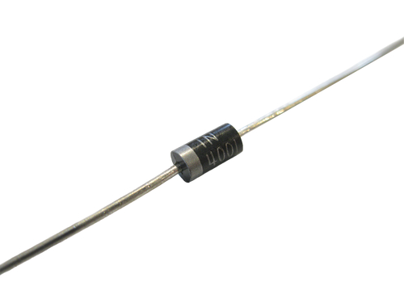</td>
<td>A diode is a component that only conducts electricity in one direction. It is commonly used if you want to convert from alternating current (AC) to direct current (DC). Other types of diodes include Light Emitting Diode (LED) and Zener diode.</td>
</tr>

<tr>
<td>Transistor</td>
<td></td>
<td>A transistor is similar to a relay in the sense that you can use it to turn on and off a current. The transistor is what makes amplifiers work.</td>
</tr>

<tr>
<td>Potentiometer</td>
<td></td>
<td>A potentiometer is a variable resistor in which a wiper sweeps from one end of the resistive element to the other, resulting in resistance that is proportional to the wiper's position.</td>
</tr>

<tr>
<td>Integrated Circuit (IC)</td>
<td>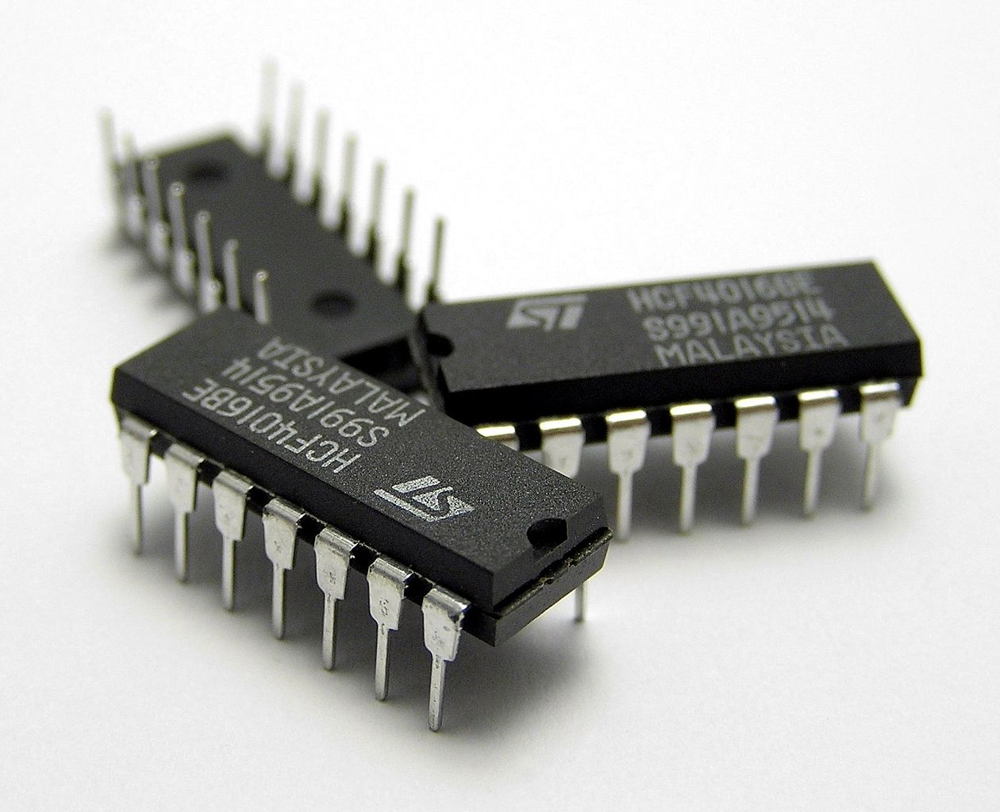</td>
<td>An integrated circuit is a circuit made up of several tiny components and placed in a small package. It could be anything from a microcontroller to a radar system.</td>
</tr>

<tr>
<td>Relay</td>
<td>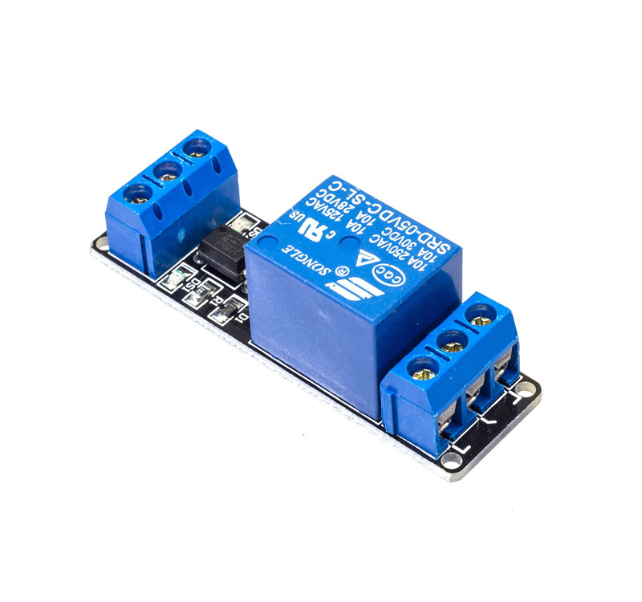</td>
<td>A relay is a switch that can be controlled electrically. If you connect power to the relay, the switch opens. If you disconnect the power, the switch closes. (Or vice versa).</td>
</tr>

<tr>
<td>Inductor</td>
<td></td>
<td>An inductor will resist changes in current.</td>
</tr>

<tr>
<td>Piezoelectric devices, crystals, resonators</td>
<td>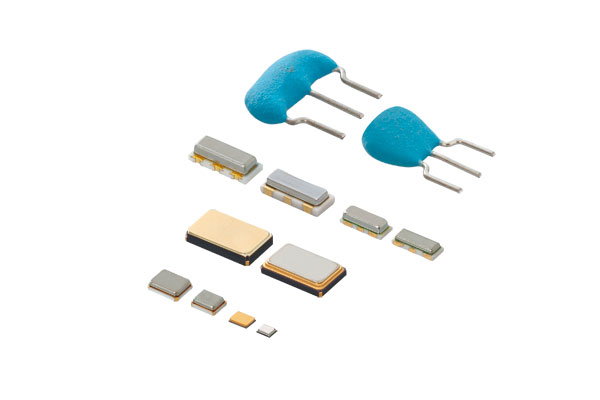</td>
<td>A crystal oscillator is a component used to create a precise frequency for example as a clock for a microcontroller.</td>
</tr>

<tr>
<td>Wires</td>
<td></td>
<td>Jumper wire for connection - male and female.</td>
</tr>

<tr>
<td>Breadboard & Perfboard</td>
<td>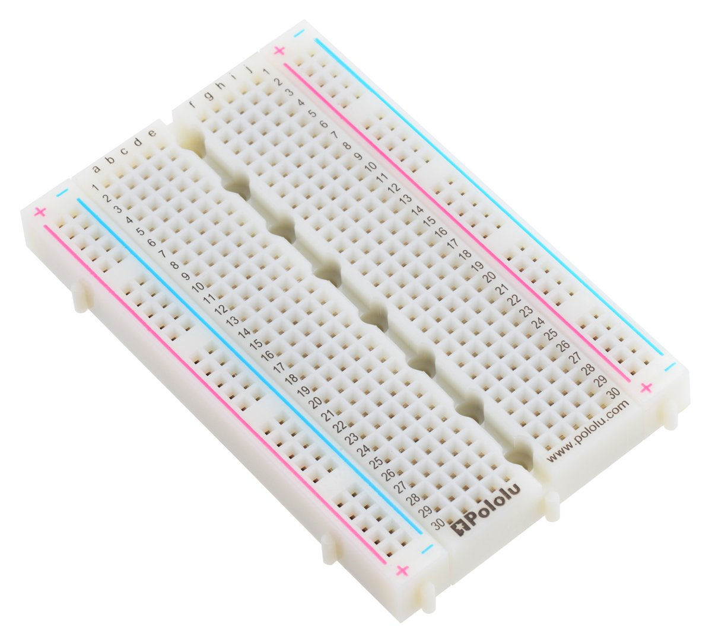</td>
<td>A breadboard, solderless breadboard, or protoboard is a construction base used to build semi-permanent prototypes of electronic circuits. 

Perfboard is a material for prototyping electronic circuits (also called DOT PCB). It is a thin, rigid sheet with holes pre-drilled at standard intervals across a grid, usually a square grid of 0.1 inches (2.54 mm) spacing.
</td>
</tr>
</tr>

<tr>
<td>Power Supply</td>
<td></td>
<td>Power Supply</td>
</tr>
</tr>

<tr>
<td>LED</td>
<td></td>
<td>Light Emitting Diode</td>
</tr>
</tr>

</table>
 

Extended :  [Buttons and Switches](https://www.sparkfun.com/categories/145) - [joystick](https://www.adafruit.com/product/3102), [Data Loggers](https://www.sparkfun.com/categories/589), [Magnets](https://www.sparkfun.com/categories/322), [Real Time Clock (RTC)](https://www.sparkfun.com/categories/358), [Sparkfun kit](https://learn.sparkfun.com/tutorials/beginner-parts-kit-identification-guide/all) and [Electronics kit](https://www.amazon.de/-/en/Electronic-Components-Electrical-Technology-Breadboard/dp/B08TLTHWD7/).

### Workbench

<table style="width:100%" >
<tr>
<th>Component Name</th>
<th>Image</th>
<th>Products</th>  
</tr>

<tr>
<td>Multimeter</td>
<td>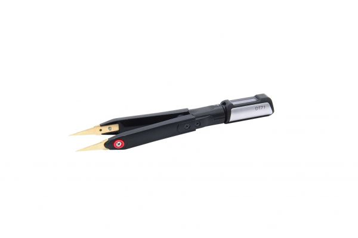</td>
<td><a href="https://www.seeedstudio.com/Mini-Digital-Tweezers-DT71-p-4696.html">
DT71 Mini Digital Tweezers - LCR/ ESR Meter, Multimeter, SMD Tester with Built-in Micro Signal Generator</a></td>
</tr>

<tr>
<td>Digital Capacitance Meter</td>
<td></td>
<td><a href="https://www.amazon.com/Honeytek-CECOMINOD047803-A6013L-Capacitor-Tester/dp/B0036FQ3FW/">Honeytek A6013L Capacitor Tester</a></td>
</tr>

<tr>
<td>Oscilloscope</td>
<td></td>
<td><a href="https://www.seeedstudio.com/DSO-Nano-v3.html">DSO Nano v3</a>, <a href="https://www.seeedstudio.com/MiniDSO-DS213-Nano-4-Channel-100MSa-s-p-2891.html">MiniDSO DS213 Nano 4 Channel 100MSa/s</a>, <a href="https://www.amazon.com/Rigol-DS1054Z-Digital-Oscilloscopes-Bandwidth/dp/B012938E76/">Rigol DS1054Z</a></td>
</tr>

<tr>
<td>Function Generator</td>
<td></td>
<td><a href="https://www.amazon.com/GW-Instek-SFG-1003-Generator-Frequency/dp/B0051W6LDW/">GW Instek SFG-1003 DDS Function Generator with 6 Digit LED Display, 0.1Hz to 3MHz Frequency</a></td>
</tr>

<tr>
<td>Diagonal Pliers</td>
<td>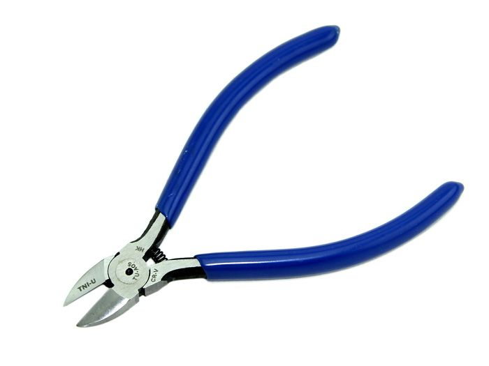</td>
<td><a href="https://www.seeedstudio.com/Diagonal-Pliers-p-1432.html">Diagonal Pliers</a></td>
</tr>

<tr>
<td>Ratcheting Crimper Pliers</td>
<td></td>
<td><a href="https://www.seeedstudio.com/Ratcheting-Crimper-Pliers-p-1584.html">Ratcheting Crimper Pliers</a></td>
</tr>

<tr>
<td>Wire Strippers</td>
<td>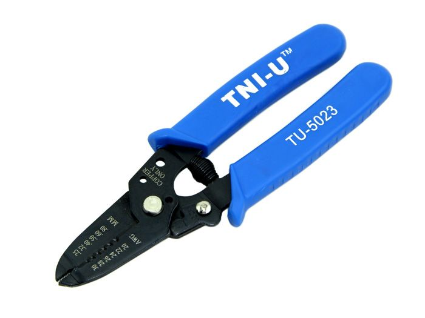</td>
<td><a href="https://www.seeedstudio.com/Wire-Strippers-p-1430.html">Wire Strippers</a></td>
</tr>

<tr>
<td>Dual-Purpose Cross-Shaped Multi-Function Screwdriver</td>
<td></td>
<td><a href="https://www.seeedstudio.com/Dual-purpose-cross-shaped-multi-function-screwdriver-p-4114.html">Dual-Purpose Cross-Shaped Multi-Function Screwdriver</a></td>
</tr>

<tr>
<td>
Tweezers-straight (anti-magnetic)</td>
<td>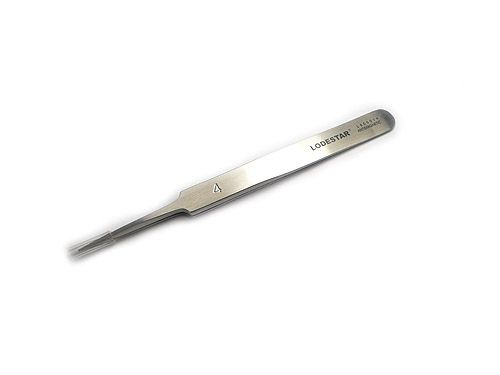</td>
<td><a href="https://www.seeedstudio.com/Tweezers-straight-anti-magneti-p-537.html">Tweezers-straight (anti-magnetic)</a></td>
</tr>

<tr>
<td>Antenna Analyzer
</td>
<td></td>
<td><a href="https://www.seeedstudio.com/SARK-110-ULM-Antenna-Analyzer-p-4126.html">SARK-110-ULM Antenna Analyzer</a></td>
</tr>

<tr>
<td>Logic Analyzer</td>
<td>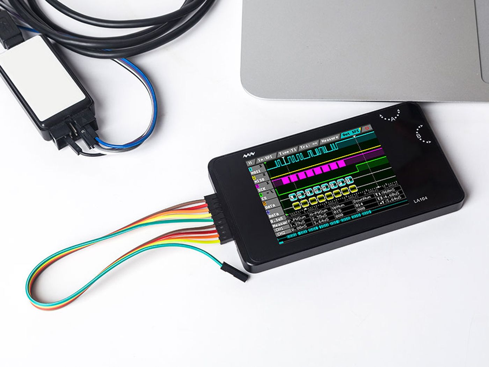</td>
<td><a href="https://www.seeedstudio.com/MiniDSO-LA104-Logic-Analyzer-p-3217.html">MiniDSO LA104 Logic Analyzer</a></td>
</tr>

<tr>
<td>Spectrum Analyzer
</td>
<td></td>
<td><a href="https://www.seeedstudio.com/RF-Explorer-6G-Combo-PLUS-Slim-p-4616.html">RF Explorer 6G Combo PLUS – Slim</a></td>
</tr>

<tr>
<td>Power Supply Tools</td>
<td></td>
<td><a href="https://www.seeedstudio.com/ZKETECH-EBC-A10H-AC-Electronic-Load-Battery-Capacity-Tester-Powe-Supply-Tester-30V-10A-150W-p-4522.html">ZKETECH EBC-A10H AC Electronic Load/Battery Capacity Tester/Power Supply Tester 30V 10A 150W</a>, <a href="https://www.seeedstudio.com/MDP-XP-Smart-Digital-Power-Supply-Kit-p-4117.html">ZKETECH EBC-A10H AC Electronic Load/Battery Capacity Tester/Power Supply Tester 30V 10A 150W</a></td>
</tr>

<tr>
<td>Soldering Tools/Kits</td>
<td></td>
<td><a href="https://www.amazon.de/-/en/Electronics-Adjustable-Temperature-Multimeter-Desoldering/dp/B09CKTYTVJ/">Soldering kit</a>, <a href="https://www.amazon.com/Thermal-Grizzly-Kryonaut-Grease-Paste/dp/B011F7W3LU">Thermal Paste</a>, <a href="https://www.amazon.com/Amazon-Brand-Isopropyl-Antiseptic-Technical/dp/B07NFSFBXQ">99% Isopropyl Alcohal</a>, <a href="https://www.amazon.com/POWERGIANT-Electric-Screwdriver-Cordless-Precision/dp/B07R7TNR66">Electric Screwdriver set</a>, <a href="https://www.amazon.com/StarTech-com-24x27-5in-Desktop-Anti-Static-M3013/dp/B00009XT3H">Building Mat</a>, <a href="https://www.amazon.com/Hakko-Digital-FX888D-Soldering-Station/dp/B00AWUFVY8/">Soldering Station</a>, <a href="https://www.amazon.com/Vastar-Solder-Sucker-Desoldering-Removal/dp/B01C70X7V4/">De Soldering Pump</a>, <a href="https://www.amazon.com/SRA-Soldering-Flux-Low-Solids-No-Clean/dp/B008OC0E5M/">Flux pen</a>.</td>
</tr>

<tr>
<td>Mat & Goggles</td>
<td></td>
<td><a href="https://www.amazon.com/Soldering-Silicone-Resistant-Electronics-Workbench/dp/B0727RK3QF?th=1">Soldering Mat Silicone Insulation Work Mat Heat Resistant 932°F</a>, <a href="https://www.amazon.com/Quilting-Cutting-Mats-Green-Supplies/s?keywords=Quilting+Cutting+Mats&rh=n%3A262643011%2Cp_n_size_browse-vebin%3A2637806011&c=ts&ts_id=262643011">Quilting Cutting Mats</a>, <a href="https://www.amazon.com/TR-Industrial-Anti-Fog-Approved-Wide-Vision/dp/B00O3K5RSS/">Protection Glass</a>, <a href="https://www.amazon.com/Illumify-Lighted-Magnifier-Visor-Removable/dp/B01B7SLFGQ/">Illumify Lighted Head Magnifier</a>, <a href="Kenley 56 LED Light Magnifying Lamp">Kenley 56 LED Light Magnifying Lamp</a></td>
</tr>

</table>
 

references : [buildelectroniccircuits](https://www.build-electronic-circuits.com/), instructables - [workbench guide](https://www.instructables.com/Electronics-Workbench-Equipment-List/), [adafruit](https://www.adafruit.com/categories) - [tools](https://www.adafruit.com/category/8).

### LED Accessories :

<table style="width:100%" >
<tr>
<th>Adafruit 8x8 NeoTrellis Feather M4 Kit Pack   <a href="https://www.adafruit.com/product/2721">link</a></th>
<th>32x32 RGB LED Matrix Panel - 4mm Pitch   <a href="https://www.adafruit.com/product/607">link</a></th>
<th>Flexible Adafruit DotStar Matrix 16x16 - 256 RGB LED Pixels   <a href="https://www.adafruit.com/product/2735">link</a></th>
<th>Adafruit DotStar High Density 8x8 Grid - 64 RGB LED Pixel Matrix   <a href="https://www.adafruit.com/product/3444">link</a></th>
</tr>

<tr>
<th>Adafruit RGB Matrix Bonnet for Raspberry Pi   <a href="https://www.adafruit.com/product/3211">link</a></th>
<th>Adafruit DotStar Digital LED Strip - Black 144 LED/m - 0.5 Meter - BLACK   <a href="https://www.adafruit.com/product/2328">link</a></th>
<th>nOOds - Flexible LED Filament - 3V 300mm long   <a href="https://www.adafruit.com/product/5510">link</a></th>
<th>Adafruit 5x5 NeoPixel Grid BFF Add-On for QT Py and Xiao   <a href="https://www.adafruit.com/product/5646">link</a></th>
</tr>
</table>
 

#### Bonus! Hacking Gadgets

<table style="width:100%" >
<tr>
<th>SHARK JACK   <a href="https://shop.hak5.org/collections/hotplug-attack-tools/products/shark-jack">hack</a></th>
<th>O.MG PLUG  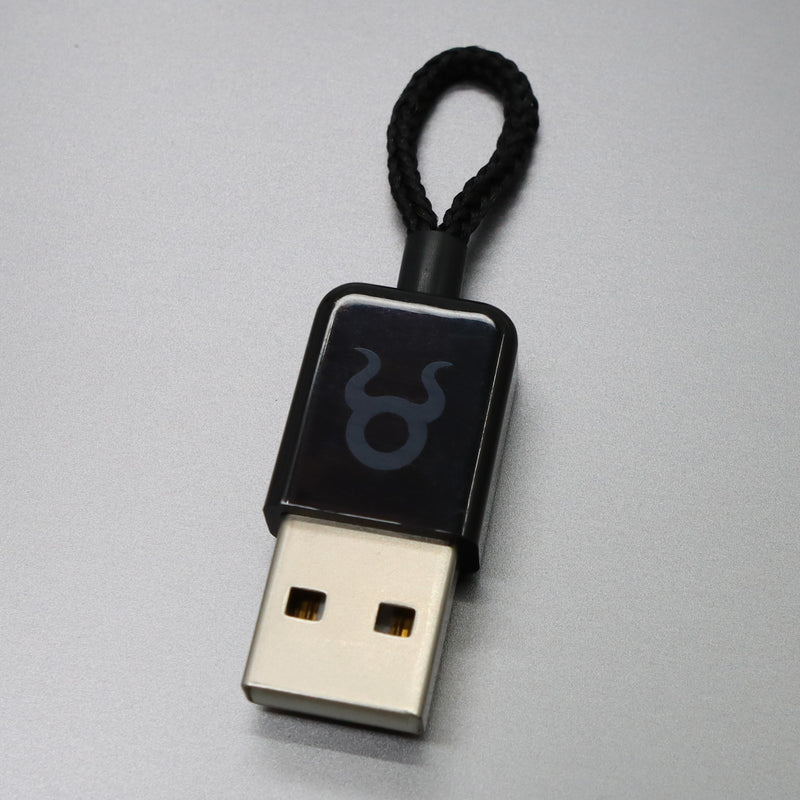 <a href="https://shop.hak5.org/collections/omg-row2/products/omg-plug?variant=40035873554545">hack</a></th>
<th>MALICIOUS CABLE DETECTOR   <a href="https://shop.hak5.org/collections/omg-row2/products/malicious-cable-detector-by-o-mg">hack</a></th>
<th>KEY CROC   <a href="https://shop.hak5.org/collections/implants/products/key-croc?variant=21284858396785">hack</a></th>
<th>USB RUBBER DUCKY   <a href="https://shop.hak5.org/collections/hotplug-attack-tools/products/usb-rubber-ducky?variant=353378649">hack</a></th>
<th>BASH BUNNY   <a href="https://shop.hak5.org/collections/hotplug-attack-tools/products/bash-bunny">hack</a></th>
</tr>

</table>
 