# IoT and AI on Edge Electronics
I was designing an IoT command center architecture with Raspberry Pi using [draw.io](https://draw.io/) (right image) at DigiLab and documented few information about existing edge devices:

Edge electronics boards: [Jetson boards](https://developer.nvidia.com/buy-jetson) ; [Raspberry Pi](https://www.raspberrypi.com/); [Arduino](https://www.arduino.cc/); [Sparkfun](https://www.sparkfun.com/); [AdaFruit](https://www.adafruit.com/categories), [seedstudio](https://www.seeedstudio.com/) and [Hailo](https://hailo.ai/) AI acceleration on edge devices.

 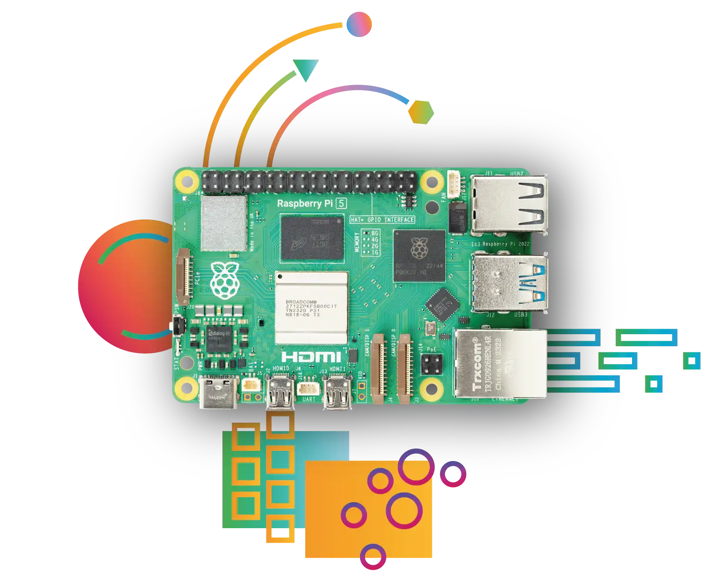 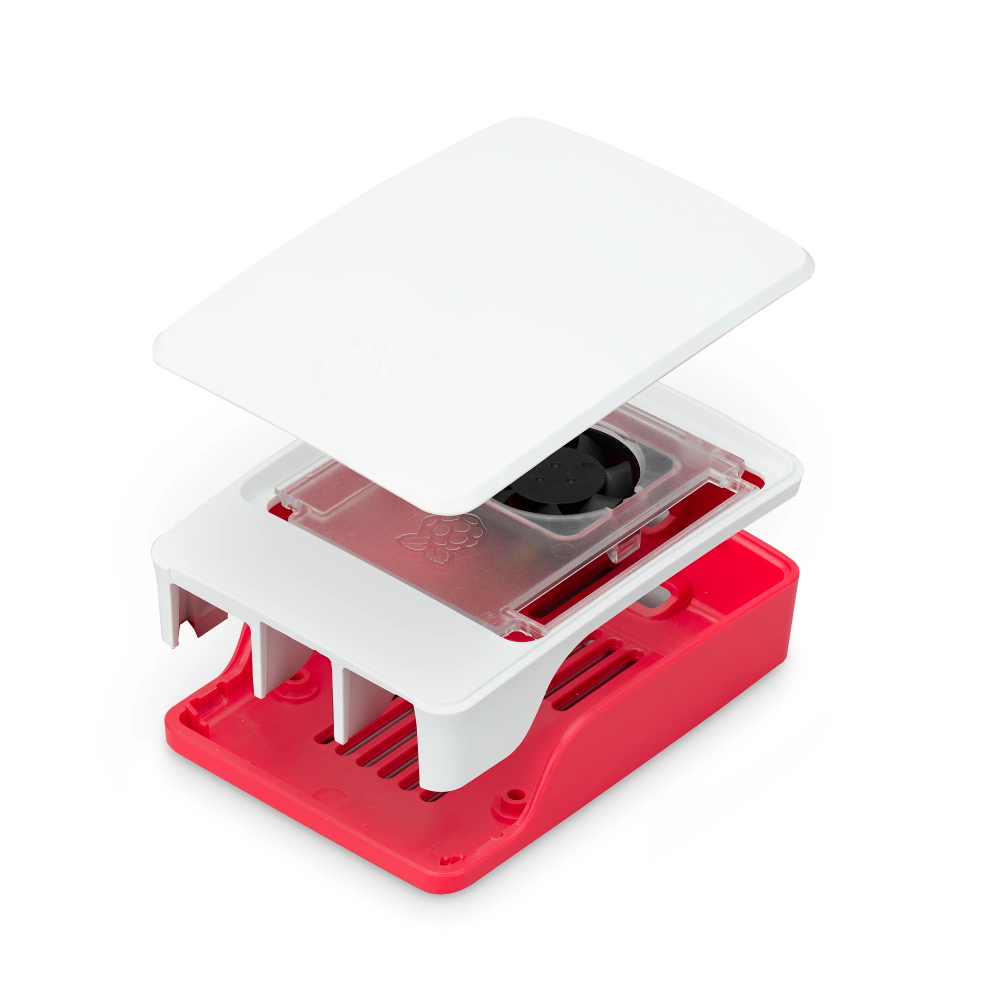

Raspberry Pi 5 : <a href="https://www.raspberrypi.com/products/raspberry-pi-5/">rp-5 board</a> | [rp-products](https://www.raspberrypi.com/products/)

<table style="width:100%" >
<tr>
<th>Jetson Orin Nano Developer Kit   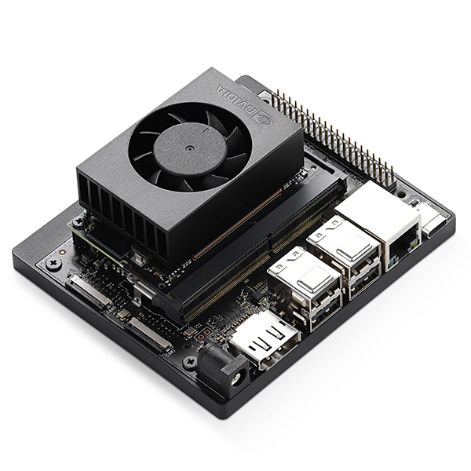 <a href="https://www.sparkfun.com/products/22098">board</a></th>
<th>Jetson Orin Nano 8GB   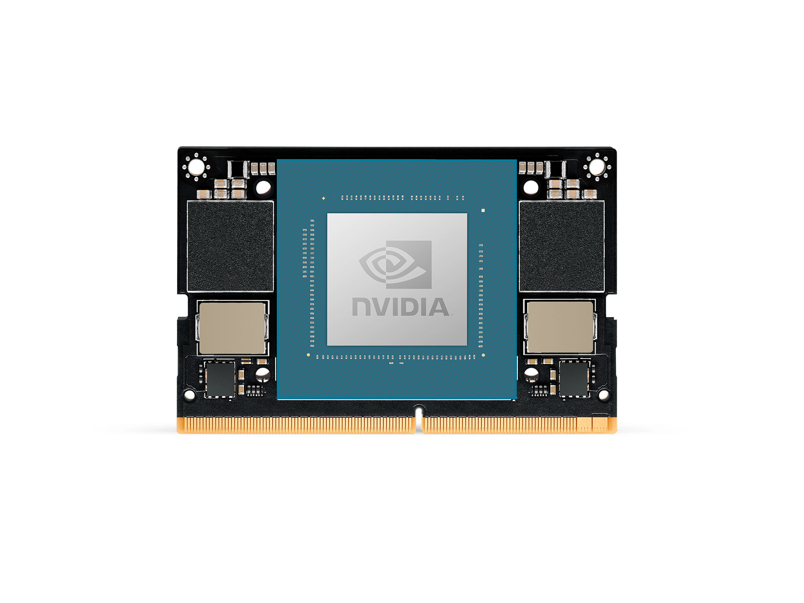 <a href="https://www.arrow.com/en/products/900-13767-0030-000/nvidia">board</a></th>
<th>Jetson Orin Nano 4GB    <a href="https://www.arrow.com/en/products/900-13767-0040-000/nvidia"> board</a></th>
<th>Jetson AGX Orin Industrial   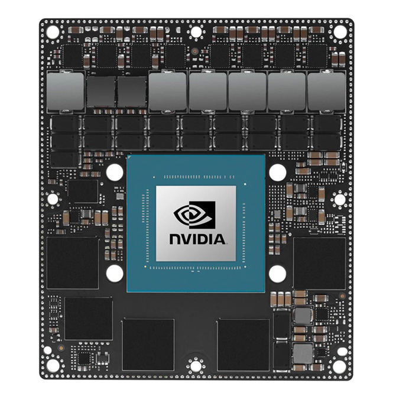 <a href="https://www.arrow.com/en/products/900-13701-0080-000/nvidia">board</a></th>
</tr>
<tr>
<th>Jetson AGX Orin 32GB    <a href="https://www.arrow.com/en/products/900-13701-0040-000/nvidia">board</a></th>
<th>Jetson AGX Orin Developer Kit    <a href="https://www.arrow.com/en/products/945-13730-0000-000/nvidia">board</a></th>
<th>Jetson AGX Xavier 64GB    <a href="https://www.arrow.com/en/products/900-82888-0050-000/nvidia"> board</a></th>
<th>Jetson AGX Xavier Industrial    <a href="https://www.arrow.com/en/products/900-82888-0080-000/nvidia">board</a></th>
</tr>
<tr>
<th>Jetson Xavier NX 16GB    <a href="https://www.arrow.com/en/products/900-83668-0030-000/nvidia">board</a></th>
<th>Jetson TX2 NX    <a href="https://www.arrow.com/en/products/900-13636-0010-000/nvidia">board</a></th>
<th>Jetson TX2i    <a href="https://www.arrow.com/en/products/900-83489-0000-000/nvidia">board</a></th>
<th>Jetson Nano Developer Kit    <a href="https://www.arrow.com/en/products/945-13450-0000-100/nvidia">board</a></th>
</tr>
<tr>
<th>Raspberry Pi 4 Model B     <a href="https://www.raspberrypi.com/products/raspberry-pi-4-model-b/">board</a> </th>
<th>Raspberry Pi Zero 2 W    <a href="https://www.raspberrypi.com/products/raspberry-pi-zero-2-w/">board</a></th>
<th>Raspberry Pi Pico    <a href="https://www.raspberrypi.com/products/raspberry-pi-pico/">board</a></th>
<th>RP 2040    <a href="https://www.raspberrypi.com/products/rp2040/">board</a></th>
</tr>

<tr>
<th>SparkFun LoRa Thing Plus    <a href="https://www.sparkfun.com/products/17506">board</a></th>
<th>SparkFun IoT RedBoard Kit - ESP32   <a href="https://www.sparkfun.com/products/20672">board</a></th>
<th>SparkFun Pro RF - LoRa, 915MHz (SAMD21)   <a href="https://www.sparkfun.com/products/15836">board</a></th>
<th>BeagleBone Black - Rev C   
 
<a href="https://www.sparkfun.com/products/12857">board</a>  ( more BeagleBone <a href="https://www.adafruit.com/category/181">boards</a> )
</th>
</tr>

<tr>
<th>Adafruit METRO 328 - ATmega328  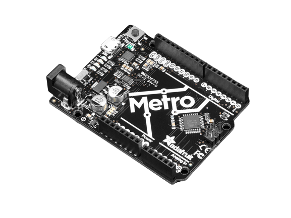 <a href="https://www.adafruit.com/product/2488">board</a></th>
<th>Microsoft Machine Learning Kit for Lobe with Raspberry Pi 4 8GB  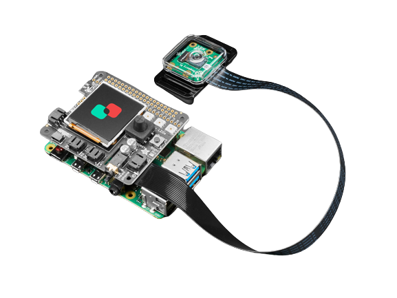 <a href="https://www.adafruit.com/product/5024">board</a></th>
<th>Google Coral Development Board  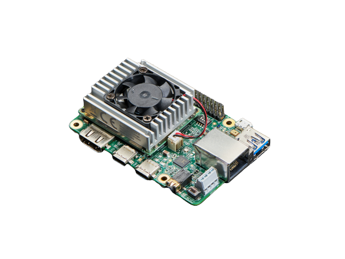 <a href="https://www.adafruit.com/product/4385">board</a></th>
<th>Adafruit EdgeBadge - TensorFlow Lite for Microcontrollers  
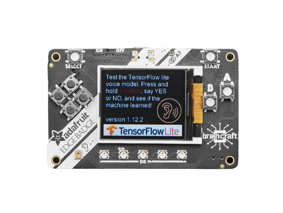 
<a href="https://www.adafruit.com/product/4400">board</a>
</th>
</tr>

</table>

[ [Bringing Generative AI to Life with NVIDIA Jetson](https://youtu.be/6mCFzDatGGc?si=kGkHHQj-JBypRmR2) ] | [ [Jetson AI Fundamentals](https://www.youtube.com/watch?v=VWdJ4BCtam8&list=PL5B692fm6--uQRRDTPsJDp4o0xbzkoyf8) ] 

Arduino boards : [ [nano-family](https://store.arduino.cc/pages/nano-family), [mkr-family](https://store.arduino.cc/collections/mkr-family) ]

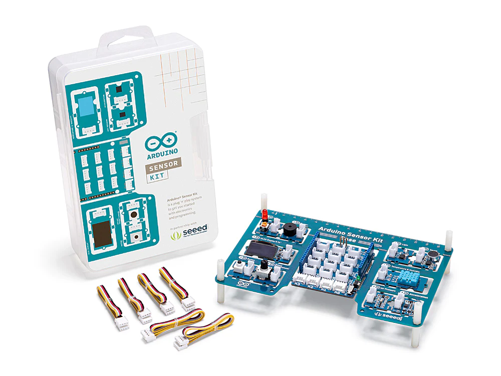 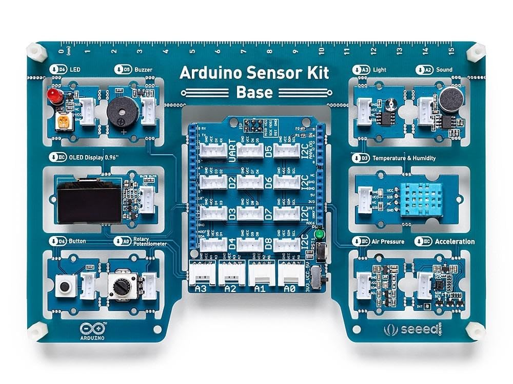 

[ [Arduino Sensor Kit - Base](https://store.arduino.cc/products/arduino-sensor-kit-base) ]

<table style="width:100%" >

<tr>
<th>Arduino® UNO R4 Minima   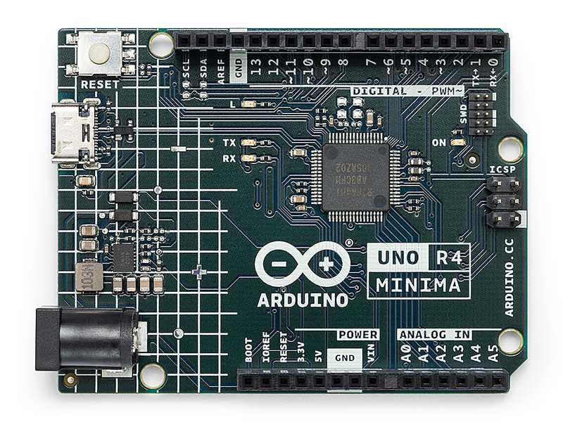 <a href="https://store.arduino.cc/products/uno-r4-minima">board</a></th>
<th>Arduino UNO R4 WiFi   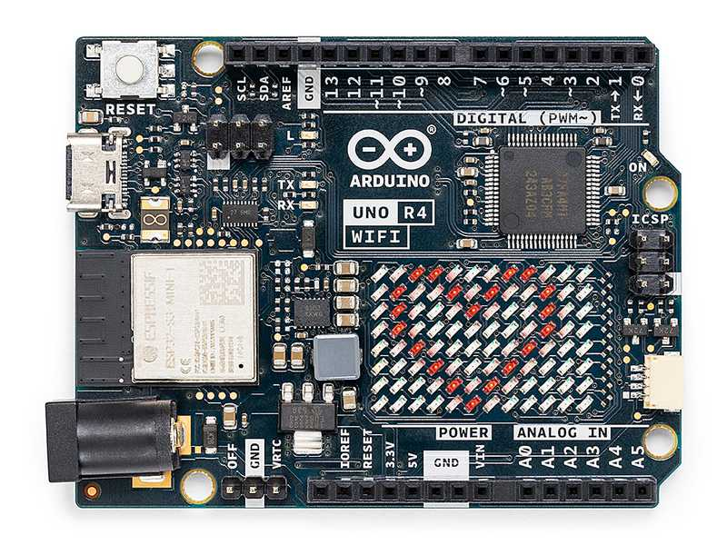 <a href="https://store.arduino.cc/products/uno-r4-wifi">board</a></th><th>Arduino UNO R3   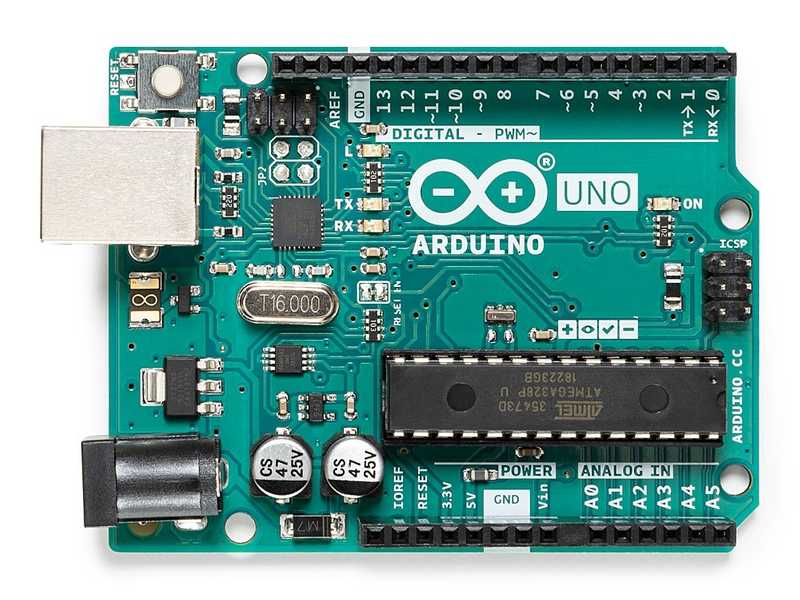 <a href="https://store.arduino.cc/products/arduino-uno-rev3">board</a></th><th>Arduino Leonardo   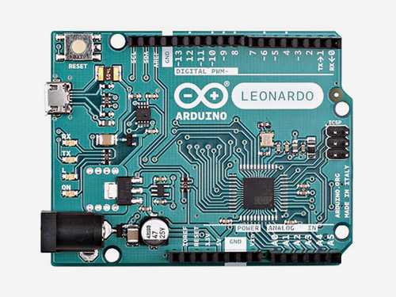 <a href="https://store.arduino.cc/products/arduino-leonardo-with-headers">board</a></th><th>Arduino UNO Mini Limited Edition   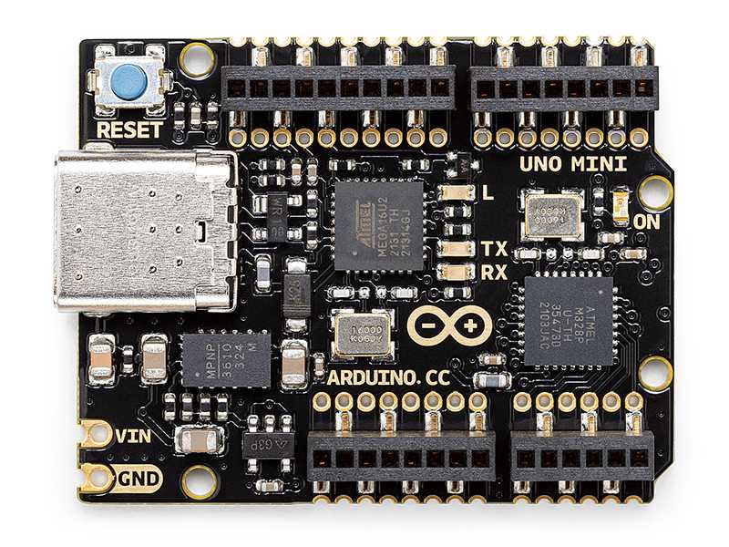 <a href="https://store.arduino.cc/products/uno-mini-le">board</a></th><th>Arduino Micro   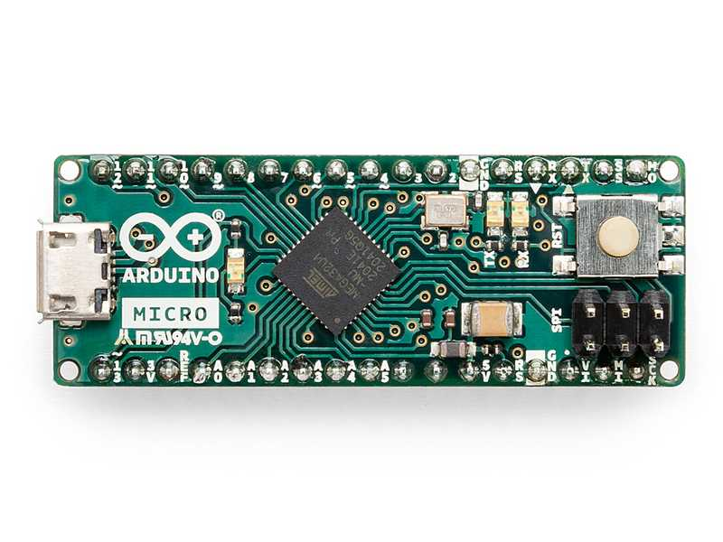 <a href="https://store.arduino.cc/products/arduino-micro">board</a></th><th>Arduino Zero   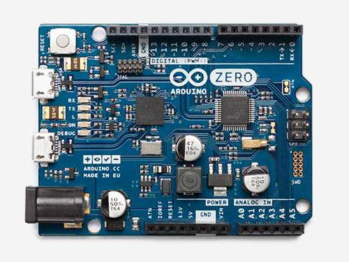 <a href="https://store.arduino.cc/products/arduino-zero">board</a></th><th>Arduino UNO WiFi Rev2   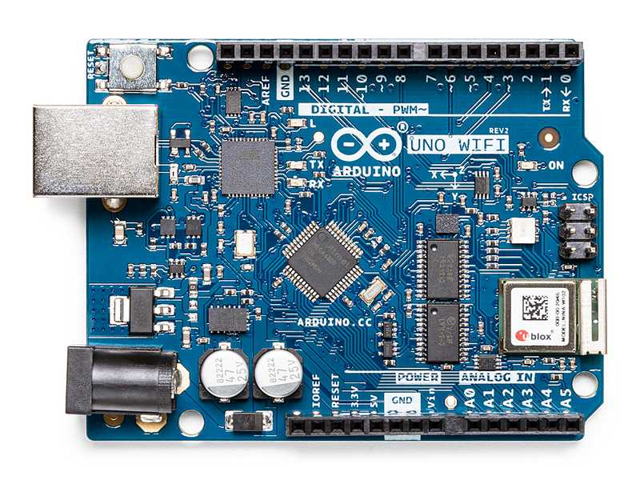 <a href="https://store.arduino.cc/products/arduino-uno-wifi-rev2">board</a></th>
</tr>

<tr>
<th>Arduino Uno - R3    <a href="https://www.sparkfun.com/products/11021">board</a></th>
<th>Arduino Nano 33 BLE    <a href="https://www.sparkfun.com/products/15588">board</a></th>
<th>Arduino Pro Mini 328 - 5V/16MHz   <a href="https://www.sparkfun.com/products/11113">board</a></th>
<th>Arduino Mega 2560 R3   <a href="https://www.sparkfun.com/products/11061">board</a></th>
<th>Arduino Due   <a href="https://www.sparkfun.com/products/11589">board</a></th>
<th>Arduino Fio   <a href="https://www.sparkfun.com/products/10116">board</a></th>

<th>Arduino 4 Relays Shield  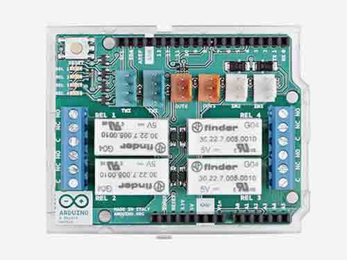 <a href="https://store.arduino.cc/products/arduino-4-relays-shield">board</a></th>

<th>Arduino GIGA Display Shield  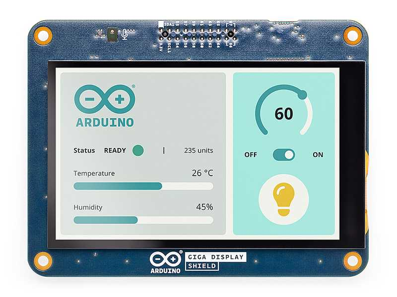 <a href="https://store.arduino.cc/products/giga-display-shield">board</a></th>
</tr>
</table>
 

also check Adafruit [feather boards](https://www.adafruit.com/category/835) and [development boards](https://www.adafruit.com/category/851).

[NVIDIA’s TensorRT SDK](https://developer.nvidia.com/tensorrt) provides a deep learning optimizer and runtime that helps you to create more efficient versions of trained models that deliver lower latency and higher throughput. Tensor-RT-based applications can perform up to 40 times faster than their CPU-based counterparts during inference.

[NVIDIA DeepStream SDK](https://developer.nvidia.com/deepstream-sdk) : Stream density defines the number of camera feeds or data streams from sensors that can be processed simultaneously.

## Google Edge TPU : [Coral](https://cloud.google.com/edge-tpu#:~:text=Edge%20TPU%20is%20Google's%20purpose,accuracy%20AI%20at%20the%20edge.) - [coral.ai](https://coral.ai/products/)

## Intel® Movidius™ Myriad™ X Vision Processing Unit : [Myriad X](https://www.intel.de/content/www/de/de/products/details/processors/movidius-vpu/movidius-myriad-x.html) and Intel® Neural Compute Stick 2 ([Intel® NCS2](https://www.intel.com/content/www/us/en/developer/articles/tool/neural-compute-stick.html))

Machine Learning libraries for edge devices : [TinyML](https://tinyml.mit.edu/), [TFlite](https://www.tensorflow.org/lite); @github/ [jomjol](https://github.com/jomjol/AI-on-the-edge-device)

<table style="width:100%" >
<tr>
<th>Particle Photon with Headers   <a href="https://www.adafruit.com/product/2721">board</a></th>
<th>Circuit Playground Express   <a href="https://www.adafruit.com/product/3333">board</a></th>
<th>Adafruit MacroPad RP2040 Starter Kit    <a href="https://www.adafruit.com/product/5128">board</a></th>
<th>i.MX 8QuadXPlus Multisensory Enablement Kit (MEK)   <a href="https://www.nxp.com/design/development-boards/i-mx-evaluation-and-development-boards/i-mx-8quadxplus-multisensory-enablement-kit-mek:MCIMX8QXP-CPU">board</a></th>
<th>Adafruit Motor/Stepper/Servo Shield for Arduino v2 Kit - v2.3   <a href="https://www.adafruit.com/product/1438">board</a></th></tr>
</table>
 

IoT Platforms : [AWS IoT Greengrass](https://aws.amazon.com/greengrass/), [The NVIDIA EGX Enterprise Platform](https://www.nvidia.com/en-us/data-center/products/egx/), [HPE Edgeline EL8000 Converged Edge System](https://buy.hpe.com/us/en/servers/edgeline-systems/edgeline-systems/edgeline-converged-edge-systems/hpe-edgeline-el8000-converged-edge-system/p/1011622898), [Particle](https://www.particle.io/), [openremote](https://openremote.io/), [Google IoT Core](https://cloud.google.com/iot-core), [IBM Watson IoT](https://www.ibm.com/cloud/internet-of-things), [Cisco IoT Cloud Connect](https://www.cisco.com/c/en/us/solutions/internet-of-things/overview.html), [IRI Voracity](https://www.iri.com/products/voracity), [Amazon AWS IoT Core](https://aws.amazon.com/iot-core/), [Microsoft Azure IoT Hub](https://azure.microsoft.com/en-us/products/iot-hub/), [sensorthings API](https://www.ogc.org/standard/sensorthings/), [10 years of embedded coding in 10 minutes](https://youtu.be/i2ypCsB93gM?si=ddLvuIlum-8ah_2O).

Resources: More exciting upcomings with [CircuitPython](https://circuitpython.org/) and google's open source hardware pdk :  [google+ skywater pdk](https://github.com/google/skywater-pdk), [pdk](https://gf.com/blog/pdks-powerful-enablers-first-pass-silicon-success/), [foss-180nm-pdk](https://github.com/google/gf180mcu-pdk).

## Systems Optimizations for Deep Learning on Accelerated Edge Devices :

Deep learning has revolutionized various fields, ranging from image recognition to natural language processing. However, deploying deep learning models on edge devices presents unique challenges due to their limited computational resources and power constraints. As the demand for intelligent edge devices continues to rise, optimizing deep learning systems for these constrained environments becomes crucial. 

With the proliferation of IoT devices and the increasing demand for intelligent edge computing, there is a growing need to deploy deep learning models on resource-constrained edge devices. These devices typically have limited computational power, memory, and energy resources compared to traditional server architectures. Thus, optimizing deep learning systems for such devices is crucial to enable efficient and real-time inference while meeting the constraints imposed by the edge environment.

Challenges of Deep Learning on Edge Devices:

+ Limited computational resources: Edge devices such as smartphones, IoT sensors, and drones often have lower computational power compared to servers.
+ Power constraints: Battery-powered devices require energy-efficient inference to prolong battery life and enable continuous operation.
+ Memory limitations: Edge devices have restricted memory capacities, limiting the size of models that can be deployed.
+ Real-time requirements: Many edge applications require real-time inference to respond quickly to input data.

Systems Optimizations Techniques:

+ Model Quantization:
    - Quantization reduces the precision of weights and activations in neural networks, thereby reducing memory footprint and computational complexity.
    - Techniques such as weight quantization, activation quantization, and mixed precision training can be employed to quantize deep learning models.
    - Quantization-aware training ensures that the quantized models maintain high accuracy by considering quantization effects during training.

+ Hardware Acceleration:
    - Hardware accelerators such as GPUs, TPUs, and FPGAs can significantly speed up inference on edge devices.
    - Optimizing deep learning frameworks to leverage these accelerators efficiently is crucial for achieving high performance.
    - Techniques such as kernel fusion, memory coalescing, and parallel execution can maximize the utilization of hardware accelerators.

+ Model Compression:
    - Model compression techniques such as pruning, knowledge distillation, and compact architecture design reduce the size of deep learning models.
    - Pruning removes redundant weights and connections from the network, leading to sparse models with fewer parameters.
    - Knowledge distillation transfers knowledge from a large, complex model (teacher) to a smaller, more compact model (student) while maintaining performance.

+ Runtime Optimization:
    - Runtime optimization techniques focus on reducing inference latency and improving energy efficiency during inference.
    - Techniques such as model caching, dynamic batching, and quantized inference optimize the execution of deep learning models at runtime.
    - Profiling tools help identify performance bottlenecks and guide optimization efforts to achieve better efficiency.

+ Neural Architecture Search (NAS):
    - Automated search for efficient network architectures.
    - Targeting edge-specific constraints during NAS.

+ Federated Learning:
    - Decentralized model training across edge devices.
    - Privacy-preserving and bandwidth-efficient learning.

Implementation Examples:

+ EfficientNet [[paper](https://arxiv.org/abs/1905.11946)]: A scalable model architecture optimized for edge devices.
+ TensorFlow Lite [[paper](https://www.tensorflow.org/lite)]: Tools and techniques for deploying TensorFlow models on mobile and edge devices.
+ EdgeTPU: Google's purpose-built ASIC for accelerating TensorFlow Lite models.
+ OpenVINO [[intel openvino](https://github.com/openvinotoolkit/openvino)]: Intel's toolkit for optimizing and deploying deep learning models on edge devices.

TOPIC : [ Distributed Machine Learning : Systems, Platforms and Algorithms ] ; GOAL : [ Understanding the interference between different concurrent workloads, performance and energy modelling, intelligently scheduling concurrent training/inference workloads to better utilize heterogenous hardware, virtualization/containerization of edge devices, etc.] ; DEVICE : [ Nvidia Jetson Orin edge device, with 12 ARM Cortex CPU cores, an Ampere GPU with 2048 CUDA cores and 64 tensor cores, and 64GB of RAM shared between CPU and GPU. It delivers 275 TOPS of performance, comparable to an RTX 3060 Ti GPU workstation. ] ; PAPERS : [ [P1](https://dl.acm.org/doi/10.1145/3570604), [P2](https://ieeexplore.ieee.org/document/9835369), [P3](https://ieeexplore.ieee.org/document/10181196) ]

Resources : [Efficient Acceleration of Deep Learning Inference on Resource-Constrained Edge Devices: A Review](https://ieeexplore.ieee.org/document/9985008), [A Survey on Optimization Techniques for Edge Artificial Intelligence (AI)](https://www.mdpi.com/1424-8220/23/3/1279), [Hardware-Aware Optimizations for Deep Learning Inference on Edge Devices](https://www.doc.ic.ac.uk/~wl/papers/22/arc22mr.pdf), [Chapter Eight - Energy-efficient deep learning inference on edge devices](https://www.sciencedirect.com/science/article/abs/pii/S0065245820300553), [How To Optimize Computer Vision Models For Edge Devices](https://medium.com/picsellia/how-to-optimize-computer-vision-models-for-edge-devices-851b20f7cf03), [Reaching for the Sky: Maximizing Deep Learning Inference Throughput on Edge Devices with AI Multi-Tenancy](https://dl.acm.org/doi/10.1145/3546192), [Deep Learning With Edge Computing: A Review](https://www.cs.ucr.edu/~jiasi/pub/deep_edge_review.pdf), [Introduction to Deep Learning for Edge Devices Session 5: Hardware at the Edge](https://youtu.be/E3sbK1-oxh4?si=ZN4Ro-c7FK2wDehv), [Build Machine Learning Models on Edge Devices](https://youtu.be/iHz1no68r0c?si=KgjCrNSW1rORNsf9).