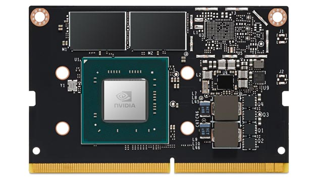
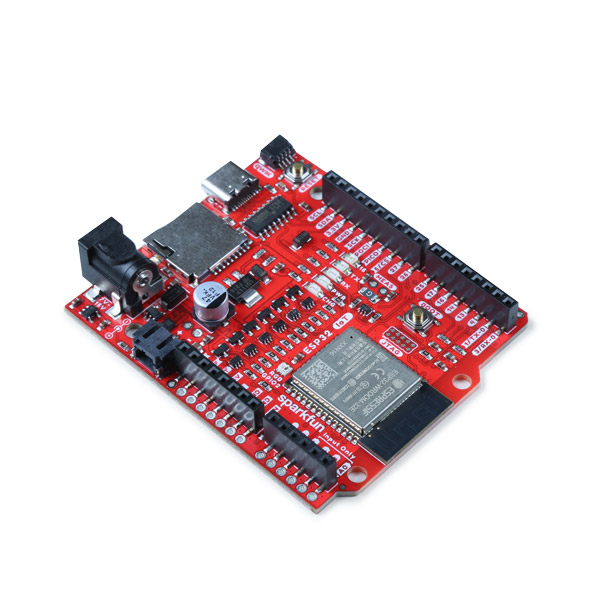
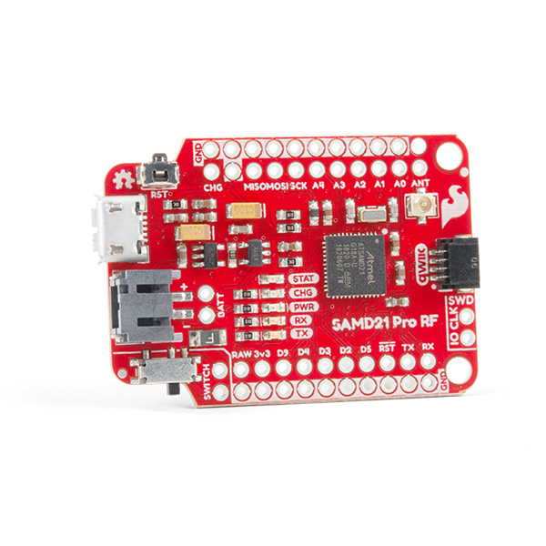

# IoT and AI on Edge Electronics

Edge electronics boards: [Jetson boards](https://developer.nvidia.com/buy-jetson) ; [Sparkfun](https://www.sparkfun.com/); [AdaFruit](https://www.adafruit.com/categories)

<table style="width:100%" >
<tr>
<th>Jetson AGX Orin 32GB    <a href="https://www.arrow.com/en/products/900-13701-0040-000/nvidia">board</a></th>
<th>Jetson AGX Orin Developer Kit    <a href="https://www.arrow.com/en/products/945-13730-0000-000/nvidia">board</a></th>
<th>Jetson AGX Xavier 64GB    <a href="https://www.arrow.com/en/products/900-82888-0050-000/nvidia"> board</a></th>
<th>Jetson AGX Xavier Industrial    <a href="https://www.arrow.com/en/products/900-82888-0080-000/nvidia">board</a></th>
</tr>
<tr>
<th>Jetson Xavier NX 16GB    <a href="https://www.arrow.com/en/products/900-83668-0030-000/nvidia">board</a></th>
<th>Jetson TX2 NX    <a href="https://www.arrow.com/en/products/900-13636-0010-000/nvidia">board</a></th>
<th>Jetson TX2i    <a href="https://www.arrow.com/en/products/900-83489-0000-000/nvidia">board</a></th>
<th>Jetson Nano Developer Kit    <a href="https://www.arrow.com/en/products/945-13450-0000-100/nvidia">board</a></th>
</tr>
<tr>
<th>Raspberry Pi 4 Model B    <a href="https://www.raspberrypi.com/products/raspberry-pi-4-model-b/">board</a></th>
<th>Raspberry Pi Zero 2 W    <a href="https://www.raspberrypi.com/products/raspberry-pi-zero-2-w/">board</a></th>
<th>Raspberry Pi Pico    <a href="https://www.raspberrypi.com/products/raspberry-pi-pico/">board</a></th>
<th>RP 2040    <a href="https://www.raspberrypi.com/products/rp2040/">board</a></th>
</tr>

<tr>
<th>SparkFun LoRa Thing Plus    <a href="https://www.sparkfun.com/products/17506">board</a></th>
<th>SparkFun IoT RedBoard Kit - ESP32   <a href="https://www.sparkfun.com/products/20672">board</a></th>
<th>SparkFun Pro RF - LoRa, 915MHz (SAMD21)   <a href="https://www.sparkfun.com/products/15836">board</a></th>
<th>BeagleBone Black - Rev C    <a href="https://www.sparkfun.com/products/12857">board</a></th>
</tr>
</table>
 