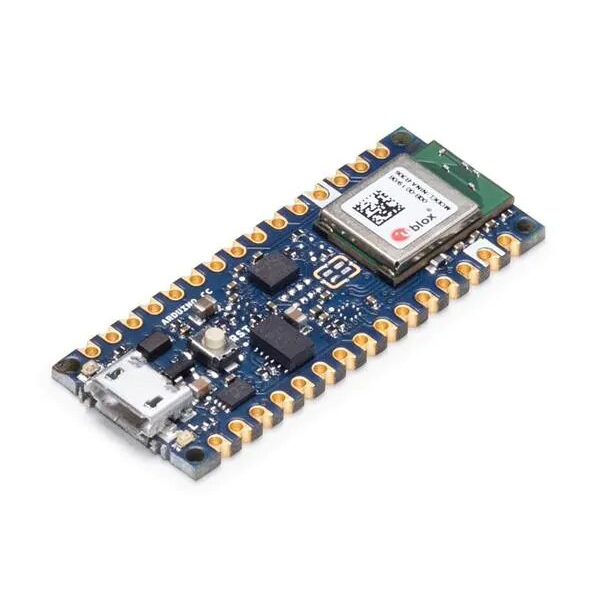

# IoT and AI on Edge Electronics
I was designing an IoT command center architecture using [draw.io](https://draw.io/) with Raspberry Pi (right image) and documenting here about existing edge devices I came across:

Edge electronics boards: [Jetson boards](https://developer.nvidia.com/buy-jetson) ; [Raspberry Pi](https://www.raspberrypi.com/); [Arduino](https://www.arduino.cc/); [Sparkfun](https://www.sparkfun.com/); [AdaFruit](https://www.adafruit.com/categories), [seedstudio](https://www.seeedstudio.com/) and [Hailo](https://hailo.ai/) AI acceleration on edge devices.

<table style="width:100%" >
<tr>
<th>Jetson AGX Orin 32GB    <a href="https://www.arrow.com/en/products/900-13701-0040-000/nvidia">board</a></th>
<th>Jetson AGX Orin Developer Kit    <a href="https://www.arrow.com/en/products/945-13730-0000-000/nvidia">board</a></th>
<th>Jetson AGX Xavier 64GB    <a href="https://www.arrow.com/en/products/900-82888-0050-000/nvidia"> board</a></th>
<th>Jetson AGX Xavier Industrial    <a href="https://www.arrow.com/en/products/900-82888-0080-000/nvidia">board</a></th>
</tr>
<tr>
<th>Jetson Xavier NX 16GB    <a href="https://www.arrow.com/en/products/900-83668-0030-000/nvidia">board</a></th>
<th>Jetson TX2 NX    <a href="https://www.arrow.com/en/products/900-13636-0010-000/nvidia">board</a></th>
<th>Jetson TX2i    <a href="https://www.arrow.com/en/products/900-83489-0000-000/nvidia">board</a></th>
<th>Jetson Nano Developer Kit    <a href="https://www.arrow.com/en/products/945-13450-0000-100/nvidia">board</a></th>
</tr>
<tr>
<th>Raspberry Pi 4 Model B    <a href="https://www.raspberrypi.com/products/raspberry-pi-4-model-b/">board</a></th>
<th>Raspberry Pi Zero 2 W    <a href="https://www.raspberrypi.com/products/raspberry-pi-zero-2-w/">board</a></th>
<th>Raspberry Pi Pico    <a href="https://www.raspberrypi.com/products/raspberry-pi-pico/">board</a></th>
<th>RP 2040    <a href="https://www.raspberrypi.com/products/rp2040/">board</a></th>
</tr>

<tr>
<th>SparkFun LoRa Thing Plus    <a href="https://www.sparkfun.com/products/17506">board</a></th>
<th>SparkFun IoT RedBoard Kit - ESP32   <a href="https://www.sparkfun.com/products/20672">board</a></th>
<th>SparkFun Pro RF - LoRa, 915MHz (SAMD21)   <a href="https://www.sparkfun.com/products/15836">board</a></th>
<th>BeagleBone Black - Rev C   
 
<a href="https://www.sparkfun.com/products/12857">board</a>  ( more BeagleBone <a href="https://www.adafruit.com/category/181">boards</a> )
</th>
</tr>

<tr>
<th>Adafruit METRO 328 - ATmega328   <a href="https://www.adafruit.com/product/2488">board</a></th>
<th>Microsoft Machine Learning Kit for Lobe with Raspberry Pi 4 8GB   <a href="https://www.adafruit.com/product/5024">board</a></th>
<th>Google Coral Development Board   <a href="https://www.adafruit.com/product/4385">board</a></th>
<th>Adafruit EdgeBadge - TensorFlow Lite for Microcontrollers  
 
<a href="https://www.adafruit.com/product/4400">board</a>
</th>
</tr>

</table>

Arduino boards : 

<table style="width:100%" >
<tr>
<th>Arduino Uno - R3    <a href="https://www.sparkfun.com/products/11021">board</a></th>
<th>Arduino Nano 33 BLE    <a href="https://www.sparkfun.com/products/15588">board</a></th>
<th>Arduino Pro Mini 328 - 5V/16MHz   <a href="https://www.sparkfun.com/products/11113">board</a></th>
<th>Arduino Mega 2560 R3   <a href="https://www.sparkfun.com/products/11061">board</a></th>
<th>Arduino Due   <a href="https://www.sparkfun.com/products/11589">board</a></th>
<th>Arduino Fio   <a href="https://www.sparkfun.com/products/10116">board</a></th>
</tr>
</table>
 

also check Adafruit [feather boards](https://www.adafruit.com/category/835) and [development boards](https://www.adafruit.com/category/851).

[NVIDIA’s TensorRT SDK](https://developer.nvidia.com/tensorrt) provides a deep learning optimizer and runtime that helps you to create more efficient versions of trained models that deliver lower latency and higher throughput. Tensor-RT-based applications can perform up to 40 times faster than their CPU-based counterparts during inference.

[NVIDIA DeepStream SDK](https://developer.nvidia.com/deepstream-sdk) : Stream density defines the number of camera feeds or data streams from sensors that can be processed simultaneously.

## Google Edge TPU : [Coral](https://cloud.google.com/edge-tpu#:~:text=Edge%20TPU%20is%20Google's%20purpose,accuracy%20AI%20at%20the%20edge.) - [coral.ai](https://coral.ai/products/)

## Intel® Movidius™ Myriad™ X Vision Processing Unit : [Myriad X](https://www.intel.de/content/www/de/de/products/details/processors/movidius-vpu/movidius-myriad-x.html) and Intel® Neural Compute Stick 2 ([Intel® NCS2](https://www.intel.com/content/www/us/en/developer/articles/tool/neural-compute-stick.html))

Machine Learning libraries for edge devices : [TinyML](https://tinyml.mit.edu/), [TFlite](https://www.tensorflow.org/lite); @github/ [jomjol](https://github.com/jomjol/AI-on-the-edge-device)

<table style="width:100%" >
<tr>
<th>Particle Photon with Headers   <a href="https://www.adafruit.com/product/2721">board</a></th>
<th>Circuit Playground Express   <a href="https://www.adafruit.com/product/3333">board</a></th>
<th>Adafruit MacroPad RP2040 Starter Kit - 3x4 Keys + Encoder + OLED - ADABOX019 Essentials   <a href="https://www.adafruit.com/product/5128">board</a></th>
<th>i.MX 8QuadXPlus Multisensory Enablement Kit (MEK)   <a href="https://www.nxp.com/design/development-boards/i-mx-evaluation-and-development-boards/i-mx-8quadxplus-multisensory-enablement-kit-mek:MCIMX8QXP-CPU">board</a></th>
<th>Adafruit Motor/Stepper/Servo Shield for Arduino v2 Kit - v2.3   <a href="https://www.adafruit.com/product/1438">board</a></th></tr>
</table>
 

IoT Platforms : [AWS IoT Greengrass](https://aws.amazon.com/greengrass/), [The NVIDIA EGX Enterprise Platform](https://www.nvidia.com/en-us/data-center/products/egx/), [HPE Edgeline EL8000 Converged Edge System](https://buy.hpe.com/us/en/servers/edgeline-systems/edgeline-systems/edgeline-converged-edge-systems/hpe-edgeline-el8000-converged-edge-system/p/1011622898), [Particle](https://www.particle.io/), [openremote](https://openremote.io/), [Google IoT Core](https://cloud.google.com/iot-core), [IBM Watson IoT](https://www.ibm.com/cloud/internet-of-things), [Cisco IoT Cloud Connect](https://www.cisco.com/c/en/us/solutions/internet-of-things/overview.html), [IRI Voracity](https://www.iri.com/products/voracity), [Amazon AWS IoT Core](https://aws.amazon.com/iot-core/), [Microsoft Azure IoT Hub](https://azure.microsoft.com/en-us/products/iot-hub/).

More exciting upcomings with [CircuitPython](https://circuitpython.org/) and google's open source hardware pdk :  [google+ skywater pdk](https://github.com/google/skywater-pdk), [pdk](https://gf.com/blog/pdks-powerful-enablers-first-pass-silicon-success/), [foss-180nm-pdk](https://github.com/google/gf180mcu-pdk).