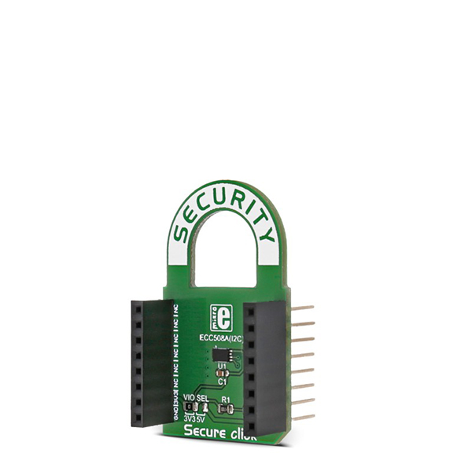
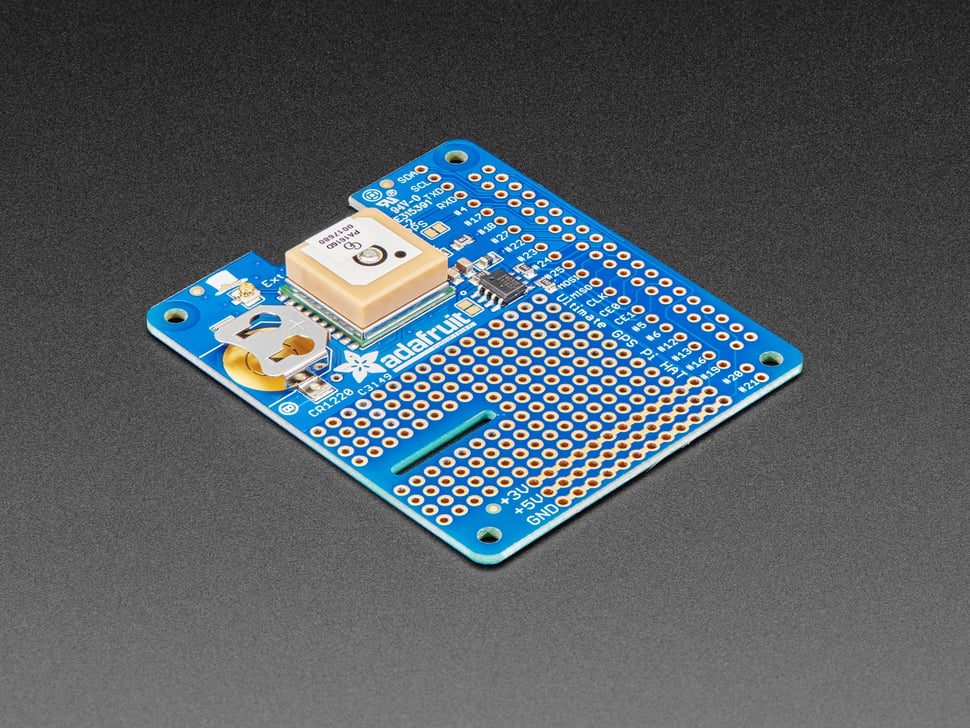
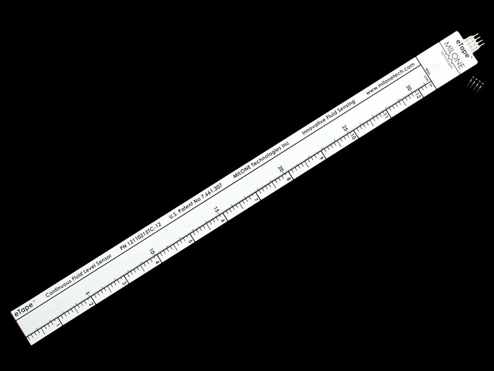
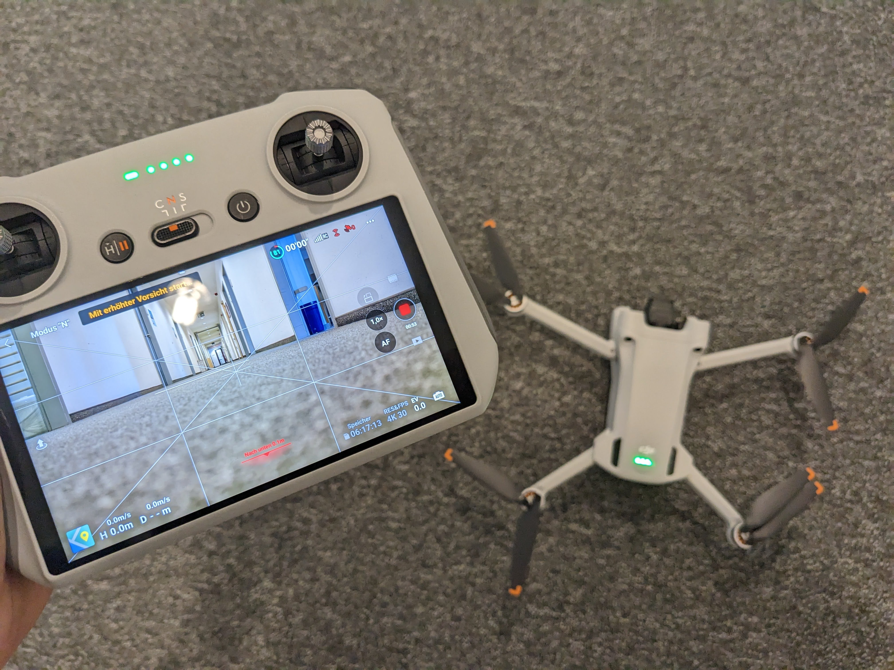
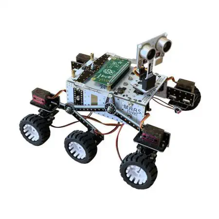
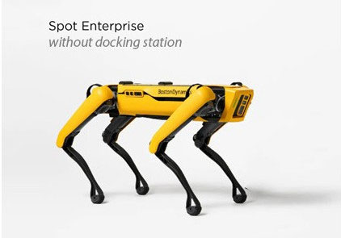

# Robotics Hardware 📡

Robotics hardware and sensors are the fundamental building blocks of autonomous and semi-autonomous robotic systems. These components allow robots to perceive and interact with their environment, making decisions and taking actions based on sensory input. 

Sensors are essential components in robotics that enable machines to perceive and interact with the world around them. Different types of sensors are employed to gather information about the environment, allowing robots to make informed decisions and perform tasks autonomously. Below are various categories of robotics sensors, each serving specific purposes:

<table width=100%>
<tr>
<th>Vision Sensors 👁</th>
<th>Proximity and Contact Sensors ☄</th>
</tr>

<tr>
<td>

####  Cameras

+ Principle: Cameras capture images or video using visible light or other spectra (e.g., infrared or thermal). They rely on sensors like charge-coupled devices (CCD) or complementary metal-oxide-semiconductor (CMOS) to convert light into electrical signals.

+ Applications: Cameras are used for tasks such as object recognition, navigation, facial recognition, surveillance, and visual inspection in manufacturing.

#### Depth Sensors

+ Principle: Depth sensors measure the distance to objects in the robot's environment. Common technologies include time-of-flight, structured light, and stereo vision.

+ Applications: Depth sensors enable 3D mapping, obstacle avoidance, and robot navigation in unknown environments.

</td>

<td>

#### Ultrasonic Sensors

+ Principle: Ultrasonic sensors emit sound waves and measure the time it takes for them to bounce back after hitting an object. The time delay is used to calculate the distance to the object.

+ Applications: Ultrasonic sensors are commonly used for obstacle detection, parking assistance, and robotics applications requiring proximity sensing.

#### Infrared Sensors

+ Principle: Infrared sensors detect infrared radiation, which is emitted by warm objects. They measure the intensity of infrared radiation to determine proximity.

+ Applications: Infrared sensors are used for proximity sensing in applications like line-following robots, home automation, and object detection.

#### Bump Sensors

+ Principle: Bump sensors detect physical contact with objects or surfaces. They can be simple mechanical switches or more advanced capacitive or piezoelectric sensors.

+ Applications: Bump sensors are crucial for robot safety systems, preventing collisions and providing feedback on contact events.

</td>

</tr>

<tr>
<th>Environmental Sensors 🌤️</th>
<th>Inertial Sensors</th>
</tr>

<tr>
<td>

####  LIDAR (Light Detection and Ranging)
+ Principle: LIDAR sensors emit laser pulses and measure the time it takes for the pulses to return after hitting objects. This data is used to create detailed 3D maps of the environment.

+ Applications: LIDAR is essential for navigation in autonomous vehicles, drones, and robotics applications requiring precise mapping and obstacle detection.

#### GPS (Global Positioning System)
+ Principle: GPS sensors receive signals from multiple satellites to determine the robot's position and velocity on the Earth's surface.

+ Applications: GPS is used for outdoor navigation and localization, especially in applications like precision agriculture and autonomous vehicles.

</td>
<td>

#### Accelerometers
+ Principle: Accelerometers measure acceleration forces acting on the sensor. They are used to detect changes in velocity and orientation.

+ Applications: Accelerometers are vital for tasks like balancing in humanoid robots, detecting falls, and stabilizing flight in drones.

#### Gyroscopes
+ Principle: Gyroscopes measure angular velocity, providing information about the rate of rotation or orientation changes.

+ Applications: Gyroscopes are crucial for orientation and stabilization in robots and drones.

#### 1 Inertial measurement unit (IMU) : The IMU is a sensor that measures triaxial acceleration and triaxial angular velocity. The IMU consists of an accelerometer, which can output linear acceleration signals on three axes in space, and a gyroscope, which can output angular velocity signals on three axes in space.

</td>
</tr>

<tr>
<th>Force and Tactile Sensors ⚙️</th>
<th>Environmental Sensors 🌡️</th>
</tr>

<tr>
<td>

####  Force Sensors
+ Principle: Force sensors measure the force applied to a surface or an object. They can be strain gauges, load cells, or piezoelectric sensors.

+ Applications: Force sensors are used for tasks like grasping, manipulation, and haptic feedback in robots.

####  Tactile Sensors
+ Principle: Tactile sensors detect contact and pressure on a surface. They can be capacitive, resistive, or piezoelectric sensors.

+ Applications: Tactile sensors are essential for touch-sensitive robots, object recognition, and applications requiring delicate interactions with the environment.

</td>
<td>

####  Temperature Sensors
+ Principle: Temperature sensors measure the ambient temperature in their vicinity.

+ Applications: Temperature sensors are used in robotics for environmental monitoring, HVAC control, and applications operating in extreme conditions.

####  Humidity Sensors
+ Principle: Humidity sensors monitor moisture levels in the surrounding environment.

+ Applications: Humidity sensors are used in applications such as climate control, agriculture, and environmental monitoring.

</td>
</tr>

</table>

### Sensors

Let's take a look at what we can buy from the market to get started with Robotics projects:

<table style="width:100%" >
<tr>
<th>SparkFun Artemis Global Tracker (Satellite)   <a href="https://www.sparkfun.com/products/18712">sensor</a></th>
<th>bladeRF x40 (Radio)   <a href="https://www.adafruit.com/product/3333">sensor</a></th>
<th>SparkFun RTK Express Plus (GNSS)   <a href="https://www.sparkfun.com/products/18590">sensor</a></th>
<th>LoRa, 915MHz (SAMD21) (LoRa)   <a href="https://www.sparkfun.com/products/15836">sensor</a></th>
</tr>

<tr>
<th>Fingerprint Scanner - TTL (GT-521F52) (Fingerprint)   <a href="https://www.sparkfun.com/products/14585">sensor</a></th>
<th>PureThermal Mini Pro JST-SR (with FLIR Lepton 3.5) (IR)   <a href="https://www.adafruit.com/product/3333">sensor</a></th>
<th>Qwiic Haptic Driver Kit - DA7280 (Haptic)   <a href="https://www.sparkfun.com/products/18247">sensor</a></th>
<th>MyoWare Muscle Sensor (Muscle)   <a href="https://www.adafruit.com/product/2699">sensor</a></th>
</tr>

<tr>
<th>Pulse Sensor Amped (Pulse)   <a href="https://www.adafruit.com/product/1093">sensor</a></th>
<th>Fingerprint sensor (Fingerprint)   <a href="https://www.adafruit.com/product/751">sensor</a></th>
<th>Muscle Sensor Surface EMG Electrodes - H124SG Covidien (EKG)   <a href="https://www.adafruit.com/product/2773">sensor</a></th>
<th>SparkFun micro:climate kit for micro:bit - v3.0 (weather)   <a href="https://www.sparkfun.com/products/16274">sensor</a></th>
</tr>

<tr>
<th>Nicla Sense ME (IMU)   <a href="https://www.sparkfun.com/products/19727">sensor</a></th>
<th>MIKROE Secure Click (Lock)   <a href="https://www.sparkfun.com/products/18848">sensor</a></th>
<th>LIDAR-Lite v3 (LIDAR)   <a href="https://www.sparkfun.com/products/14032">sensor</a></th>
<th>Mini Photocell (Light)   <a href="https://www.sparkfun.com/products/9088">sensor</a></th>
</tr>

<tr>
<th>Pixhawk 6C with PM07 Power Module and M8N GPS (Flight Controller)   <a href="#">sensor</a></th>
<th>Raspberry Pi HQ Camera Module (RGB camera)   <a href="https://www.sparkfun.com/products/16760">sensor</a></th>
<th>Luxonis Oak-D DepthAI Hardware (RGB-D camera)   <a href="https://www.sparkfun.com/products/17770">sensor</a></th>
<th>Piezoelectric Ribbon Sensor (Piezoelectric))   <a href="https://www.adafruit.com/product/4931">sensor</a></th>
</tr>

<tr>
<th>Adafruit I2C Stemma QT Rotary Encoder Breakout with NeoPixel - STEMMA QT / Qwiic (Rotor)   <a href="https://www.adafruit.com/product/4991">sensor</a></th>
<th>Adafruit 9-DOF Absolute Orientation IMU Fusion Breakout - BNO055 (IMU)   <a href="https://www.adafruit.com/product/2472">sensor</a></th>
<th>Square Force-Sensitive Resistor (FSR) - Alpha MF02A-N-221-A01 (FSR)   <a href="https://www.adafruit.com/product/1075">sensor</a></th>
<th>Magnetic contact switch (door sensor)   <a href="https://www.adafruit.com/product/375">sensor</a></th>
</tr>

<tr>
<th>PIR (motion) sensor   <a href="https://www.adafruit.com/product/189">sensor</a></th>
<th>Leap Motion Controller with SDK   <a href="https://www.adafruit.com/product/2106">sensor</a></th>
<th>Adafruit STEMMA Soil Sensor - I2C Capacitive Moisture Sensor - JST PH 2mm   <a href="https://www.adafruit.com/product/4026">sensor</a></th>
<th>Monk Makes Plant Monitor - Capacitive Moisture Meter - Temperature & Relative Humidity   <a href="https://www.adafruit.com/product/5587">sensor</a></th>
</tr>

<tr>
<th>Adafruit LTR390 UV Light Sensor - STEMMA QT / Qwiic   <a href="https://www.adafruit.com/product/4831">sensor</a></th>
<th>Simple Water Detection Sensor with Digital Output   <a href="#">sensor</a></th>
<th>Adafruit MLX90640 24x32 IR Thermal Camera Breakout - 110 Degree FoV   <a href="https://www.adafruit.com/product/4469">sensor</a></th>
<th>Adafruit ANO Rotary Navigation Encoder Breakout PCB   <a href="https://www.adafruit.com/product/5221">sensor</a></th>
</tr>

<tr>
<th>Barcode Reader/Scanner Module - CCD Camera - USB Interface   <a href="https://www.adafruit.com/product/1203">sensor</a></th>
<th>Flora Wearable Ultimate GPS Module   <a href="https://www.adafruit.com/product/1059">sensor</a></th>
<th>Adafruit Ultimate GPS HAT for Raspberry Pi A+/B+/Pi 2/3/Pi 4 - Mini Kit   <a href="https://www.adafruit.com/product/2324">sensor</a></th>
<th>ADXL375 - High G Accelerometer (+-200g) with I2C and SPI - STEMMA QT / Qwiic   <a href="https://www.adafruit.com/product/5374">sensor</a></th>
</tr>

<tr>
<th>M5StickV AI Camera - Kendryte K210 Chipset (no Wi-Fi)   <a href="https://www.adafruit.com/product/4321">sensor</a></th>
<th>Pixy2 CMUcam5 Sensor   <a href="https://www.adafruit.com/product/1906">sensor</a></th>
<th>12" eTape Liquid Level Sensor + extras   <a href="https://www.adafruit.com/product/464">sensor</a></th>
<th>Thermal Receipt Printer Guts   <a href="https://www.adafruit.com/product/2753">sensor</a></th>
</tr>

<tr>
<th>Thermal Camera Imager for Fever Screening - UTi165H   <a href="https://www.adafruit.com/product/4578">sensor</a></th>
<th>Garmin LIDAR-Lite Optical Distance Sensor - V3   <a href="https://www.adafruit.com/product/4058">sensor</a></th>
<th>Ultraleap 3Di Stereo Hand Tracking Camera   <a href="https://www.adafruit.com/product/5571">sensor</a></th>
<th>Adafruit Proximity Trinkey - USB APDS9960 Sensor Dev Board   <a href="https://www.adafruit.com/product/5022">sensor</a></th>
</tr>

<tr>
<th>Adafruit PyPortal Titano   <a href="https://www.adafruit.com/product/4444">sensor</a></th>
<th>Pimoroni Enviro – Indoor Environmental Monitor for RaspPi - PIM486   <a href="https://www.adafruit.com/product/4455">sensor</a></th>
<th>Ultrasonic Distance Sensor - 3V or 5V - HC-SR04 compatible - RCWL-1601   <a href="https://www.adafruit.com/product/4007">sensor</a></th>
<th>Adafruit MS8607 Pressure Humidity Temperature PHT Sensor - STEMMA QT / Qwiic   <a href="https://www.adafruit.com/product/4716">sensor</a></th>
</tr>
</table>
 

also checkout Ada Fruit's [sensor page](https://www.adafruit.com/category/35) for myriads of other cool sensors, amplifiers and breakout boards.

### Programmable Drones

<table style="width:100%" >
<tr>
<th>DJI Matrice 300 RTK   <a href="https://www.dji.com/de/matrice-300">drone</a></th>
<th>Parrot Anafi   <a href="https://www.parrot.com/en/drones/anafi">drone</a></th>
<th>Air:bit 2   <a href="https://www.robotshop.com/products/airbit-2-programmable-drone-kit-w-2x-microbit">drone </a> </th>
<th>Tello Quadcopter   <a href="https://www.ryzerobotics.com/de/tello-edu">drone</a></th>

<td><b>Bitcraze Crazyflie 2.1</b>   <a href="https://www.bitcraze.io/products/crazyflie-2-1/">drone</a>(open source)</td>
</tr>
</table>
 

This year I did some CV Tello experiments - [[video](https://youtu.be/GytbWIVu4dU)] and learned a bit about drone repair as well : Mavic Mini Pro 3, along with some AR/ Digital Twin experiments. More intermediate handware list @[github](https://github.com/mjyc/awesome-robotics-projects).

 

 

### Robotic kits with API

<table style="width:100%" >
<tr>
<th>4tronix M.A.R.S. Rover Robot Kit for Raspberry Pi Zero   <a href="https://www.elektor.com/4tronix-mars-rover-robot-kit-for-raspberry-pi-zero">kit</a></th>
<th>Hiwonder uHandPi Raspberry Pi Robotic Hand   <a href="https://hiwonder.hk/products/hiwonder-uhandpi-raspberry-pi-robotic-hand-ai-vision-recognition-and-tracking-python-programming?variant=39672207048791">kit</a></th>
<th>TonyPi Pro Hiwonder Humanoid Robot    <a href="https://hiwonder.hk/products/tonypi-pro-hiwonder-humanoid-robot-professional-development-kit-powered-by-raspberry-pi-4b-4gb">kit</a></th>
<th>MyCobot 280 M5Stack 6 DOF   <a href="https://shop.elephantrobotics.com/en-de/products/mycobot-worlds-smallest-and-lightest-six-axis-collaborative-robot?variant=39585938833494">kit</a></th>
</tr>

<tr>
<th>Hiwonder JetAuto ROS Robot Car   <a href="https://hiwonder.hk/products/hiwonder-jetauto-ros-robot-car-powered-by-jetson-nano-with-lidar-depth-camera-touch-screen-microphone-array-support-slam-mapping-and-navigation?variant=39960852594775">kit</a></th>
<th>SpiderPi Pro: Hiwonder Hexapod Robot   <a href="https://hiwonder.hk/products/spiderpi-pro-hiwonder-hexapod-robot-with-ai-vision-robotic-arm-powered-by-raspberry-pi-4b-4gb">kit</a></th>
<th>Hiwonder JetHexa ROS Hexapod Robot Kit   <a href="https://hiwonder.hk/products/hiwonder-jethexa-ros-hexapod-robot-kit-powered-by-jetson-nano-with-lidar-depth-camera-support-slam-mapping-and-navigation?variant=39876752638039">kit</a></th>
<th>PuppyPi Hiwonder Quadruped Robot    <a href="https://hiwonder.hk/products/puppypi-hiwonder-ros-quadruped-puppy-robot-with-ai-vision-powered-by-raspberry-pi-4b-support-python-programming?variant=39919263678551">kit</a></th>
</tr>
</table>

<table style="width:100%" >
<tr>
<th>

Universal Robots : [UR30](https://www.universal-robots.com/products/ur30-robot/)

 
</th>
<th>

MYCOBOT [PRO 600](https://shop.elephantrobotics.com/collections/mycobot-pro-600)

 
</th>
</tr>
</table>

 

## [UniTree Robotics](https://shop.unitree.com/en-de/collections/education-industry)

Unitree Go 2 [[video](https://youtu.be/6zPvT0ig1VM)] [[buy](https://m.unitree.com/en/go2/)] [[buy-de](https://www.quadruped.de/QUADRUPED-Go2)] [quadruped.de](https://www.quadruped.de/QUADRUPEDs)

   

Unitree Education / Industry : [Unitree 4D LiDAR L1](https://shop.unitree.com/products/unitree-4d-lidar-l1), [Unitree Z1](https://shop.unitree.com/products/unitree-z1), [Aliengo](https://shop.unitree.com/products/aliengo), [Unitree B2](https://shop.unitree.com/products/unitree-b2) [[vid](https://youtu.be/-0n_MFLKD3M?si=-W2LVTuXXYABu2pF)], [Unitree H1](https://www.unitree.com/h1/) [[vid](https://youtu.be/q8JMX6PGRoI?si=X41w-btUZEaz6soX)]

    

## [Boston Dynamics](https://www.bostondynamics.com/products/spot)

 Boston Dynamics [Atlas](https://bostondynamics.com/atlas/), [Stretch](https://bostondynamics.com/products/stretch/) | [Atlas | Partners in Parkour](https://youtu.be/tF4DML7FIWk?si=V-jJOZbSO0ZeCpvl), [Atlas Gets a Grip | Boston Dynamics](https://youtu.be/-e1_QhJ1EhQ?si=JzbZQbKakHc48p33), [Do You Love Me?](https://youtu.be/fn3KWM1kuAw?si=FCU2zyHN8mEe2vkq), [More Parkour Atlas](https://youtu.be/_sBBaNYex3E?si=WWY5RzSeT4URuJH6), [The Evolution of Stretch | Boston Dynamics](https://youtu.be/8WZoVJIV9V0?si=IMZDlK6Tgyb8ehWW)

    

 ## [Boston Dynamics Spot®](https://www.bostondynamics.com/products/spot)

  

  [ 2023 [update](https://spectrum.ieee.org/boston-dynamics-spot-robot-dog-now-available): Boston Dynamics' Spot Robot Dog Now Available for $74,500 ] . (Old: A new contract notice from the UK's Atomic Energy Authority (UKAEA) for the premium Spot Enterprise robot dog, “SPOT Arm and all ancillary equipment” puts the number at £181,492 ($204,840) excluding VAT).

  [What's New in Spot Release 3.3](https://youtu.be/nASTVKX0gpo?si=UAyXYZqCg57fPo_6), [Spot at Ontario Power Generation: Automating Circuit Breaker Tripping and Racking](https://youtu.be/CyjYIgnsIeY?si=ylONU0egrMIcATCN), [The Next Level of Industrial Inspection](https://youtu.be/W5ugoiHDaOA?si=89y_KYNKNQyAHjGI), [Paris Underground: Spot Inspects Transportation Infrastructure with RATP Group](https://youtu.be/bKDhmENcKto?si=7_hGGmkTZrN8u4dD)

 

Check out this cute [emo](https://living.ai/product/emo/) robot, [MorpHex](https://youtu.be/yn3FWb-vQQ4) and we can buy robots from [robotshop](https://www.robotshop.com/), [myrobotshop](https://www.mybotshop.de/), [Festo](https://www.festo.com/de/en/c/products-id_pim1/) etc. Research on Boston Dynamics [Atlas](https://www.bostondynamics.com/atlas) and Anybotic's [ANYmal](https://www.anybotics.com/anymal-autonomous-legged-robot/) seems promising.