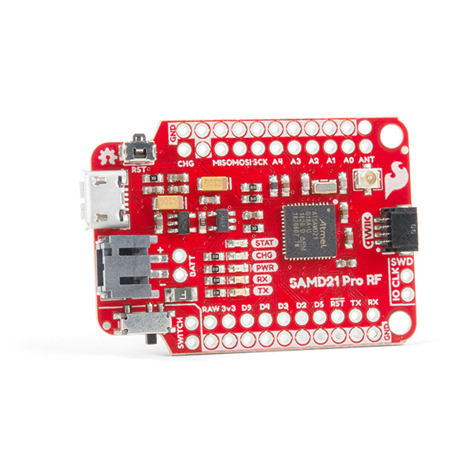
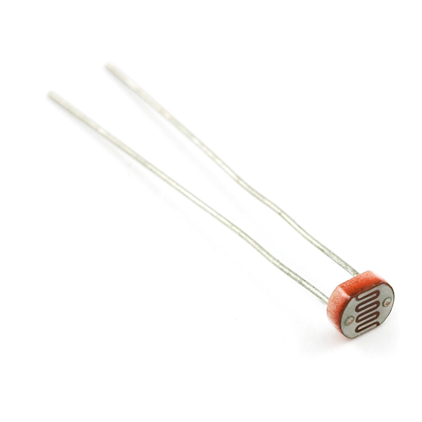

# Robotics Hardware

Let's take a look at what we can buy from the market to get started with Robotics projects:

### Sensors

<table style="width:100%" >
<tr>
<th>SparkFun Artemis Global Tracker (Satellite)   <a href="https://www.sparkfun.com/products/18712">sensor</a></th>
<th>bladeRF x40 (Radio)   <a href="https://www.adafruit.com/product/3333">sensor</a></th>
<th>SparkFun RTK Express Plus (GNSS)   <a href="https://www.sparkfun.com/products/18590">sensor</a></th>
<th>LoRa, 915MHz (SAMD21) (LoRa)   <a href="https://www.sparkfun.com/products/15836">sensor</a></th>
</tr>

<tr>
<th>Fingerprint Scanner - TTL (GT-521F52) (Fingerprint)   <a href="https://www.sparkfun.com/products/14585">sensor</a></th>
<th>PureThermal Mini Pro JST-SR (with FLIR Lepton 3.5) (IR)   <a href="https://www.adafruit.com/product/3333">sensor</a></th>
<th>Qwiic Haptic Driver Kit - DA7280 (Haptic)   <a href="https://www.sparkfun.com/products/18247">sensor</a></th>
<th>MyoWare Muscle Sensor (Muscle)   <a href="https://www.adafruit.com/product/2699">sensor</a></th>
</tr>

<tr>
<th>Pulse Sensor Amped (Pulse)   <a href="https://www.adafruit.com/product/1093">sensor</a></th>
<th>Fingerprint sensor (Fingerprint)   <a href="https://www.adafruit.com/product/751">sensor</a></th>
<th>Muscle Sensor Surface EMG Electrodes - H124SG Covidien (EKG)   <a href="https://www.adafruit.com/product/2773">sensor</a></th>
<th>SparkFun micro:climate kit for micro:bit - v3.0 (weather)   <a href="https://www.sparkfun.com/products/16274">sensor</a></th>
</tr>

<tr>
<th>Nicla Sense ME (IMU)   <a href="https://www.sparkfun.com/products/19727">sensor</a></th>
<th>MIKROE Secure Click (Lock)   <a href="https://www.sparkfun.com/products/18848">sensor</a></th>
<th>LIDAR-Lite v3 (LIDAR)   <a href="https://www.sparkfun.com/products/14032">sensor</a></th>
<th>Mini Photocell (Light)   <a href="https://www.sparkfun.com/products/9088">sensor</a></th>
</tr>

<tr>
<th>Pixhawk 6C with PM07 Power Module and M8N GPS (Flight Controller)   <a href="#">sensor</a></th>
<th>Raspberry Pi HQ Camera Module (RGB camera)   <a href="https://www.sparkfun.com/products/16760">sensor</a></th>
<th>Luxonis Oak-D DepthAI Hardware (RGB-D camera)   <a href="https://www.sparkfun.com/products/17770">sensor</a></th>
<th>Piezoelectric Ribbon Sensor (Piezoelectric))   <a href="https://www.adafruit.com/product/4931">sensor</a></th>
</tr>

</table>
 

### Robotic kits with API

 

We can also build DIY Robotic projects: