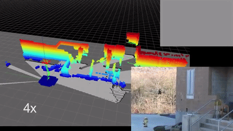
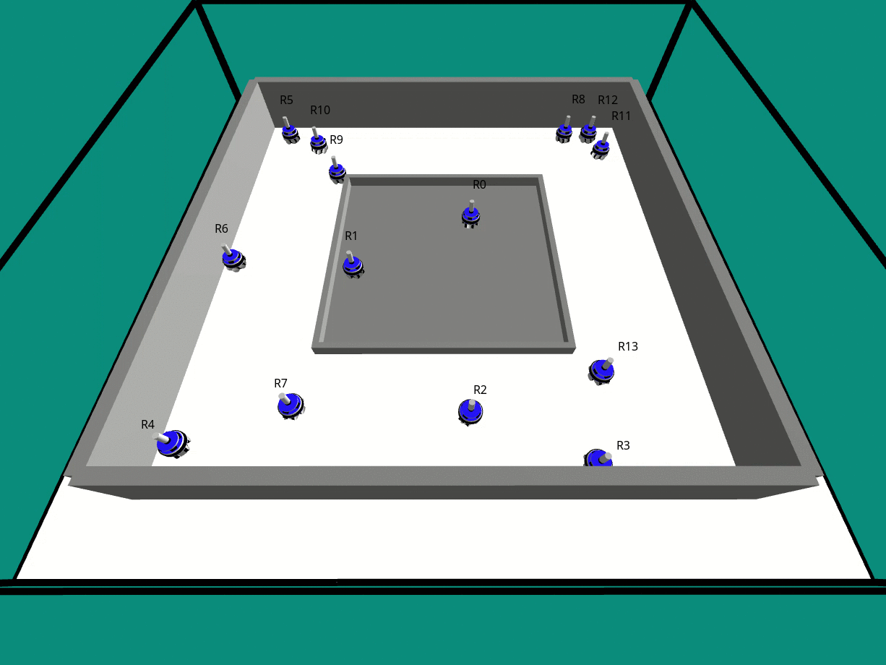

# Robotics and Mechatronics

## Aerial Robotics

## Perception and Manipulation

## SLAM, Motion Planning and Navigation 

## Swarm Intelligence (Multi Agent Systems)

## Human Robot Interaction

## Space Robotics

[ [Mars  Rover](https://mars.nasa.gov/mer/) ] [ [Robotic Servicing Arm](https://nexis.gsfc.nasa.gov/robotic_servicing_arm.html) ] [ [European Robotic Arm](https://en.wikipedia.org/wiki/European_Robotic_Arm) ] : [ERA](https://www.esa.int/Science_Exploration/Human_and_Robotic_Exploration/International_Space_Station/European_Robotic_Arm)

[ [IEEE Space Robotics](https://www.ieee-ras.org/space-robotics) ] [ [NASA Space Robotics Challenge](https://www.nasa.gov/directorates/spacetech/centennial_challenges/space_robotics/index.html) ] [ [Space Robotics: A Comprehensive Study of Major Challenges and Proposed Solutions](https://link.springer.com/chapter/10.1007/978-981-19-4606-6_87) ] [[Science Direct - Space Robotics](https://www.sciencedirect.com/topics/engineering/space-robotics)] [ [Robotic Manipulation and Capture in Space: A Survey](https://www.frontiersin.org/articles/10.3389/frobt.2021.686723/full) ] [ [Space Robotics](https://link.springer.com/book/10.1007/978-981-15-4902-1) ] : [[pdf](./doc/10.1007@978-981-15-4902-1.pdf)]

Institutes: [DLR - Institute of Robotics and Mechatronics](https://www.dlr.de/rm/en/desktopdefault.aspx/tabid-3794/), [DFKI - Robotics Innovation Center (Space Robotics)](https://robotik.dfki-bremen.de/en/research/teams/space), [Tohoku University - The Space Robotics Lab (Space Exploration Lab)](http://www.astro.mech.tohoku.ac.jp/e/), [MIT Astrodynamics, Space Robotics, and Controls Lab (ARCLab)](https://aeroastro.mit.edu/arclab/), [Autonomous Space Robotics Lab (ASRL) at the University of Toronto](http://asrl.utias.utoronto.ca/), [LASR Lab](https://lasr.tamu.edu/), [Autonomous Robotics and Control Lab at Caltech](http://aerospacerobotics.caltech.edu/), [Planetary Robotics Laboratory (PRL) - JPL, NASA](https://www-robotics.jpl.nasa.gov/how-we-do-it/facilities/the-planetary-robotics-laboratory/)

Continuum Robotics : Jessica Burgner-Kahrs - [Continuum Robotics Laboratory in UofT](https://crl.utm.utoronto.ca/); Nanorobotics - [NanoRobotics Lab - CMU](https://medrobotics.ri.cmu.edu/node/128479), [Nanorobotics- GRASP Lab](https://www.grasp.upenn.edu/research-groups/nanorobotics-lab/), [Multi Scale Robotics Lab](https://msrl.ethz.ch/); [CLOVER](https://github.com/Space-Robotics-Laboratory/rlstar).

News : [How Space Robots Shape The Future](https://youtu.be/m6x7SVwapUw)

Companies : [Boston Dynamics](https://bostondynamics.com/), [Festo](https://www.festo.com/de/en/e/journal/robotics-id_9229-1153/), [AnyBotics](https://www.anybotics.com/), [Clear Path Robotics](https://clearpathrobotics.com/), [Rethink Robotics](https://www.rethinkrobotics.com/).

Class : [ETH-Z Autonomous Mobile Robots](https://learning.edx.org/course/course-v1:ETHx+AMRx+2T2020/home), [University of Pennsylvania : GRASP Lab](https://www.coursera.org/specializations/robotics), [Modern Robotics: Mechanics, Planning, and Control](https://www.coursera.org/specializations/modernrobotics), [Technische Universität München: Autonomous Navigation for Flying Robots](https://www.edx.org/course/autonomous-navigation-for-flying-robots) )([AUTONAVx](https://jsturm.de/wp/teaching/autonavx-slides/)) ; list of all robotics classes @ [[MIT](https://www.robolab.mit.edu/course-listing)], @Stanford : [[Robotics and Autonomous Systems Graduate Certificate](https://online.stanford.edu/programs/robotics-and-autonomous-systems-graduate-certificate)], [CMU - Robotics Institute](https://www.ri.cmu.edu/research/).

| Robotics classes :   | [ICRA](https://ieeexplore.ieee.org/xpl/conhome/1000639/all-proceedings), [RSS](https://roboticsconference.org/) | 
| -------- | ------- |
| [Stanford AA289 - Robotics and Autonomous Systems Seminar](https://www.youtube.com/watch?v=h0KMxcEAKHs&list=PLoROMvodv4rMeercb-kvGLUrOq4HR6BZD)  | [CMU - Robotics Institute Seminar Series](https://www.youtube.com/watch?v=CmgAbyhUJtY&list=PLCFD85BC79FE703DF)    |
| @[CyrillStachniss](https://www.youtube.com/@CyrillStachniss/playlists) | [manipulation.mit.edu](https://manipulation.mit.edu/)     |
| [MIT 6.832: Underactuated Robotics](https://underactuated.mit.edu/Spring2022/)    | [CMU - Robot Dynamics](https://www.youtube.com/watch?v=LiNgr1tz49I&list=PLZnJoM76RM6ItAfZIxJYNKdaR_BobleLY)    |
| [CMU - Optimal Control](https://www.youtube.com/watch?v=6rUdAOCNXAU&list=PLZnJoM76RM6KugDT9sw5zhAmqKnGeoLRa)    | [MIT - Machine Vision](https://www.youtube.com/watch?v=tY2gczObpfU&list=PLUl4u3cNGP63pfpS1gV5P9tDxxL_e4W8O)    |
