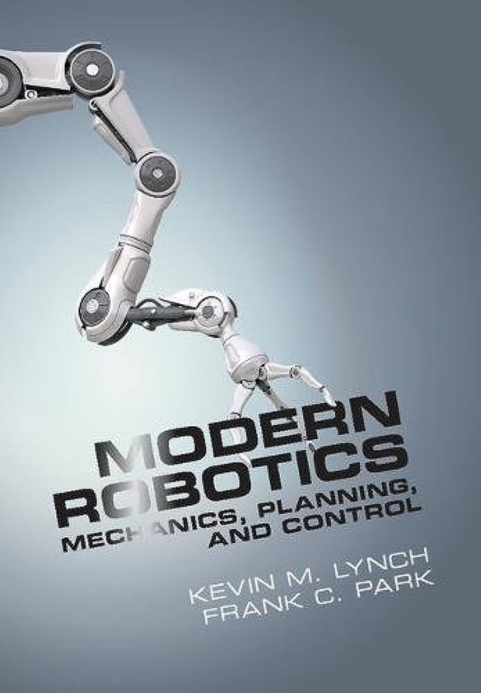

# Robotics and Mechatronics 🤖

```bash

    $ echo "🌸 # # # # # # # # # # # # # # # # # # # # # # # # # # # # # # # # # # # # # # # # # # # # # # # # # # 🤖"
    $ echo "# # # # # # 🌸 🌸 🌸 # # # # # # 🌸🌸 # # # # #🌸🌸🌸🌸 # # # # 🌸🌸 # # # # # # # # # # # # # # # #"
    $ echo "# # # # # # 🌸 # # # 🌸 # # 🤖 🌸 # # 🌸 # # # 🌸 # # # 🌸 #  🌸 # # 🌸 # # # # # # 🌸 # # # # # # #"
    $ echo "# # # # # # 🌸 # # # 🌸 # # # 🌸 # # # 🌸 # # # 🌸 # # # 🌸 # 🌸 # # # 🌸 # # # # 🌸 #🌸 # # # # # # "
    $ echo "# # # # # # 🌸 🌸 # # # # # # 🌸 # # # 🌸 # # # 🌸 🌸 🌸 # # 🌸 # # # #🌸 # # # # # # 🌸 # # # # # #"
    $ echo "# # # # # # 🌸 # # 🌸 # # # # 🌸 # # # 🌸 # # # 🌸 # # # 🌸 # 🌸 # # # 🌸 # # # # 🌸 #🌸 # # # # # #"
    $ echo "# # # # # # 🌸 # # # #🌸 # # # 🌸 # # 🌸 # # # #🌸 # # # 🌸 #  🌸 # # 🌸🤖 # # # # #🌸 # # # # # # #"
    $ echo "# # # # # # 🌸 # # # # #🌸 # # # 🌸🌸 # # # # # 🌸🌸🌸🌸 # # # # 🌸🌸 # # # # # # # # # # # # # # # #"
    $ echo "# # # # # # # # # # # # # # # # # # # # # # # # # # # # # # # # # # # # # # # # # # # # # # # # # # # # #"    

```

Robotics and Mechatronics in short is the science and art of making physically intelligent yet artificial beings. AI is about mimicking the human senses ~ (Computer Vision == eyesight; NLP == language) and Robotics ~ physical touch. I prepared some notes on Robotics & Mechatronics and took a [course](https://twitter.com/florist_notes/status/1668754257292726274) on Robot Kinematics. The usual flow: 

<b>+ Robot Kinematics:</b> Kinematics is the study of the relationship between a robot's joint coordinates and its spatial layout, and is a fundamental and classical topic in robotics. Kinematics can yield very accurate calculations in many problems, such as positioning a gripper at a place in space, designing a mechanism that can move a tool from point A to point B, or predicting whether a robot's motion would collide with obstacles. Kinematics is concerned with only the instantaneous values of the robot's coordinates, and ignores their movement under forces and torques.

<b>+ Robot Dynamics:</b> The dynamics in robotics, in English defined as robot dynamics, studies the forces acting on a robotic mechanism and the accelerations that these forces produce. The robotic mechanism is generally considered as a rigid system, in order to apply the dynamic laws of rigid bodies. The two main problems in robot dynamics are:

+ Forward dynamics: given the forces, work out the accelerations.
+ Inverse dynamics: given the accelerations, work out the forces.
+ Hybrid dynamics: given the forces at some joints and the accelerations at others, work out the unknown forces and accelerations.

<b>+ Robot Motion Planning and Control: </b> Motion planning, also path planning (also known as the navigation problem or the piano mover's problem) is a computational problem to find a sequence of valid configurations that moves the object from the source to destination.

<b>+ Robot Manipulation :</b> The manipulation task usually requires moving an object to a specified location in space, without particular regard as to how the manipulator can accomplish the task. The model considered here greatly simplifies the problems of grasping, stability, friction, mechanics, and uncertainties and instead focuses on the geometric aspects.

<b>+ Robot State Estimation and Learning :</b> How can robots determine their state and properties of the surrounding environment from noisy sensor measurements in time?  how to get robots to incorporate uncertainty into estimating and learning from a dynamic and changing world.

<b>+ Robot Perception:</b> Robots' ability to interact with their surroundings is an essential capability, especially in unstructured human-inhabited environments. The knowledge of such an environment is usually obtained through sensors. The study of acquiring knowledge from sensor data is called robotic perception.

I made a video on "state of the art robotics research" to explore and learn about new robotics projects. [ [video](https://youtu.be/8X6KHBze2vY?si=XJOIFhwT8nGol7MD) ].

projects : [ [Adaptive Walking of Bio-inspired Musculoskeletal Soft Quadruped Robot in Slow Motion](https://youtu.be/89L8tqP6_MU?si=sRyuvk7OzLBwMIPH), [으뜸병원로봇동영상](https://youtu.be/r-Qh0Ox9ZmE?si=qKrB6EiuJ243ChuR), [Arduino Quadruped Robot Dancing to 'Small Steps'](https://youtu.be/95QFbXK_3GQ?si=QFnQm23BV_PCUtDf), [ウマの走行能力のヒミツに迫る　解剖学的な歩行ロボット](https://youtu.be/fA8YVgKO72U?si=wbkDikT_JVe0k8Uk), [CRL Legged Robotics Team in Swiss Robotics Day 2023](https://youtu.be/V6F5AtdAL4w?si=hbBYurj7e2CAUEV5), [方舟无限ARX5 轻型力控机械臂](https://youtu.be/KWCL-jCnivI?si=SgTl4orj4pXDh_0m), [ARX-5-robot arm dancing -real2sim2real2sim2real…](https://youtu.be/NW4ZE4y-8hU?si=ruPJXj8GabB55eaf), [Hexapod Robot Mat6 Climbs Stairs](https://youtu.be/f3L8R5Vx6Z0?si=TQ8uRz8rCIYN2Trb), [Hexapod Mark IV August Update](https://youtu.be/Loa3qMb-oT0?si=U5wsZkP-F3GmuHoZ), [KITECH Dual Arm Robot Performs Manipulation Tasks](https://youtu.be/ZtP-I_Bpibs?si=vVAO-6nH-o8J1H5H), [peg-in-hole with dual robot arm](https://youtu.be/8xjBv8AF5U4?si=GKZsCXjo8DO5sO3W), [ARX方舟无限 Ultron / Dual-arm Robot - for Embodied AI](https://youtu.be/OVC0aQ0yJrU?si=7Wxjfl70my111I6y), [PDH-GS120](https://youtu.be/PwNWEeX3sgE?si=RzEWdKjNzC5H0qzp), [Spirit](https://youtu.be/Bba_PAy1AyU?si=DkSe_aWN2efFF-Gi), [ RAF 'Jackal'](https://youtu.be/6eEaPb7fP70?si=hWxW8mnEtDbBZadw), [Sonnie Robot](https://youtu.be/JmH703sYQUU?si=TtrPm6rOWSMZbO1y) [[ Shanghai AI event](https://youtu.be/HhOND0JWoGA?si=8O0g8YbxH3slJuQ0)], [BirdBot](https://youtu.be/wwH40rYJt9g?si=6JIz4dC-O6J2Bibq) - [[Ostrich-inspired 'BirdBot' ](https://youtu.be/6myoC_un7Gg?si=DHMBLH5g0zPhSxLP)], [Robotic drones with suction pads can fly, swim or hitch a ride to get around](https://youtu.be/3Fi114zf0a0?si=r1NF7qfQeMONhrBK), [BAS-200](https://youtu.be/mQaiw7aXjDo?si=TG88ObHAw6ydXkp0), [Thrust vectoring drone](https://youtu.be/u2cETOyuJ20?si=gvlEsjjEwhktH-t1), [#Oblivion Drone 166](https://youtu.be/-ukq8H5ASb8?si=PCiwIzOu12FumkG9), [Drone swarm avoids crashing in dense forest using new algorithm](https://youtu.be/Lr7L2t-svJQ?si=FbMUps-oASe-rYso), [PteroDynamics X-P4 Transwing](https://youtu.be/kA1ENhxLqTo?si=MIxrVFyOOKAuwlKZ), [VR control of NASA Valkyrie humanoid astronaut robot using PSYONIC Ability Hand](https://youtu.be/LaYlQYHXJio?si=XMfd-WOPl9XcIUzy), [2023 Summer Project](https://youtu.be/W3BaOlSbYNY?si=mTzlVTEId0nkf2TI), [Pneumatic Augmentation for Explosive Hopping Robots](https://youtu.be/JObkOIaiOqE?si=qedWoY43JGMhkTi8), [Exo-H3 Promo 2024](https://youtu.be/jDPZHOcB928?si=kHJAu5qC8J3ISvD9), [Hierarchical Optimization-Based Control for Agile and Adaptive Legged Robots](https://youtu.be/YePNt9S9hkY?si=z0SutM-rN7Bl0erY), [Diffusion Policy Assistive Action Prediction](https://youtu.be/OzGdJI0vE44?si=lLG3_xHy-THRyDbE), [10 years of swarm study Dec 2023](https://youtu.be/VYTldGWsu1A?si=4XX0eH3PyqOo1_0s), [SNAP: Self-Supervised Neural Maps for Visual Positioning and Semantic Understanding](https://youtu.be/xogrwdgNQdo?si=nRmfIBdvRPenqFNQ), [Gradient-Based Trajectory Optimization With Learned Dynamics - Supplementary](https://youtu.be/yj-iFPIAW2o?si=27jnKDdwMohx2obL), [Project Darkbot Final Demo](https://youtu.be/_8Z9SxTvpJI?si=cXx0oJ3XnWGYErGd), [Gyroscopic Bipeds: A Different Way of Walking with Dr Pauline Pounds](https://youtu.be/B6Wr9C92uRA?si=3D8lTJEdlS-0AbC-), [Introducing HyperLeg: Human-like Robot Leg and Foot for Highly Dynamic Motions](https://youtu.be/wLFCMwRvhVI?si=6VoTDrzN4qJljtUa), [Menteebot by Mentee Robotics is agile](https://youtu.be/zJTf4JhGSsI?si=U0VaqXrPBHx4dfx5), [SpaceHopper](https://spectrum.ieee.org/video-friday-spacehopper) ] 

Robotics Simulation tools : [MuJoCo](https://github.com/google-deepmind/mujoco), [AirSim](https://github.com/microsoft/AirSim), [CARLA](https://github.com/carla-simulator/carla), [Webots](https://github.com/cyberbotics/webots), [Gazebo](https://github.com/gazebosim/gz-sim), [Raisim](https://raisim.com) and a lot more [here](https://github.com/florist-notes/aicore_s/blob/main/notes/robotics_ee_hardware/img/robosim.jpeg). 

### Robotics Books:

<table style="width:100%" >
<tr>
<th>Probabilistic Robotics (Intelligent Robotics and Autonomous Agents series)<br /> </th>

<th>Introduction to Autonomous Mobile Robots<br /> </th>

<th>Modern Robotics: Mechanics, Planning, and Control<br /> </th>

<th>Principles of Robot Motion: Theory, Algorithms, and Implementations<br /> </th>

<th>Planning Algorithms<br /> </th>

</tr>
</table>
<br />

I am interested in Perception and Navigation of Robotic Systems. Feel free to check my pages on robotics hardware : @[robotic-components-i](https://github.com/florist-notes/aicore_s/blob/main/notes/robotics_ee_hardware/robotic_components.md), [robotic-components-ii](https://github.com/florist-notes/aicore_s/blob/main/notes/robotics_ee_hardware/diyarh.md). I also found these helpful resources : @github/[awesome-robotics](https://github.com/kiloreux/awesome-robotics), [awesome-robotics-libraries](https://github.com/jslee02/awesome-robotics-libraries), [awesome-robotics](https://github.com/ahundt/awesome-robotics), [awesome-ros2](https://github.com/fkromer/awesome-ros2), [python-robotics](https://github.com/AtsushiSakai/PythonRobotics), [webots](https://github.com/cyberbotics/webots) + [josm](https://josm.openstreetmap.de/); [dih-hero.eu](https://dih-hero.eu/repository-of-libraries/), [DRAKE.mit](https://drake.mit.edu/), [IEEE RAS CRV ](https://ieee-ras-crv.github.io/), [rerun.io](https://www.rerun.io/).

## Aerial Robotics

Aerial robotics, particularly unmanned aerial vehicles (UAVs) or drones, have seen a surge in research and development owing to their diverse applications across various domains. Aerial robotics has witnessed exponential growth, driven by advancements in AI, robotics, and sensor technologies. UAVs are now deployed for tasks ranging from surveillance and reconnaissance to delivery and disaster response. 

I was working on hand gesture recognition on aerial systems at my lab. We had dji tello in lab and plans to research with crazyflie 2.1. I developed a control station for drone autonomy in lab and presented my hand gesture recognition work to Senator, Dr. Anjes Tjarks ( Behörde für Verkehr und Mobilitätswende ), Hamburg and LSBG CEO, Dr Klotz at DigiLab, LSBG. [ [post](https://twitter.com/florist_notes/status/1633093993146753027) ]


The following Institutes have been doing amazing work on aerial robotics : [ [MIT Spark Lab](https://web.mit.edu/sparklab/) ] [ [EPFL - Aerial Robotics](https://www.epfl.ch/labs/lis/research/aerial-robotics/) ] [ [UZH - Robotics and Perception Group](https://rpg.ifi.uzh.ch/) ] [ [Imperial - Aerial Robotics](https://www.imperial.ac.uk/aerial-robotics/) ] [ [ETH - Z : ASL - Flying Robots](https://asl.ethz.ch/research/flying-robots.html) ] [ [GRASP Lab : Aerial Robotics](https://www.grasp.upenn.edu/virtual-grasp-tour-videos/a-glimpse-into-grasp-research-aerial-robotics/) ] [ [Oxford - Dynamic Robot Systems Group](https://ori.ox.ac.uk/labs/drs/aerial-robotics/) ] [ [Stanford - Aerospace Robotics Lab](https://web.stanford.edu/group/arl/) ] [ [CMU - AirLab](https://www.ri.cmu.edu/robotics-groups/air-lab/) ] [ [Smart Robotics Lab - TUM](https://srl.cit.tum.de/research/drones) ] [ [University of Tokyo - DRAGON Lab](http://www.dragon.t.u-tokyo.ac.jp/) ] [ [Microsoft - Aerial Informatics and Robotics Group](https://www.microsoft.com/en-us/research/group/air/) ] [ [Caltech - Autonomous Robotics and Control Lab](http://aerospacerobotics.caltech.edu/videos) ] [ [MIT - Robust Robotics Group](https://www.csail.mit.edu/research/robust-robotics-group) ] [ [Autonomous Robots Lab, NTNU](https://www.autonomousrobotslab.com/) ] [ [Biomorphic Intelligence Lab - TU Delft](https://www.tudelft.nl/ai/biomorphic-intelligence-lab) ] [ [Bio-inspired Soft Aerial Robotics](https://www.soft-aerial-robotics.com/) ] [ [Spark Lab](./spark.MD) ]

+ [MIT Robotics - Kevin Chen - Agile, robust, and multifunctional micro-aerial-robots](https://youtu.be/xmrDK_w0Yog)
+ [RI Seminar: Kostas Alexis : Autonomous Exploration and Inspection using Aerial Robots](https://www.youtube.com/live/4ko2K6jFwaU?feature=share)

projects : [Design, Modeling and Control of Aerial Robot DRAGON](https://youtu.be/zMi5v2KznU4), [Versatile Articulated Aerial Robot DRAGON: Aerial Manipulation and Grasping by Vectorable Thrust](https://youtu.be/fJA4Rch0biE), [Learning High-Speed Flight in the Wild (Science Robotics, 2021)](https://youtu.be/m89bNn6RFoQ), [Swarm of Micro Flying Robots in the Wild [All]](https://youtu.be/L0fJ0EHHfOA), [Controlling Robotic Swarms](https://youtu.be/stzQNjtDg0g), [Crazyflie in research, 2020-2022](https://youtu.be/iTe6-lLp5iM), [EPFL - Aerial Robotics](https://www.youtube.com/watch?v=3-O85lB_DJQ&list=PLx1eeEN6ALvVP2CCpfGI_pbvDUH10O8RW), [This drone has legs: Watch a flying robot perch on branches, catch a tennis ball in mid-air](https://youtu.be/TF-OthkH844), [GAAS](https://github.com/generalized-intelligence/GAAS), [This Transformative Drone Can Change its Shape Mid-Flight](https://youtu.be/G8bmtLvIR30?si=ucgx754p8wyS_aWi), [PteroDynamics X-P4 Transwing® sizzle video](https://youtu.be/kA1ENhxLqTo?si=5U67vBJQInb-iogQ), ['Energy-efficient flapping-wing robots' workshop puts bio-inspired aerial robots to the test](https://youtu.be/-t7p-Lgtm2g?si=MyvJ22GwnVxCSOy-), [MonoNav: MAV Navigation via Monocular Depth Estimation and Reconstruction](https://youtu.be/msWLSfOmTpI?si=Gq-Snk63X8UTgE2h), [Semester project in Autonomous Aerial Robotics at UMD](https://youtu.be/DGx-8SBLRV8?si=r6Ku6GrBm3GQN6hQ), [The bio-inspired 'transformer' that crawls, rolls and flies](https://youtu.be/S4eQXXxUnNE?si=A9rE2XQJjihpeVPP), [Reliable Robotics remotely operates a large cargo aircraft with no one on board](https://youtu.be/w2O4hgNCMd4?si=iklaoPUpKtdCzXts), [A Robot That Walks, Flies, Skateboards, Slacklines](https://youtu.be/H1_OpWiyijU?si=s9DjRTFoQjBgLkng), [Optimal elastic wing for flapping-wing robots through passive morphing](https://youtu.be/kwuW8cfy-MI?si=h4MkZRQ1DuLS558F), [OmniNxt:A Fully Open-source and Compact Aerial Robot with Omni Visual Perception](https://youtu.be/IOuJ7Y6dpeY?si=6DlVHqtJ0t0_l76v), [GPS free drone navigation with VIO](https://youtu.be/BKAy5lTHssI?si=OVL5Sm80RbwwWuXD), [ROS Aerial Robotics WG meeting April 2024](https://youtu.be/-4z2vpCIBqs?si=puX4jgccPSoL6mks), [Impact-Aware Planning and Control for Aerial Robots with Suspended Payload](https://youtu.be/FIfo1P7O39g?si=q4QS5lxDfgREv3RM), [PufferBot: Actuated Expandable Structures for Aerial Robots](https://youtu.be/XtPepCxWcBg?si=njCfHY0VVz1yYzPR).


resources : [Bitcraze Aerial Robotics Meeting](https://www.youtube.com/watch?v=nf_shDkCOGA&list=PLj9XMmQVSr-Bwqia2Do_xdD8aq6DfY3E0), [UZH Robotics and Perception Group](https://www.youtube.com/@ailabRPG/videos), [BitCraze Videos](https://www.youtube.com/@BitcrazeVideos/playlists), [International Conference on Unmanned Aircraft Systems (ICUAS)](https://www.ieee-ras.org/conferences-workshops/technically-co-sponsored/icuas), [Springer - Aerial Robotics](https://link.springer.com/referenceworkentry/10.1007/978-3-540-30301-5_45),  [Springer - Aerial Robotics](https://link.springer.com/book/10.1007/978-3-030-12945-3), [MDPI - Aerial Robotics for Inspection and Maintenance](https://www.mdpi.com/journal/applsci/special_issues/Aerial_Robotics_for_Inspection_and_Maintenance), [list](https://www.bitcraze.io/2023/07/online-courses-in-aerial-robotics/) of aeriial robotics classes. Here are some books - [A First Course in Aerial Robots and Drones](https://www.routledge.com/A-First-Course-in-Aerial-Robots-and-Drones/Sebbane/p/book/9780367631383) : [pdf](./doc/(Chapman%20&%20Hall_CRC%20Artificial%20Intelligence%20and%20Robotics%20Series)%20Yasmina%20Bestaoui%20Sebbane%20-%20A%20First%20Course%20in%20Aerial%20Robots%20and%20Drones-CRC%20Press%20(2022).pdf), [Control of Ground and Aerial Robots](https://link.springer.com/book/10.1007/978-3-031-23088-2), [online textbook](https://www.autonomousrobotslab.com/online-textbook.html), [Udacity - Flying Car and Autonomous Flight Engineer](https://www.udacity.com/course/flying-car-nanodegree--nd787), [Optimal elastic wing for flapping-wing robots through passive morphing](https://youtu.be/kwuW8cfy-MI?si=24CvTHMY5RxbEgjV), [aerial-robotics-course](https://www.youtube.com/watch?v=Y1twsFRqZQQ&list=PLx0tK3DMiHk6vBj-pfe1_bEE-JgsR8-sl), @[MITRoboticsSeminar](https://www.youtube.com/@MITRoboticsSeminar/videos).

## Perception and Manipulation


The following Institutes have been doing amazing work on robot manipulation :   [MIT ROBOTIC MANIPULATION](https://manipulation.csail.mit.edu/index.html), [University of Leeds - Robotic Manipulation](https://robotics.leeds.ac.uk/research/ai-for-robotics/robotic-manipulation/), [CMU Robot Perception Lab](http://rpl.ri.cmu.edu/), [Robotics: Perception and Manipulation (RPM) Lab](https://rpm-lab.github.io/), [UMich - Robot Perception & Manipulation](https://robotics.umich.edu/research/focus-areas/robot-perception-manipulation/), [UWash - Personal Robotics Lab](https://personalrobotics.cs.washington.edu/),  [Georgia Tech - Adaptive Robotic Manipulation (ARM) Laboratory](https://armlab.gatech.edu/), [NVIDIA Seattle Robotics Lab](https://research.nvidia.com/labs/srl/).


Some recent work on Robot Manipulation:
+ [Perception and Manipulation in Robotics: Neural Network Approaches](https://link.springer.com/chapter/10.1007/978-1-4471-1021-7_32)
+ [Robot Perception and Learning for Navigation, Manipulation, and Locomotion](https://youtu.be/JWJWfLcqvHk)
+ [Robot learning and perception for contact-rich manipulation](https://youtu.be/YGMSznpKCq4)
+ [MIT Robotics - Dieter Fox - Toward Foundational Robot Manipulation Skills](https://youtu.be/1EFZ--nbKog)
+ [MIT Robotics - Jeffrey Ichnowski - Dynamic Robot Manipulation](https://youtu.be/LgHC4fohvfU)
+ [StanfordWebinar - Autonomous Robotic Manipulation: What’s Within Reach? Jeannette Bohg](https://youtu.be/sCyvqNbQzqk)
+ [PhD Thesis Defense - Maria Bauza - Visuo-Tactile Perception for Dexterous Manipulation](https://youtu.be/T7ZO_cxgHlo)
+ [PhD Thesis Defense - Siyuan Dong - High-resolution Tactile Sensing for Reactive Robotic Manipulation](https://youtu.be/kaPdUzM_A28)
+ [Stanford Seminar - Robotic Autonomy and Perception in Challenging Environments](https://youtu.be/4AudRBdZVV0)
+ [RI Seminar: Michael Kaess: Factor Graphs for Robot Perception](https://youtu.be/Q313pTMAdcM)

Institutes : [Institut de Robotica](https://www.iri.upc.edu/research/perception), [UMich - Robot Perception & Manipulation Robot Perception & Manipulation](https://robotics.umich.edu/research/focus-areas/robot-perception-manipulation/), [Robotics: Perception and Manipulation (RPM) Lab](https://rpm-lab.github.io/), [MPI - Autonomous Robotic Manipulation](https://am.is.mpg.de/research_projects/autonomous-robotic-manipulation), [DLR - Perception and Cognition](https://www.dlr.de/rm/en/desktopdefault.aspx/tabid-8023/11888_read-28100/), [Stanford ARM Lab](https://arm.stanford.edu/), [Flight Robotics and Perception Group (FRPG)](https://github.com/robot-perception-group).

resources : [Active Manipulation for Perception](https://link.springer.com/chapter/10.1007/978-3-319-32552-1_41), [DeepRob: Deep Learning for Robot Perception](https://deeprob.org/); class - [MIT 6.4210/6.4212 Robotic Manipulation](https://www.youtube.com/watch?v=QlrRb7X4JvA&list=PLkx8KyIQkMfUSDs2hvTWzaq-cxGl8Ha69), [Workshop on "Benchmarking in Robotic Manipulation"](https://youtu.be/WNklJiqLduc), [Workshop on "Learning, Perception, and Abstraction for Long-Horizon Planning"](https://youtu.be/8CFnk8l-RMQ), [Robot Manipulation Final Projects](https://www.youtube.com/watch?v=WzJJ4c6AqnE&list=PLkx8KyIQkMfUbHMSbSVTmCM63rICMdFNI), @github/[robosuite](https://github.com/ARISE-Initiative/robosuite), robot perception [projects](https://www.youtube.com/watch?v=K-uWCB8Y7eo&list=PL3FroDZgGeCMt-iFJOPxMQppx9uf1TSha), class : [Modern Computer Vision](https://www.youtube.com/watch?v=Q3fqoJ41g6U&list=PLzWRmD0Vi2KVsrCqA4VnztE4t71KnTnP5), [Computer Vision — Andreas Geiger](https://www.youtube.com/playlist?list=PL05umP7R6ij35L2MHGzis8AEHz7mg381_), [MIT - Robotic Manipulation Perception, Planning, and Control](https://manipulation.csail.mit.edu/index.html), [MIT Robotic Manipulation 2023 (class)](https://www.youtube.com/watch?v=v04rn86Dehg&list=PLkx8KyIQkMfWr191lqbN8WfV08j-ui8WX), [DeXtreme: Transferring Dexterous Manipulation from Simulations to Reality](https://youtu.be/TAUiaYAVkfI?si=EOh63rtFhQLXr7UN).

## SLAM, Motion Planning and Navigation 

<a> </a> 

Simultaneous localization and mapping is the computational problem of constructing or updating a map of an unknown environment while simultaneously keeping track of an agent's location within it. I have good notes on SLAM here @[visual-slam](https://github.com/florist-notes/aicore_n/blob/main/notes/code/slam/README.MD).

Some recent work on SLAM:
+ [CSIRO's Wildcat SLAM: A Robust SLAM System for Robot Teams in the Wild](https://www.youtube.com/live/YCE1Aj0k1UA?feature=share)
+ [Swarm-SLAM : Sparse Decentralized Collaborative Simultaneous Localization and Mapping Framework for Multi-Robot Systems](https://arxiv.org/abs/2301.06230)
+ [An Introduction to Robot SLAM (Simultaneous Localization And Mapping)](https://lucidar.me/en/kalman-filters/files/introduction-to-slam.pdf)
+ [FastSLAM: A Factored Solution to the Simultaneous Localization and Mapping Problem](http://robots.stanford.edu/papers/montemerlo.fastslam-tr.pdf)
+ [Past, Present, and Future of Simultaneous Localization And Mapping: Towards the Robust-Perception Age](https://arxiv.org/pdf/1606.05830.pdf)
+ [Introduction to Visual SLAM](https://link.springer.com/book/10.1007/978-981-16-4939-4) - [repo](https://github.com/gaoxiang12/slambook-en)
+ [Online LiDAR-SLAM for Legged Robots with Robust Registration and Deep-Learned Loop Closure](https://ori.ox.ac.uk/media/5601/2020icra_ramezani.pdf)
+ [Co-SLAM: Joint Coordinate and Sparse Parametric Encodings for Neural Real-Time SLAM](https://hengyiwang.github.io/projects/CoSLAM)
+ [ICCV'23 Robot Learning & SLAM Workshop](https://www.youtube.com/live/k2tquhx4FsQ?si=68CP6k4n16r_WV9y)

resources: [Easy SLAM with ROS using slam_toolbox](https://youtu.be/ZaiA3hWaRzE), [Understanding SLAM Using Pose Graph Optimization](https://youtu.be/saVZtgPyyJQ), [SLAM Robot Mapping](https://youtu.be/-XU54IsG8Vo), [SLAM Course - Cyrill Stachniss](https://www.youtube.com/watch?v=U6vr3iNrwRA&list=PLgnQpQtFTOGQrZ4O5QzbIHgl3b1JHimN_), [Simultaneous Localization and Mapping (SLAM) for Robotics - NTNU](https://www.youtube.com/playlist?list=PLZ_sI4f41TGtsqgT6cMLCUCYOT7mCjBMM), [VSLAM for Robotic Applications](https://www.youtube.com/watch?v=mNTi1osPSIA), [How to get your robot to see in 3D! (Depth Cameras in ROS](https://youtu.be/T9xZ22i9-Ys), [Dr. Franz Andert](https://ieeexplore.ieee.org/author/37681903100), [SLAM - Matlab](https://de.mathworks.com/discovery/slam.html), [SLAM for Dummies](https://dspace.mit.edu/bitstream/handle/1721.1/119149/16-412j-spring-2005/contents/projects/1aslam_blas_repo.pdf), [Indoor Robot Localization with SLAM](https://towardsdatascience.com/indoor-robot-localization-with-slam-f8b447bcb865), [Multi Agent SLAM - DLR](https://www.dlr.de/kn/desktopdefault.aspx/tabid-15373/24954_read-62490/), [SLAM variants](https://avirmani.com/robotics/slam-overview-applications-and-challenges-in-robotics/), [Springer - SLAM](https://link.springer.com/chapter/10.1007/978-3-540-75388-9_3), ICRA SLAM paper [list](https://github.com/wanghuayou1028/ICRA2021-SLAM-paper-list), paperswithcode - [SLAM / kimera](https://paperswithcode.com/task/simultaneous-localization-and-mapping), @github/[awesome-visual-slam](https://github.com/tzutalin/awesome-visual-slam), [awesome-slam](https://github.com/kanster/awesome-slam), [semantic-slam](https://github.com/topics/semantic-slam), [lidar-slam](https://github.com/topics/lidar-slam), [slam-algorithms](https://github.com/topics/slam-algorithms).


Some recent work on Motion Planning:

+ [Robot Motion Planning using A* (Cyrill Stachniss)](https://youtu.be/HR1TNa8Lp7w)
+ [Introduction to Motion Planning for Flying Robots: Dr. Sebastian Scherer](https://youtu.be/8uLsT-fAlMc)
+ [Advanced Motion Planning: FMT*, Informed RRT*, BIT*, and RABIT* | An OMPL Tutorial with Examples](https://youtu.be/yggi7QjfOUM)
+ [RI Seminar: Russ Tedrake: Robust motion planning for walking robots and robotic birds](https://youtu.be/QV0gydSTqdY)
+ [Russ Tedrake: Motion Planning Around Obstacles with Convex Optimization](https://youtu.be/5E2OaizkJEs)
+ [Siddharth Srivastava on "Task and Motion Planning for Robots..."](https://youtu.be/wRZ2yqRrPiY)
+ [Motion Planning Among Dynamic, Decision-Making Agents with Deep Reinforcement Learning](https://youtu.be/XHoXkWLhwYQ)
+ [Robot Motion Planning: Challenges and Opportunities for Increasing Robot Autonomy](https://youtu.be/N7M4-XP7igk)

resources: [Motion Planning for Robots](https://www.youtube.com/watch?v=nbaSzCnmyec&list=PL0sla3wvhSnYNAyp0-OQmTMyO2POZRSe-), [UMich - Motion Planning](https://robotics.umich.edu/research/focus-areas/motion-planning/), [A review of motion planningalgorithmsforintelligent robotics](https://arxiv.org/ftp/arxiv/papers/2102/2102.02376.pdf), [Springer - Robot Motion Planning](https://link.springer.com/book/10.1007/978-1-4615-4022-9), [MIT - CSAIL : Task and Motion Planning for Autonomous Robots](https://www.csail.mit.edu/research/task-and-motion-planning-autonomous-robots), [ACM - Robot Motion Planning](https://dl.acm.org/doi/10.5555/532147), [Neighborhood Attention Transformer (CVPR 2023)](https://youtu.be/Ya4BfioxIHA?si=0nZtRZEuirz0owFB), [Transformer Architecture](https://youtu.be/1h7T_-V5GI4?si=NVOC8T8cO_MlXYC1), [Self-Attention Using Scaled Dot-Product Approach](https://youtu.be/1IKrHh2X0F0?si=AkxBK639IKDv3uz3), [A Dive Into Multihead Attention, Self-Attention and Cross-Attention](https://youtu.be/mmzRYGCfTzc?si=NZreJg1Y2HyDd6y-).


Some recent work on Navigation:
+ [A comprehensive study for robot navigation techniques](https://www.tandfonline.com/doi/full/10.1080/23311916.2019.1632046)
+ [Visual language maps for robot navigation](https://ai.googleblog.com/2023/03/visual-language-maps-for-robot.html)
+ [Improving Autonomous Robotic Navigation Using Imitation Learning](https://www.frontiersin.org/articles/10.3389/frobt.2021.627730/full)
+ [Mobile Robot Navigation and Obstacles Avoidance based on Planning and Re-Planning Algorithm](https://www.sciencedirect.com/science/article/pii/S1474667016336795)
+ [Autonomous Robot Navigation in Highly Populated Pedestrian Zones](https://europa2.informatik.uni-freiburg.de/files/kuemmerle14jfr.pdf)
+ [Robot Mapping and Navigation in Real-World Environments](https://bonndoc.ulb.uni-bonn.de/xmlui/handle/20.500.11811/7381)
+ [Mobile Robot Navigation Using Deep Reinforcement Learning](https://www.mdpi.com/2227-9717/10/12/2748)
+ [Navigation System of the Autonomous Agricultural Robot “BoniRob”*](https://www.cs.cmu.edu/~mbergerm/agrobotics2012/01Biber.pdf)

resources: [Autonomous Navigation - Matlab](https://www.youtube.com/watch?v=Fw8JQ5Q-ZwU&list=PLn8PRpmsu08rLRGrnF-S6TyGrmcA2X7kg), [Making robot navigation easy with Nav2 and ROS!](https://youtu.be/jkoGkAd0GYk), [Where Can Machine Learning Help Robotic State Estimation?](https://www.youtube.com/live/z9IeZ_U0uqY?feature=share), [Springer - Mobile Robot Navigation](https://link.springer.com/chapter/10.1007/978-3-642-33965-3_1), paperswithcode - [robotnavigation](https://paperswithcode.com/task/robot-navigation), [Safe Robot Navigation in Dense Crowds](https://cordis.europa.eu/project/id/779942).

## Swarm Intelligence (Multi Agent Systems)


A multi-agent system is a computerized system composed of multiple interacting intelligent agents. Multi-agent systems can solve problems that are difficult or impossible for an individual agent or a monolithic system to solve. Reinforcement Learning is widely used in Multi Agent System problems and my deep reinforcement learning notes are here @/[drl](https://github.com/florist-notes/aicore_n/blob/main/notes/drl.MD).

Some recent works on Multi Agent Systems:

- ["Learning to Communicate in Multi-Agent Systems" - Amanda Prorok](https://youtu.be/J9Olp6YqQhw)
- [Understanding Equilibria in Multi-Agent Systems - Michael Wooldridge, University of Oxford](https://youtu.be/Iqm8UTXUG24)
- [Scalable and Robust Multi-Agent Reinforcement Learning - Microsoft Research](https://youtu.be/Yd6HNZnqjis)
- [The Role of Multi-Agent Learning in Artificial Intelligence Research at DeepMind](https://youtu.be/CvL-KV3IBcM)
- [Can AI Learn to Cooperate? Multi Agent Deep Deterministic Policy Gradients (MADDPG) in PyTorch](https://youtu.be/tZTQ6S9PfkE)
- [MIT Robotics - Dimitra Panagou - Safety and Resilience in Multi-Agent Systems](https://youtu.be/HgUKVBBaXW8)
- [DLRLSS 2019 - Multi-Agent Systems - James Wright](https://youtu.be/MEUdtwQev9A)
+ [CMU - Multi Agent Systems](https://www.cs.cmu.edu/~softagents/multi.html), [An Introduction to Multi-Agent Systems](https://link.springer.com/chapter/10.1007/978-3-642-14435-6_1), [IEEE - Multi-Agent Systems: A Survey](https://ieeexplore.ieee.org/document/8352646)

Institutes : [Deepmind](https://www.deepmind.com/), [TUD - Intelligent Multi-Agent Systems](https://www.ias.informatik.tu-darmstadt.de/Teaching/IntelligentMultiAgentSystemsLecture), [ Automatic Coordination of Teams (ACT) Lab at Brown University](http://act.usc.edu/), [Autonomous Multi-Robots Lab. Delft University of Technology](https://www.autonomousrobots.nl/), [huntlab](https://www.huntlab.uk/), [Harvard University : Designing Emergence Laboratory](https://projects.iq.harvard.edu/del), Inria - [Lagadic](http://www.irisa.fr/lagadic/welcome-eng.html), [Chroma](https://team.inria.fr/chroma/en/), [LABUST](https://labust.fer.hr/), Stanford - [Multi-robot Systems Lab (MSL)](https://msl.stanford.edu/), [MPI - Robotic Perception Group](https://ps.is.mpg.de/research_fields/robot-perception-group).

resources : ScienceDirect - [Swarm Intelligence](https://www.sciencedirect.com/topics/engineering/swarm-intelligence), [Multi Agent Systems](https://www.sciencedirect.com/topics/chemical-engineering/multi-agent-systems), Springer - [Swarm Intelligence](https://www.springer.com/journal/11721), [Swarm Intelligence Principles, Advances, and Applications](https://www.routledge.com/Swarm-Intelligence-Principles-Advances-and-Applications/Hassanien-Emary/p/book/9780367737542), [YT](https://www.youtube.com/watch?v=EnmQbw8EeI8&list=PLEXCtjCCJih50Wjxu8GgOukaLK_iklqgS), [AAMAS (International Conference on Autonomous Agents and Multiagent Systems)](https://dl.acm.org/conference/aamas).

github : [multi_agent_path_planning](https://github.com/atb033/multi_agent_path_planning), [camel](https://github.com/camel-ai/camel), [MARL-papers](https://github.com/LantaoYu/MARL-Papers), [Petting Zoo](https://github.com/Farama-Foundation/PettingZoo), [awesome-deep-rl](https://github.com/tigerneil/awesome-deep-rl), [mava](https://github.com/instadeepai/Mava), [MARL-papers-with-code](https://github.com/TimeBreaker/MARL-papers-with-code)

## Human Robot Interaction

The decade of talking to robots in our native natural language is here with LLMs:

Human Robot Interaction with Large Language Models (LLMs) : 

- [LLM-GROP : Task and Motion Planning with Large Language Models for Object Rearrangement](https://arxiv.org/abs/2303.06247)
- [LM-Nav: Robotic Navigation with Large Pre-Trained Models of Language, Vision, and Action](https://arxiv.org/abs/2207.04429)
- [MOO : Open-World Object Manipulation using Pre-trained Vision-Language Models](https://arxiv.org/abs/2303.00905)
- [Large Language Models as Zero-Shot Human Models for Human-Robot Interaction](https://arxiv.org/pdf/2303.03548.pdf)
- [Language Models for Human-Robot Interaction](http://www.diva-portal.org/smash/get/diva2:1744270/FULLTEXT01.pdf)
  


[ [Science Direct : HRI ](https://www.sciencedirect.com/topics/computer-science/human-robot-interaction) ]. To know more about LLMs, check my repo on AI @[aicore_n](https://github.com/florist-notes/aicore_n).


+ [ [ROS GPT](https://www.preprints.org/manuscript/202304.0827/v3/download) ], [ @github/[Awesome-LLM-Robotics](https://github.com/GT-RIPL/Awesome-LLM-Robotics), @github/[Everything-LLMs-And-Robotics](https://github.com/jrin771/Everything-LLMs-And-Robotics) ], [Special Issue: Large Language Models in Robotics](https://www.springer.com/journal/10514/updates/23925216), [Large Language Models-powered Human-Robotic Interactions](https://falcond.ai/blog/llm-robot-interaction/), [OpenAI](https://platform.openai.com/)

+ demo video : [ChatGPT for Robotics](https://youtu.be/NYd0QcZcS6Q); article : [Google Research, 2022 & beyond: Robotics](https://ai.googleblog.com/2023/02/google-research-2022-beyond-robotics.html).

[2024: The Year of Humanoid Robots? (+ More Tech News)](https://youtu.be/jV4ZCWk9bo8?si=UNmf4ateSQ0aXk_V)

## Space Robotics


Important resources on space robotics:

[ [Mars  Rover](https://mars.nasa.gov/mer/) ] [ [Robotic Servicing Arm](https://nexis.gsfc.nasa.gov/robotic_servicing_arm.html) ] [ [European Robotic Arm](https://en.wikipedia.org/wiki/European_Robotic_Arm) ] : [ERA](https://www.esa.int/Science_Exploration/Human_and_Robotic_Exploration/International_Space_Station/European_Robotic_Arm)


[ [IEEE Space Robotics](https://www.ieee-ras.org/space-robotics) ] [ [NASA Space Robotics Challenge](https://www.nasa.gov/directorates/spacetech/centennial_challenges/space_robotics/index.html) ] [ [Space Robotics: A Comprehensive Study of Major Challenges and Proposed Solutions](https://link.springer.com/chapter/10.1007/978-981-19-4606-6_87) ] [[Science Direct - Space Robotics](https://www.sciencedirect.com/topics/engineering/space-robotics)] [ [Robotic Manipulation and Capture in Space: A Survey](https://www.frontiersin.org/articles/10.3389/frobt.2021.686723/full) ] [ [Space Robotics](https://link.springer.com/book/10.1007/978-981-15-4902-1) ] : [ [pdf](./doc/10.1007@978-981-15-4902-1.pdf) ] [ [Robots in space | Meet the experts](https://youtu.be/ycLOu8Gi4Sc) ] [ [PLANETARY ROVERS - Robotic Exploration of the Solar System](https://www.youtube.com/playlist?list=PLw-wjl2fXY-s-7NOIgFQDsjIEArezpsVG) ] [ [space.ros.org](https://space.ros.org/) ]

Institutes: [DLR - Institute of Robotics and Mechatronics](https://www.dlr.de/rm/en/desktopdefault.aspx/tabid-3794/), [DFKI - Robotics Innovation Center (Space Robotics)](https://robotik.dfki-bremen.de/en/research/teams/space), [Tohoku University - The Space Robotics Lab (Space Exploration Lab)](http://www.astro.mech.tohoku.ac.jp/e/), [MIT Astrodynamics, Space Robotics, and Controls Lab (ARCLab)](https://aeroastro.mit.edu/arclab/), [Autonomous Space Robotics Lab (ASRL) at the University of Toronto](http://asrl.utias.utoronto.ca/), [LASR Lab](https://lasr.tamu.edu/), [Autonomous Robotics and Control Lab at Caltech](http://aerospacerobotics.caltech.edu/), [Planetary Robotics Laboratory (PRL) - JPL, NASA](https://www-robotics.jpl.nasa.gov/how-we-do-it/facilities/the-planetary-robotics-laboratory/)


Continuum Robotics : Jessica Burgner-Kahrs - [Continuum Robotics Laboratory in UofT](https://crl.utm.utoronto.ca/); Nanorobotics - [NanoRobotics Lab - CMU](https://medrobotics.ri.cmu.edu/node/128479), [Nanorobotics- GRASP Lab](https://www.grasp.upenn.edu/research-groups/nanorobotics-lab/), [Multi Scale Robotics Lab](https://msrl.ethz.ch/); [CLOVER](https://github.com/Space-Robotics-Laboratory/rlstar).

Companies : [Boston Dynamics](https://bostondynamics.com/), [Festo](https://www.festo.com/de/en/e/journal/robotics-id_9229-1153/), [AnyBotics](https://www.anybotics.com/), [Clear Path Robotics](https://clearpathrobotics.com/), [Rethink Robotics](https://www.rethinkrobotics.com/), [Google Robotics](https://research.google/teams/robotics/).

Youtube: @[BostonDynamics](https://www.youtube.com/@BostonDynamics), @[ANYbotics](https://www.youtube.com/c/ANYbotics), @[Festo](https://www.youtube.com/user/FestoHQ/featured) @[BPSspace](https://www.youtube.com/@BPSspace), @[RSS](https://www.youtube.com/@roboticsscienceandsystems2817/playlists), @[integza](https://www.youtube.com/@integza), @[Skyentific](https://www.youtube.com/@Skyentific),  [Understanding Sensor Fusion and Tracking](https://www.youtube.com/watch?v=6qV3YjFppuc&list=PLn8PRpmsu08ryYoBpEKzoMOveSTyS-h4a&index=2), [Kalman Filter](https://www.youtube.com/watch?v=mwn8xhgNpFY&list=PLn8PRpmsu08pzi6EMiYnR-076Mh-q3tWr), [Robust Control](https://www.youtube.com/watch?v=A7wHSr6GRnc&list=PLn8PRpmsu08qFLMfgTEzR8DxOPE7fBiin&index=2), [Autonomous Navigation](https://www.youtube.com/watch?v=Fw8JQ5Q-ZwU&list=PLn8PRpmsu08rLRGrnF-S6TyGrmcA2X7kg), [PID Control](https://www.youtube.com/watch?v=wkfEZmsQqiA&list=PLn8PRpmsu08pQBgjxYFXSsODEF3Jqmm-y), [AMECA](https://youtu.be/LzBUm31Vn3k), @[Robotics Today](https://www.youtube.com/c/RoboticsTodaySeminar), @[UofTRoboticsInstitute](https://www.youtube.com/@UofTRoboticsInstitute/playlists) @[MITRobotics](https://www.youtube.com/@MITRoboticsSeminar/videos), [How Space Robots Shape The Future](https://youtu.be/m6x7SVwapUw).

Class : [ETH-Z Autonomous Mobile Robots](https://learning.edx.org/course/course-v1:ETHx+AMRx+2T2020/home), [University of Pennsylvania : GRASP Lab](https://www.coursera.org/specializations/robotics), [Modern Robotics: Mechanics, Planning, and Control](https://www.coursera.org/specializations/modernrobotics), [Technische Universität München: Autonomous Navigation for Flying Robots](https://www.edx.org/course/autonomous-navigation-for-flying-robots) )([AUTONAVx](https://jsturm.de/wp/teaching/autonavx-slides/)) ; list of all robotics classes @ [[MIT](https://www.robolab.mit.edu/course-listing)], @Stanford : [[Robotics and Autonomous Systems Graduate Certificate](https://online.stanford.edu/programs/robotics-and-autonomous-systems-graduate-certificate)], [CMU - Robotics Institute](https://www.ri.cmu.edu/research/), [UMich - Mobile Robotics](https://www.youtube.com/watch?v=pH4Pkmey2_E&list=PLdMorpQLjeXmbFaVku4JdjmQByHHqTd1F).

| Robotics classes :   | [ICRA](https://ieeexplore.ieee.org/xpl/conhome/1000639/all-proceedings), [RSS](https://roboticsconference.org/), [IROS](https://ieee-iros.org/https://ieee-iros.org/) | 
| -------- | ------- |
| [Stanford AA289 - Robotics and Autonomous Systems Seminar](https://www.youtube.com/watch?v=h0KMxcEAKHs&list=PLoROMvodv4rMeercb-kvGLUrOq4HR6BZD)  | [CMU - Robotics Institute Seminar Series](https://www.youtube.com/watch?v=CmgAbyhUJtY&list=PLCFD85BC79FE703DF)    |
| @[CyrillStachniss](https://www.youtube.com/@CyrillStachniss/playlists) | [manipulation.mit.edu](https://manipulation.mit.edu/)     |
| [MIT 6.832: Underactuated Robotics](https://underactuated.mit.edu/Spring2022/)    | [CMU - Robot Dynamics](https://www.youtube.com/watch?v=LiNgr1tz49I&list=PLZnJoM76RM6ItAfZIxJYNKdaR_BobleLY)    |
| [CMU - Optimal Control](https://www.youtube.com/watch?v=6rUdAOCNXAU&list=PLZnJoM76RM6KugDT9sw5zhAmqKnGeoLRa)    | [MIT - Machine Vision](https://www.youtube.com/watch?v=tY2gczObpfU&list=PLUl4u3cNGP63pfpS1gV5P9tDxxL_e4W8O)    |

MIT [16.485 : Visual Navigation For Autonomous Vehicles (VNAV)](https://ocw.mit.edu/courses/16-485-visual-navigation-for-autonomous-vehicles-vnav-fall-2020/pages/syllabus/) | [6.141/16.405j - Robotics: Science and Systems](https://lucacarlone.mit.edu/teaching/) | [TUM : Lecture: Visual Navigation for Flying Robots](https://www.youtube.com/playlist?list=PLTBdjV_4f-EKeki5ps2WHqJqyQvxls4ha) | [Introduction to Robotics @ Princeton](https://www.youtube.com/playlist?list=PLF8B1bJgOQK67xkgYz_Xtx0ShjcqfdXwE) | [UMich - Robotics 101 (Fall 2020)](https://www.youtube.com/watch?v=v1jneRWVrxY&list=PLdPQZLMHRjDK8ZbLIcq1Q2PQobIi68dpv) | [Introducing PyPose: A Library for Differentiable Robotics](https://youtu.be/XDtUDIWuGng?si=DlEDgQqgVOUYsrJs), [Realtime 3D Drone Localization with Lidar (Laser) SLAM](https://youtu.be/aDohXW4lsco?si=UZ5BHokrTdd2kfae) | [Bendy robot arms made cheaper, lighter and more efficient thanks to electrostatic tech](https://youtu.be/Bu6MRcUcTfE?si=G56bqnG0yZupQulu), [Chebyshev Linkage Robot](https://youtu.be/R5awaD_mLkQ?si=u3WKtZMHl01Cvycu)
