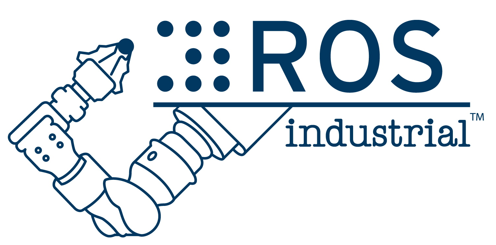
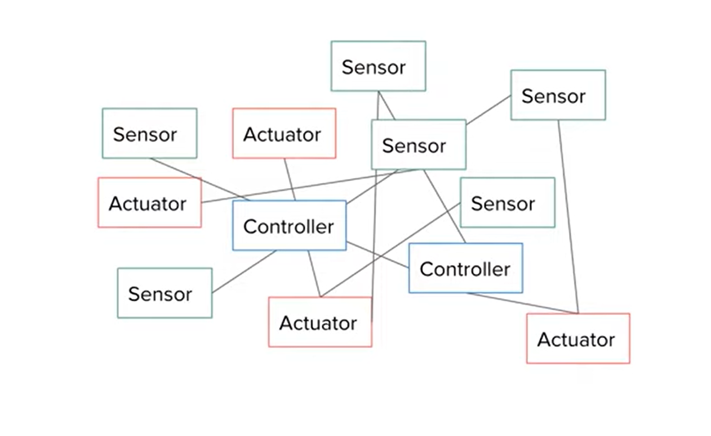
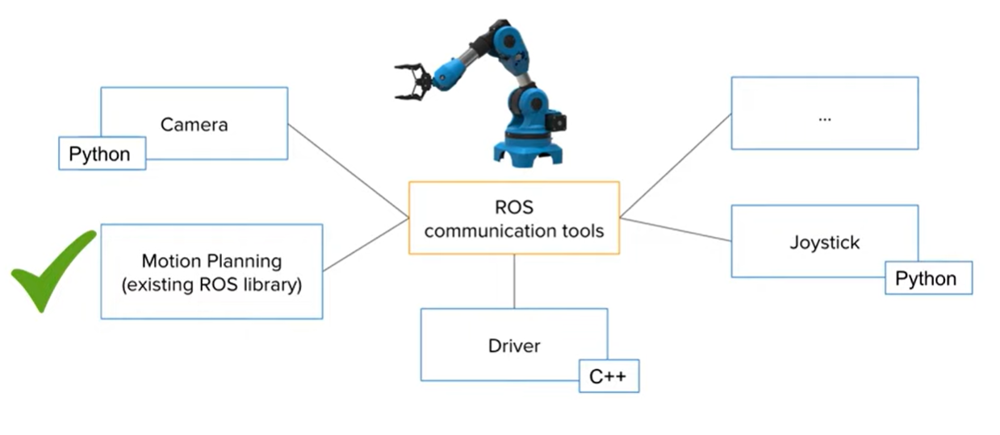
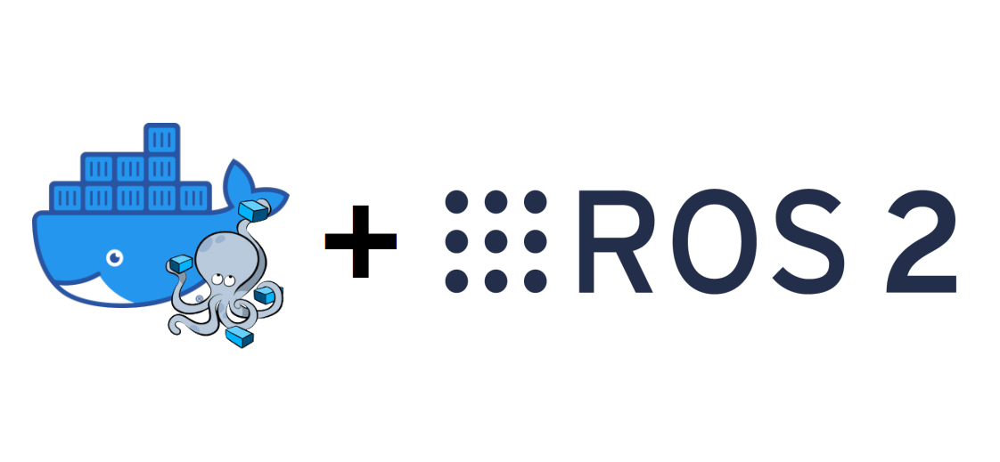

# Robot Operating System ([ROS](https://www.ros.org/)) | [wiki](https://en.wikipedia.org/wiki/Robot_Operating_System)

<a> </a>

full installation @ [docs.ros.org](https://docs.ros.org/en/rolling/Installation/Ubuntu-Install-Debians.html) | netplan, ssh

```bash
    $ sudo apt update && sudo apt install ros-dev-tools
    $ sudo apt install ros-rolling-desktop
    $ source /opt/ros/rolling/setup.bash (put this in .bashrc / $ gedit ~/.bashrc)

```

The [Robot Operating System (ROS)](https://www.ros.org/) is a set of software libraries and tools that help us build robot applications. From drivers to state-of-the-art algorithms, and with powerful developer tools, ROS has what we need for our next robotics project. And it's all open source. { [awesome/ros2](https://fkromer.github.io/awesome-ros2/) } & [programming multiple robots with ros2](https://osrf.github.io/ros2multirobotbook/intro.html).

<a> </a>

#####  [ROS Framework Overview](https://youtu.be/7TVWlADXwRw) | [ROS 2 : Rolling Ridley](https://docs.ros.org/en/rolling/index.html) | [github/ros2](https://github.com/ros2) | [ETH Z : Programming for Robotics - ROS](https://rsl.ethz.ch/education-students/lectures/ros.html) | [ubuntu/what is ros?](https://ubuntu.com/robotics/what-is-ros) | [ROSCON](https://roscon.ros.org/) | [ROS2 Humble Crash course](https://youtu.be/Gg25GfA456o) | [turtlebot-4](https://youtu.be/T3if0aPj0Eo) | [Building a Legged Robot with ROS (Péter Fankhauser)](https://youtu.be/5BkoGug8HhE) | [@jamesbruton](https://www.youtube.com/@jamesbruton/playlists) | [mini-pupper](https://github.com/mangdangroboticsclub/QuadrupedRobot/tree/mini_pupper)


ROS processes are represented as nodes in a graph structure, connected by edges called topics. ROS nodes can pass messages to one another through topics, make service calls to other nodes, provide a service for other nodes, or set or retrieve shared data from a communal database called the parameter server. A process called the ROS Master makes all of this possible by registering nodes to itself, setting up node-to-node communication for topics, and controlling parameter server updates. Messages and service calls do not pass through the master, rather the master sets up peer-to-peer communication between all node processes after they register themselves with the master. This decentralized architecture lends itself well to robots, which often consist of a subset of networked computer hardware, and may communicate with off-board computers for heavy computing or commands. List of ROS [tools](https://en.wikipedia.org/wiki/Robot_Operating_System#Tools), [versions and releases](https://en.wikipedia.org/wiki/Robot_Operating_System#Versions_and_releases) and [configuring your ros2 environment](https://docs.ros.org/en/crystal/Tutorials/Configuring-ROS2-Environment.html).

```bash
    $ ros2 run demo_nodes_cpp talker  ( $ ros2 run package_module nodename )
    $ ros2 run demo_nodes_cpp listener
    $ rqt_graph
    $ ros2 run turtlesim turtlesim_node
    $ ros2 run turtlesim turtle_teleop_key (listen to keystrokes)
```

```bash
    $ ros2 topic list
    $ ros2 node list
    $ ros2 run rplidar_ros rplidar_node
    $ ros2 service list
    $ ros2 service call /stop_motor
    $ ros2 service call /stop_motor std_srvs/srv/Empty
```

ros2 workspace:
```bash
          $ sudo apt install python3-colcon-common-extensions
          $ cd /usr/share/colcon_argcomplete/hook/
          $ gedit ~/.bashrc ( source /usr/share/colcon_argcomplete/hook/)
          $ mkdir ros2_ws > $ cd ros2_ws
          $ mkdir src 
(ros2_ws) $ colcon build > $ ls
          $ gedit ~/.bashrc ( source ~/ros2_ws/install/setup.bash )
```

ros2 parameters and remapping:
```bash
    $ ros2 run rplidar_ros rplidar_node --ros-args -p serial_ports:=/dev/ttyUSB0 -r scan:=scan_1
    $ ros2 run rplidar_ros rplidar_node --ros-args -p serial_ports:=/dev/ttyUSB1 -r __ns:=/scanner2
```
`parameters` (-p) are a way to change the behaviour of ros nodes and `remapping` (-r) is similar to reconfiguring of nodes to publish and subscribe to correct nodes. Use `--ros-args` for ros2 parameters and remapping and `__ns` to change namespace.

ros2 launch files make everything simple in one go ` $ ros2 launch testlaunch.py`.

ros2 application (create packages in src):

```bash
 $ ros2 pkg create my_robot_controller  --build-type ament_
 $ ros2 pkg create my_robot_controller  --build-type ament_python --dependencies rclpy
 $ ls (rclpy in the py package for ros2)
```
'colcon' is the [build tool](https://design.ros2.org/articles/build_tool.html) and 'ament' is the build system. We can have multiple nodes in a package and packages can be dependent on each other. In the package folder > 'package.xml' for meta information.

go to 'ros2_ws' and build the package (forming the workspace):

```bash
 $ colcon build
```

python features and packages: 

```bash
 $ cd packagename
 $ touch feature.py > $ chmod +x feature.py 
```
feature.py:

```python
# /usr/bin/env python3
import rclpy
from rclpy.node import Node

class MyNode(Node):
    def __init__(self):
        super().__init__('first_node') #name of node
        self.get_logger().info('Hello from ROS 2')

def main(args=None):
    rclpy.init(args=args) #initialize ros2 communication
    node = MyNode() #create node
    rclpy.spin(node) #run node indef until killed
    rclpy.shutdown()

if __name__ == '__main__':
    main()
```

Add in `setup.py` of the package to run ros function from terminal. After adding do `$ colcon build ` > `$ source ~/.bashrc` > `$ ros2 run packagename`:

```python
.
.
    entry_points=[
        'console_scripts': [
            "test_node = packagename.nodename:functionname"
        ],
    ]
```

`$ ros2 run packagename` will give us option to run `test_node` :  `$ ros2 run packagename test_node`. For CI/CD of py scripts do :  `$ colcon build --symlink-install` > ` $ source ~/.bashrc `.

```python
class MyNode(Node):
    def __init__(self):
        super().__init__("first_node")
        self.counter_ = 0
        self.create_timer(1.0, self.timer_callback) # every 1 sec prints "Hello"

    def timer_callback(self):
        self.get_logger().info("Hello" + str(self.counter_))
        self.counter_ += 1
```
`$ ros2 node list` > `$ ros2 node info /first_node`  to list all nodes and introspect.

topics: `$ rqt_graph` > `$ ros2 topic list` > `$ ros2 topic info /chatter` > `$ ros2 interface show std_msgs/msg/String`.

`$ ros2 topic echo /chatter` ( it creates a subscriber node ).

ros2 publisher in python node: ` $ touch tele.py `:

```python
    
    import rclpy
    from rclpy.node import Node
    from geometry_msgs.msg import Twist

    class DrawCircleNode(Node):
        def __init__(self):
            super().__init__("draw circle")
            self.cmd_vel_pub_ = self.create_publisher(Twist, '/turtle1/cmd_vel', 10)
            self.timer = self.create_timer(0.5, self.send_velocity_command)
            self.get_logger().info("circle node has been started")

        def send_velocity_command(self):
            msg = Twist()
            msg.linear.x = 2.0
            msg.angular.z = 1.0
            self.cmd_vel_pub.publish(msg)

    def main(args=None):
        rclpy.init(args=args)
        node = DrawCircleNode()
        rclpy.spin(node)
        rclpy.shutdown()

. #in setup.py
.
.
    entry_points=[
        'console_scripts': [
            "draw_circle = packagename.filename:main"
        ],
    ]
```

In `package.xml` add `<depend>geometry_msgs</depend>`, `<depend>turtlesim</depend>`. Check data type with : ` $ros2 topic info /turtle1/cmd_vel`.

ROS 2 Subscriber: ` $ ros2 topic info /turtle1/pose ` > ` $ ros2 interface show turtlesim/msg/Pose ` > ` $  touch pose_subscriber.py`  

```python
    import rclpy
    from rclpy.node import Node
    from turtlesim.msg import Pose

    class PoseSubscriberNode(Node):
        def __init__(self):
            super.__init__("pose_subscriber")
            self.pose_subscriber_ = self.create_subscription(Pose, "/turtle1/pose", self.pose_callback, 10)
        def pose_callback(self, msg: Pose):
            self.get_logger().info(str(msg))

    def main(args=None):
        rclpy.init(args=args)
        node = PoseSubscriberNode()
        rclpy.spin(node)
        rclpy.shutdown()
```

ros2 service : ` $ ros2 service list` > ` $ ros2 run demo_nodes_cpp add_two_ints_server ` > ` $ ros2 service` > ` $ ros2 service type /add_two_ints`.

example service call : ` $ ros2 service call /add_two_ints example_interfaces/srv/AddTwoInts "{'a' : 2,'b' : 5}" `.

Quality of Service (QoS) : QoS helps to set standard configurations in ros2.

```bash
    $ ros2 topic pub /test std_msgs/msg/Int32 "data: 42" --qos-reliability "best_effort"
    $ ros2 topic echo /test  --qos-reliability "best_effort"
```

## ROS 2 Projects: 
## + ROS 2 Navigation: [@rosnav](./rosproj/nav/README.MD)

## + ROS 2 Robotic Arm 6 DoF: [@rosarm](./rosproj/6dof/README.MD)

## + ROS 2 Point Cloud: [@rospcloud](./rosproj/pclab/README.MD)


#### ROS 2 RESOURCES: [An Updated Guide to Docker and ROS 2](https://roboticseabass.com/2023/07/09/updated-guide-docker-and-ros2/), @[webviz](https://github.com/cruise-automation/webviz), @[rosbag.js](https://github.com/cruise-automation/rosbag.js), [Web-Based Visualization using ROS JavaScript Library : ROS Bridge](https://roboticsknowledgebase.com/wiki/tools/roslibjs/)




##  [ROS Industrial](https://rosindustrial.org/)

ROS-Industrial is an open-source project that extends the advanced capabilities of ROS software to industrial relevant hardware and applications.

## [NVIDIA Issac ROS](https://developer.nvidia.com/isaac-ros)

<a> </a>

[How do we add LIDAR to a ROS robot?](https://youtu.be/eJZXRncGaGM)
[How to get your robot to see in 3D! (Depth Cameras in ROS)](https://youtu.be/T9xZ22i9-Ys)
[Making Your First ROS Package](https://youtu.be/Y_SyQXTL2XU)
[How do we describe a robot? With URDF! ](https://youtu.be/CwdbsvcpOHM), [ROS Aerial Robotics WG meeting](https://youtu.be/qMt5bOKZw-M?si=bLPPLQojXESnKxBE), [6 degrees of Freedom Robot Manipulator Modeling in ROS2 and Visualization in RViz2 - URDF and Python](https://youtu.be/t67JaKiZY_U?si=GTZicORtiXSA82iq), [Robot Operating System (ROS) Course](https://youtu.be/dDODrSy6cYU?si=_Ix4HeBUdGavZUNk)

resources: [Articulated Robotics](https://www.youtube.com/@ArticulatedRobotics), [Robotics Back End](https://www.youtube.com/@RoboticsBackEnd), [Learn robotics with ROS](https://www.youtube.com/@learn-robotics-with-ros/videos), [ROS Developers OPEN Class](https://www.youtube.com/watch?v=RQ5sAz23pLM&list=PLK0b4e05LnzbuxWCdip-2Tf-SIiZle5NA)