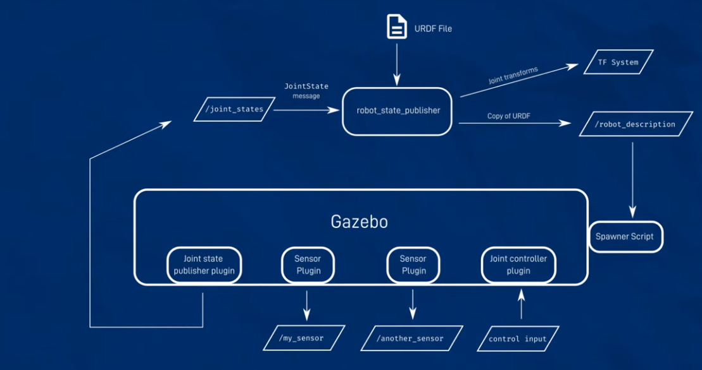
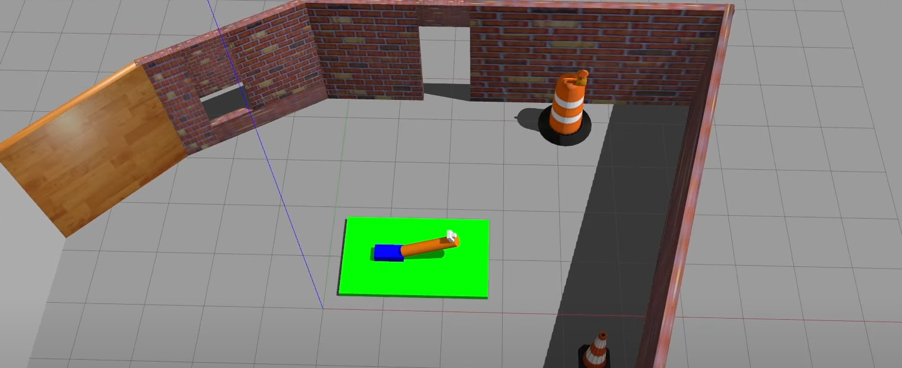
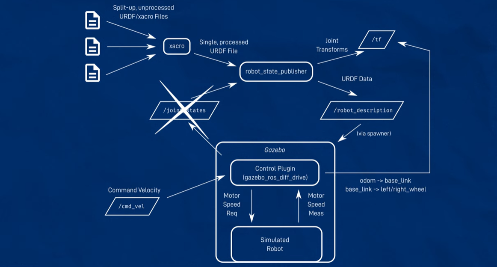

# ROS 2 Gazebo

ROS 2 Gazebo stands as a pivotal tool within the ROS 2 ecosystem, providing a comprehensive simulation environment for robotic systems. The key features of ROS 2 Gazebo encompass a wide range of functionalities that enable users to simulate robotic systems in dynamic environments. Let's delve deeper into these features:

### 🌸 Physics Simulation:
`Definition`: ROS 2 Gazebo integrates physics engines such as ODE (Open Dynamics Engine) and Bullet to simulate realistic robot dynamics and interactions with the environment.

`Significance`: Accurate physics simulation is crucial for testing and validating robot behaviors, including locomotion, manipulation, and interaction with objects in the environment.

### 🌸 Sensor Simulation:
`Definition`: ROS 2 Gazebo provides the capability to emulate various sensors commonly used in robotics, including cameras, LiDAR, IMUs (Inertial Measurement Units), and depth sensors.

`Significance`: Sensor simulation allows developers to test sensor configurations, calibration methods, and perception algorithms in a controlled virtual environment before deploying them on physical robots.

### 🌸 Environment Modeling:
`Definition`: Users can create and customize virtual environments within Gazebo, including indoor and outdoor scenes, terrains, and obstacles.

`Significance`: Environment modeling enables the simulation of diverse real-world scenarios, facilitating testing under different conditions such as lighting variations, terrain irregularities, and cluttered environments.

### 🌸 Visualization and Debugging Tools:
`Definition`: ROS 2 Gazebo provides visualization and debugging tools, including a graphical user interface (GUI) and integration with ROS tools such as RViz.

`Significance`: Visualization tools allow users to monitor the simulation in real-time, visualize robot states, sensor data, and environmental factors, and debug issues during simulation runtime.

### 🌸 Multi-Robot Simulation:
`Definition`: ROS 2 Gazebo supports the simulation of interactions between multiple robots within the same environment.

`Significance`: Multi-robot simulation enables the testing of coordination, cooperation, and communication algorithms between robotic agents, facilitating the development of swarm robotics systems and multi-agent applications.

### 🌸 Dynamic Object Simulation:
`Definition`: Users can incorporate dynamic objects such as movable obstacles, tools, or other entities that interact with the robot within the simulation environment.

`Significance`: Dynamic object simulation allows for testing scenarios involving dynamic changes in the environment, such as obstacle avoidance, object manipulation, and collaborative tasks with external entities.

### 🌸 Real-time Simulation:
`Definition`: ROS 2 Gazebo offers techniques for achieving real-time performance in simulations, ensuring that the simulation runs at a speed comparable to real-world operations.

`Significance`: Real-time simulation is essential for applications requiring time-sensitive feedback and control, such as teleoperation, closed-loop control, and hardware-in-the-loop (HIL) testing.

[ [Gazebo ROS2](https://classic.gazebosim.org/tutorials?tut=ros2_overview), [Gazebo Ignition](https://gazebosim.org/api/gazebo/2.10/index.html) ]

```bash
    $ sudo apt install ros-foxy-gazebo-ros-pkgs
    $ gazebo /usr/share/gazebo-11/worlds/seesaw.world
```
Gazebo uses a similar format to URDF called SDF and Gazebo can convert URDF to SDF.



```bash
    $ ros2 launch gazebo_ros gazebo.launch.py
```

To spawn our robot (URDF) to Gazebo:
```bash
    $ ros2 run gazebo_ros spawn_entity.py -topic robot_description -entity mybot
    $ ros2 launch urdf_example rsp_sim.launch.py
    $ ros2 launch urdf_example rsp_sim.launch.py world:=~/my_world.world
```

gazebo collapses all the fixed joints into a single entity. To add cameras in gazebo world, we have to add optical_camera link in the xacro file.

```xml
    <gazebo reference="camera_link">
        <sensor type="depth" name="my_camera">
            <update_rate>20</update_rate>
            <visualize>true</visualize>
            <camera name="cam"></camera>
            <plugin name="camera_controller" filename="libgazebo_ros_camera.so">
            </plugin>
        </sensor>
    </gazebo>
```



Resources : [Simulating Robots with Gazebo and ROS ](https://youtu.be/laWn7_cj434?si=IiQRkcDOkuqvaQrk), [Driving your virtual robot!](https://youtu.be/IjFcr5r0nMs?si=RC_vNRPyOH3L-FVD)

## Driving our virtual robot in Gazebo:

```bash
    $ cd dev_ws/
    $ source install/setup.bash
    $ ros2 launch articubot_one rsp.launch.py use_sim_time:=true
    $ ros2 param get /robot_state_publisher use_sim_time
```

```bash
    $ ros2 launch gazebo_ros gazebo.launch.py
```
```bash
    $ ros2 run gazebo_ros spawn_entity.py -topic robot_description -entity bot_name
```
launch_sim.launch.py: 

```python

import os

from ament_index_python.packages import get_package_share_directory


from launch import LaunchDescription
from launch.actions import IncludeLaunchDescription
from launch.launch_description_sources import PythonLaunchDescriptionSource

from launch_ros.actions import Node


def generate_launch_description():


    # Include the robot_state_publisher launch file, provided by our own package. 
    # Force sim time to be enabled
    # !!! MAKE SURE YOU SET THE PACKAGE NAME CORRECTLY !!!

    package_name='articubot_one' #<--- CHANGE ME

    rsp = IncludeLaunchDescription(
                PythonLaunchDescriptionSource([os.path.join(
                    get_package_share_directory(package_name),'launch','rsp.launch.py'
                )]), launch_arguments={'use_sim_time': 'true'}.items()
    )

    # Include the Gazebo launch file, provided by the gazebo_ros package
    gazebo = IncludeLaunchDescription(
                PythonLaunchDescriptionSource([os.path.join(
                    get_package_share_directory('gazebo_ros'), 'launch', 'gazebo.launch.py')]),
             )

    # Run the spawner node from the gazebo_ros package. 
    # The entity name doesn't really matter if you only have a single robot.
    spawn_entity = Node(package='gazebo_ros', executable='spawn_entity.py',
                        arguments=['-topic', 'robot_description',
                                   '-entity', 'my_bot'],
                        output='screen')


    # Launch them all!
    return LaunchDescription([
        rsp,
        gazebo,
        spawn_entity,
    ])

```

Combining everything into one ros file : `    $ ros2 launch articubot_one launch_sim.launch.py`.



We need to add the control plugin to xacro file:

```xml
    <xacro:include filename:="gazebo_control.xacro" />
```
 To describe the differential_drive plugin :

 ```xml
    <gazebo>
        <plugin name="diff_drive" filename="libgazebo_ros_diff_drive.so">
            <!-- wheel information  -->
            <left_joint>left_wheel_joint</left_joint>
            <right_joint>right_wheel_joint</right_joint>
            <wheel_separation>0.35</wheel_separation>
            <wheel_diameter>0.1</wheel_diameter>

            <!-- limits -->
            <max_wheel_torque>200</max_wheel_torque>
            <max_wheel_acceleration>10.0</max_wheel_acceleration>

            <!-- output -->
            <odometry_frame>odom</odometry_frame>
            <robot_base_frame>base_link</robot_base_frame>

            <publish_odom>true</publish_odom>
            <publish_odom_tf>true</publish_odom_tf>
            <publish_wheel_tf>true</publish_wheel_tf>
        </plugin>
    <gazebo/>
 ```

To send commands to the robot:

```bash
    $ ros2 run teleop_twist_keyboard teleop_twist_keyboard
```

To run with Joystick:
```bash
    $ ros2 run teleop_twist_joy -- teleop_node joy -- joy_node
```

Resources : [[Build the Sentinel Robots from Matrix for Gazebo Simulator](https://www.youtube.com/watch?v=B8pipPGL7KE&list=PLK0b4e05LnzbsYJ5WH-S5td2aclJqpDYo)]

