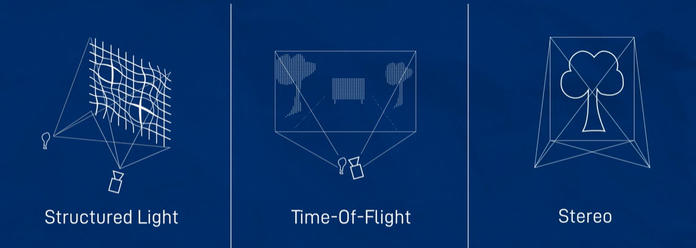

# ROS2 RGB, RGB-D and LiDAR

LiDAR, or Light Detection and Ranging, is a remote sensing method that uses a laser to measure the distance to a target and create a 3D map of the surrounding environment. It works by sending a short pulse of light and measuring the time it takes for the reflected light to return to the receiver. The reflected light is recorded as millions of points, called a “point cloud,” that represent the 3D positions of objects on the surface. 


In ROS 2, Msg type for 2D LiDAR: `sensor_msgs/LaserScan` and Msg type for 3D LiDAR: `sensor_msgs/PointCloud2`

In the main robot xacro file : `<xacro:include filename="lidar.xacro">` 

In `lidar.xacro` file:

```xml
    <?xml version="1.0">
    <robot xlmns:xacro="http://www.ros.org/wiki/xacro">
        <joint name="laser_joint" type="fixed">
            <parent link="chassis" />
            <child link="laser_frame" />
            <origin xyz="0.1 0 0.175" rpy="0 0 0" />
        <joint />

        <link name="laser_frame">
            <visual>
                <geometry>
                    <cylinder radius="0.05" length="0.04">
                </geometry>
                <material name="red" />
            </visual>
            <collision>
                <geometry>
                    <cylinder radius="0.05" length="0.04" />
                </geometry>
            </collision>
            <xacro:inertial_cylinder mass="0.1" length="0.04" radius="0.05">
                <origin xyz="0 0 0" rpy="0 0 0">
            </xacro:inertial_cylinder>
        </link>

        <gazebo reference="laser_frame">
                <material>Gazebo/Red</material>

                <sensor name="laser" type="ray">
                    <pose> 0 0 0 0 0 0 </pose>
                    <visualize>true</visualize>
                    <update_rate>10</update_rate>
                    <ray>
                        <scan>
                            <horizontal>
                                <samples>360</samples>
                                <min_angle>-3.14</min_angle>
                                <max_angle>3.14</max_angle>
                            </horizontal>
                        </scan>
                        <range>
                            <min>0.3</min>
                            <max>12</max>
                        </range>
                    </ray>
                    <plugin name="laser_controller" filename="libgazebo_ros_ray_sensor.so">
                        <ros>
                            <argument>~/out:=scan</argument>
                        </ros>
                        <output_type>sensor_msgs/LaserScan</output_type>
                        <frame_name>laser_frame</frame_name>
                    </plugin>
                </sensor>
            </gazebo>
    </robot>
```

rplidar.launch.py:

```python
import os
from launch import LaunchDescription
from launch_ros.actions import Node

def generate_launch_description():

    return LaunchDescription([

        Node(
            package='rplidar_ros',
            executable='rplidar_composition',
            output='screen',
            parameters=[{
                'serial_port': '/dev/serial/by-path/platform-fd500000.pcie-pci-0000:01:00.0-usb-0:1.3:1.0-port0',
                'frame_id': 'laser_frame',
                'angle_compensate': True,
                'scan_mode': 'Standard'
            }]
        )
    ])
```

Then:
```bash
    $ ros2 launch articubot_one launch_sim.launch.py world:=./src/articubot_one/worlds/obstacles.world
```
To add a real LiDAR hardware: ` $ sudo apt install ros-foxy-rplidar-ros`

```bash
    $ ros2 run rplidar_ros rplidar_composition --ros-args -p serial_port:=/dev/ttyUSB0 -p frame_id:=laser_frame -p angle_compensate:=true -p scan_mode:=Standard
```

Then check the lidar points in `$ rviz2`. To check the serial ports : `$ ls /dev/serial/by-`. To stop the motor : ` $ ros2 service call ` or directly `$ ros2 service call /stop_motor std_srvs/srv/Empty {}`. To stop absolute : ` $ killall rplidar_composition`.

# RGB Camera:

8 bits : 0 - 255, 3 channels (R, G, B) | Camera → [ Driver Node ] → [ sensor_msgs/Image ] / [ sensor_msgs/CompressedImage ]→ [ Algorithms & stuff ].

The [`image_transport library/nodes`] does all the conversions between Image and CompressedImage. The unprocessed image is at [`/image_raw`] and for compressed images [`/image_raw/compressed`].

[ sensor_msgs/Image ] ; [ sensor_msgs/CameraInfo ]


In the main robot xacro file : `<xacro:include filename="camera.xacro">` 


In `camera.xacro` file:

```xml
    <joint name="camera_joint" type="fixed">
        <parent link="chassis"/>
        <child link="camera_link"/>
        <origin xyz="0.305 0 0.08" rpy="0 0 0"/>
    </joint>

    <link name="camera_link">
        <visual>
            <geometry>
                <box size="0.010 0.03 0.03">
            </geometry>
            <material name="red">
        </visual>
    </link>

    <joint name="camera_optical_joint" type="fixed">
        <parent link="camera_link"/>
        <child link="camera_link_optical"/>
        <origin xyz="0 0 0" rpy="${-pi/2} 0 ${-pi/2}"/>
    </joint>

    <link name="camera_link_optical"></link>

    <gazebo reference="camera_link">
            <material>Gazebo/Red</material>
            <sensor name="camera" type="camera">
                <pose>0 0 0 0 0 0</pose>
                <visualize>true<visualize>
                <update_rate>10</update_rate>
                <camera>
                    <horizontal_fov>1.089</horizontal_fov>
                    <image>
                        <format>R8G8B8</format>
                        <width>640</width>
                        <height>480</height>
                    </image>
                    <clip>
                        <near>0.05</near>
                        <far>8.0</far>
                    </clip>
                </camera>
                <plugin>
                    <ros>
                        <argument>~/out:=scan</argument>
                    </ros>
                    <output_type>sensor_msgs/LaserScan</output_type>
                    <frame_name>camera_link_optical</frame_name>
                </plugin>
            </sensor>
    </gazebo>
```

To test : `$ colcon build --symlink-install` → ` $ source install/setup.bash` →  ` $ ros2 launch articubot_one launch_sim.launch.py world:=./src/articubot_one/worlds/obstacles.world `.

Plugins for image compression: ` $ sudo apt install ros-foxy-image-transport-plugins` → ` $ sudo apt install ros-foxy-rqt-image-view`  → ` $ ros2 run rqt_image_view rqt_image_view`.

Next : ` $ ros2 run image_transport list_transports`.

To get image of one type and republish it to another type : ` $ ros2 run image_transport republish compressed raw --ros-args -r in/compressed:=/camera/image_raw/compressed -r out:=/camera/image_raw/uncompressed`.

## Connecting to a real RGB camera: 

`$ sudo apt install libraspberrypi-bin v4l-utils ros-foxy-v4l2-camera ros-foxy-image-transport-plugins ros-foxy-rqt-image-view` → ` $ sudo usermod -aG video username`.

To check camera : ` $ vcgencmd get_camera `  →  ` $ raspistill -k` (to stream data from camera).
If video for linux subsystem can see it : ` $ v4l2-ctl --list-devices`.

To run video for linux driver : ` $ ros2 run v4l2_camera v4l2_camera_node --ros-args -p image_size:="[640, 480]" -p camera_frame_id:=camera_link_optical`  →  ` $ ros2 run rqt_image_view`.

```python
import os

from launch import LaunchDescription
from launch_ros.actions import Node

def generate_launch_description():


    return LaunchDescription([

        Node(
            package='v4l2_camera',
            executable='v4l2_camera_node',
            output='screen',
            parameters=[{
                'image_size': [640,480],
                'camera_frame_id': 'camera_link_optical'
                }]
    )
    ])
```

To run with the launch file : ` $ pluma camera.launch.py ` → ` $ ros2 launch camera.launch.py `.

# Depth Cameras (RGB-D):



Depth image →  3D projection →  Point cloud. Data is stored as 32 bit float. ROS 2 also provides the `depth_image_proc` package which is in image_pipelline repository/metapackage/stack.

To simulate a depth camera in gazebo: In the main robot xacro file : `<xacro:include filename="depth_camera.xacro">` 


In `depth_camera.xacro` file:

```xml
    <joint name="camera_joint" type="fixed">
        <parent link="chassis"/>
        <child link="camera_link"/>
        <origin xyz="0.305 0 0.08" rpy="0 0 0"/>
    </joint>

    <link name="camera_link">
        <visual>
            <geometry>
                <box size="0.010 0.03 0.03">
            </geometry>
            <material name="red">
        </visual>
    </link>

    <joint name="camera_optical_joint" type="fixed">
        <parent link="camera_link"/>
        <child link="camera_link_optical"/>
        <origin xyz="0 0 0" rpy="${-pi/2} 0 ${-pi/2}"/>
    </joint>

    <link name="camera_link_optical"></link>

    <gazebo reference="camera_link">
            <material>Gazebo/Red</material>
            <sensor name="camera" type="depth">
                <pose>0 0 0 0 0 0</pose>
                <visualize>true<visualize>
                <update_rate>10</update_rate>
                <camera>
                    <horizontal_fov>1.089</horizontal_fov>
                    <image>
                        <format>B8G8R8</format>
                        <width>640</width>
                        <height>480</height>
                    </image>
                    <clip>
                        <near>0.05</near>
                        <far>8.0</far>
                    </clip>
                </camera>
                <plugin name="camera_controller" filename="lib_gazebo_ros"> 
                    <frame_name>camera_link_optical</frame_name>
                    <min_depth>0.1</min_depth>
                    <max_depth>0.1</max_depth>
                </plugin>
            </sensor>
    </gazebo>
```

to run : ` $ colcon build --symlink-install` → ` $ source install/setup.bash`.

## Connect a real depth camera (DepthAI OAK-D):

OAK = OpenCV AI Kit → ` $ lsusb` | [github.com/luxonis/depthai-ros](https://github.com/luxonis/depthai-ros), [(Depth Cameras in ROS)](https://youtu.be/T9xZ22i9-Ys?si=oMiUPiosIMR4AeDp).
