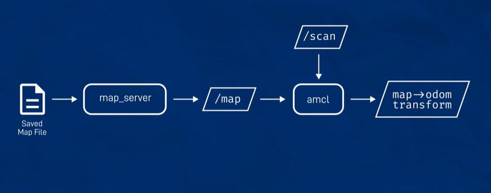
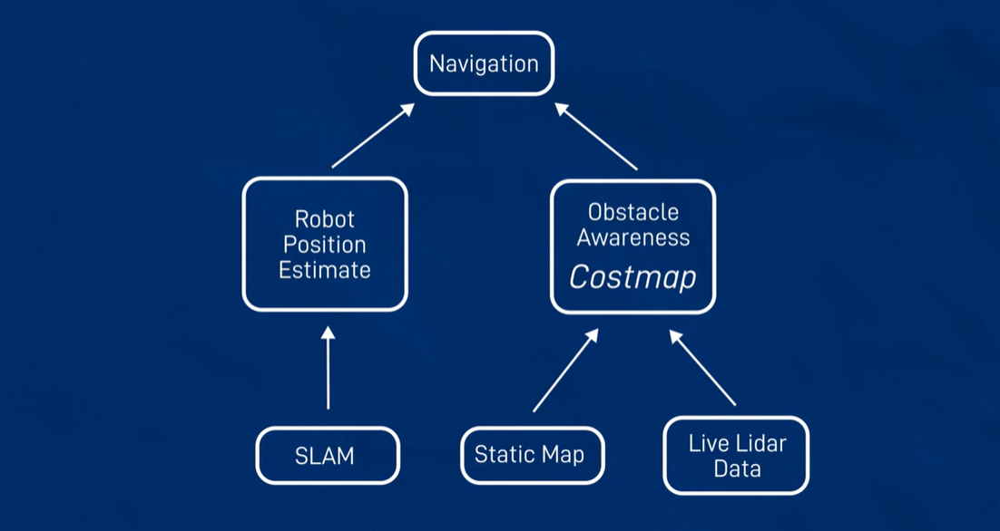
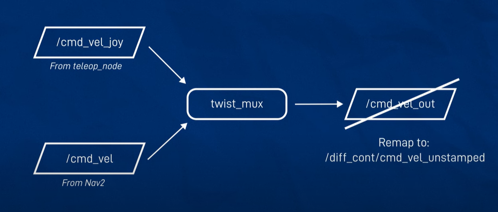

# ROS2 Nav2 | SLAM :
ROS 2 Navigation Stack (Nav2) serves as the cornerstone for autonomous navigation in robotics, providing a comprehensive suite of tools and algorithms for path planning, obstacle avoidance, and localization. The architecture of ROS 2 Navigation Stack (Nav2) is designed to provide a modular and flexible framework for autonomous navigation in robotic systems. Let's explore its key components and interactions:

### 🌸 Planner:

`Definition`: The planner component is responsible for generating a global path from the robot's current position to its goal location.
`Functionality`: It utilizes algorithms such as A* (A-star), Dijkstra, or potential fields to compute an optimal or near-optimal path while considering obstacles and constraints.
`Interaction`: The planner communicates with the costmap to access the environment's occupancy information and with the controller to execute the planned path.

### 🌸 Controller:

`Definition`: The controller component is responsible for executing the planned path by generating low-level control commands for the robot's actuators.
`Functionality`: It implements trajectory tracking algorithms to ensure the robot follows the planned path accurately while considering dynamics and constraints.
`Interaction`: The controller receives input from the planner or local planner and generates control commands to drive the robot along the planned trajectory.

### 🌸 Recovery Behaviors:

`Definition`: Recovery behaviors are strategies employed by Nav2 to handle navigation failures, unexpected obstacles, or other unforeseen circumstances.
`Functionality`: They provide a hierarchical framework for implementing various recovery strategies, such as obstacle clearing, replanning, or fallback maneuvers, to ensure navigation robustness.
`Interaction`: Recovery behaviors interact with the planner, controller, and costmap to diagnose navigation failures, trigger appropriate recovery actions, and resume navigation.

### 🌸 Costmap:

`Definition`: The costmap component represents the robot's environment as a grid map with different cost values assigned to cells based on occupancy, traversability, and other factors.
`Functionality`: It provides a spatial representation of obstacles, static and dynamic, enabling path planning and obstacle avoidance.
`Interaction`: The costmap interacts with sensor data to update occupancy information, with the planner to compute collision-free paths, and with the controller to ensure obstacle avoidance during trajectory execution.

### 🌸 Localization:

`Definition`: The localization component estimates the robot's pose (position and orientation) within a known map.
`Functionality`: It employs localization algorithms, such as Monte Carlo Localization (MCL) or Extended Kalman Filter (EKF), to estimate the robot's pose based on sensor measurements and motion models.
`Interaction`: Localization interacts with the costmap to integrate sensor measurements with map information and provide accurate pose estimates for path planning and execution.

### 🌸 Interactions:

`Planner-Controller Interaction`: The planner generates a global path, which is then executed by the controller through trajectory tracking.
`Planner-Costmap Interaction`: The planner accesses occupancy information from the costmap to compute collision-free paths and avoid obstacles.
`Recovery-Costmap Interaction`: Recovery behaviors utilize costmap information to identify obstacles and plan appropriate recovery actions.
`Localization-Costmap Interaction`: Localization updates the costmap with pose estimates to align sensor measurements with the map.

Grid SLAM : slam_toolbox is a grid_map based approach. 

For TF Frames - Odom (Odometry Origin) & map "World/global" origin* teh relevant Topics are : [/odom] (nav_msgs/msg/Odometry) [same position info as odom → base_link TF ; velocity, covariances] & [/map] (nav_msgs/msg/OccupancyGrid) [grid map occupancy data]

Install slam_toolbox : ` $ sudo apt install ros-foxy-slam-toolbox `.

robot_core.xacro: [github.com/robot_core.xacro](https://github.com/joshnewans/articubot_one/blob/main/description/robot_core.xacro)

```bash
    $ cp /opt/ros/foxy/share/slam_toolbox/config/mapper_params_online_async.yaml dev_ws/src/articubot_one/config/
```

This copies the following file : [github.com/mapper_params_online_async.yaml](https://github.com/joshnewans/articubot_one/blob/main/config/mapper_params_online_async.yaml). Then to build the file : ` $ colcon build --symlink-install`  → ` $ source install/setup.bash`  → ` $ ros2 launch articubot_one launch_sim.launch.py world:=./src/articubot_one/worlds/obstacles.world`.

To run in Rviz : ` $ rviz2 -d src/articubot_one/config/main.rviz`. Then,

` $ ros2 launch slam_toolbox online_async_launch.py params_file:=./src/articubot_one/config/mapper_params_online_async.yaml use_sim_time:=true` :

online_async_launch.py :
```python
import os

from launch import LaunchDescription
from launch.actions import DeclareLaunchArgument, LogInfo
from launch.conditions import UnlessCondition
from launch.substitutions import LaunchConfiguration, PythonExpression
from launch_ros.actions import Node
from ament_index_python.packages import get_package_share_directory
from nav2_common.launch import HasNodeParams


def generate_launch_description():
    use_sim_time = LaunchConfiguration('use_sim_time')
    params_file = LaunchConfiguration('params_file')
    default_params_file = os.path.join(get_package_share_directory("articubot_one"),
                                       'config', 'mapper_params_online_async.yaml')

    declare_use_sim_time_argument = DeclareLaunchArgument(
        'use_sim_time',
        default_value='true',
        description='Use simulation/Gazebo clock')
    declare_params_file_cmd = DeclareLaunchArgument(
        'params_file',
        default_value=default_params_file,
        description='Full path to the ROS2 parameters file to use for the slam_toolbox node')

    # If the provided param file doesn't have slam_toolbox params, we must pass the
    # default_params_file instead. This could happen due to automatic propagation of
    # LaunchArguments. See:
    # https://github.com/ros-planning/navigation2/pull/2243#issuecomment-800479866
    has_node_params = HasNodeParams(source_file=params_file,
                                    node_name='slam_toolbox')

    actual_params_file = PythonExpression(['"', params_file, '" if ', has_node_params,
                                           ' else "', default_params_file, '"'])

    log_param_change = LogInfo(msg=['provided params_file ',  params_file,
                                    ' does not contain slam_toolbox parameters. Using default: ',
                                    default_params_file],
                               condition=UnlessCondition(has_node_params))

    start_async_slam_toolbox_node = Node(
        parameters=[
          actual_params_file,
          {'use_sim_time': use_sim_time}
        ],
        package='slam_toolbox',
        executable='async_slam_toolbox_node',
        name='slam_toolbox',
        output='screen')

    ld = LaunchDescription()

    ld.add_action(declare_use_sim_time_argument)
    ld.add_action(declare_params_file_cmd)
    ld.add_action(log_param_change)
    ld.add_action(start_async_slam_toolbox_node)

    return ld

```

To list the services available : ` $ ros2 service list`. Save Map (for external use) and Serialize map (for reuse within ros2) from ros2 plugin. [Save Map] saves two files `my_map_save.pgm` and `my_map_save.yaml`. [Serialize Map] saves two files `my_map_serial.data` and `my_map_serial.posegraph`.

In [github.com/mapper_params_online_async.yaml](https://github.com/joshnewans/articubot_one/blob/main/config/mapper_params_online_async.yaml), if we change # ROS Parameters (mode: mapping) to (mode: localization). 

We can use our generated maps in other systems, such as the AMCL : Adaptive Monte Carlo Localisation (part of teh Nav2 stack). To install Nav2 : ` $ sudo apt install ros-foxy-navigation2 ros-foxy-nav2-bringup ros-foxy-turtlebot3*`. 



To run that : ` $ ros2 run nav2_map_server map_server --ros-args -p yaml_filename:=my_map_save.yaml -p use_sim_time:=true`. To activate, run the following in a different terminal : ` $ ros2 run nav2_util lifecycle_bringup map_server`.

Then : ` $ ros2 run nav2_amcl amcl --ros-args -p use_sim_time:=true` → ` $ ros2 run nav2_util lifecycle_bringup amcl`.

# Navigation:

Plan and execute a safe trajectory from an initial pose to a target pose. We need `Robot Position Estimate`!


In the Costmap, high costs are to be avoided and low cost regions are preferred.

Install : ` $ sudo apt install ros-foxy-twist-mux`.

Our controller is expecting the command velocities on `/diff_cont/cmd_vel_unstamped` vs `/cmd_vel`.



file: [twist_mux.yaml](https://github.com/joshnewans/articubot_one/blob/main/config/twist_mux.yaml). Then,

``` 
$ ros2 run twist_mux twist_mux --ros-args --params-file ./src/articubot_one/config/twist_mux.yaml -r cmd_vel_out:=diff_cont/cmd_vel_unstamped 
$ source install/setup.bash
$ ros2 launch articubot_one launch_sim.launch.py world:=./src/articubot_one/worlds/obstacles.world
$ ros2 launch slam_toolbox online_async_launch.py params_file:=./src/articubot_one/config/mapper_params_online_async.yaml use_sim_time:=true
$ ros2 launch nav2_bringup navigation_launch.py use_sim_time:=true
```
We can view the costmap in Rviz2.


resources : [Easy SLAM with ROS using slam_toolbox](https://youtu.be/ZaiA3hWaRzE?si=rN1tTIZ1yEmvJGL1), [Making robot navigation easy with Nav2 and ROS!](https://youtu.be/jkoGkAd0GYk?si=DK22UF4dDbrAx1GJ)