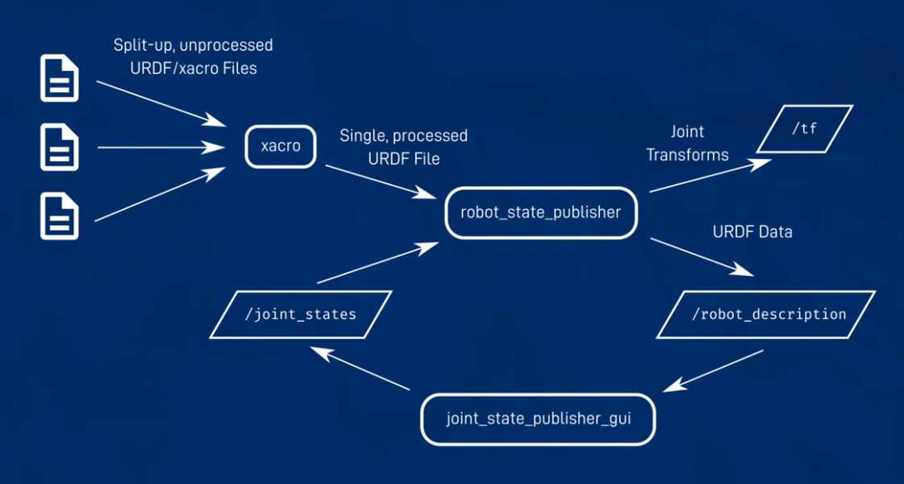

# ROS 2 : Unified Robot Description Format (URDF)

```xml

    <?xml version="1.0"?>
    <robot name="robot">

            <link>
            </link>

            <joint>
            </joint>

            <link>
            </link>

    </robot>

```


 The `<link name="arm_link">` tag has options to specify three different characteristics : `<visual>`, `<collision>` and `<inertial>`.

 In the `<visual>` tag, we can specify three different characteristics : `<geometry>`, `<origin>` and `<material>`. <br />
The `<collision>` tag is used for Physics collision calculations : `<geometry>` and `<origin>`.

The `<inertial>` tag is also used for physics calculations, about how the links responds to forces. The properties are `<mass>`, `<origin>` and `<inertia>`.

<hr />

The `<joint>` tag :

```xml
    <joint name="arm_joint" type="revolute">
        <parent link="slider_link" />
        <child link="arm_link"> 
        <origin xyz="0.25 0 0.15" rpy="0 0 0" />
        <axis xyz="0 -1 0" />
        <limit lower="0" upper="${pi/ 2}" velocity="100" effort="100" />
    </joint>
```

## Using xacro to make things easier:

To enable xacro, add `<robot xmlns:xacro="http://www.ros.org/wiki/xacro">`:




We can visualize with Rviz. | [How do we describe a robot? With URDF!](https://youtu.be/CwdbsvcpOHM?si=VQqJcrBY-EZPAJDh), [Creating a rough 3D model of our robot with URDF](https://youtu.be/BcjHyhV0kIs?si=0jZzdozibFmpXwMJ)