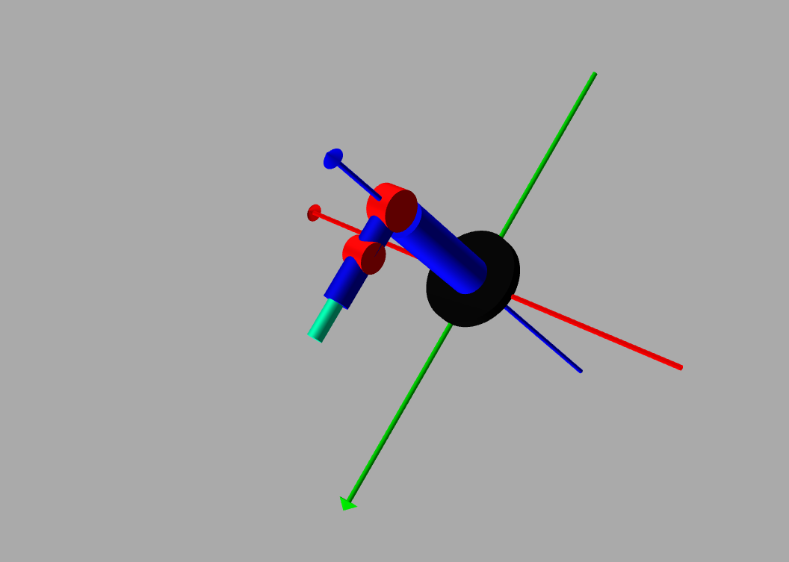
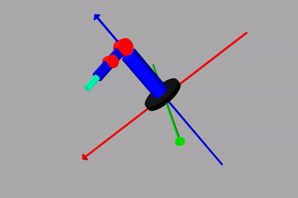

# Manipulation Planning : 6 D-o-F ros 2 with URDF

Serial / Chain Manipulators: [CREATING A WORKSPACE AND PUBLISHER](https://www.clearpathrobotics.com/assets/guides/kinetic/ros/Creating%20publisher.html) : ` $ mkdir -p robotic_arm_ws/src` , where `src` will contain all the packages. Then ` $ cd robotic_arm_ws/` > ` $ colcon build `. It will create `build`, `install` and `log` directories.

A trivial workspace might look like:

```python

workspace_folder/
    src/
      cpp_package_1/
          CMakeLists.txt
          include/cpp_package_1/
          package.xml
          src/

      py_package_1/
          package.xml
          resource/py_package_1
          setup.cfg
          setup.py
          py_package_1/
      ...
      cpp_package_n/
          CMakeLists.txt
          include/cpp_package_n/
          package.xml
          src/

```


Create a ros2 python package:  `$ ros2 pkg create --build-type ament_python <package_name>` and ` $ ros2 pkg create --build-type ament_python --node-name my_node my_package`. To build package, go outside `src` : ` $ colcon build` and to build a single package : ` $ colcon build --packages-select my_package`. To use package: ` $ ros2 run my_package my_node`. To link package with `install/setup.sh` : ` $ source install/setup.bash`. In bashrc add : `source ~/robotic_arm_ws/install/setup.bash`.

```python

my_package/
      package.xml
      resource/my_package
      setup.cfg
      setup.py
      my_package/

```
we write Robot Design with URDF : `Unified Robotics Description Format` : ` $ mkdir urdf ` > ` $ touch  r6dof.
urdf` : [ [6dof_robot.urdf](./6dof_robot.urdf) ]. Here is how our arm looks:


 

Rviz simulation of robot described by URDF : 

Create a new folder `launch` and ` $ touch rvizlaunch.py`: [ [rvizlaunch.py](./rvizlaunch.py) ] . The setup.py file links the share folder of package and we must import as :

```python

    data_files=[
        ('share/ament_index/resource_index/packages',
            ['resource/' + package_name]),
        ('share/' + package_name, ['package.xml']),
        
        (os.path.join('share', package_name,'launch'), glob('launch/*')),
        
        (os.path.join('share', package_name,'urdf'), glob('urdf/*')),

        (os.path.join('share', package_name,'config'), glob('config/*')),


    ],

```

Do a ` $ colcon build ` and ` $ ros 2 launcg 6dof_robot rvirlaunch.py `

### Gazebo is a near world simulator:  `$ touch gazebolaunch.py`

ROS2 Control: `Joint Trajectory Controller`

We create ` $ mkdir config` > ` $ touch jtc.yaml`  : [[jtc.yaml](./jtc.yaml) and define the controller path in ` $ 6dof_robot.urdf`. Node communication with Joint Trajectory Controller : ` $ touch controllerlaunch.py ` : [ [controllerlaunch.py](./controllerlaunch.py) ].


### Kuka Robot Motion Planning: @[kuka-experimental](https://github.com/ros-industrial/kuka_experimental)

 