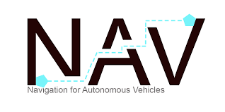

# Nav2 stack  :ros 2

> Install Nav2 on ROS2 Humble > Generate a map with SLAM > Make a robot navigate using the map <br />

 nav2 : [web](https://navigation.ros.org/), [github](https://github.com/ros-planning/navigation2)
 
<a> </a><a> </a>

```bash

$ sudo apt install ros-humble-navigation2 ros-humble-nav2-bringup ros-humble-turtlebot3*

```

Turtle Bot 3 : `$ gedit ~/.bashrc`

```bash

export TURTLEBOT3_MODEL=waffle
source /opt/ros/humble/setup.bash


```
next do : `$ source .bashrc` and `$ printenv | grep TURTLE`

### Gazebo : ` $ gazebo` > `$ ros2 launch turtlebot3_gazebo turtlebot3_world.launch.py`

start node :  `$ ros2 run turtlebot3_teleop teleop_keyboard`, also check ` $ rqt_graph`.

 


## Simultaneous localization and mapping (SLAM)

`$ ros2 launch turtlebot3_gazebo turtlebot3_world.launch.py`

`$ ros2 launch turtlebot3_cartographer cartographer.launch.py use_sim_time:=True`

Rviz opens up:


save map : `$ mkdir maps` > `ros2 run nav2_map_server map_saver_cli -f maps/my_map` : files generated `.pgm` and `.yaml`

nav2 fixes : ` $ sudo apt install ros-humble-rmw-cyclonedds-cpp` > ` $ gedit ~/.bashrc`, add: 

```bash

     $ export RMW_IMPLEMENTATION=rmw_cyclonedds_cpp

```

### Navigation of the Robot : 

`$ ros2 launch turtlebot3_gazebo turtlebot3_world.launch.py`

`$ ros2 launch turtlebot3_navigation2 navigation2.launch.py use_sim_time:=True maps:=maps/my_map.yaml`

Click in RViz : " 2D Pose Estimate "


resources : [Navigation and SLAM Using the ROS 2 Navigation Stack](https://automaticaddison.com/navigation-and-slam-using-the-ros-2-navigation-stack/), [Sensor Fusion Using the Robot Localization Package – ROS 2](https://automaticaddison.com/sensor-fusion-using-the-robot-localization-package-ros-2/), [LIDAR for a Simulated Mobile Robot in ROS 2](https://automaticaddison.com/set-up-lidar-for-a-simulated-mobile-robot-in-ros-2/)