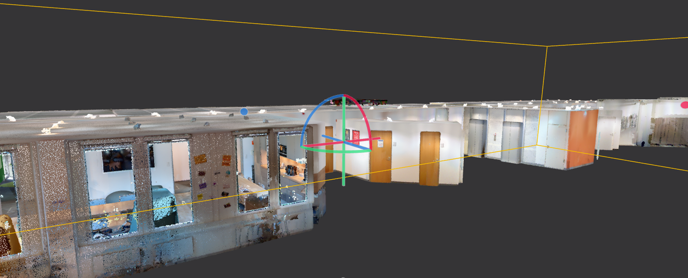
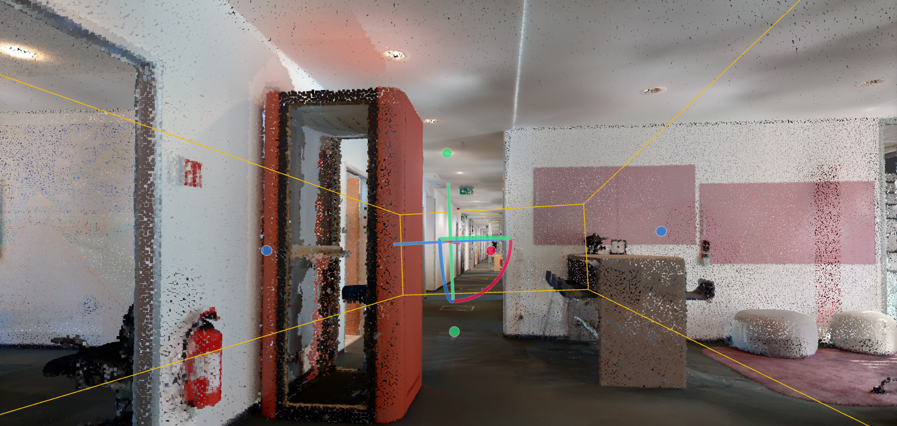

# Point Cloud ros 2 | [PCL](https://pointclouds.org/)

ROS 2 (Robot Operating System 2) can be integrated with the Point Cloud Library (PCL) to process and manipulate point cloud data in robotic applications. Point cloud data is essential for tasks like 3D mapping, object detection, and obstacle avoidance. 

#### Installing PCL in ROS 2:

```bash

sudo apt install ros-<ROS_DISTRO>-pcl-conversions
sudo apt install libpcl-dev


```

Replace `<ROS_DISTRO>` with your ROS 2 distribution (e.g., `foxy`, `galactic`, etc.).


#### Creating a Point Cloud Publisher Node:

Here's an example of a ROS 2 node that publishes a synthetic point cloud using the `sensor_msgs/PointCloud2` message type:

```py

import rclpy
from rclpy.node import Node
from sensor_msgs.msg import PointCloud2
import pcl
import pcl.pcl_visualization

class PointCloudPublisher(Node):
    def __init__(self):
        super().__init__('point_cloud_publisher')
        self.publisher = self.create_publisher(PointCloud2, 'point_cloud', 10)
        timer_period = 1.0  # seconds
        self.timer = self.create_timer(timer_period, self.publish_point_cloud)

    def publish_point_cloud(self):
        cloud = pcl.PointCloud()
        points = [(1.0, 2.0, 3.0), (2.0, 3.0, 4.0)]  # Example point cloud data
        cloud.from_list(points)
        msg = pcl_to_ros(cloud)
        self.publisher.publish(msg)
        self.get_logger().info('Publishing a point cloud.')

def pcl_to_ros(pcl_cloud):
    msg = PointCloud2()
    msg.header.stamp = pcl_cloud.header.stamp.to_msg()
    msg.header.frame_id = pcl_cloud.header.frame_id
    msg.height = pcl_cloud.height
    msg.width = pcl_cloud.width
    msg.is_dense = pcl_cloud.is_dense
    msg.is_bigendian = pcl_cloud.is_bigendian
    msg.fields = pcl_cloud.fields
    msg.point_step = pcl_cloud.point_step
    msg.row_step = pcl_cloud.row_step
    msg.data = pcl_cloud.data
    return msg

def main(args=None):
    rclpy.init(args=args)
    node = PointCloudPublisher()
    rclpy.spin(node)
    rclpy.shutdown()

if __name__ == '__main__':
    main()


```

#### Creating a Point Cloud Subscriber Node:

We can also create a subscriber node to receive and process point cloud data. Here's an example of a ROS 2 node that subscribes to a point cloud topic and visualizes it:

```py
import rclpy
from rclpy.node import Node
from sensor_msgs.msg import PointCloud2
import pcl
import pcl.pcl_visualization

class PointCloudSubscriber(Node):
    def __init__(self):
        super().__init__('point_cloud_subscriber')
        self.subscription = self.create_subscription(
            PointCloud2,
            'point_cloud',
            self.point_cloud_callback,
            10
        )
        self.subscription  # prevent unused variable warning

    def point_cloud_callback(self, msg):
        cloud = ros_to_pcl(msg)
        # Perform point cloud processing here
        self.get_logger().info('Received a point cloud.')

def ros_to_pcl(ros_cloud):
    pcl_cloud = pcl.PointCloud()
    pcl_cloud.from_list(ros_cloud.data)
    pcl_cloud.header.stamp = pcl_to_ros_time(ros_cloud.header.stamp)
    pcl_cloud.header.frame_id = ros_cloud.header.frame_id
    return pcl_cloud

def pcl_to_ros_time(pcl_stamp):
    return pcl_stamp.to_time()

def main(args=None):
    rclpy.init(args=args)
    node = PointCloudSubscriber()
    rclpy.spin(node)
    rclpy.shutdown()

if __name__ == '__main__':
    main()


```

This subscriber node converts received `sensor_msgs/PointCloud2 messages` to PCL point clouds for further processing.

<table width=100%>
<tr>
<th>Point Cloud Processing:</th>
<th> Visualizing Point Clouds:</th>
</tr>


<tr>
<td>

Here's an example of filtering a point cloud to remove outliers using the `StatisticalOutlierRemoval` filter:

```py
import pcl
from pcl.filters import StatisticalOutlierRemoval

cloud = pcl.PointCloud()  # Load your point cloud data here
filter = cloud.make_statistical_outlier_filter()
filter.set_mean_k(50)  # Set the number of neighbors to consider
filter.set_std_dev_mul_thresh(1.0)  # Set the standard deviation threshold
cloud_filtered = filter.filter()


```
</td>
<td> 

 We can use the pcl.pcl_visualization module to create visualizations of point clouds in your ROS 2 nodes.
 
 ```py

 import pcl.pcl_visualization

visual = pcl.pcl_visualization.CloudViewing()
visual.ShowMonochromeCloud(cloud)  # Display your point cloud
visual.Spin()  # Keep the visualization window open

 
 ```
 
 </td>
</tr>
</table>


LiDAR and depth camera produces point clouds (.e57) : 

```bash

    $ sudo apt install libpcl-dev

```




process 3d point clouds with : [rtabmap_ros](http://wiki.ros.org/rtabmap_ros) : ` $ sudo apt-get install ros-humble-rtabmap`, ` $ sudo apt-get install ros-humble-pcl-msgs` and ` $ sudo apt-get install ros-humble-pcl-conversions`
